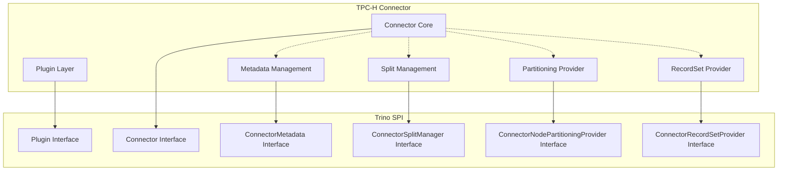

# TPC-H Connector

## Overview

The TPC-H Connector is a specialized Trino plugin that provides read-only access to synthetic data generated according to the TPC-H benchmark specification. This connector is designed for testing and benchmarking purposes, offering a standardized dataset that simulates a business-oriented database without requiring actual data storage.

## Purpose and Use Cases

The TPC-H Connector serves several key purposes:

- **Performance Testing**: Provides a standardized dataset for benchmarking Trino query performance
- **Development Testing**: Offers predictable, synthetic data for testing query optimization and execution
- **Educational Use**: Demonstrates Trino connector architecture with a simple, well-understood dataset
- **Regression Testing**: Enables consistent performance comparisons across Trino versions

## Architecture

The TPC-H Connector follows the standard Trino connector architecture, implementing key interfaces from the [Trino SPI](Trino SPI.md) to provide seamless integration with the Trino query engine.

## Core Components

### [Connector Core](Connector Core.md)
The foundational components that implement the Trino SPI interfaces:
- **TpchPlugin**: Entry point that registers the connector factory
- **TpchConnector**: Main connector implementation coordinating all operations

### [Metadata Management](Metadata Management.md)
Handles all metadata operations including:
- Schema and table discovery
- Column metadata and type mapping
- Statistics estimation for query optimization
- Table properties and partitioning information

### [Data Distribution](Data Distribution.md)
Manages data distribution across worker nodes:
- **TpchSplitManager**: Divides synthetic data into parallelizable splits
- **TpchNodePartitioningProvider**: Implements data partitioning strategies

### [Data Access](Data Access.md)
Provides the interface for data generation and access, implementing the TPC-H specification to generate synthetic data on-demand during query execution.

## Data Generation

The connector generates synthetic data according to the TPC-H benchmark specification:

- **Scale Factors**: Supports multiple scale factors (tiny, sf1, sf100, sf300, sf1000, sf3000, sf10000, sf30000, sf100000)
- **Tables**: Provides all 8 TPC-H tables (customer, orders, lineitem, part, supplier, partsupp, nation, region)
- **Data Consistency**: Ensures referential integrity and consistent data generation across queries
- **Performance**: Optimized data generation that scales with the number of worker nodes

## Configuration

The TPC-H Connector supports several configuration options:

- **Column Naming**: Simplified or standard TPC-H column naming conventions
- **Decimal Type Mapping**: Configuration for handling decimal types (DOUBLE or DECIMAL)
- **Predicate Pushdown**: Enable/disable predicate pushdown optimization
- **Partitioning**: Enable/disable table partitioning for improved query performance
- **Table Scan Redirection**: Optional redirection to other catalogs/schemas

## Integration with Trino

The TPC-H Connector integrates seamlessly with Trino's query execution pipeline:

1. **Query Planning**: Metadata operations provide table structure and statistics for optimal query planning
2. **Split Generation**: Data is divided into splits for parallel processing
3. **Data Generation**: Synthetic data is generated on-demand during query execution
4. **Partitioning**: Data partitioning enables efficient distributed joins and aggregations

## Performance Characteristics

- **Scalability**: Linear scalability with the number of worker nodes
- **Memory Efficiency**: Minimal memory footprint as data is generated on-demand
- **CPU Usage**: CPU-intensive data generation balanced across worker nodes
- **Network**: Minimal network overhead as data is generated locally

## Related Documentation

- [Trino SPI](Trino SPI.md) - Core service provider interfaces
- [Base JDBC Connector](Base JDBC Connector.md) - Reference for connector patterns
- [Plugin Toolkit](Plugin Toolkit.md) - Common plugin utilities and patterns