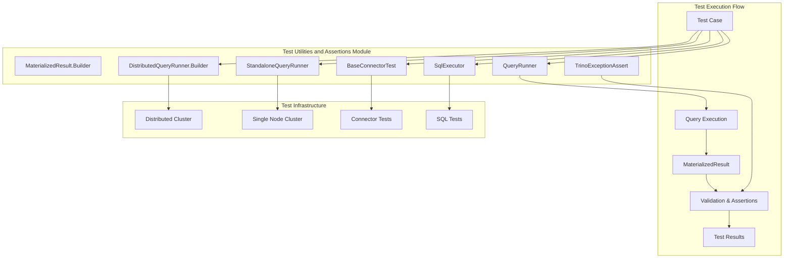
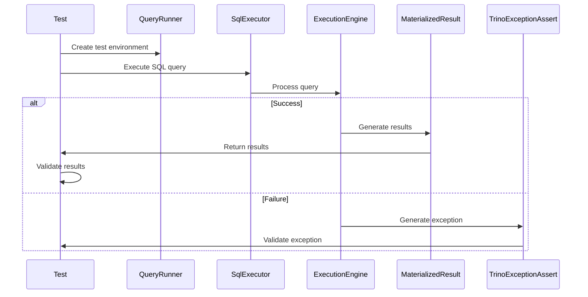
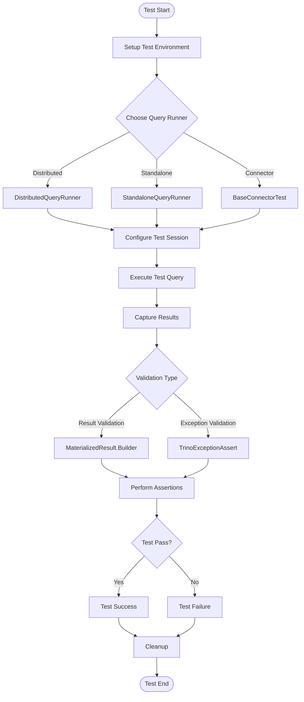

# Test Utilities and Assertions Module

## Introduction

The Test Utilities and Assertions module provides essential testing infrastructure for the Trino ecosystem. This module offers comprehensive testing frameworks, assertion utilities, and result validation tools that enable developers to write robust tests for Trino connectors, SQL functionality, and query execution. It serves as the foundation for testing across all Trino components, from basic SQL operations to complex distributed query scenarios.

## Architecture Overview

The Test Utilities and Assertions module is built around several key architectural components that work together to provide a complete testing ecosystem:

## Core Components

### MaterializedResult.Builder

The `MaterializedResult.Builder` is a fundamental component for capturing and validating query results in tests. It provides a fluent API for constructing result sets that can be compared against expected outcomes.

**Key Responsibilities:**
- Building structured result sets for test validation
- Providing type-safe result construction
- Supporting both row and column-oriented result formats
- Enabling comparison operations for test assertions

**Integration Points:**
- Works with [Query Execution Engine](Query%20Execution%20Engine.md) to capture actual results
- Integrates with [SQL Testing Framework](SQL%20Testing%20Framework.md) for query validation
- Supports [Connector Test Framework](Connector%20Test%20Framework.md) for connector-specific testing

### TrinoExceptionAssert

The `TrinoExceptionAssert` component provides specialized assertion capabilities for Trino-specific exceptions, enabling precise validation of error conditions and error messages.

**Key Responsibilities:**
- Asserting specific Trino exception types
- Validating error messages and error codes
- Checking exception hierarchies and causes
- Providing fluent assertion APIs for error testing

**Integration Points:**
- Validates exceptions from [SQL Analyzer, Planner & Optimizer](SQL%20Analyzer,%20Planner%20&%20Optimizer.md)
- Tests error conditions in [Query Execution Engine](Query%20Execution%20Engine.md)
- Ensures proper error handling in [SQL Functions & Operators](SQL%20Functions%20&%20Operators.md)

## Query Runner Infrastructure

### QueryRunner

The `QueryRunner` interface provides the foundational abstraction for executing queries in test environments, offering a unified API for both distributed and standalone testing scenarios.

**Key Responsibilities:**
- Abstracting query execution details
- Providing session management for tests
- Supporting both DDL and DML operations
- Enabling transaction control in test contexts

### DistributedQueryRunner.Builder

The `DistributedQueryRunner.Builder` creates testing environments that simulate distributed Trino clusters, essential for testing query distribution, fault tolerance, and parallel execution.

**Key Responsibilities:**
- Building multi-node test clusters
- Simulating distributed query execution
- Testing node communication and coordination
- Validating distributed query planning and execution

**Integration with Trino Ecosystem:**
- Utilizes [Query Execution Engine](Query%20Execution%20Engine.md) for actual query processing
- Integrates with [SQL Analyzer, Planner & Optimizer](SQL%20Analyzer,%20Planner%20&%20Optimizer.md) for query planning
- Leverages [Metadata & Connector Abstraction](Metadata%20&%20Connector%20Abstraction.md) for connector testing

### StandaloneQueryRunner

The `StandaloneQueryRunner` provides a lightweight testing environment for scenarios that don't require full distributed cluster capabilities, offering faster test execution for simpler scenarios.

**Key Responsibilities:**
- Providing single-node test environments
- Enabling rapid test execution
- Supporting unit testing of SQL functionality
- Facilitating debugging and development workflows

## Connector Test Framework

### BaseConnectorTest

The `BaseConnectorTest` serves as the foundation for connector-specific testing, providing a comprehensive suite of standard tests that all connectors should pass.

**Key Responsibilities:**
- Defining standard connector test suites
- Providing baseline functionality validation
- Ensuring connector compliance with Trino SPI
- Testing connector-specific features and optimizations

**Test Coverage Areas:**
- Data type support and conversion
- Predicate pushdown capabilities
- Aggregation function support
- Join operation handling
- Transaction management
- Metadata operations

**Integration with Connector Ecosystem:**
- Tests [Base JDBC Connector](Base%20JDBC%20Connector.md) functionality
- Validates [Hive Connector](Hive%20Connector.md) specific features
- Ensures [Iceberg Connector](Iceberg%20Connector.md) compliance
- Verifies [Delta Lake Connector](Delta%20Lake%20Connector.md) operations

## SQL Testing Framework

### SqlExecutor

The `SqlExecutor` component provides specialized SQL execution capabilities for testing, offering fine-grained control over query execution and result validation.

**Key Responsibilities:**
- Executing SQL statements in test contexts
- Managing test sessions and configurations
- Providing SQL parsing and validation
- Supporting both synchronous and asynchronous execution

**Integration Points:**
- Leverages [SQL Parser & AST](SQL%20Parser%20&%20AST.md) for query parsing
- Uses [SQL Analyzer, Planner & Optimizer](SQL%20Analyzer,%20Planner%20&%20Optimizer.md) for query processing
- Integrates with [Query Execution Engine](Query%20Execution%20Engine.md) for execution

## Data Flow Architecture

## Testing Process Flow

## Key Features and Capabilities

### Comprehensive Testing Support

The module provides testing capabilities across multiple dimensions:

1. **Functional Testing**: Validates SQL functionality and query results
2. **Performance Testing**: Supports performance benchmarking and optimization validation
3. **Integration Testing**: Tests connector integration and interoperability
4. **Error Handling**: Validates error conditions and exception handling
5. **Concurrency Testing**: Supports multi-threaded and distributed test scenarios

### Extensibility Framework

The module is designed for extensibility, allowing developers to:
- Create custom test runners for specific scenarios
- Extend assertion capabilities for domain-specific validations
- Build specialized test suites for connector types
- Develop custom result validation logic

### Integration with Development Workflow

The testing framework integrates seamlessly with development workflows:
- Supports both unit testing and integration testing
- Provides debugging capabilities for test failures
- Enables test result reporting and analysis
- Facilitates continuous integration and deployment

## Best Practices

### Test Environment Setup
- Use `DistributedQueryRunner` for testing distributed functionality
- Use `StandaloneQueryRunner` for rapid development cycles
- Configure appropriate timeouts for long-running tests
- Ensure proper cleanup of test resources

### Result Validation
- Use `MaterializedResult.Builder` for structured result validation
- Leverage `TrinoExceptionAssert` for precise error validation
- Implement custom assertions for domain-specific validations
- Validate both positive and negative test scenarios

### Connector Testing
- Extend `BaseConnectorTest` for comprehensive connector validation
- Test both standard and connector-specific functionality
- Validate performance characteristics and optimizations
- Ensure proper error handling and edge case coverage

## Dependencies and Integration

The Test Utilities and Assertions module integrates with numerous other Trino modules:

- **Trino SPI**: Provides the foundational interfaces for connector testing
- **Query Execution Engine**: Enables actual query execution in test environments
- **SQL Parser & AST**: Supports SQL parsing and validation in tests
- **Metadata & Connector Abstraction**: Facilitates connector-specific testing
- **SQL Functions & Operators**: Enables testing of function implementations

This comprehensive integration ensures that tests can validate all aspects of Trino functionality, from SQL parsing through query execution and result delivery.

## Conclusion

The Test Utilities and Assertions module is a critical component of the Trino ecosystem, providing the testing infrastructure necessary to ensure quality and reliability across all Trino components. Its comprehensive feature set, extensible architecture, and deep integration with the Trino platform make it an indispensable tool for developers working with Trino connectors, SQL functionality, and query execution systems.