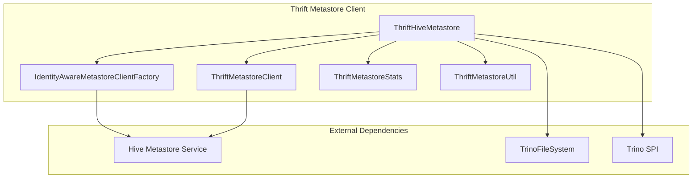
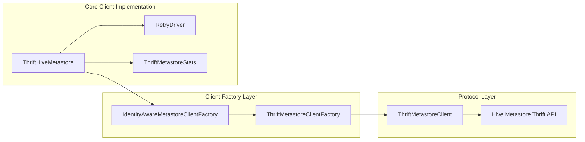
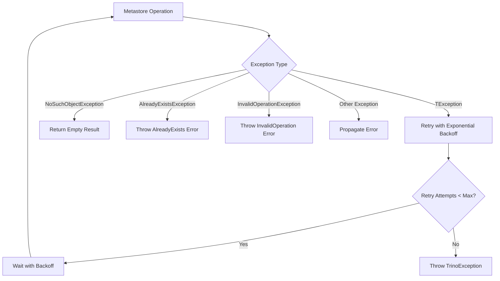
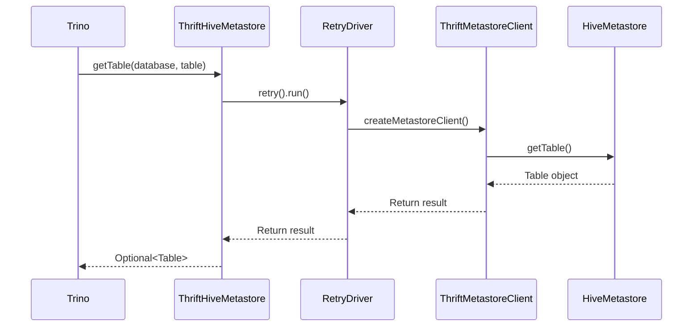
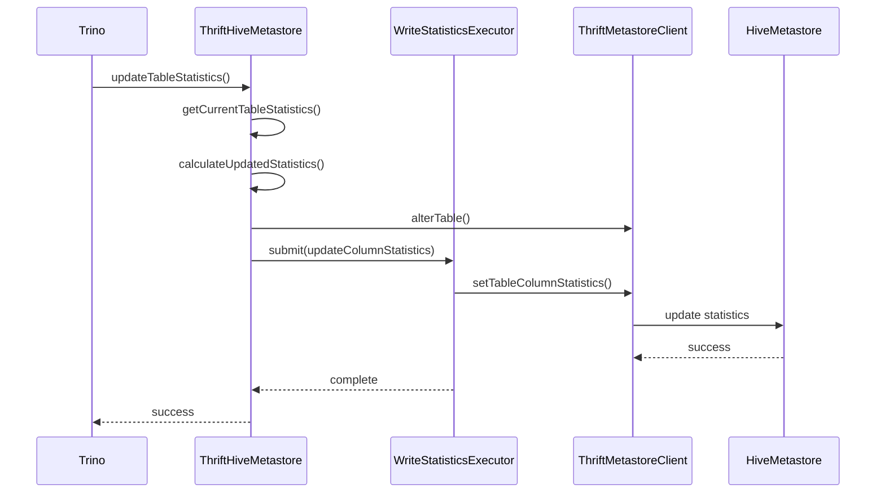
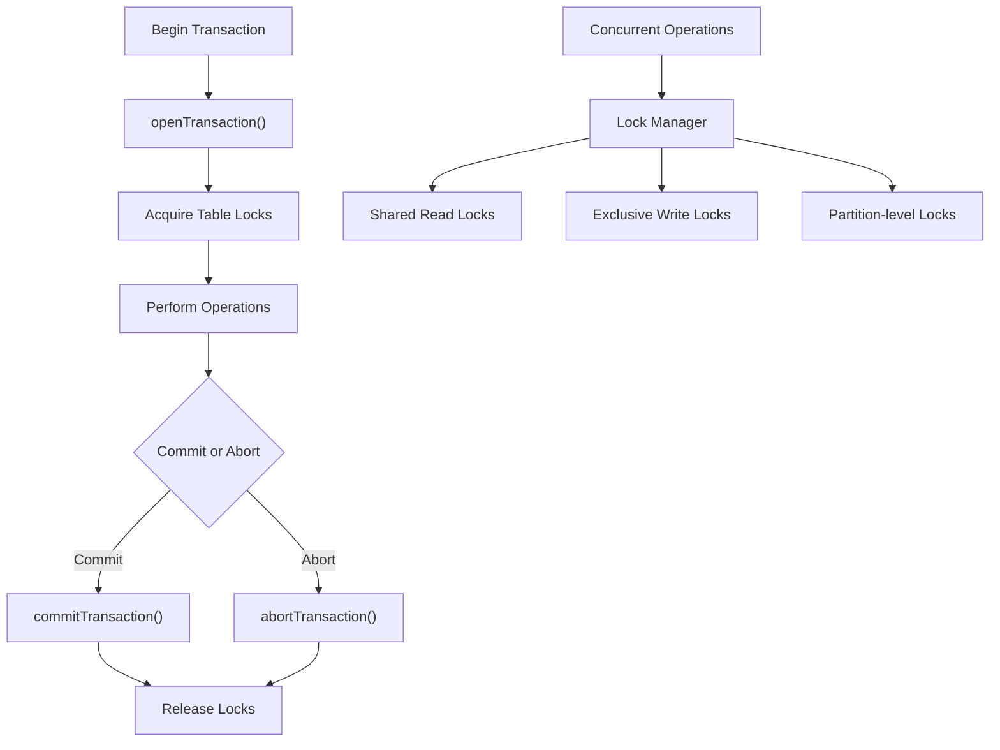
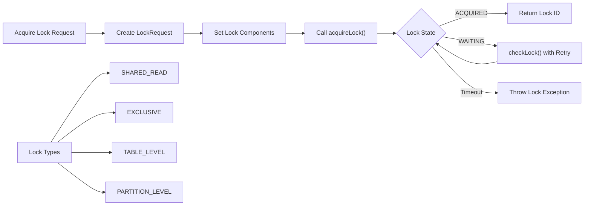
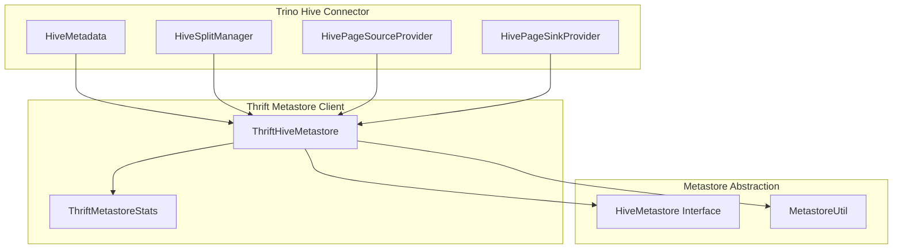

# Thrift Metastore Client

The Thrift Metastore Client module provides the primary interface for Trino's Hive connector to interact with Hive Metastore services using the Apache Thrift protocol. This module implements a robust, retry-aware client that handles all metadata operations required for Hive table management, including schema operations, table lifecycle management, partition handling, statistics management, and transactional support.

## Overview

The Thrift Metastore Client serves as the bridge between Trino's Hive connector and external Hive Metastore services. It implements comprehensive error handling, automatic retry logic with exponential backoff, and connection pooling to ensure reliable metadata operations across distributed Hive deployments. The client supports both traditional Hive tables and ACID transactional tables, providing full compatibility with Hive's evolving metadata requirements.

## Architecture

### Core Components

### Component Relationships

## Key Features

### Comprehensive Metadata Operations

The Thrift Metastore Client provides complete coverage of Hive Metastore operations:

- **Database Management**: Create, drop, alter databases with full schema lifecycle support
- **Table Operations**: Create, drop, alter tables with comprehensive validation and error handling
- **Partition Management**: Add, drop, alter partitions with batch operation support
- **Statistics Management**: Table and partition-level column statistics with concurrent update support
- **Privilege Management**: Role-based access control with grant/revoke operations
- **Transaction Support**: Full ACID transaction support with locking mechanisms

### Robust Error Handling and Retry Logic

### Connection Management and Performance

The client implements sophisticated connection management:

- **Connection Pooling**: Reuses metastore connections to minimize overhead
- **Identity-Aware Connections**: Supports different authentication contexts
- **Concurrent Statistics Updates**: Parallel processing of partition statistics
- **Configurable Timeouts**: Flexible timeout and retry configuration
- **Performance Metrics**: Comprehensive statistics collection for monitoring

## Data Flow

### Metadata Retrieval Flow

### Statistics Update Flow

## Transaction and Lock Management

### ACID Transaction Support

The client provides comprehensive support for Hive's ACID transactional tables:

### Lock Acquisition Process

## Integration with Trino Ecosystem

### Hive Connector Integration

### Configuration and Dependencies

The Thrift Metastore Client integrates with several Trino subsystems:

- **FileSystem Integration**: Uses [TrinoFileSystem](Filesystem Abstraction Layer.md) for data file operations
- **Security Framework**: Integrates with [Trino Security](Trino Server & API.md#security-framework) for authentication
- **Statistics Framework**: Works with [Trino Statistics](SQL Analyzer, Planner & Optimizer.md#cost--statistics) for query optimization
- **Error Handling**: Leverages [Trino SPI](Trino SPI.md) exception types for consistent error reporting

## Configuration Options

### Connection and Retry Configuration

- **Backoff Parameters**: Configurable exponential backoff for retries
- **Timeout Settings**: Connection timeouts and maximum wait times
- **Retry Limits**: Maximum retry attempts and time limits
- **Connection Pooling**: Client factory configuration for connection reuse

### Feature Flags

- **deleteFilesOnDrop**: Automatic cleanup of data files on table/partition drop
- **assumeCanonicalPartitionKeys**: Optimization for partition key handling
- **useSparkTableStatisticsFallback**: Compatibility with Spark-generated statistics

## Performance Characteristics

### Statistics Collection

The client provides comprehensive performance metrics through `ThriftMetastoreStats`:

- Operation-level timing and success rates
- Connection pool utilization metrics
- Retry frequency and failure analysis
- Lock acquisition timing and contention

### Optimization Features

- **Batch Operations**: Efficient bulk operations for partitions and statistics
- **Concurrent Updates**: Parallel processing of independent statistics updates
- **Connection Reuse**: Minimizes connection overhead through pooling
- **Smart Retries**: Exponential backoff with jitter to avoid thundering herd

## Error Handling and Reliability

### Exception Classification

The client implements sophisticated exception handling:

- **Retryable Exceptions**: Network issues, temporary metastore unavailability
- **Non-retryable Exceptions**: Invalid objects, permission errors, schema conflicts
- **Special Cases**: Handling of Hive version-specific exception types

### Reliability Features

- **Circuit Breaker Pattern**: Prevents cascading failures
- **Graceful Degradation**: Continues operation when statistics updates fail
- **Resource Cleanup**: Automatic cleanup of locks and connections
- **Transaction Safety**: Ensures transaction consistency even on failure

## Security and Authentication

### Identity Management

The client supports multiple authentication modes:

- **User Impersonation**: Operations performed on behalf of query users
- **Service Authentication**: Dedicated service account for metastore access
- **Principal Mapping**: Translation between Trino and Hive principal types

### Access Control Integration

- **Privilege Validation**: Validates user privileges before operations
- **Role Management**: Supports Hive's role-based access control
- **Audit Trail**: Comprehensive logging for security auditing

## Monitoring and Observability

### Metrics and Logging

The client provides extensive observability features:

- **Operation Metrics**: Detailed timing and success rates per operation type
- **Connection Metrics**: Pool utilization and connection lifecycle tracking
- **Error Metrics**: Categorized error rates and retry statistics
- **Performance Logging**: Structured logging for troubleshooting

### Health Checks

- **Connection Health**: Regular validation of metastore connectivity
- **Operation Health**: Success rate monitoring for critical operations
- **Resource Health**: Connection pool and thread pool monitoring

## Future Enhancements

### Planned Improvements

- **Async Operations**: Non-blocking variants of long-running operations
- **Caching Layer**: Intelligent caching of frequently accessed metadata
- **Multi-Metastore Support**: Federation across multiple metastore instances
- **Enhanced Metrics**: More granular performance and reliability metrics

### Compatibility Considerations

- **Hive Version Support**: Maintaining compatibility across Hive versions
- **Protocol Evolution**: Support for new Thrift protocol features
- **Cloud Integration**: Enhanced support for cloud-based metastore services