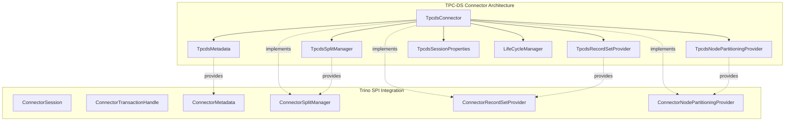
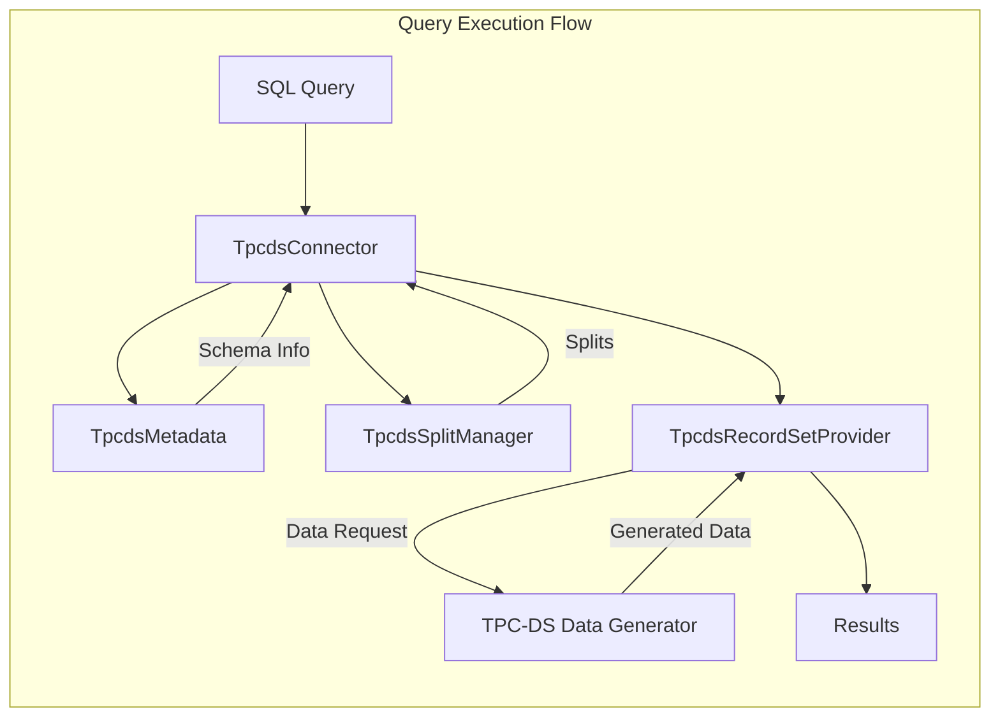
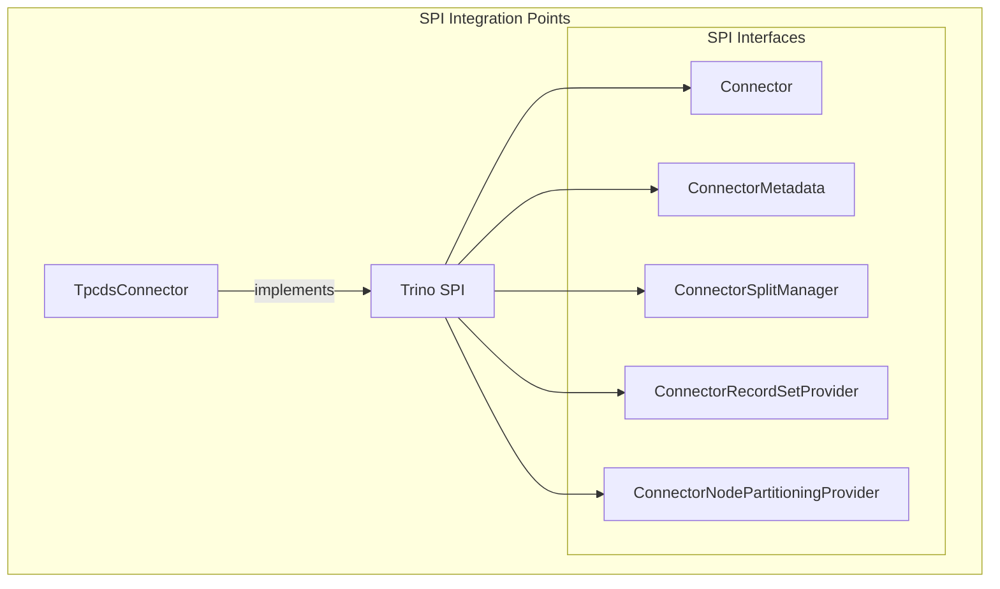

# TPC-DS Connector Module

## Overview

The TPC-DS Connector is a specialized Trino plugin that provides read-only access to synthetic data generated according to the TPC-DS benchmark specification. This connector is designed for testing and benchmarking purposes, allowing users to evaluate Trino's query performance against standardized data sets without requiring external data sources.

## Purpose and Core Functionality

The TPC-DS Connector serves several key purposes:

1. **Benchmark Testing**: Provides standardized TPC-DS benchmark data for performance testing
2. **Development Testing**: Offers consistent, reproducible data sets for query optimization and testing
3. **Educational Tool**: Demonstrates connector implementation patterns for developers
4. **Performance Analysis**: Enables query performance evaluation without external dependencies

Unlike traditional connectors that interface with external systems, the TPC-DS Connector generates data on-demand using the TPC-DS data generation library, making it completely self-contained and deterministic.

## Architecture

### Component Architecture



### Data Flow Architecture



## Core Components

### TpcdsConnector

The main connector class that implements the Trino `Connector` interface. It orchestrates all connector operations and manages the lifecycle of dependent components.

**Key Responsibilities:**
- Transaction management (always returns `TpcdsTransactionHandle.INSTANCE`)
- Component coordination and dependency injection
- Session property management
- Lifecycle management through `LifeCycleManager`

**Key Methods:**
- `beginTransaction()`: Creates read-only transactions with `READ_COMMITTED` isolation
- `getMetadata()`: Provides metadata access through `TpcdsMetadata`
- `getSplitManager()`: Returns the split manager for data distribution
- `getRecordSetProvider()`: Provides record set access for data reading
- `getNodePartitioningProvider()`: Handles node-level data partitioning

### Supporting Components

The connector relies on several specialized components:

1. **TpcdsMetadata**: Manages table and column metadata for TPC-DS tables
2. **TpcdsSplitManager**: Creates splits for parallel data processing
3. **TpcdsRecordSetProvider**: Generates TPC-DS data on-demand
4. **TpcdsNodePartitioningProvider**: Handles data distribution across nodes
5. **TpcdsSessionProperties**: Manages connector-specific session properties

## Integration with Trino Ecosystem

### SPI Integration

The TPC-DS Connector integrates with Trino through the [Connector SPI](TrinoSPI.md#connector-framework):



### Query Processing Integration

The connector integrates with Trino's query processing pipeline:

1. **Query Planning**: [SQL Analyzer](SQLAnalyzerPlannerOptimizer.md#sql-analyzer) uses `TpcdsMetadata` for schema information
2. **Split Generation**: [Query Execution Engine](QueryExecutionEngine.md) uses `TpcdsSplitManager` for parallelization
3. **Data Access**: [Query Execution Engine](QueryExecutionEngine.md) uses `TpcdsRecordSetProvider` for data retrieval

## Data Generation and Schema

### TPC-DS Schema

The connector provides all 24 TPC-DS tables with their standard schema:

- **Store Sales**: Fact table for sales transactions
- **Customer**: Customer dimension table
- **Date**: Time dimension table
- **Item**: Product dimension table
- **Store**: Store dimension table
- And 19 additional dimension and fact tables

### Data Generation

Data is generated deterministically based on:
- Scale factor (SF): Controls data volume
- Parallelism: Number of splits for distributed processing
- Seed values: Ensures reproducible data generation

## Configuration and Usage

### Connector Configuration

```properties
connector.name=tpcds
tpcds.scale-factor=1
tpcds.split-count=4
```

### Session Properties

The connector supports session properties for query-time configuration:

- `tpcds.scale_factor`: Override default scale factor
- `tpcds.split_count`: Control parallelism level

### Example Usage

```sql
-- Enable TPC-DS catalog
USE tpcds.sf1;

-- Query store sales data
SELECT 
    d_year,
    SUM(ss_sales_price) as total_sales
FROM store_sales ss
JOIN date_dim d ON ss.ss_sold_date_sk = d.d_date_sk
GROUP BY d_year
ORDER BY d_year;
```

## Performance Characteristics

### Advantages

1. **No External Dependencies**: Self-contained data generation
2. **Deterministic**: Reproducible results across runs
3. **Scalable**: Configurable scale factors from 1GB to 100TB+
4. **Standardized**: Industry-recognized benchmark data

### Considerations

1. **Read-Only**: No support for INSERT, UPDATE, or DELETE operations
2. **CPU Intensive**: Data generation consumes CPU resources
3. **Memory Usage**: Large scale factors require sufficient memory
4. **Network**: Data is generated locally on each node

## Testing and Development

### Use Cases

1. **Query Optimization Testing**: Test optimizer improvements
2. **Performance Regression Testing**: Compare query performance across versions
3. **Connector Development**: Reference implementation for connector developers
4. **Benchmarking**: Standardized performance comparisons

### Integration with Testing Framework

The connector integrates with [Trino Testing Framework](TrinoTestingFramework.md):

```java
@Test
public void testTpcdsQuery()
{
    QueryRunner queryRunner = DistributedQueryRunner.builder()
        .addTpcdsCatalog("tpcds", 1)
        .build();
    
    MaterializedResult result = queryRunner.execute(
        "SELECT COUNT(*) FROM tpcds.sf1.store_sales"
    );
    // Verify results
}
```

## Comparison with TPC-H Connector

The TPC-DS Connector complements the [TPC-H Connector](TpchConnector.md):

| Aspect | TPC-DS | TPC-H |
|--------|---------|--------|
| Complexity | 24 tables, complex schemas | 8 tables, simpler schemas |
| Query Patterns | Decision support, analytics | Business-oriented queries |
| Data Model | Star/snowflake schema | Simple relational model |
| Use Case | Modern analytics workloads | Traditional business queries |

## Dependencies

The TPC-DS Connector depends on:

1. **Trino SPI**: Core connector interfaces and types
2. **TPC-DS Data Generator**: Library for synthetic data generation
3. **Guice**: Dependency injection framework
4. **Airlift Lifecycle**: Component lifecycle management

## Future Enhancements

Potential improvements include:

1. **Streaming Data Generation**: Generate data incrementally during query execution
2. **Custom Schema Support**: Allow user-defined table subsets
3. **Performance Metrics**: Built-in query performance statistics
4. **Extended TPC-DS**: Support for TPC-DS extensions and variations

## References

- [Trino SPI Documentation](TrinoSPI.md)
- [Query Execution Engine](QueryExecutionEngine.md)
- [SQL Analyzer and Planner](SQLAnalyzerPlannerOptimizer.md)
- [TPC-H Connector](TpchConnector.md)
- [Trino Testing Framework](TrinoTestingFramework.md)