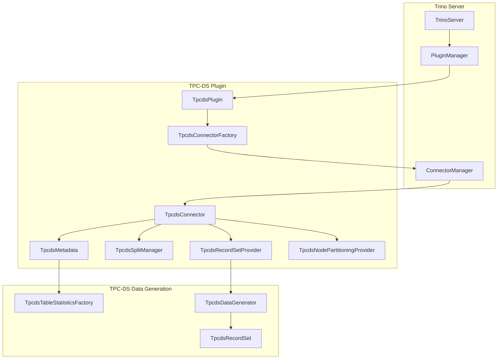
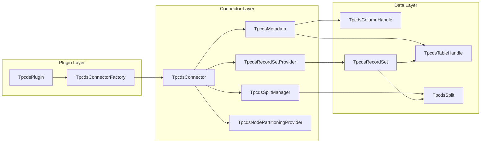
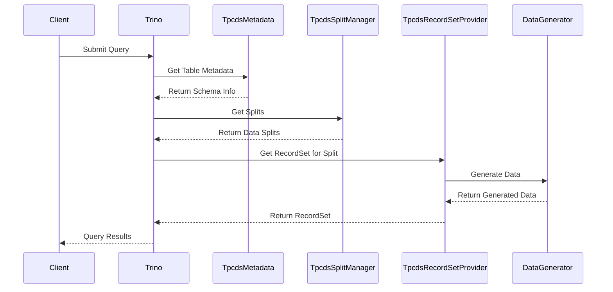
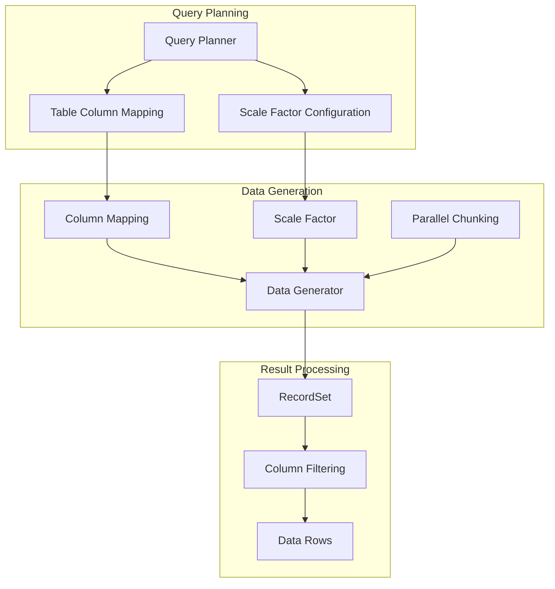
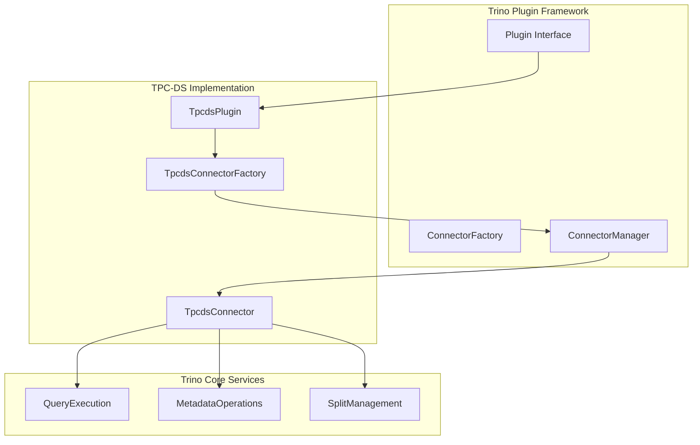
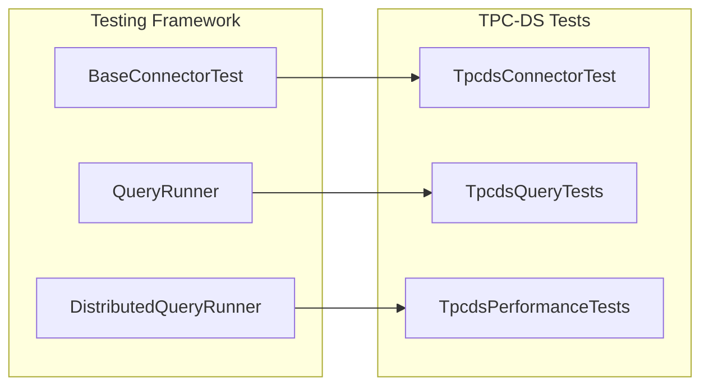

# TPC-DS Plugin Documentation

## Overview

The TPC-DS Plugin is a specialized Trino connector that provides access to TPC-DS (Transaction Processing Performance Council - Decision Support) benchmark datasets. This plugin enables users to query synthetic data that follows the TPC-DS specification, making it ideal for testing query performance, validating optimizer behavior, and conducting benchmark studies without requiring external data sources.

## Purpose and Core Functionality

The TPC-DS Plugin serves several key purposes within the Trino ecosystem:

1. **Performance Testing**: Provides standardized datasets for consistent performance benchmarking
2. **Query Optimization Validation**: Offers complex schemas and relationships for testing optimizer decisions
3. **Development and Testing**: Eliminates dependency on external data sources during development
4. **Educational Resource**: Demonstrates connector implementation patterns for plugin developers

The plugin generates TPC-DS data on-demand using the official TPC-DS data generation algorithms, ensuring data consistency and reproducibility across different environments and query executions.

## Architecture

### High-Level Architecture



### Component Relationships



## Core Components

### TpcdsPlugin
The main plugin entry point that implements Trino's [Plugin](Plugin.md) interface. It registers the TPC-DS connector factory with the Trino plugin manager.

**Key Responsibilities:**
- Plugin lifecycle management
- Connector factory registration
- Integration with Trino's plugin architecture

### TpcdsConnector
Implements the [Connector](Connector.md) interface and serves as the central coordinator for all TPC-DS operations.

**Key Responsibilities:**
- Transaction management
- Component coordination (metadata, split manager, record set provider)
- Session property management
- Lifecycle management

### TpcdsMetadata
Implements [ConnectorMetadata](ConnectorMetadata.md) and provides schema and table information for TPC-DS datasets.

**Key Features:**
- **Schema Management**: Supports multiple scale factors (tiny, sf1, sf10, sf100, etc.)
- **Table Discovery**: Exposes all 24 TPC-DS base tables
- **Type Mapping**: Converts TPC-DS column types to Trino types
- **Statistics**: Provides table and column statistics for query optimization

**Supported Scale Factors:**
- `tiny`: 0.01 scale factor (minimal dataset)
- `sf1`: 1GB scale factor
- `sf10`: 10GB scale factor
- `sf100`: 100GB scale factor
- `sf300`: 300GB scale factor
- `sf1000`: 1TB scale factor
- `sf3000`: 3TB scale factor
- `sf10000`: 10TB scale factor
- `sf30000`: 30TB scale factor
- `sf100000`: 100TB scale factor

### TpcdsSplitManager
Implements [ConnectorSplitManager](ConnectorSplitManager.md) and handles data distribution across Trino worker nodes.

**Key Responsibilities:**
- **Parallel Processing**: Distributes data generation across multiple nodes
- **Load Balancing**: Ensures even distribution of work
- **Configuration**: Supports configurable split counts and distribution strategies

### TpcdsRecordSetProvider
Implements [ConnectorRecordSetProvider](ConnectorRecordSetProvider.md) and generates the actual TPC-DS data.

**Key Features:**
- **On-Demand Generation**: Creates data dynamically during query execution
- **Parallel Generation**: Supports chunked data generation for scalability
- **Column Pruning**: Only generates required columns for optimal performance
- **Consistency**: Ensures reproducible results across executions

## Data Flow

### Query Execution Flow



### Data Generation Process



## Integration with Trino Ecosystem

### Plugin Architecture Integration

The TPC-DS plugin integrates seamlessly with Trino's plugin architecture:



### Dependencies on Trino Core Components

The TPC-DS plugin relies on several Trino core components:

1. **[Trino SPI](TrinoSPI.md)**: Provides plugin interfaces and data types
2. **[Connector Framework](ConnectorFramework.md)**: Defines connector contracts
3. **[Type System](TypeSystem.md)**: Handles data type conversions
4. **[Execution Engine](QueryExecutionEngine.md)**: Manages query execution

## Configuration and Usage

### Plugin Configuration

The TPC-DS plugin requires minimal configuration and is typically activated by adding a catalog properties file:

```properties
# etc/catalog/tpcds.properties
connector.name=tpcds
```

### Session Properties

The plugin supports several session properties for fine-tuning behavior:

- **Split Count**: Controls the number of data splits for parallel processing
- **Splits Per Node**: Configures splits per worker node
- **No Sexism**: Controls demographic data generation patterns

### Query Examples

```sql
-- Query the customer table at 1GB scale
SELECT * FROM tpcds.sf1.customer LIMIT 10;

-- Join multiple tables
SELECT 
    c.c_customer_id,
    SUM(ss.ss_sales_price) as total_sales
FROM tpcds.sf1.customer c
JOIN tpcds.sf1.store_sales ss ON c.c_customer_sk = ss.ss_customer_sk
GROUP BY c.c_customer_id
LIMIT 100;

-- Use the tiny schema for quick testing
SELECT COUNT(*) FROM tpcds.tiny.store_sales;
```

## Performance Characteristics

### Scalability

The TPC-DS plugin is designed for horizontal scalability:

- **Parallel Generation**: Data is generated in parallel across worker nodes
- **Chunked Processing**: Large datasets are processed in manageable chunks
- **Memory Efficient**: Uses streaming generation to minimize memory footprint

### Optimization Features

- **Column Pruning**: Only generates columns required by the query
- **Predicate Pushdown**: Supports partition elimination based on scale factors
- **Statistics**: Provides accurate table statistics for query optimization

## Development and Testing

### Use Cases for Development

1. **Connector Development**: Reference implementation for connector developers
2. **Query Testing**: Test complex queries without external dependencies
3. **Performance Benchmarking**: Consistent datasets for performance testing
4. **Optimizer Testing**: Validate optimizer decisions with known data patterns

### Testing Framework Integration

The plugin integrates with Trino's testing framework:



## Comparison with TPC-H Plugin

The TPC-DS plugin complements the [TPC-H Plugin](TpchPlugin.md):

| Feature | TPC-DS | TPC-H |
|---------|---------|---------|
| **Focus** | Decision Support | Decision Support |
| **Complexity** | Higher (24 tables) | Lower (8 tables) |
| **Schema** | Snowflake | Star |
| **Use Case** | Modern analytics | Traditional analytics |
| **Data Volume** | Same scale factors | Same scale factors |

## Best Practices

### For Users

1. **Start Small**: Use the `tiny` schema for development and testing
2. **Scale Gradually**: Progress through scale factors as needed
3. **Monitor Resources**: Large scale factors require significant resources
4. **Use Appropriate Scale**: Match scale factor to your testing requirements

### For Developers

1. **Study the Implementation**: Excellent reference for connector development
2. **Understand Data Generation**: Learn how synthetic data can be generated
3. **Leverage Statistics**: Use provided statistics for query optimization
4. **Test Thoroughly**: Comprehensive testing with different scale factors

## Limitations

1. **Read-Only**: The plugin only supports read operations
2. **Synthetic Data**: Data is algorithmically generated, not real-world data
3. **Fixed Schema**: Schema is determined by TPC-DS specification
4. **No Updates**: Tables cannot be modified or updated

## Future Enhancements

Potential areas for enhancement include:

1. **Additional Scale Factors**: Support for more granular scaling
2. **Custom Schemas**: Support for custom table modifications
3. **Performance Optimizations**: Enhanced data generation algorithms
4. **Extended Statistics**: More detailed column and table statistics

## Related Documentation

- [Trino Plugin Architecture](PluginArchitecture.md)
- [Connector Framework](ConnectorFramework.md)
- [TPC-H Plugin](TpchPlugin.md)
- [Query Execution Engine](QueryExecutionEngine.md)
- [Type System](TypeSystem.md)
- [Testing Framework](TestingFramework.md)