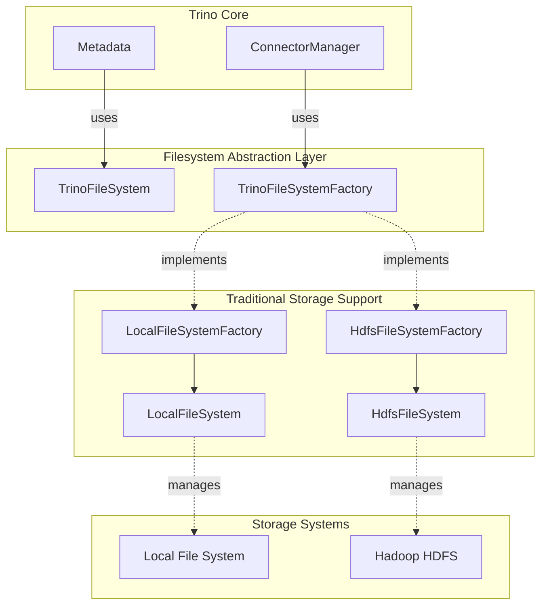
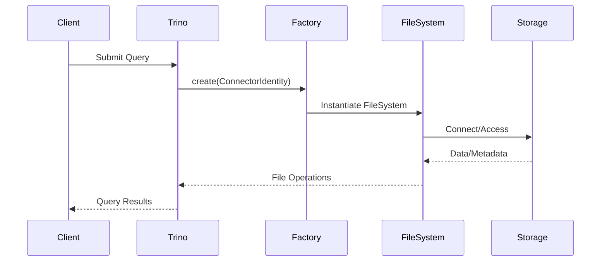
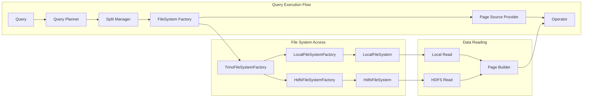
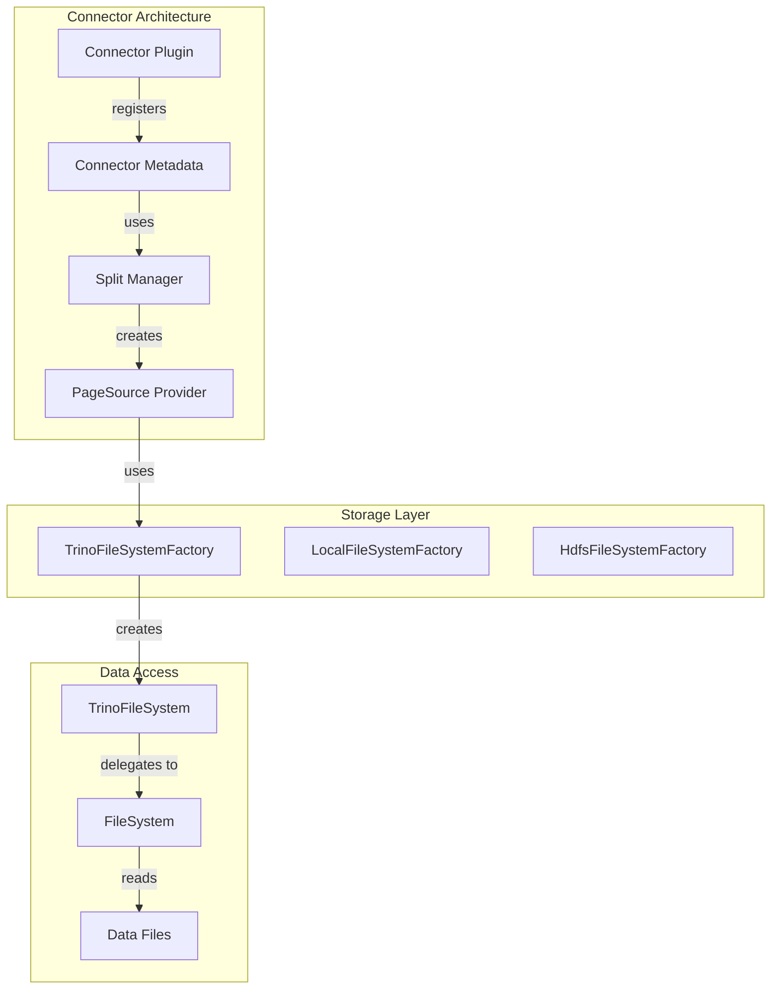

# Traditional Storage Support Module

## Introduction

The Traditional Storage Support module provides Trino with the ability to interact with conventional file systems and distributed storage systems that form the backbone of many enterprise data infrastructures. This module bridges the gap between Trino's modern query engine and traditional storage systems, enabling seamless access to data stored in local file systems and Hadoop Distributed File System (HDFS).

The module serves as a critical component in the [Filesystem Abstraction Layer](Filesystem%20Abstraction%20Layer.md), offering standardized interfaces for file operations while maintaining compatibility with legacy storage systems that organizations have invested in over years of operation.

## Architecture Overview



## Core Components

### LocalFileSystemFactory

The `LocalFileSystemFactory` provides access to the local file system, primarily used for testing and development scenarios. It creates `LocalFileSystem` instances that operate on the local machine's file system.

**Key Features:**
- **Root Path Configuration**: Operates within a specified root directory for security isolation
- **Dependency Injection**: Supports both constructor-based and Guice-based configuration
- **Identity-Agnostic**: Returns the same file system instance regardless of connector identity

**Configuration:**
```java
// Constructor-based configuration
LocalFileSystemFactory factory = new LocalFileSystemFactory(rootPath);

// Guice-based configuration with LocalFileSystemConfig
@Inject
public LocalFileSystemFactory(LocalFileSystemConfig config)
```

### HdfsFileSystemFactory

The `HdfsFileSystemFactory` provides access to Hadoop Distributed File System (HDFS), enabling Trino to query data stored in Hadoop clusters. This factory creates `HdfsFileSystem` instances configured with appropriate Hadoop environment settings.

**Key Features:**
- **Hadoop Integration**: Leverages Trino's HDFS environment configuration
- **Context-Aware**: Creates file systems with proper security context and user identity
- **Statistics Tracking**: Integrates with HDFS file system statistics for monitoring

**Dependencies:**
- `HdfsEnvironment`: Provides Hadoop configuration and file system access
- `TrinoHdfsFileSystemStats`: Tracks file system operation statistics
- `HdfsContext`: Carries security and configuration context

## Data Flow Architecture



## Component Interactions



## Integration with Trino Ecosystem

### Connector Integration

Traditional storage support integrates seamlessly with Trino's connector framework:



### Security Integration

The module integrates with Trino's security framework through `ConnectorIdentity`:

- **Identity Propagation**: File system instances are created with specific user identities
- **Access Control**: Leverages Trino's access control mechanisms
- **Audit Trail**: Supports security auditing through identity tracking

## Configuration and Usage

### Local File System Configuration

```java
// Basic configuration
Path rootPath = Paths.get("/data/trino");
LocalFileSystemFactory factory = new LocalFileSystemFactory(rootPath);

// Guice-based configuration
public class LocalFileSystemModule extends AbstractConfigurationAwareModule
{
    @Override
    protected void setup(Binder binder)
    {
        binder.bind(LocalFileSystemFactory.class).in(Scopes.SINGLETON);
        configBinder(binder).bindConfig(LocalFileSystemConfig.class);
    }
}
```

### HDFS Configuration

```java
// Guice-based configuration
public class HdfsFileSystemModule extends AbstractConfigurationAwareModule
{
    @Override
    protected void setup(Binder binder)
    {
        binder.bind(HdfsFileSystemFactory.class).in(Scopes.SINGLETON);
        binder.bind(HdfsEnvironment.class).in(Scopes.SINGLETON);
        binder.bind(TrinoHdfsFileSystemStats.class).in(Scopes.SINGLETON);
    }
}
```

## Performance Considerations

### Local File System
- **Direct Access**: No network overhead for local operations
- **Caching**: Leverages OS-level file system caching
- **Testing**: Ideal for development and unit testing scenarios

### HDFS Integration
- **Distributed Access**: Parallel access to distributed data
- **Data Locality**: Optimizes for data locality when possible
- **Statistics**: Tracks performance metrics for optimization

## Error Handling and Resilience

### Common Error Scenarios
- **File Not Found**: Graceful handling of missing files
- **Permission Denied**: Proper error propagation with security context
- **Network Issues**: HDFS connection failures with retry mechanisms
- **Configuration Errors**: Validation of file system configuration

### Recovery Mechanisms
- **Retry Logic**: Automatic retry for transient failures
- **Fallback Options**: Alternative data sources when available
- **Error Reporting**: Detailed error messages for debugging

## Testing and Development

### Local File System for Testing
The `LocalFileSystemFactory` is particularly valuable for:
- **Unit Testing**: Fast, isolated file system operations
- **Integration Testing**: Test connector behavior without external dependencies
- **Development**: Local development without HDFS cluster requirements

### Mock and Stub Support
- **Test File Systems**: Custom file system implementations for testing
- **Configuration Mocking**: Flexible configuration for different test scenarios
- **Identity Mocking**: Test with different user identities

## Future Enhancements

### Potential Improvements
- **Additional File Systems**: Support for other traditional storage systems
- **Performance Optimization**: Enhanced caching and prefetching
- **Security Enhancements**: Improved authentication and authorization
- **Monitoring**: Better metrics and observability for file system operations

### Integration Opportunities
- **Cloud Storage**: Hybrid cloud-on-premises storage solutions
- **Data Lake**: Integration with modern data lake architectures
- **Backup Systems**: Support for backup and archival storage systems

## Related Documentation

- [Filesystem Abstraction Layer](Filesystem%20Abstraction%20Layer.md) - Core file system abstraction
- [Hive Connector](Hive%20Connector.md) - Uses traditional storage for Hive tables
- [Iceberg Connector](Iceberg%20Connector.md) - Modern table format with storage support
- [Trino SPI](Trino%20SPI.md) - Plugin and connector framework
- [Query Execution Engine](Query%20Execution%20Engine.md) - How queries interact with storage

## Conclusion

The Traditional Storage Support module provides essential connectivity to established storage systems, enabling Trino to leverage existing data infrastructure investments. Through its clean abstraction layer and robust implementation, it ensures that legacy storage systems can participate in modern analytics workflows without compromising performance or security.