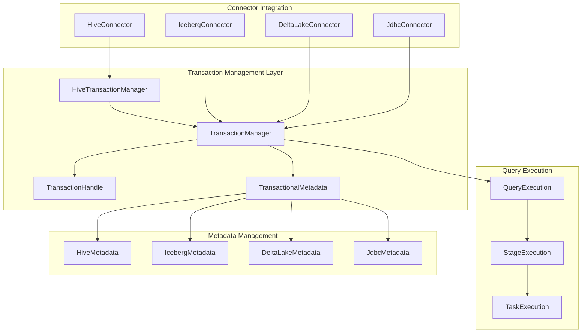
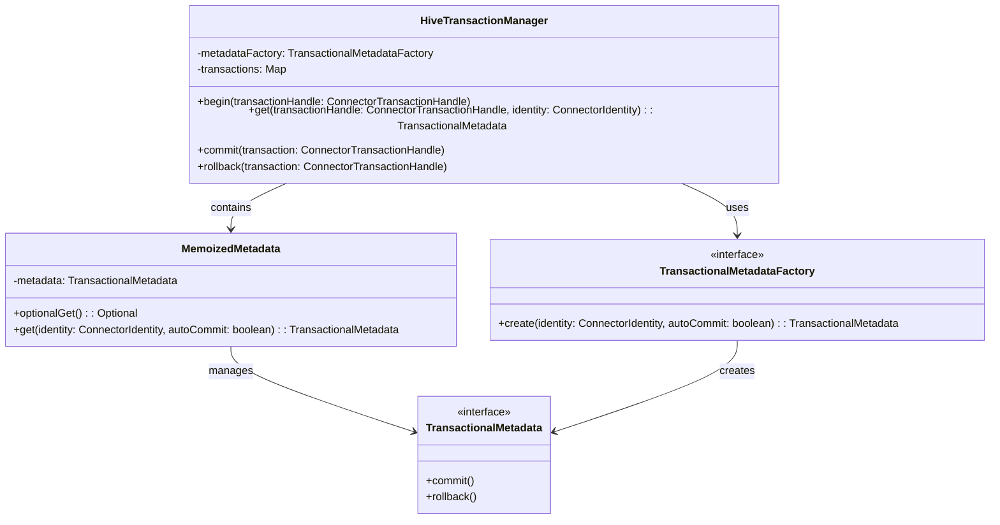
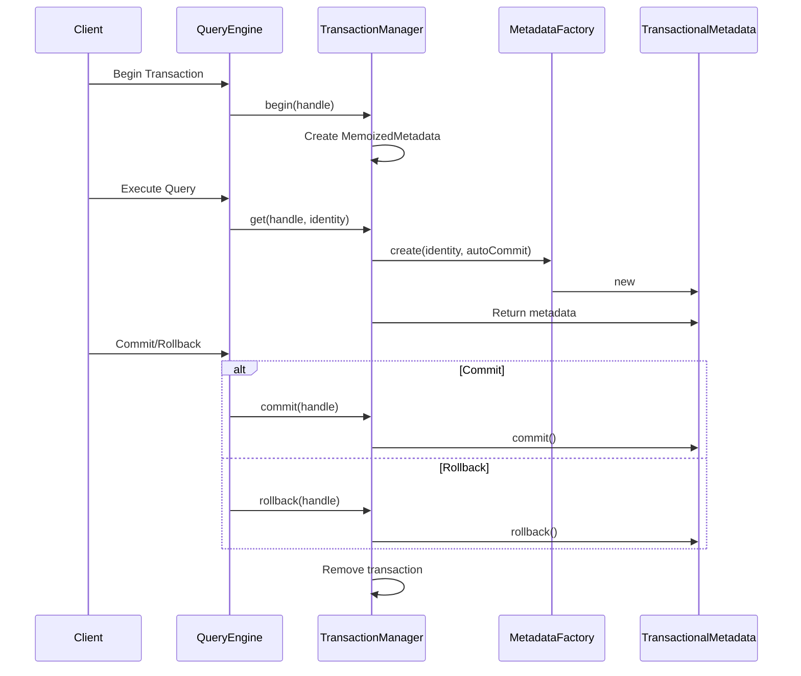
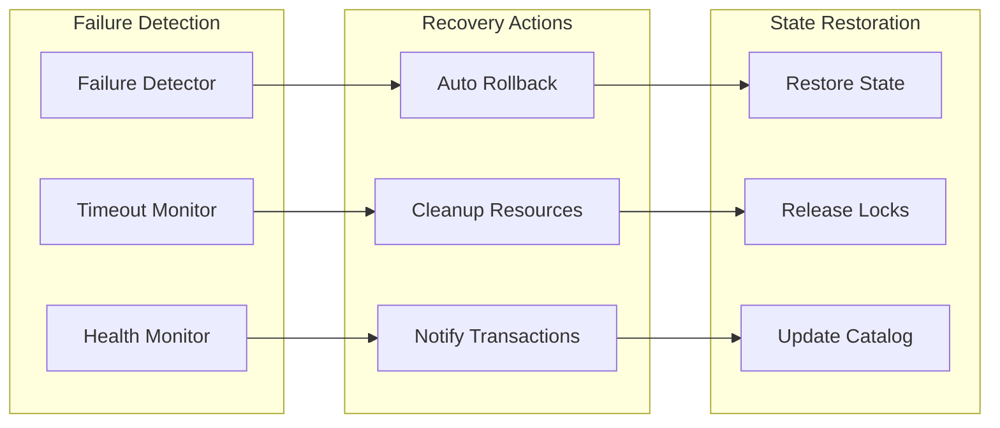

# Transaction Management Module

## Introduction

The Transaction Management module in Trino provides the foundational infrastructure for handling database transactions across all connectors. It ensures ACID (Atomicity, Consistency, Isolation, Durability) properties for data operations, manages transaction lifecycle, and coordinates transaction state across distributed query execution environments.

This module is critical for maintaining data integrity and consistency in Trino's distributed SQL query engine, supporting both auto-commit and explicit transaction modes across various data sources including Hive, Iceberg, Delta Lake, and JDBC-based connectors.

## Architecture Overview

## Core Components

### HiveTransactionManager

The `HiveTransactionManager` serves as the primary transaction coordinator for the Hive connector, implementing a thread-safe transaction management system with lazy metadata initialization.

#### Key Features:

- **Thread-Safe Operations**: Uses `ConcurrentHashMap` for transaction storage and synchronized methods for metadata access
- **Lazy Initialization**: Metadata objects are created only when first accessed via the `MemoizedMetadata` inner class
- **ClassLoader Isolation**: Ensures proper classloader context during transaction operations
- **Auto-Commit Support**: Handles both explicit transactions and auto-commit modes

### Transaction Lifecycle

## Data Flow Architecture

```mermaid
graph LR
    subgraph "Client Layer"
        C[Client]
        CS[ClientSession]
    end
    
    subgraph "Query Processing"
        DM[DispatchManager]
        QE[SqlQueryExecution]
        SA[StatementAnalyzer]
    end
    
    subgraph "Transaction Management"
        TM[TransactionManager]
        TH[TransactionHandle]
        MM[MemoizedMetadata]
    end
    
    subgraph "Connector Layer"
        HC[HiveConnector]
        HM[HiveMetadata]
        HSM[HiveSplitManager]
    end
    
    C --> CS
    CS --> DM
    DM --> QE
    QE --> SA
    SA --> TM
    TM --> TH
    TH --> MM
    MM --> HC
    HC --> HM
    HM --> HSM
```

## Integration with Other Modules

### Connector Framework Integration

The Transaction Management module integrates closely with the [Connector Framework](Connector%20Framework.md) to provide transaction capabilities across different data sources:

- **Hive Connector**: Uses `HiveTransactionManager` for managing Hive table transactions
- **Iceberg Connector**: Leverages Iceberg's native transaction support through `IcebergMetadata`
- **Delta Lake Connector**: Integrates with Delta Lake's transaction log for ACID operations
- **JDBC Connectors**: Delegates to underlying database transaction management

### Query Execution Integration

Works in conjunction with the [Query Execution Engine](Query%20Execution%20Engine.md) to ensure transaction consistency across distributed query execution:

- **Stage Execution**: Maintains transaction context across query stages
- **Task Execution**: Ensures transactional metadata is available to all tasks
- **Memory Management**: Coordinates with memory management for transaction-scoped resources

### Metadata Management Integration

Coordinates with the [Metadata & Connector Abstraction](Metadata%20&%20Connector%20Abstraction.md) module to provide transaction-aware metadata operations:

- **Schema Operations**: Ensures DDL operations are properly transactional
- **Table Operations**: Manages table creation, alteration, and deletion within transactions
- **Partition Operations**: Handles partition operations transactionally

## Transaction Isolation and Concurrency

```mermaid
graph TB
    subgraph "Transaction Isolation Levels"
        RC[Read Committed]
        RR[Repeatable Read]
        S[Serializable]
        
        RC --> |"Default"| RR
        RR --> |"Optional"| S
    end
    
    subgraph "Concurrency Control"
        LC[Lock Management]
        MV[MVCC]
        OCC[Optimistic Concurrency]
        
        LC --> MV
        MV --> OCC
    end
    
    subgraph "Conflict Resolution"
        DR[Deadlock Resolution]
        TW[Transaction Wait]
        TR[Transaction Retry]
        
        DR --> TW
        TW --> TR
    end
```

## Error Handling and Recovery

### Transaction Failure Scenarios

1. **Network Failures**: Automatic rollback on connection loss
2. **Resource Exhaustion**: Graceful handling of memory/disk constraints
3. **Concurrent Conflicts**: Detection and resolution of transaction conflicts
4. **System Crashes**: Recovery mechanisms for in-flight transactions

### Recovery Mechanisms

## Performance Considerations

### Optimization Strategies

1. **Lazy Metadata Loading**: Metadata objects are created only when needed
2. **Connection Pooling**: Reuses database connections across transactions
3. **Batch Operations**: Groups multiple operations within single transactions
4. **Metadata Caching**: Caches transaction metadata to reduce overhead

### Monitoring and Metrics

- **Transaction Duration**: Tracks time spent in transactions
- **Rollback Rate**: Monitors transaction failure rates
- **Concurrent Transactions**: Measures transaction throughput
- **Resource Utilization**: Tracks memory and CPU usage per transaction

## Security Integration

The Transaction Management module integrates with Trino's [Security Framework](Security%20Framework.md) to ensure:

- **Identity Propagation**: Maintains user identity across transaction boundaries
- **Access Control**: Enforces security policies within transactions
- **Audit Logging**: Records transaction events for compliance
- **Data Isolation**: Ensures proper data visibility based on user permissions

## Configuration and Tuning

### Key Configuration Parameters

- **Transaction Timeout**: Maximum duration for transactions
- **Auto-Commit Mode**: Default transaction behavior
- **Isolation Level**: Transaction isolation settings
- **Retry Policy**: Configuration for transaction retry attempts

### Best Practices

1. **Use Appropriate Isolation Levels**: Balance consistency and performance
2. **Minimize Transaction Scope**: Keep transactions as short as possible
3. **Handle Timeouts Gracefully**: Implement proper timeout handling
4. **Monitor Resource Usage**: Track transaction resource consumption
5. **Implement Proper Error Handling**: Ensure robust error recovery

## Future Enhancements

- **Distributed Transaction Support**: Enhanced coordination across multiple connectors
- **Savepoint Management**: Support for transaction savepoints
- **Advanced Isolation Levels**: Implementation of stricter isolation guarantees
- **Performance Optimizations**: Reduced overhead for high-throughput scenarios
- **Enhanced Monitoring**: More detailed transaction metrics and diagnostics