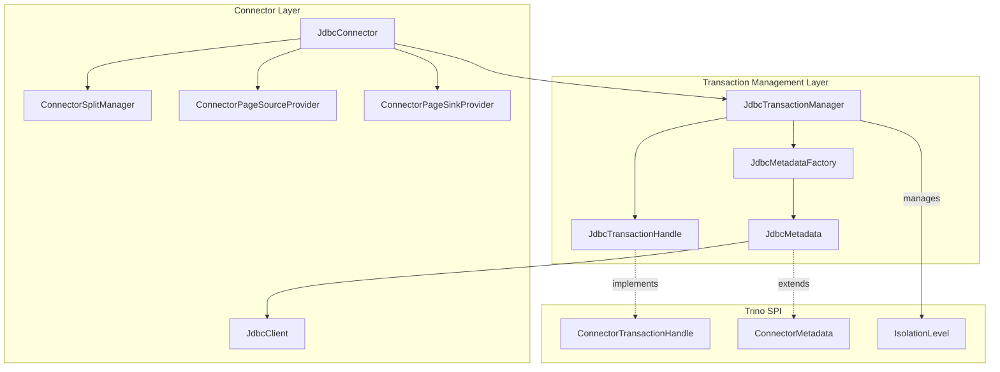
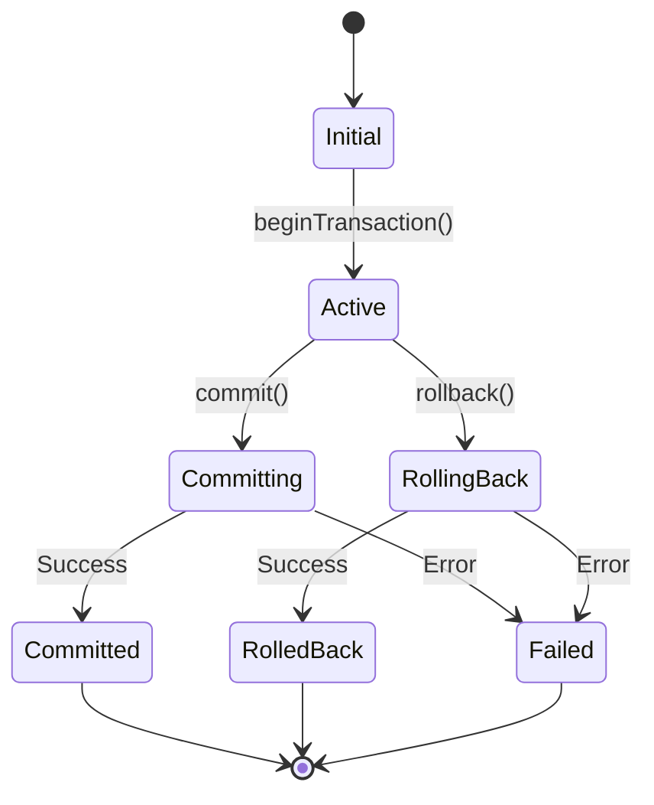
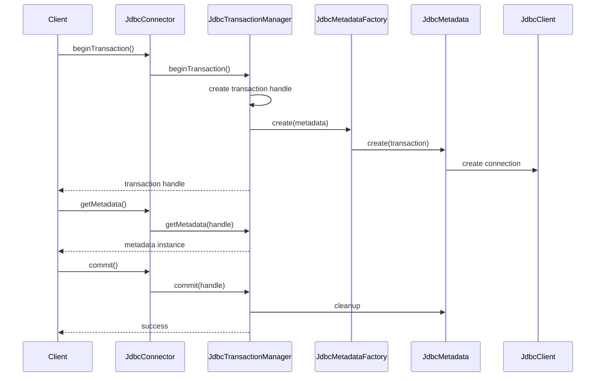
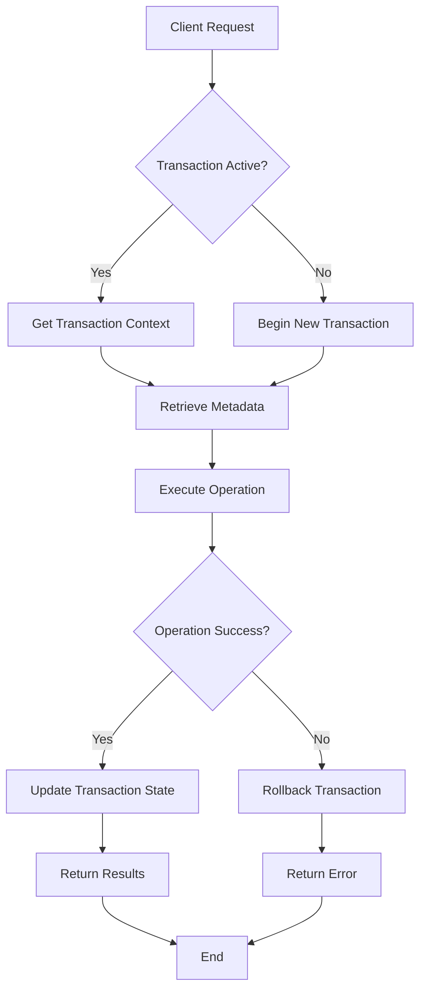
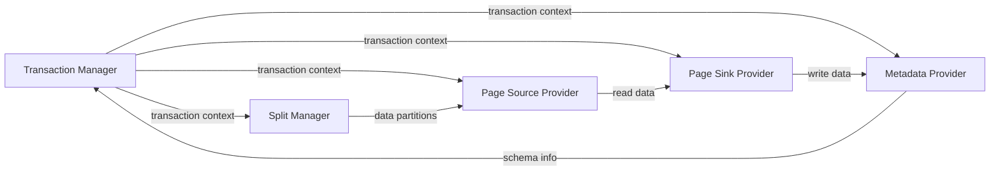
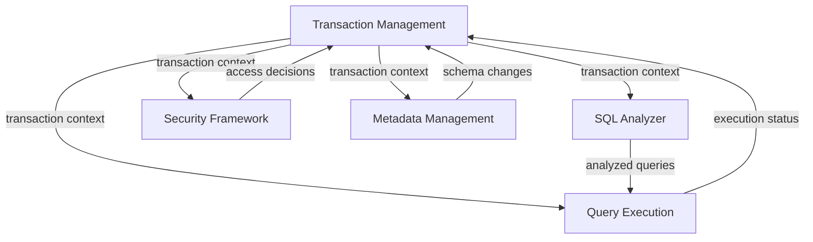

# Transaction Management Module

## Overview

The Transaction Management module in Trino provides a robust framework for handling database transactions across different connector implementations. This module ensures ACID (Atomicity, Consistency, Isolation, Durability) properties for database operations, manages transaction lifecycle, and coordinates transaction state across distributed query execution environments.

The transaction management system is primarily implemented in the Base JDBC Connector and serves as a foundation for other connectors that require transactional support. It provides a unified interface for transaction handling while allowing connector-specific implementations to customize behavior based on their underlying data source capabilities.

## Architecture

### Core Components

The transaction management architecture consists of several key components that work together to provide comprehensive transaction support:

#### Transaction Manager
The central coordinator that manages transaction lifecycle, state transitions, and coordination between different components. It maintains a registry of active transactions and ensures proper cleanup and resource management.

#### Transaction Handle
A unique identifier for each transaction that encapsulates transaction context and state. Handles are used to reference specific transactions across different components and operations.

#### Metadata Factory
Responsible for creating transaction-specific metadata instances that provide connector-specific functionality within the context of a transaction. Each transaction gets its own metadata instance to ensure isolation.

#### Transactional Metadata
Provides the actual implementation of connector operations within a transaction context, including table operations, schema management, and data manipulation operations.



## Transaction Lifecycle

### Transaction States

Transactions in Trino progress through several distinct states during their lifecycle:

1. **Initial**: Transaction has not yet been started
2. **Active**: Transaction is currently running and can perform operations
3. **Committing**: Transaction is in the process of being committed
4. **Committed**: Transaction has been successfully committed
5. **Rolling Back**: Transaction is in the process of being rolled back
6. **Rolled Back**: Transaction has been successfully rolled back
7. **Failed**: Transaction has failed due to an error

### State Transitions



## Implementation Details

### Base JDBC Connector Implementation

The Base JDBC Connector provides the foundational implementation of transaction management that other JDBC-based connectors can extend and customize.

#### JdbcTransactionManager

The `JdbcTransactionManager` class serves as the central coordinator for all transaction operations:

```java
public class JdbcTransactionManager
{
    private final ConcurrentMap<ConnectorTransactionHandle, JdbcMetadata> transactions = new ConcurrentHashMap<>();
    private final JdbcMetadataFactory metadataFactory;
    
    public ConnectorTransactionHandle beginTransaction(IsolationLevel isolationLevel, boolean readOnly, boolean autoCommit)
    {
        checkConnectorSupports(READ_COMMITTED, isolationLevel);
        JdbcTransactionHandle transaction = new JdbcTransactionHandle();
        transactions.put(transaction, metadataFactory.create(transaction));
        return transaction;
    }
    
    public void commit(ConnectorTransactionHandle transaction)
    {
        checkArgument(transactions.remove(transaction) != null, "no such transaction: %s", transaction);
    }
    
    public void rollback(ConnectorTransactionHandle transaction)
    {
        JdbcMetadata metadata = transactions.remove(transaction);
        checkArgument(metadata != null, "no such transaction: %s", transaction);
        metadata.rollback();
    }
}
```

#### JdbcTransactionHandle

The `JdbcTransactionHandle` provides a unique identifier for each transaction:

```java
public record JdbcTransactionHandle(UUID uuid)
        implements ConnectorTransactionHandle
{
    public JdbcTransactionHandle()
    {
        this(UUID.randomUUID());
    }
}
```

#### JdbcMetadata Interface

The `JdbcMetadata` interface extends `ConnectorMetadata` and adds transaction-specific operations:

```java
public interface JdbcMetadata
        extends ConnectorMetadata
{
    JdbcTableHandle getTableHandle(ConnectorSession session, PreparedQuery preparedQuery);
    JdbcProcedureHandle getProcedureHandle(ConnectorSession session, ProcedureQuery procedureQuery);
    void rollback();
    
    static List<JdbcColumnHandle> getColumns(ConnectorSession session, JdbcClient jdbcClient, JdbcTableHandle tableHandle)
    {
        // Implementation for column retrieval
    }
}
```

### Transaction Isolation Levels

Trino supports different transaction isolation levels that determine how transactions interact with each other:

#### READ_COMMITTED
The default isolation level supported by the Base JDBC Connector. This level ensures:
- No dirty reads (transactions cannot read uncommitted data from other transactions)
- Non-repeatable reads are possible (data can change between reads within the same transaction)
- Phantom reads are possible (new rows can appear between queries)

#### Isolation Level Validation

The transaction manager validates that requested isolation levels are supported:

```java
checkConnectorSupports(READ_COMMITTED, isolationLevel);
```

### Connection Management

The transaction management system integrates with connection management to ensure proper resource handling:



## Data Flow

### Transaction-Bound Operations

When operations are performed within a transaction context, the following data flow occurs:

1. **Operation Request**: Client requests an operation (query, insert, update, etc.)
2. **Transaction Context**: The system retrieves the transaction context using the transaction handle
3. **Metadata Resolution**: Transaction-specific metadata is obtained from the transaction manager
4. **Operation Execution**: The operation is executed using the transaction-bound resources
5. **Result Processing**: Results are processed and returned to the client
6. **State Update**: Transaction state is updated based on operation outcome



## Component Interactions

### Transaction Manager and Connector Integration

The transaction manager integrates with various connector components to provide comprehensive transaction support:

#### With Split Manager
The split manager works with transaction metadata to ensure consistent data partitioning and distribution across query execution nodes.

#### With Page Source Provider
The page source provider uses transaction context to maintain consistent data reading operations and handle transaction-specific optimizations.

#### With Page Sink Provider
The page sink provider coordinates write operations within transaction boundaries, ensuring that data modifications are properly committed or rolled back.

#### With Metadata Provider
The metadata provider maintains transaction-specific metadata state and ensures that schema operations are properly isolated within transactions.



## Error Handling and Recovery

### Transaction Failure Scenarios

The transaction management system handles various failure scenarios:

#### Connection Failures
When database connections are lost during transaction execution, the system:
1. Detects the connection failure
2. Marks the transaction as failed
3. Attempts to clean up resources
4. Notifies the client of the failure

#### Timeout Handling
Transactions that exceed configured timeouts are automatically rolled back to prevent resource locking and ensure system stability.

#### Deadlock Detection
The system monitors for potential deadlock situations and takes appropriate action to resolve them, typically by rolling back one of the conflicting transactions.

### Recovery Mechanisms

#### Automatic Recovery
For certain types of failures, the system can automatically recover by:
- Retrying operations with exponential backoff
- Reestablishing database connections
- Recreating transaction contexts

#### Manual Recovery
For complex failure scenarios, manual intervention may be required:
- Administrative cleanup of orphaned transactions
- Manual rollback of stuck transactions
- Database-level recovery procedures

## Performance Considerations

### Transaction Overhead

Transaction management introduces certain performance overhead:

#### Resource Allocation
Each transaction requires memory for maintaining state, connection pooling, and metadata management.

#### Lock Contention
Higher isolation levels can lead to increased lock contention and reduced concurrency.

#### Network Roundtrips
Transaction coordination may require additional network communication between Trino nodes and the database.

### Optimization Strategies

#### Connection Pooling
Efficient connection pooling reduces the overhead of establishing database connections for each transaction.

#### Batch Operations
Grouping multiple operations within a single transaction reduces transaction management overhead.

#### Read-Only Transactions
Optimizing read-only transactions by avoiding unnecessary locking and logging operations.

#### Lazy Initialization
Deferring expensive operations until they are actually needed within the transaction.

## Integration with Other Modules

### SQL Analyzer and Planner Integration

The transaction management system integrates with the SQL Analyzer and Planner to ensure that query plans respect transaction boundaries and isolation requirements.

### Query Execution Engine Integration

During query execution, the transaction context is propagated to ensure that all operations within a query execution are performed within the same transaction boundary.

### Security Framework Integration

Transaction management works with the Security Framework to ensure that access control decisions are made within the appropriate transaction context.



## Connector-Specific Implementations

### Hive Connector

The Hive Connector extends the base transaction management with Hive-specific features:

- **Metastore Integration**: Coordinates with Hive Metastore for transaction-aware metadata operations
- **ACID Table Support**: Provides full ACID compliance for Hive ACID tables
- **Partition Management**: Handles transaction-aware partition operations

### Iceberg Connector

The Iceberg Connector implements transaction management optimized for Iceberg table format:

- **Snapshot Isolation**: Leverages Iceberg's snapshot mechanism for consistent reads
- **Optimistic Concurrency**: Uses optimistic locking for write operations
- **Table Maintenance**: Coordinates table optimization and cleanup operations

### Delta Lake Connector

The Delta Lake Connector provides transaction management for Delta Lake tables:

- **Delta Log Integration**: Coordinates with Delta Lake transaction log
- **Time Travel Support**: Enables querying historical versions of tables
- **Conflict Resolution**: Handles concurrent write conflicts

## Best Practices

### Transaction Design

1. **Keep Transactions Short**: Minimize transaction duration to reduce lock contention and improve concurrency
2. **Appropriate Isolation Levels**: Choose isolation levels based on consistency requirements
3. **Error Handling**: Implement proper error handling and rollback procedures
4. **Resource Management**: Ensure proper cleanup of transaction resources

### Performance Optimization

1. **Batch Operations**: Group related operations within transactions
2. **Index Usage**: Ensure proper indexing to minimize lock duration
3. **Connection Pooling**: Configure appropriate connection pool sizes
4. **Monitoring**: Monitor transaction performance and identify bottlenecks

### Reliability

1. **Timeout Configuration**: Set appropriate transaction timeouts
2. **Retry Logic**: Implement retry mechanisms for transient failures
3. **Deadlock Prevention**: Design operations to minimize deadlock potential
4. **Backup Strategies**: Implement backup and recovery procedures

## References

- [Base JDBC Connector](BaseJDBCConnector.md) - Foundation for JDBC-based transaction management
- [Hive Connector](HiveConnector.md) - Hive-specific transaction implementation
- [Iceberg Connector](IcebergConnector.md) - Iceberg table format transaction support
- [Delta Lake Connector](DeltaLakeConnector.md) - Delta Lake transaction management
- [Query Execution Engine](QueryExecutionEngine.md) - Integration with query execution
- [SQL Analyzer and Planner](SQLAnalyzerPlannerOptimizer.md) - Transaction-aware query planning
- [Security Framework](SecurityFramework.md) - Transaction context security integration
- [Metadata Management](MetadataConnectorAbstraction.md) - Transactional metadata operations