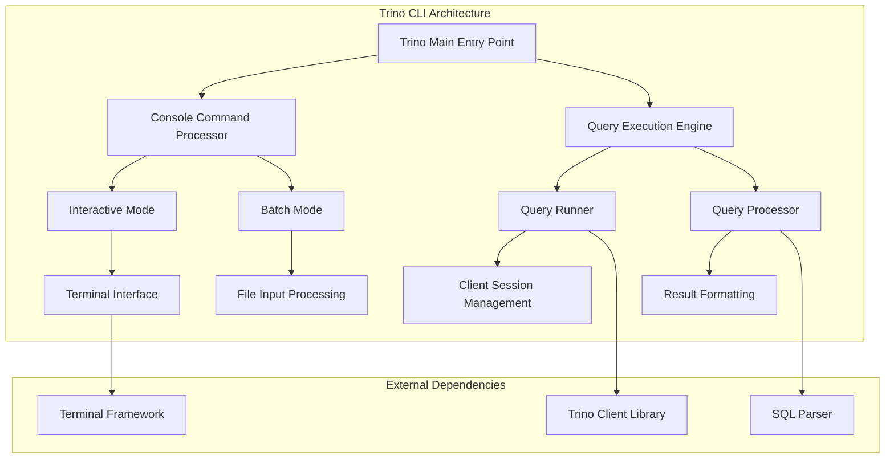

# Trino CLI Documentation

## Overview

The Trino CLI (Command Line Interface) is a powerful, interactive client application that provides users with direct access to Trino's distributed SQL query engine. It serves as the primary command-line tool for executing SQL queries, managing sessions, and interacting with Trino clusters from terminal environments.

## Purpose and Core Functionality

The Trino CLI module delivers a comprehensive command-line experience for:
- **Interactive SQL Query Execution**: Real-time query processing with immediate results
- **Batch Processing**: Automated execution of SQL scripts and files
- **Session Management**: Dynamic configuration of catalogs, schemas, and session properties
- **Multi-format Output**: Flexible result presentation in various formats (CSV, JSON, TSV, etc.)
- **Advanced Authentication**: Support for multiple authentication mechanisms including Kerberos, OAuth, and basic authentication
- **Progress Monitoring**: Real-time query execution tracking and resource utilization display

## Architecture Overview



## Core Components

### 1. Main Entry Point ([Application Framework](Application Framework.md))
The central application launcher that:
- Initializes command-line argument processing using picocli framework
- Configures resource bundles for internationalization
- Sets up exception handling and error formatting
- Manages configuration file discovery and loading

### 2. Console Interface ([Console Interface](Console Interface.md))
The primary user interaction layer featuring:
- **Interactive Mode**: Real-time SQL prompt with history and auto-completion
- **Batch Mode**: File-based query execution with error handling
- **Command Processing**: Special commands (exit, clear, help, history)
- **Session State Management**: Dynamic catalog/schema switching
- **Terminal Integration**: Advanced terminal capabilities via JLine

### 3. Query Execution ([Query Execution Engine](Query Execution Engine.md))
The query processing engine responsible for:
- **Statement Execution**: Managing the complete query lifecycle
- **Result Rendering**: Multi-format output generation
- **Progress Tracking**: Real-time query status monitoring
- **Error Handling**: Comprehensive error reporting and location highlighting
- **Warning Management**: SQL warning collection and display

### 4. Query Runner ([Query Execution Engine](Query Execution Engine.md))
The client session manager that:
- **HTTP Client Management**: OkHttp-based connection handling
- **Session Lifecycle**: Client session creation and maintenance
- **Authentication**: Credential management and security protocol handling
- **Query Initialization**: Statement client preparation and configuration

### 5. Client Options ([Configuration Management](Configuration Management.md))
The configuration management system providing:
- **Connection Parameters**: Server URLs, authentication settings
- **Session Properties**: Catalog, schema, and runtime configuration
- **Output Formatting**: Result presentation options
- **Resource Management**: Query timeout and buffering controls
- **Security Settings**: SSL/TLS and authentication configurations

### 6. Statement Splitter ([SQL Processing](SQL Processing.md))
The SQL parsing utility that:
- **Statement Parsing**: ANTLR-based SQL statement recognition
- **Delimiter Handling**: Multi-statement separation and processing
- **Function Detection**: Advanced SQL function identification
- **Whitespace Management**: Statement normalization and cleanup

## Key Features

### Interactive Query Environment
- **Syntax Highlighting**: SQL keyword recognition and coloring
- **Auto-completion**: Table and column name suggestions
- **Command History**: Persistent query history with search capabilities
- **Multi-line Support**: Complex query editing with proper formatting

### Flexible Output Formats
- **Table Formats**: Aligned, vertical, and markdown table presentations
- **Data Exchange**: CSV, TSV, and JSON export capabilities
- **Customizable Display**: Configurable column widths and pagination
- **Progress Indicators**: Real-time query execution status

### Advanced Authentication
- **Kerberos Support**: Enterprise-grade authentication with keytab management
- **OAuth Integration**: Modern token-based authentication flows
- **Certificate-based**: SSL client certificate authentication
- **Basic Authentication**: Username/password credential handling

### Session Management
- **Dynamic Configuration**: Runtime catalog and schema switching
- **Property Management**: Session-level configuration control
- **Transaction Support**: Transaction lifecycle management
- **Role-based Access**: User role and permission handling

## Integration with Trino Ecosystem

The Trino CLI seamlessly integrates with:
- **[Trino Client Library](Trino Client Library.md)**: Core communication protocol
- **[Trino Server & API](Trino Server & API.md)**: REST API endpoints
- **[SQL Parser & AST](SQL Parser & AST.md)**: Query parsing and validation
- **[Metadata & Connector Abstraction](Metadata & Connector Abstraction.md)**: Catalog and schema discovery

## Usage Patterns

### Interactive Mode
```bash
trino --server localhost:8080 --catalog hive --schema default
```

### Batch Processing
```bash
trino --server localhost:8080 --file queries.sql --output-format CSV
```

### Advanced Configuration
```bash
trino --server https://trino.example.com \
      --keystore-path /path/to/keystore.jks \
      --catalog iceberg \
      --schema production
```

## Configuration Management

The CLI supports multiple configuration sources:
1. **Command Line Arguments**: Direct parameter specification
2. **Configuration Files**: `~/.trino_config` and system-wide settings
3. **Environment Variables**: `TRINO_CONFIG`, `TRINO_PASSWORD`
4. **URI Parameters**: Connection string embedded configuration

## Error Handling and Diagnostics

The module provides comprehensive error management:
- **Query Error Location**: Precise error positioning in SQL statements
- **Stack Trace Display**: Optional debug information for troubleshooting
- **Connection Diagnostics**: Network and authentication failure analysis
- **Resource Monitoring**: Memory and timeout issue detection

## Performance Optimization

Key performance features include:
- **Result Streaming**: Efficient large result set handling
- **Memory Management**: Configurable buffering and queue sizes
- **Connection Pooling**: HTTP connection reuse and optimization
- **Compression Support**: Network traffic reduction capabilities

This documentation provides a comprehensive overview of the Trino CLI module. For detailed information about specific sub-modules, refer to their individual documentation files.