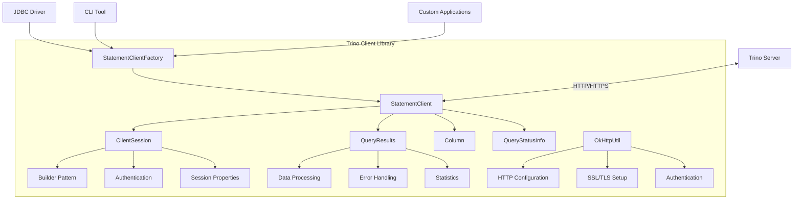
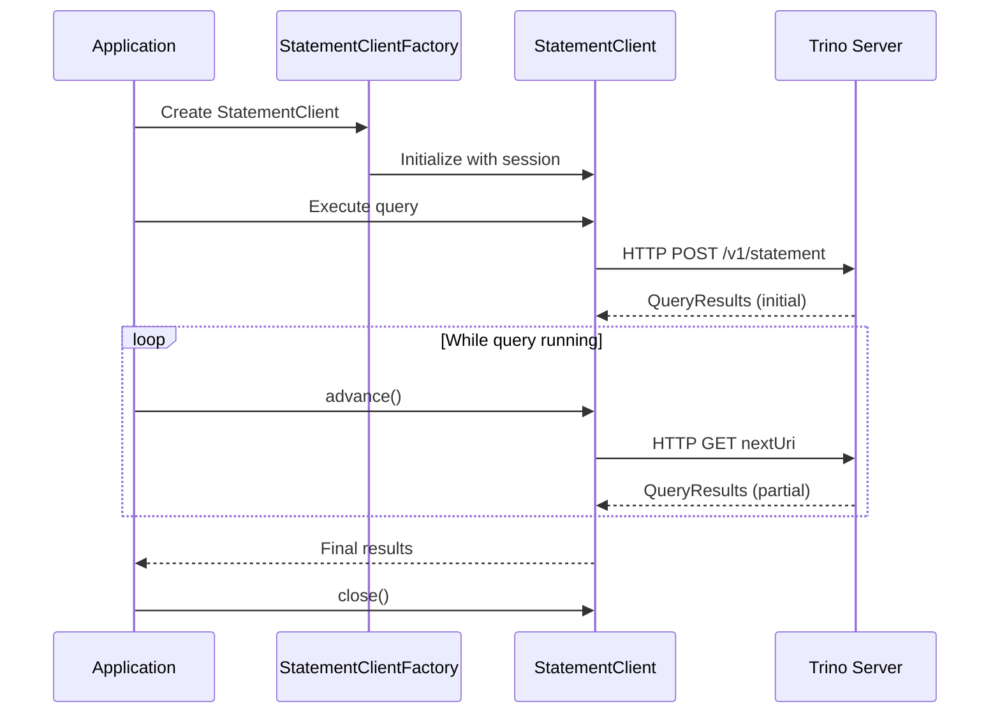

# Trino Client Library

## Overview

The Trino Client Library is a Java-based client library that provides programmatic access to Trino (formerly Presto SQL) distributed SQL query engines. This library serves as the foundation for building applications that need to execute SQL queries against Trino clusters, offering a comprehensive set of APIs for query execution, result processing, and session management.

## Purpose and Core Functionality

The Trino Client Library enables developers to:
- Execute SQL queries against Trino clusters
- Manage client sessions with authentication and configuration
- Process query results with type-safe data handling
- Handle asynchronous query execution and status monitoring
- Integrate with various authentication mechanisms
- Support both synchronous and asynchronous query patterns

## Architecture Overview



## Core Components

### Query Execution Framework
The query execution framework provides the core interfaces and factories for executing SQL queries against Trino clusters. See [Query Execution Framework](Query%20Execution%20Framework.md) for detailed documentation.

### Session Management
Comprehensive session management capabilities including authentication, configuration, and transaction handling. See [Session Management](Session%20Management.md) for detailed documentation.

### Result Processing
Type-safe result processing with column metadata, data handling, and status information. See [Result Processing](Result%20Processing.md) for detailed documentation.

### Network & Security
HTTP client configuration, SSL/TLS setup, and authentication mechanisms. See [Network & Security](Network%20&%20Security.md) for detailed documentation.

## Integration with Trino Ecosystem

The Trino Client Library serves as the foundation for higher-level client tools:

- **[Trino JDBC Driver](Trino JDBC Driver.md)**: Provides JDBC compatibility layer
- **[Trino CLI](Trino CLI.md)**: Command-line interface for interactive query execution
- **Custom Applications**: Direct integration for specialized use cases

## Data Flow Architecture



## Key Features

### Asynchronous Query Execution
The library supports non-blocking query execution with the ability to:
- Monitor query progress through statistics
- Cancel running queries
- Handle partial results
- Manage query lifecycle states

### Type Safety
Strong typing throughout the API with:
- Immutable data structures
- Type-safe column definitions
- Comprehensive error handling
- Optional values for nullable fields

### Authentication Support
Multiple authentication mechanisms:
- Basic authentication
- Token-based authentication (Bearer tokens)
- Kerberos/SPNEGO authentication
- SSL client certificates

### Session Management
Comprehensive session control including:
- Catalog and schema selection
- Time zone and locale settings
- Transaction management
- Prepared statement handling
- Role-based access control

## Error Handling

The library provides robust error handling with:
- Structured error information via `QueryError`
- Client-side validation
- Network error recovery
- Detailed error messages and error codes

## Performance Considerations

- **Connection Pooling**: Built-in HTTP connection pooling via OkHttp
- **Streaming Results**: Support for large result sets through pagination
- **Compression**: Optional response compression
- **Timeouts**: Configurable request timeouts and heartbeats

## Security Features

- **SSL/TLS Support**: Full SSL configuration with certificate validation
- **Authentication**: Multiple authentication methods
- **Credential Management**: Secure handling of user credentials
- **Proxy Support**: HTTP and SOCKS proxy configuration

## Usage Patterns

### Basic Query Execution
```java
// Create session
ClientSession session = ClientSession.builder()
    .server(URI.create("https://trino.example.com"))
    .catalog("hive")
    .schema("default")
    .build();

// Execute query
StatementClient client = StatementClientFactory
    .newStatementClient(httpClient, session, "SELECT * FROM users");

// Process results
while (client.isRunning()) {
    QueryResults results = client.currentStatusInfo();
    // Process results...
    client.advance();
}
```

### Advanced Configuration
The library supports extensive configuration for enterprise environments, including custom authentication, SSL settings, and connection pooling.

## Dependencies

The Trino Client Library is built on proven open-source libraries:
- **OkHttp**: HTTP client for reliable network communication
- **Jackson**: JSON serialization and deserialization
- **Guava**: Google core libraries for utilities
- **Airlift**: Framework for building REST services

This foundation ensures reliability, performance, and maintainability while providing a clean, intuitive API for Trino integration.