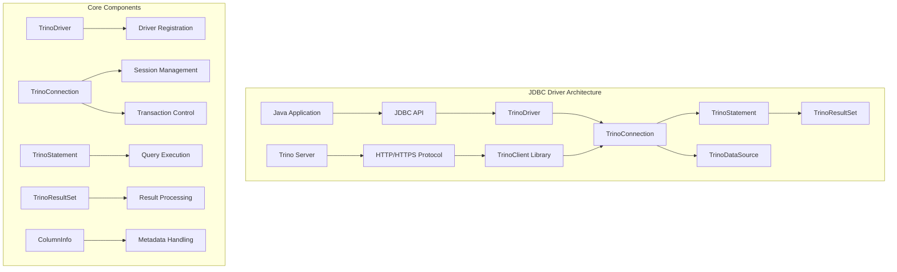
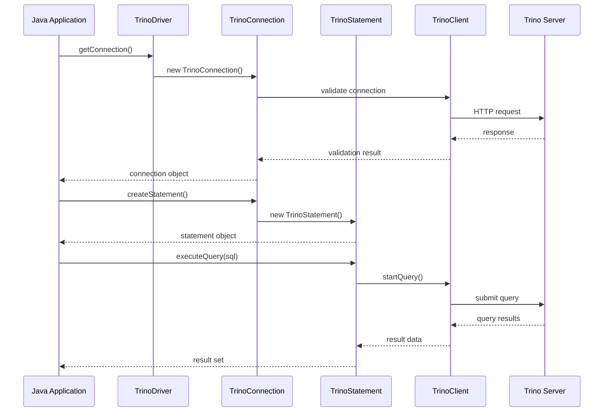

# Trino JDBC Driver

## Overview

The Trino JDBC Driver is a Java Database Connectivity (JDBC) driver that enables Java applications to connect to and interact with Trino, a distributed SQL query engine. The driver implements the standard JDBC API, providing a familiar interface for Java developers to execute SQL queries against Trino clusters.

## Purpose and Core Functionality

The Trino JDBC Driver serves as a bridge between Java applications and Trino clusters, offering:

- **Standard JDBC Compliance**: Full implementation of JDBC 4.0+ interfaces
- **Connection Management**: Secure authentication and session management
- **Query Execution**: Support for both synchronous and asynchronous query processing
- **Result Set Handling**: Streaming result sets for efficient memory usage
- **Transaction Support**: Basic transaction management capabilities
- **Metadata Access**: Database metadata and schema information retrieval

## Architecture Overview



## Core Components

### 1. TrinoDriver
The main entry point that registers itself with the JDBC DriverManager and handles driver-level operations. See [Query Execution Framework](Query Execution Framework.md) for detailed information.

### 2. TrinoConnection
Manages the connection lifecycle, session properties, authentication, and transaction state. Provides the primary interface for creating statements and managing connection-level settings. See [Connection Management](Connection Management.md) for detailed information.

### 3. TrinoStatement
Implements the Statement interface for executing SQL queries and updates. Handles query execution, timeout management, and result set creation. See [Query Execution Framework](Query Execution Framework.md) for detailed information.

### 4. TrinoResultSet
Provides access to query results with streaming capabilities. Implements cursor-based navigation and data type conversions. See [Result Processing](Result Processing.md) for detailed information.

### 5. TrinoDataSource
Implements the DataSource interface for connection pooling and JNDI integration, providing a standard way to obtain connections. See [Connection Management](Connection Management.md) for detailed information.

### 6. ColumnInfo
Handles metadata information about result set columns, including type mapping between Trino types and JDBC SQL types. See [Result Processing](Result Processing.md) for detailed information.

## Data Flow Architecture



## Integration with Trino Ecosystem

The JDBC driver integrates with several other Trino modules:

- **[Trino Client Library](Trino Client Library.md)**: Provides the underlying communication protocol and client session management through StatementClient and ClientSession components
- **[Trino Server & API](Trino Server & API.md)**: Interfaces with the server's REST API endpoints for query submission and result retrieval
- **[SQL Parser & AST](SQL Parser & AST.md)**: Leverages the parser for SQL syntax validation and query processing

## Sub-module Documentation

For detailed information about specific aspects of the JDBC driver, refer to:

- **[Connection Management](Connection Management.md)**: Detailed documentation of connection lifecycle, authentication, and session management
- **[Query Execution Framework](Query Execution Framework.md)**: Comprehensive guide to query execution, statement handling, and driver registration
- **[Result Processing](Result Processing.md)**: In-depth coverage of result set handling, column metadata, and data type conversions

## Key Features

### Connection Management
- Support for multiple authentication methods (basic, Kerberos, OAuth)
- SSL/TLS encryption for secure connections
- Connection pooling through DataSource implementation
- Session property configuration

### Query Execution
- Prepared statement support with parameter binding
- Batch execution capabilities
- Query timeout management
- Progress monitoring and cancellation

### Result Processing
- Streaming result sets for large datasets
- Type-safe data access with automatic type conversion
- Metadata access for result set structure
- Warning and error handling

### Transaction Support
- Auto-commit and manual transaction modes
- Transaction isolation level configuration
- Commit and rollback operations

## Configuration and Usage

The driver supports various connection parameters through JDBC URLs and properties:

```java
// Basic connection
String url = "jdbc:trino://host:port/catalog/schema";
Connection conn = DriverManager.getConnection(url, "user", "password");

// With additional properties
Properties props = new Properties();
props.setProperty("user", "username");
props.setProperty("password", "password");
props.setProperty("SSL", "true");
Connection conn = DriverManager.getConnection(url, props);
```

## Error Handling and Diagnostics

The driver provides comprehensive error handling:

- SQL exception mapping from Trino errors
- Connection validation and retry logic
- Detailed error messages with context
- Logging support for debugging

## Performance Considerations

- **Streaming Results**: Large result sets are processed incrementally to minimize memory usage
- **Connection Pooling**: DataSource implementation supports connection reuse
- **Async Processing**: Non-blocking query execution with callback support
- **Compression**: Optional compression for network traffic

## Security Features

- **Authentication**: Multiple authentication mechanisms
- **Encryption**: SSL/TLS support for data in transit
- **Credential Management**: Secure handling of authentication credentials
- **Role-based Access**: Support for Trino's role-based security model

This documentation provides a comprehensive overview of the Trino JDBC Driver's architecture and capabilities. For detailed information about specific components and their interactions, refer to the individual component documentation.