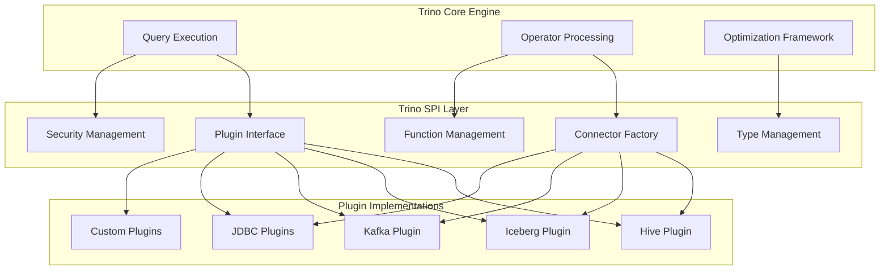

# Trino SPI (Service Provider Interface)

## Overview

The Trino SPI (Service Provider Interface) is the core abstraction layer that defines the contract between Trino's query engine and its various connectors, plugins, and extensions. It provides a standardized interface for implementing custom data sources, functions, security mechanisms, and other pluggable components within the Trino ecosystem.

## Purpose and Architecture

The Trino SPI serves as the foundation for Trino's extensibility, enabling:

- **Connector Development**: Standardized interfaces for connecting to diverse data sources
- **Plugin Architecture**: Modular extension of Trino's capabilities
- **Type System**: Comprehensive type definitions and operations
- **Security Integration**: Pluggable authentication and authorization mechanisms
- **Function Extensions**: Custom function implementations
- **Data Format Support**: Block-based data processing abstractions

### High-Level Architecture



## Core Components

### 1. [Plugin Architecture](Plugin Architecture.md)
The `Plugin` interface is the entry point for all Trino extensions. It provides factories for various components including connectors, types, functions, and security mechanisms.

**Key Responsibilities:**
- Connector factory registration
- Type system extensions
- Function registration
- Security provider factories
- Event listener registration

### 2. [Data Processing Framework](Data Processing Framework.md)
The data processing components provide a columnar, block-based data model optimized for analytical workloads.

**Page**: A collection of blocks representing a set of rows with multiple columns
**Block**: A columnar data structure containing values of a specific type

### 3. [Type System](Type System.md)
Comprehensive type system supporting primitive types, complex types (arrays, maps, rows), and custom user-defined types.

**Features:**
- Type signatures and validation
- Serialization/deserialization
- Comparison and ordering operations
- Range and discrete value support

### 4. [Connector Framework](Connector Framework.md)
Standardized interfaces for implementing data source connectors:

- **ColumnMetadata**: Schema definition and column properties
- **Constraint**: Query predicate pushdown optimization
- **ConnectorMaterializedViewDefinition**: Materialized view support

### 5. [Security Framework](Security Framework.md)
Identity and security management for connector-level authentication and authorization.

**Capabilities:**
- User identity management
- Group membership
- Role-based access control
- Credential management

### 6. [Function System](Function System.md)
Function definition and signature management supporting:

- Type variable constraints
- Variable arity functions
- Complex type signatures
- Overload resolution

### 7. [Statistics Framework](Statistics Framework.md)
Cost-based optimization support through table and column statistics.

### 8. [Procedure Framework](Procedure Framework.md)
Stored procedure support for connector-specific operations and administrative tasks.

## Integration Points

The Trino SPI integrates with various Trino modules:

- **[SQL Parser & AST](SQL Parser & AST.md)**: Type system integration and function resolution
- **[SQL Analyzer, Planner & Optimizer](SQL Analyzer, Planner & Optimizer.md)**: Constraint pushdown and statistics usage
- **[Query Execution Engine](Query Execution Engine.md)**: Block-based data processing
- **[Metadata & Connector Abstraction](Metadata & Connector Abstraction.md)**: Connector lifecycle management
- **[Plugin Toolkit](Plugin Toolkit.md)**: Base implementations and utilities

## Key Design Principles

### 1. Extensibility
- Interface-based design allowing custom implementations
- Factory pattern for component creation
- Plugin lifecycle management

### 2. Performance
- Columnar data representation for analytical workloads
- Block-based memory management
- Type-specific optimizations

### 3. Type Safety
- Strong typing throughout the SPI
- Compile-time validation where possible
- Runtime type checking and validation

### 4. Compatibility
- Version compatibility mechanisms
- Backward compatibility considerations
- Deprecation management

## Usage Patterns

### Plugin Development
```java
public class MyPlugin implements Plugin {
    @Override
    public Iterable<ConnectorFactory> getConnectorFactories() {
        return List.of(new MyConnectorFactory());
    }
    
    @Override
    public Iterable<Type> getTypes() {
        return List.of(new MyCustomType());
    }
}
```

### Connector Implementation
```java
public class MyConnector implements Connector {
    // Implement connector lifecycle methods
    // Provide metadata, split manager, page source providers
}
```

### Custom Type Definition
```java
public class MyType implements Type {
    // Implement type-specific operations
    // Define serialization/deserialization
    // Provide comparison and ordering logic
}
```

## Best Practices

### 1. Performance Optimization
- Implement proper block compaction
- Use appropriate block types for data patterns
- Leverage dictionary encoding when beneficial

### 2. Memory Management
- Implement accurate size estimation
- Proper retained size calculation
- Memory-efficient data structures

### 3. Error Handling
- Clear error messages with context
- Proper exception types
- Graceful degradation

### 4. Testing
- Comprehensive unit tests
- Integration testing with Trino
- Performance benchmarking

## Related Documentation

- [Plugin Toolkit](Plugin Toolkit.md) - Base implementations and utilities for plugin development
- [Base JDBC Connector](Base JDBC Connector.md) - Reference implementation for JDBC-based connectors
- [Hive Connector](Hive Connector.md) - Complex connector implementation example
- [Iceberg Connector](Iceberg Connector.md) - Modern table format connector implementation