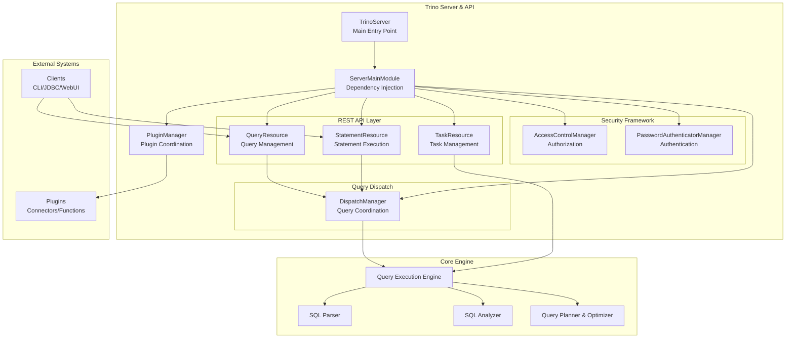

# Trino Server & API

## Overview

The Trino Server & API module is the core server infrastructure that provides the main entry point for the Trino distributed SQL query engine. It encompasses the HTTP REST API endpoints, server lifecycle management, plugin system coordination, and security framework that together form the foundation of Trino's query processing capabilities.

## Purpose and Core Functionality

The Trino Server & API module serves as the central orchestration layer that:

- **Provides HTTP REST API endpoints** for query submission, monitoring, and management
- **Manages server lifecycle** including startup, configuration, and graceful shutdown
- **Coordinates plugin loading** and registration of connectors, functions, and security providers
- **Implements security frameworks** for authentication, authorization, and access control
- **Handles query dispatch** and resource management across the cluster
- **Exposes monitoring and administrative interfaces** for operational visibility

## Architecture Overview

## Component Relationships

The Trino Server & API module integrates with several key subsystems:

### Core Dependencies
- **[Query Execution Engine](Query%20Execution%20Engine.md)**: Provides task execution and operator framework
- **[SQL Parser & AST](SQL%20Parser%20&%20AST.md)**: Handles SQL parsing and abstract syntax tree representation
- **[SQL Analyzer, Planner & Optimizer](SQL%20Analyzer%2C%20Planner%20&%20Optimizer.md)**: Performs query analysis, planning, and optimization
- **[Metadata & Connector Abstraction](Metadata%20&%20Connector%20Abstraction.md)**: Manages catalog metadata and connector interfaces

### Client Integration
- **[Trino Client Library](Trino%20Client%20Library.md)**: Provides client-side API for programmatic access
- **[Trino CLI](Trino%20CLI.md)**: Command-line interface for interactive query execution
- **[Trino JDBC Driver](Trino%20JDBC%20Driver.md)**: JDBC-compliant driver for database connectivity
- **[Trino Web UI](Trino%20Web%20UI.md)**: Web-based user interface for query monitoring

### Plugin Ecosystem
- **[Trino SPI](Trino%20SPI.md)**: Service Provider Interface for plugin development
- **[Plugin Toolkit](Plugin%20Toolkit.md)**: Utility libraries for plugin implementation

## Sub-modules

### REST API Layer
The REST API provides HTTP endpoints for query management, statement execution, and task coordination. See [REST API Layer](REST%20API%20Layer.md) for detailed documentation.

### Security Framework
Implements comprehensive security controls for authentication and authorization. See [Security Framework](Security%20Framework.md) for detailed documentation.

### Query Dispatch
Coordinates query execution across the cluster. See [Query Dispatch](Query%20Dispatch.md) for detailed documentation.

### Server Infrastructure
Core server components providing lifecycle management. See [Server Infrastructure](Server%20Infrastructure.md) for detailed documentation.

## Key Features

### Multi-Protocol Support
The server supports multiple client protocols:
- HTTP REST API for web and programmatic access
- JDBC for database tool integration
- CLI for interactive usage
- Web UI for monitoring and administration

### Pluggable Architecture
Extensible plugin system allows for:
- Custom connector implementations
- User-defined functions
- Security providers
- Event listeners

### Security Integration
Comprehensive security framework including:
- Authentication via multiple mechanisms (password, certificate, header-based)
- Fine-grained authorization with row-level security and column masking
- Integration with external identity providers

### Operational Excellence
Built-in monitoring and management capabilities:
- Query performance metrics and statistics
- Resource utilization tracking
- Health checks and status endpoints
- Graceful shutdown and recovery mechanisms

## Configuration and Deployment

The server module is configured through:
- **Server Configuration**: Core server settings including coordinator/worker roles
- **Security Configuration**: Authentication and authorization policies
- **Plugin Configuration**: Connector and function registration
- **Resource Management**: Memory, CPU, and network resource limits

## Performance Characteristics

The Trino Server & API module is designed for:
- **High Concurrency**: Supports thousands of concurrent queries
- **Low Latency**: Minimal overhead for query submission and coordination
- **Scalability**: Horizontal scaling across large clusters
- **Fault Tolerance**: Graceful handling of node failures and network partitions

This module serves as the foundation for all Trino operations, providing the essential infrastructure that enables the distributed SQL query processing capabilities that Trino is known for.