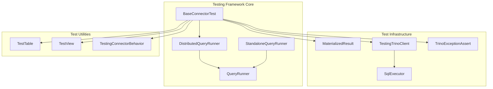
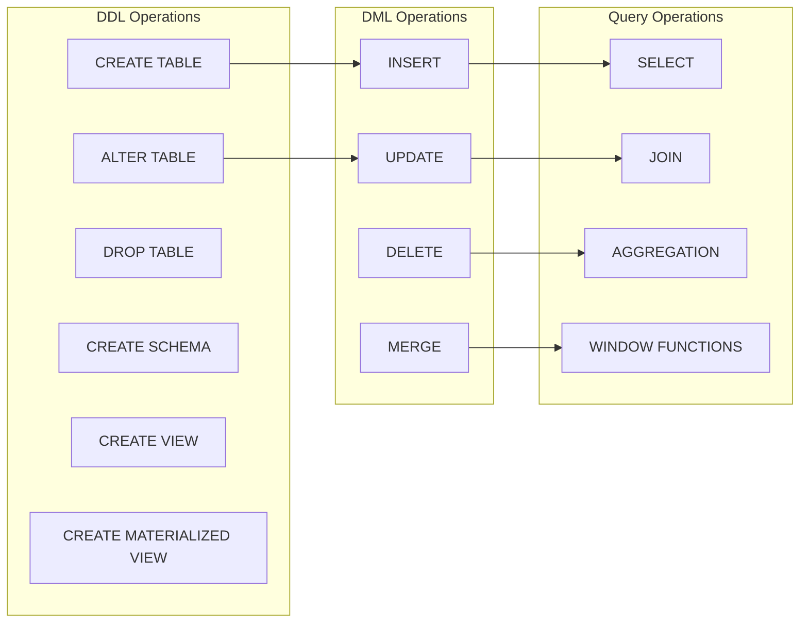

# Trino Testing Framework

## Overview

The Trino Testing Framework is a comprehensive testing infrastructure designed to validate Trino's distributed SQL query engine functionality. It provides a robust set of tools and utilities for testing connectors, query execution, and various SQL operations across different deployment scenarios.

## Purpose

The framework serves as the primary testing mechanism for:
- **Connector Validation**: Testing Trino connectors against various data sources
- **Query Execution**: Validating SQL query processing and optimization
- **Distributed Operations**: Testing multi-node cluster functionality
- **Data Type Support**: Ensuring proper handling of diverse data types
- **Performance Testing**: Benchmarking query execution and optimization

## Architecture



## Core Components

### QueryRunner Interface
The foundation of the testing framework, providing:
- Query execution capabilities
- Session management
- Transaction handling
- Catalog and schema operations

### DistributedQueryRunner
Implements distributed testing scenarios with:
- Multi-node cluster simulation
- Coordinator and worker node management
- Fault injection capabilities
- Load balancing validation

### BaseConnectorTest
Comprehensive connector testing suite featuring:
- **DDL Operations**: CREATE, ALTER, DROP operations
- **DML Operations**: INSERT, UPDATE, DELETE, MERGE
- **Query Operations**: SELECT, JOIN, AGGREGATION
- **Schema Operations**: Schema creation and management
- **View Operations**: View creation and refresh
- **Materialized Views**: MV creation and maintenance

## Key Features

### 1. Comprehensive Test Coverage
- **Data Type Testing**: Support for all Trino data types
- **SQL Operation Testing**: Complete SQL statement validation
- **Connector Behavior Testing**: Behavior-driven testing approach
- **Performance Testing**: Query execution time and resource usage

### 2. Distributed Testing
- **Multi-node Clusters**: Simulates production environments
- **Fault Tolerance**: Tests failure scenarios and recovery
- **Load Distribution**: Validates query distribution across nodes
- **Concurrency Testing**: Multi-threaded operation validation

### 3. Connector Validation
- **Behavior-based Testing**: Uses TestingConnectorBehavior enum
- **Feature Detection**: Automatically detects connector capabilities
- **Error Handling**: Validates proper error reporting
- **Data Consistency**: Ensures data integrity across operations

## Testing Capabilities

### SQL Operations Testing


### Data Type Support
- **Primitive Types**: Integer, String, Boolean, Date/Time
- **Complex Types**: Arrays, Maps, Rows (Structs)
- **Precision Types**: Decimal, Timestamp with timezone
- **Specialized Types**: JSON, UUID, IP addresses

### Performance Testing
- **Query Execution Time**: Measures query performance
- **Resource Usage**: Monitors memory and CPU consumption
- **Scalability Testing**: Tests with varying data volumes
- **Optimization Validation**: Verifies query plan optimization

## Integration Points

The testing framework integrates with:
- **[Trino SPI](Trino SPI.md)**: For connector development and testing
- **[SQL Parser & AST](SQL Parser & AST.md)**: For query parsing validation
- **[Query Execution Engine](Query Execution Engine.md)**: For execution testing
- **[Metadata & Connector Abstraction](Metadata & Connector Abstraction.md)**: For metadata operations

## Usage Patterns

### Basic Connector Testing
```java
public class MyConnectorTest extends BaseConnectorTest {
    @Override
    protected QueryRunner createQueryRunner() {
        return DistributedQueryRunner.builder(session)
            .setCoordinatorProperties(...)
            .setWorkerCount(3)
            .build();
    }
}
```

### Custom Test Scenarios
```java
@Test
public void testCustomScenario() {
    try (TestTable table = newTrinoTable("test_table", 
            "(id INT, name VARCHAR)")) {
        assertUpdate("INSERT INTO " + table.getName() + 
            " VALUES (1, 'test')", 1);
        assertQuery("SELECT * FROM " + table.getName(),
            "VALUES (1, 'test')");
    }
}
```

## Sub-modules

The testing framework consists of several specialized sub-modules:

### [Query Runner Infrastructure](Query Runner Infrastructure.md)
Core query execution and cluster management components that provide the foundation for distributed and standalone testing scenarios.

### [Connector Test Framework](Connector Test Framework.md)
Comprehensive connector validation and testing utilities that enable thorough testing of Trino connectors with extensive SQL operation coverage.

### [Test Utilities and Assertions](Test Utilities and Assertions.md)
Helper classes and assertion frameworks for test validation, including result verification and exception handling.

### [SQL Testing Framework](SQL Testing Framework.md)
SQL-specific testing capabilities and validation tools for executing and verifying SQL statements across different connectors and configurations.

## Best Practices

1. **Use TestTable and TestView**: Leverage automatic cleanup
2. **Follow Naming Conventions**: Use descriptive test names
3. **Test Edge Cases**: Include null values, empty results, errors
4. **Validate Error Messages**: Ensure proper error reporting
5. **Test Concurrent Operations**: Use multi-threaded tests when appropriate
6. **Measure Performance**: Include performance assertions
7. **Document Test Purpose**: Clear test documentation

## Configuration

The framework supports various configuration options:
- **Cluster Size**: Configurable number of worker nodes
- **Memory Settings**: Heap size and memory management
- **Timeout Values**: Query and test timeouts
- **Logging Levels**: Configurable logging for debugging
- **Feature Flags**: Enable/disable specific features

## Error Handling

The framework provides comprehensive error handling:
- **Expected Failures**: Validates proper error conditions
- **Exception Types**: Specific exception validation
- **Error Messages**: Message content validation
- **Stack Traces**: Proper error propagation

This testing framework ensures Trino's reliability, performance, and correctness across all supported connectors and deployment scenarios.