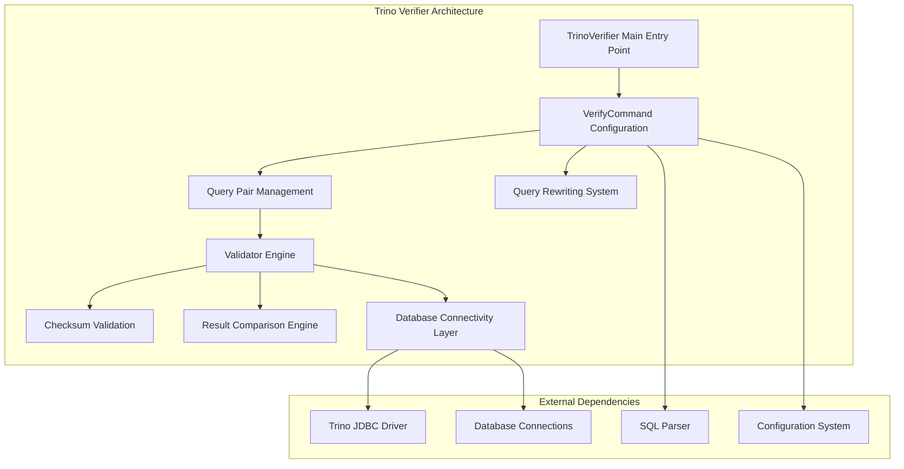

# Trino Verifier

## Overview

The Trino Verifier is a specialized testing and validation framework designed to ensure query correctness and performance consistency across different Trino deployments. It provides comprehensive query validation capabilities by comparing execution results between control and test environments, making it an essential tool for regression testing, upgrade validation, and performance benchmarking.

## Purpose and Core Functionality

The Trino Verifier serves as a critical quality assurance component in the Trino ecosystem, enabling:

- **Query Result Validation**: Systematic comparison of query results between different Trino instances to detect correctness regressions
- **Performance Regression Detection**: Monitoring and comparison of query execution metrics to identify performance degradation
- **Upgrade Validation**: Comprehensive testing framework for validating Trino upgrades and configuration changes
- **Deterministic Query Analysis**: Detection of non-deterministic queries that may produce inconsistent results
- **Shadow Testing Support**: Ability to run production queries against test environments without impacting production workloads

## Architecture Overview

## Core Components

### 1. TrinoVerifier Entry Point
The main entry point that initializes the verification process using command-line interface framework. It orchestrates the entire verification workflow and manages the application lifecycle.

### 2. Command & Configuration System
A comprehensive configuration management system that handles command-line argument parsing, configuration file processing, and database connection setup. For detailed information, see [Command & Configuration System](Command & Configuration System.md).

### 3. Query Pair Management
Manages paired query execution between control and test environments, including query loading, validation, and filtering. For detailed information, see [Query Pair Management](Query Pair Management.md).

### 4. Query Execution & Validation Engine
The core validation engine that executes queries and performs comprehensive validation, including dual-environment execution, result comparison, and performance analysis. For detailed information, see [Query Execution & Validation Engine](Query Execution & Validation Engine.md).

### 5. Result Comparison Engine
Sophisticated result comparison system featuring multi-precision numeric comparison, complex data type handling, and detailed difference reporting.

### 6. Checksum Validation
Provides checksum-based validation capabilities for large result sets, enabling efficient comparison of query results without full data transfer.

## Key Features

### Query Type Classification
The system automatically classifies queries into three categories:
- **READ**: SELECT, SHOW, and EXPLAIN queries
- **CREATE**: CREATE TABLE, CREATE VIEW, and CREATE MATERIALIZED VIEW queries
- **MODIFY**: INSERT, UPDATE, DELETE, and DDL operations

### Deterministic Query Detection
Advanced algorithm to identify non-deterministic queries that may produce different results across multiple executions, crucial for reliable validation.

### Shadow Testing Support
Comprehensive shadow testing capabilities that allow production queries to be safely executed against test environments with automatic table prefix rewriting and schema mapping.

### Performance Monitoring
Integrated performance monitoring that tracks:
- Query execution time (wall time)
- CPU time consumption
- Query resource utilization
- Performance regression detection

## Integration with Trino Ecosystem

The Trino Verifier integrates seamlessly with the broader Trino ecosystem:

- **Trino JDBC Driver**: Leverages the [Trino JDBC Driver](Trino JDBC Driver.md) for database connectivity
- **SQL Parser**: Utilizes the [SQL Parser & AST](SQL Parser & AST.md) module for query analysis and classification
- **Configuration System**: Integrates with Trino's configuration management framework
- **Testing Framework**: Complements the [Trino Testing Framework](Trino Testing Framework.md) for comprehensive testing strategies

## Usage Patterns

### Regression Testing
Systematic validation of query correctness after code changes, configuration updates, or infrastructure modifications.

### Upgrade Validation
Comprehensive testing framework for validating Trino version upgrades across different environments.

### Performance Benchmarking
Automated performance comparison between different Trino configurations, hardware setups, or software versions.

### Production Validation
Safe validation of production workloads using shadow testing techniques without impacting live systems.

## Configuration and Deployment

The Trino Verifier supports flexible deployment configurations:

- **Multi-environment Support**: Simultaneous testing across multiple Trino clusters
- **Configurable Precision**: Adjustable comparison precision for numeric data types
- **Flexible Query Filtering**: Sophisticated query selection and filtering capabilities
- **Scalable Execution**: Multi-threaded execution for large-scale validation campaigns

## Error Handling and Reporting

Comprehensive error handling and reporting system providing:
- Detailed failure analysis and root cause identification
- Performance regression reports with historical comparison
- Query execution statistics and resource utilization metrics
- Configurable logging and monitoring integration

This documentation provides a foundation for understanding the Trino Verifier's capabilities and architecture. For detailed implementation specifics, refer to the individual component documentation files.