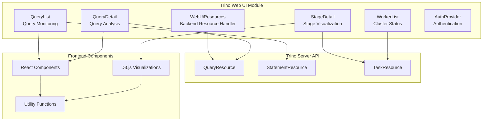
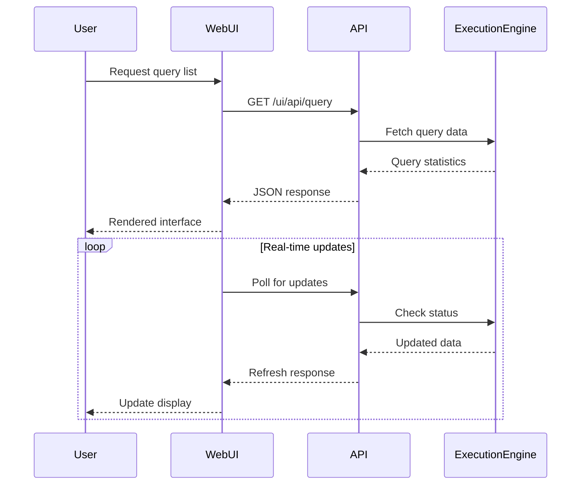

# Trino Web UI Module

## Overview

The Trino Web UI module provides a comprehensive web-based interface for monitoring, managing, and analyzing Trino query execution. It serves as the primary visualization layer for the Trino distributed SQL query engine, offering real-time insights into query performance, cluster status, and system health.

## Purpose and Core Functionality

The Web UI module enables users to:
- Monitor active queries and their execution status in real-time
- Analyze detailed query performance metrics and execution plans
- View cluster topology and worker node status
- Access historical query information and statistics
- Navigate through query execution stages and task details
- Monitor resource utilization and memory consumption

## Architecture Overview

## Module Structure

The Trino Web UI module consists of several key sub-modules:

### 1. Backend Resource Management
- **WebUiResources**: Core backend component that handles static resource serving and media type management
- Provides secure access to web application resources
- Handles content type detection and response formatting

### 2. Query Monitoring and Analysis
- **QueryList**: Real-time query monitoring with filtering, sorting, and search capabilities
- **QueryDetail**: Comprehensive query analysis with execution statistics and performance metrics
- **StageDetail**: Stage-level execution visualization and operator performance analysis

### 3. Cluster Management
- **WorkerList**: Cluster topology visualization and worker node status monitoring

### 4. Authentication and Security
- **AuthProvider**: Modern authentication system with TypeScript/React implementation

## Key Features

### Real-time Query Monitoring
- Live query status updates with automatic refresh
- Advanced filtering by state, user, source, and resource group
- Search functionality across query text, IDs, and metadata
- Sortable columns with multiple criteria support

### Performance Analysis
- Detailed execution statistics including CPU time, memory usage, and I/O metrics
- Stage-by-stage execution breakdown with task-level granularity
- Operator performance visualization with D3.js charts
- Memory utilization tracking and peak usage analysis

### Cluster Visualization
- Worker node status monitoring with real-time updates
- Coordinator identification and node version tracking
- Cluster topology visualization

### User Experience
- Responsive design with Bootstrap framework
- Interactive charts and sparklines for metric visualization
- Copy-to-clipboard functionality for query text and metadata
- Tooltip-based help system for complex metrics

## Integration Points

The Web UI module integrates with several other Trino modules:

- **[Trino Server & API](Trino Server & API.md)**: Provides REST endpoints for query, statement, and task information
- **[Query Execution Engine](Query Execution Engine.md)**: Supplies real-time execution data and statistics
- **[Metadata & Connector Abstraction](Metadata & Connector Abstraction.md)**: Delivers catalog and schema information

## Technical Implementation

### Frontend Technology Stack
- **React**: Component-based UI framework for dynamic interfaces
- **D3.js**: Data visualization library for charts and graphs
- **Bootstrap**: CSS framework for responsive design
- **jQuery**: DOM manipulation and AJAX requests
- **Sparkline**: Lightweight charting for metric trends

### Backend Integration
- **JAX-RS**: RESTful web service implementation
- **Guava**: Utility libraries for resource handling
- **Java NIO**: Efficient file system operations

### Data Flow

## Performance Considerations

### Optimization Strategies
- **Incremental Updates**: Only refresh changed data to minimize network traffic
- **Client-side Filtering**: Reduce server load by filtering data in the browser
- **Lazy Loading**: Load detailed information only when requested
- **Caching**: Cache static resources and infrequently changing data

### Scalability Features
- **Pagination**: Limit displayed queries to prevent UI overload
- **Configurable Refresh Rates**: Adjustable update intervals based on system load
- **Resource Cleanup**: Automatic cleanup of completed queries and temporary data

## Security Features

### Authentication Integration
- Support for multiple authentication mechanisms
- Session management with secure token handling
- Role-based access control integration

### Resource Protection
- Path validation to prevent directory traversal attacks
- Content type validation for uploaded resources
- Secure handling of sensitive query information

## Monitoring and Observability

### Built-in Metrics
- Query execution time tracking
- Memory utilization monitoring
- CPU usage statistics
- Network I/O measurements

### Health Checks
- Worker node connectivity monitoring
- API endpoint availability checks
- Resource availability validation

## Future Enhancements

### Planned Features
- Advanced query plan visualization
- Historical trend analysis
- Automated performance recommendations
- Enhanced security auditing
- Mobile-responsive design improvements

### Technical Roadmap
- Migration to modern React patterns (hooks, context)
- TypeScript adoption for better type safety
- WebSocket implementation for real-time updates
- Progressive Web App (PWA) capabilities

## Related Documentation

For more detailed information about specific components, refer to:
- [QueryList Component](QueryList.md) - Real-time query monitoring and management
- [QueryDetail Component](QueryDetail.md) - Comprehensive query analysis and performance metrics
- [StageDetail Component](StageDetail.md) - Stage-level execution visualization and operator analysis
- [WorkerList Component](WorkerList.md) - Cluster topology and worker node monitoring
- [Authentication System](AuthProvider.md) - Modern authentication and security framework