# Type System Integration Module

## Introduction

The Type System Integration module serves as the central hub for type management and language function handling in Trino. It provides the foundational infrastructure for registering, managing, and resolving data types, as well as handling SQL language functions. This module acts as the bridge between the core type system defined in the Trino SPI and the metadata management layer, ensuring type consistency across the entire query execution pipeline.

## Architecture Overview

The Type System Integration module consists of two primary components that work together to provide comprehensive type and function management capabilities:

### Core Components

1. **TypeRegistry.InternalTypeManager** - Central type registry and manager
2. **LanguageFunctionManager.LanguageFunctionLoader** - SQL language function management

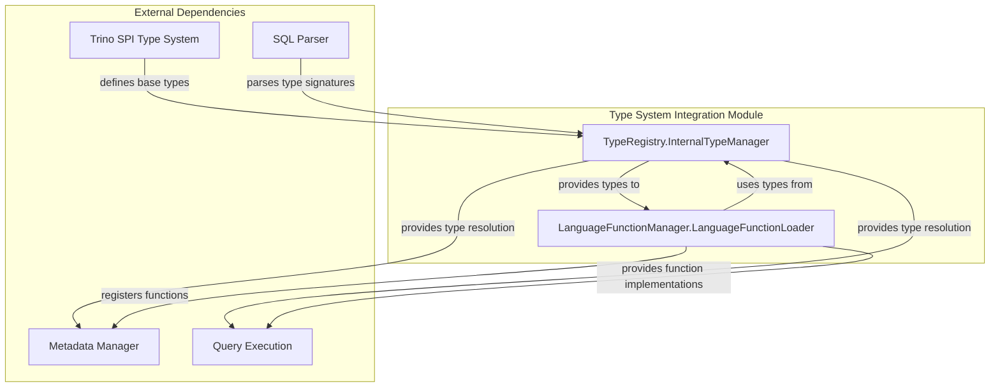

## TypeRegistry.InternalTypeManager

### Purpose and Responsibilities

The `InternalTypeManager` is the core type registry that manages all data types in Trino. It provides:

- **Type Registration**: Centralized registration of built-in and parametric types
- **Type Resolution**: Lookup and instantiation of types from signatures
- **Type Validation**: Verification of type operators and consistency
- **SQL Type Parsing**: Conversion from SQL type strings to Type objects
- **Parametric Type Support**: Dynamic instantiation of parameterized types

### Architecture

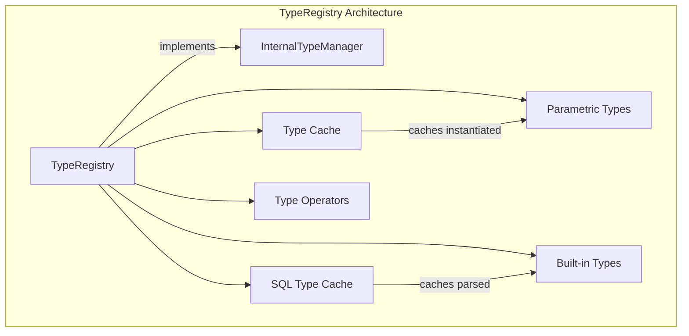

### Type Management Process

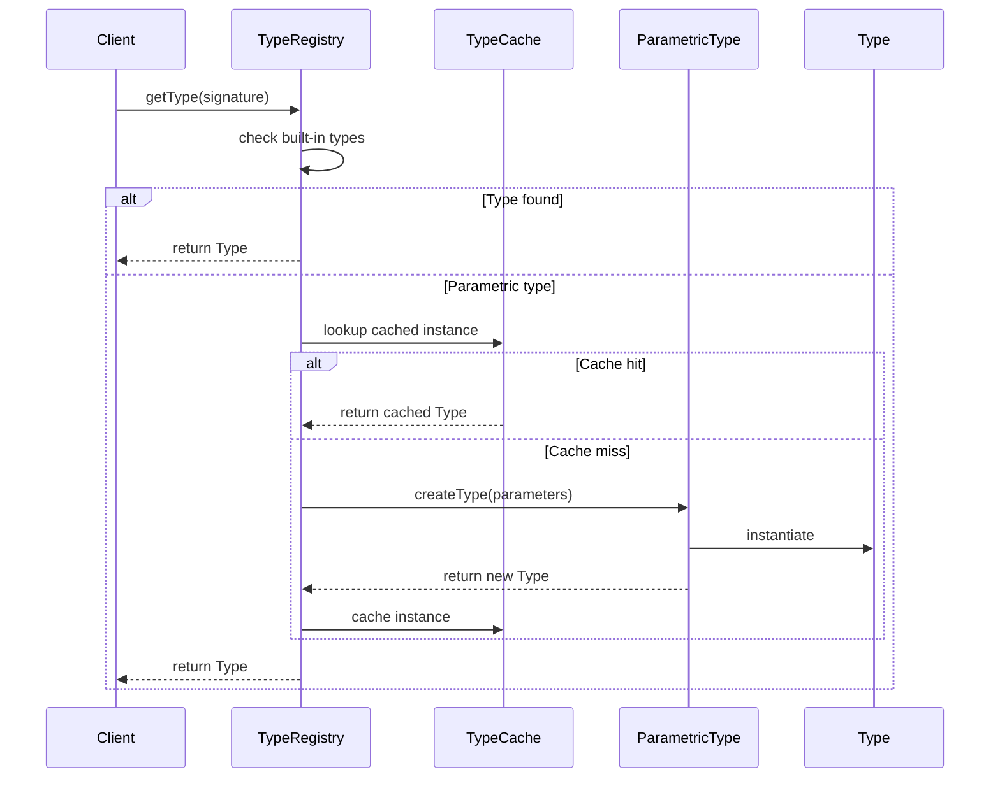

### Built-in Types

The TypeRegistry automatically registers essential built-in types during initialization:

**Primitive Types**: BOOLEAN, BIGINT, INTEGER, SMALLINT, TINYINT, DOUBLE, REAL, VARBINARY, DATE
**Complex Types**: INTERVAL_YEAR_MONTH, INTERVAL_DAY_TIME, HYPER_LOG_LOG, P4_HYPER_LOG_LOG
**Specialized Types**: JSON, JSON_2016, JSON_PATH, COLOR, IPADDRESS, UUID, TDIGEST, SET_DIGEST
**Parametric Types**: VARCHAR, CHAR, DECIMAL, ROW, ARRAY, MAP, FUNCTION, QDIGEST, TIMESTAMP, TIME

### Type Validation

The registry performs comprehensive validation to ensure type consistency:

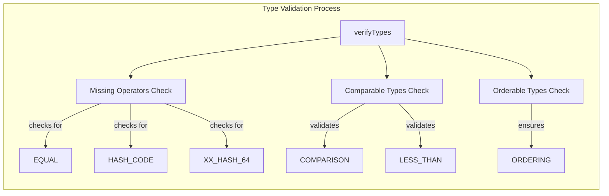

## LanguageFunctionManager.LanguageFunctionLoader

### Purpose and Responsibilities

The `LanguageFunctionLoader` manages SQL language functions, providing:

- **Function Registration**: Dynamic registration of SQL functions
- **Function Analysis**: Semantic analysis and validation of function definitions
- **Function Compilation**: Compilation of SQL functions to executable form
- **Security Integration**: Access control and permission management for functions
- **Query Isolation**: Per-query function namespace management

### Architecture

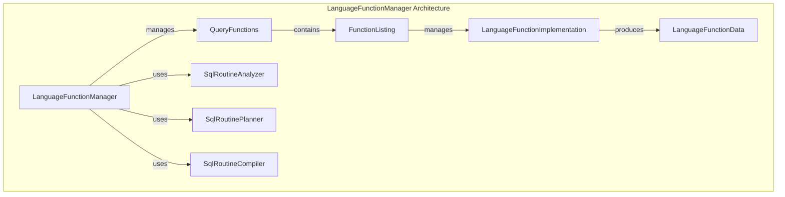

### Function Lifecycle

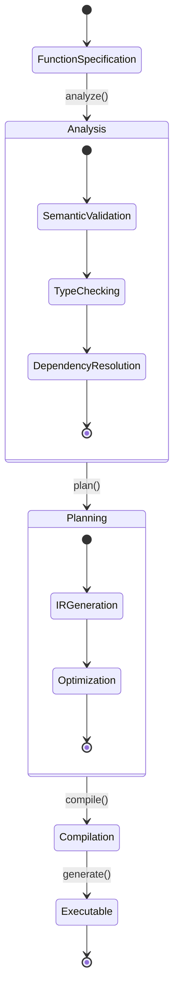

### Function Types Support

The manager supports different function categories:

**SQL Functions**: Pure SQL functions compiled to Trino's internal representation
**Engine Functions**: Functions implemented in external languages (via LanguageFunctionEngine)
**Inline Functions**: Temporary functions scoped to a specific query
**Stored Functions**: Persistent functions stored in catalogs

### Security and Access Control

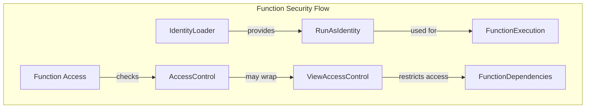

## Integration with Other Modules

### Trino SPI Integration

The Type System Integration module serves as the bridge between the Trino SPI type system and the internal metadata management:

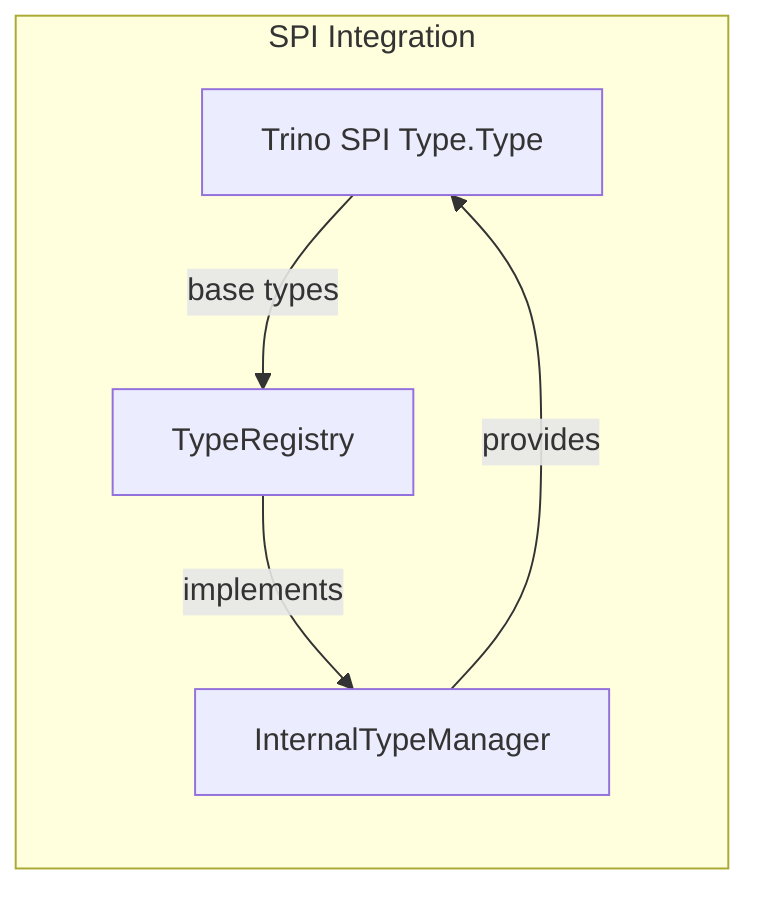

### Metadata Manager Integration

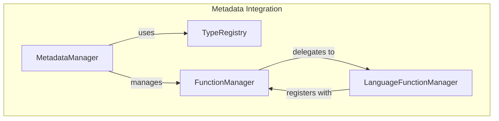

### Query Execution Integration

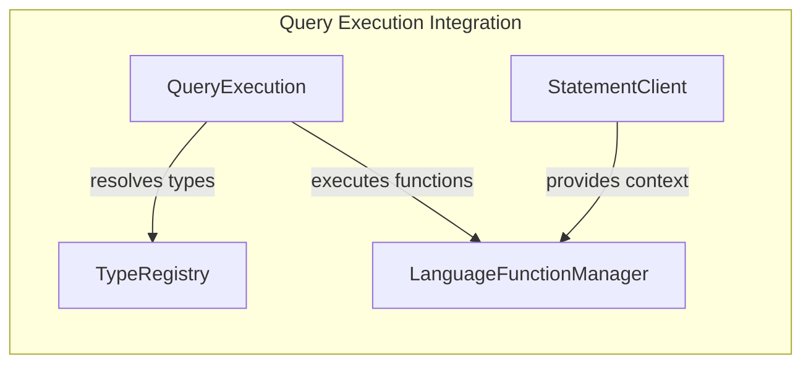

## Data Flow

### Type Resolution Flow

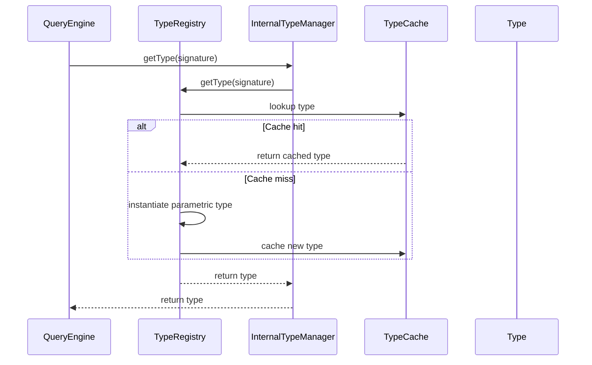

### Function Resolution Flow

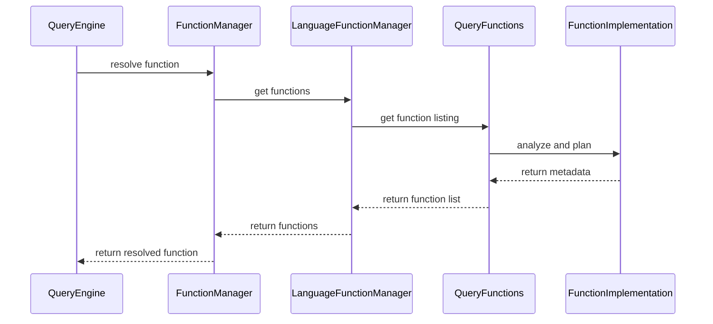

## Key Features

### Type System Features

- **Comprehensive Type Support**: All standard SQL types plus Trino-specific extensions
- **Parametric Type Instantiation**: Dynamic creation of parameterized types (VARCHAR(n), DECIMAL(p,s))
- **Type Caching**: Efficient caching of instantiated types to avoid repeated creation
- **Type Validation**: Comprehensive validation of type operators and consistency
- **SQL Type Parsing**: Direct parsing of SQL type strings to Type objects

### Language Function Features

- **Multi-Language Support**: SQL and external language function engines
- **Query Isolation**: Per-query function namespaces prevent conflicts
- **Security Integration**: Full integration with Trino's access control system
- **Function Compilation**: Compilation to efficient executable form
- **Dependency Management**: Automatic resolution and validation of function dependencies

## Performance Considerations

### Type Registry Performance

- **Caching Strategy**: Two-level caching (built-in types + parametric type cache)
- **Concurrent Access**: Thread-safe implementation using ConcurrentHashMap
- **Lazy Instantiation**: Parametric types instantiated only when needed
- **Memory Efficiency**: Shared type instances across the system

### Language Function Performance

- **Compilation Caching**: Compiled functions cached for repeated use
- **Query-Level Isolation**: Functions scoped to queries to avoid global locks
- **Efficient Resolution**: Function metadata cached after first resolution
- **Parallel Processing**: Support for concurrent function analysis and compilation

## Error Handling

### Type System Errors

- **TypeNotFoundException**: Raised when requested type cannot be found or instantiated
- **IllegalStateException**: Raised for type registration conflicts or validation failures
- **ParsingException**: Raised for invalid SQL type strings

### Language Function Errors

- **LanguageFunctionAnalysisException**: Raised during function analysis phase
- **TrinoException**: General function-related errors with specific error codes
- **IllegalStateException**: Raised for invalid function states or configurations

## Configuration and Extension

### Type Registration

Types can be registered through:
- **Built-in Registration**: Automatic during TypeRegistry initialization
- **Plugin Registration**: Via Plugin interface for connector-specific types
- **Dynamic Registration**: Runtime registration of new types

### Function Engine Extension

New language function engines can be added by:
- **Implementing LanguageFunctionEngine**: Interface for external language support
- **Registering with LanguageFunctionEngineManager**: Engine discovery and management
- **Providing Function Properties**: Configuration support for function properties

## References

- [Trino SPI Type System](Trino%20SPI.md#type-system)
- [Metadata & Connector Abstraction](Metadata%20&%20Connector%20Abstraction.md)
- [SQL Parser & AST](SQL%20Parser%20&%20AST.md)
- [Query Execution Engine](Query%20Execution%20Engine.md)