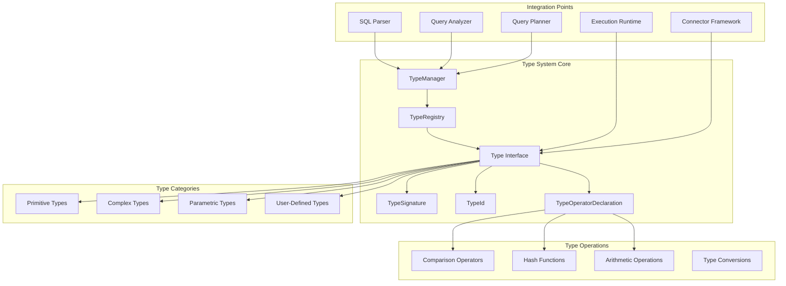
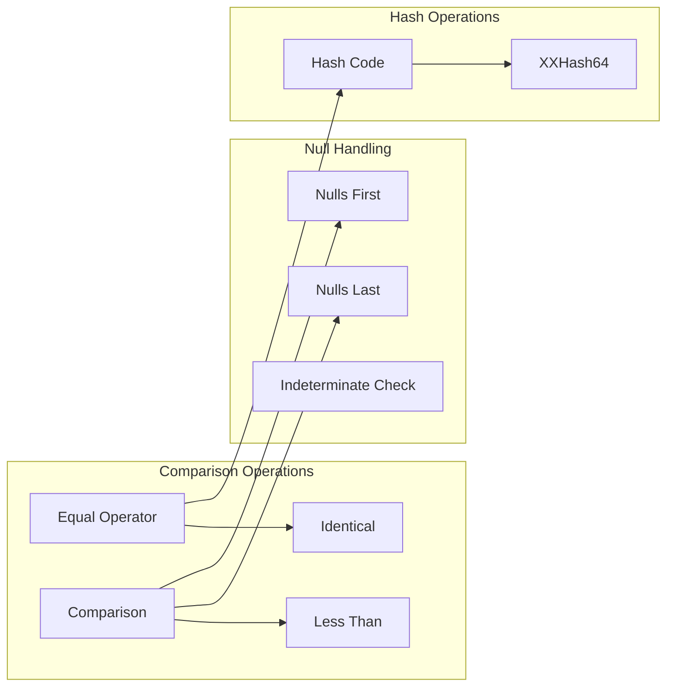
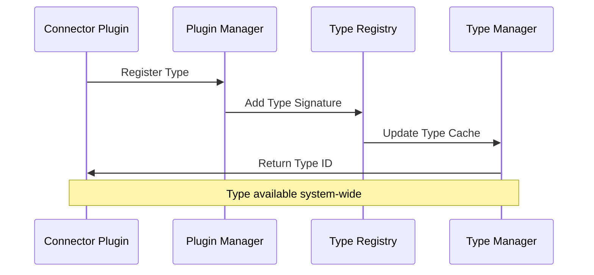

# Type System

The Trino Type System is the foundational framework that defines, manages, and operates on data types throughout the Trino query engine. It provides a comprehensive type infrastructure that supports primitive types, complex types (arrays, maps, rows), and user-defined types, enabling type-safe operations across all components of the query engine.

## Overview

The Type System serves as the central authority for type management in Trino, providing:

- **Type Definition and Metadata**: Complete type information including signatures, parameters, and characteristics
- **Type Operations**: Built-in and custom operators for comparison, hashing, and manipulation
- **Type Safety**: Compile-time and runtime type checking across query processing
- **Extensibility**: Plugin-based type registration and custom type support
- **Performance Optimization**: Specialized type-specific operations and storage formats

The system is designed to handle the full spectrum of SQL data types while providing the extensibility needed for connectors to introduce their own types and operations.

## Architecture



## Core Components

### Type Interface

The `Type` interface is the central abstraction that defines the contract for all data types in Trino. It provides methods for:

- **Type Metadata**: Name, signature, display name, and type parameters
- **Value Access**: Reading and writing values in different formats (boolean, long, double, Slice, Object)
- **Block Operations**: Creating and manipulating blocks of typed values
- **Type Characteristics**: Comparable, orderable, and range information
- **Storage Optimization**: Flat buffer support for efficient serialization

Key capabilities:
- Type signature management for parameterized types
- Java type mapping for runtime representation
- Block builder creation for value storage
- Range and discrete value support for optimization

### TypeSignature

`TypeSignature` represents the structural definition of a type, including:

- **Base Type Name**: The fundamental type identifier
- **Parameters**: Type arguments for parameterized types (e.g., `ARRAY(VARCHAR)`)
- **Calculated Flags**: Support for dynamic type resolution

The signature system supports complex type construction:
```
ARRAY(MAP(VARCHAR, ROW(field1 BIGINT, field2 DOUBLE)))
```

### TypeId

`TypeId` provides unique identification for types across the system:

- **Global Uniqueness**: Case-insensitive unique identifiers
- **JSON Serialization**: Support for cross-system type communication
- **Immutable Design**: Thread-safe type identification

### TypeOperatorDeclaration

`TypeOperatorDeclaration` manages the operational capabilities of types:

- **Comparison Operations**: Equal, less than, comparison with null handling
- **Hash Functions**: Standard and xxHash64 implementations
- **Value Operations**: Read value, indeterminate value detection
- **Invocation Conventions**: Multiple calling patterns for performance

Operator types include:
- `READ_VALUE`: Extract typed values from blocks
- `EQUAL`: Equality comparison with null handling
- `HASH_CODE`: Consistent hashing for distributed operations
- `COMPARISON_UNORDERED_LAST`: Ordering with null value placement
- `LESS_THAN`: Range comparison operations

## Type Categories

### Primitive Types

Built-in fundamental types with optimized implementations:

- **Numeric**: `BOOLEAN`, `TINYINT`, `SMALLINT`, `INTEGER`, `BIGINT`, `REAL`, `DOUBLE`
- **String**: `VARCHAR`, `CHAR` with length parameters
- **Temporal**: `DATE`, `TIME`, `TIMESTAMP` with precision and timezone
- **Binary**: `VARBINARY` for binary data

### Complex Types

Structured types supporting nested data:

- **ARRAY**: Homogeneous collections with element type parameter
- **MAP**: Key-value pairs with type parameters for both
- **ROW**: Structured records with named fields and types

### Parametric Types

Types with configurable parameters:

- **Precision-based**: `DECIMAL(precision, scale)` for exact numeric
- **Length-based**: `VARCHAR(length)` for string constraints
- **Time-based**: `TIMESTAMP(precision)` for temporal accuracy

### User-Defined Types

Extensible type system supporting:

- **Connector Types**: Custom types defined by connectors
- **Plugin Types**: Types registered through the plugin framework
- **Runtime Registration**: Dynamic type discovery and loading

## Type Operations

### Comparison System

The type system provides comprehensive comparison capabilities:



### Block Operations

Efficient bulk operations on typed data:

- **Value Extraction**: `getBoolean()`, `getLong()`, `getDouble()`, `getSlice()`, `getObject()`
- **Value Writing**: `writeBoolean()`, `writeLong()`, `writeDouble()`, `writeSlice()`, `writeObject()`
- **Block Building**: Creation of typed blocks for query results
- **Appending**: Efficient value transfer between blocks

### Range and Optimization

Types can provide optimization hints:

- **Range Information**: Min/max values for predicate pushdown
- **Discrete Values**: Enumerable value sets for optimization
- **Previous/Next Value**: Adjacent value calculation for indexing

## Integration with Query Processing

### Parser Integration

The SQL parser uses the type system for:

- **Type Parsing**: Converting SQL type names to Type signatures
- **Literal Validation**: Ensuring literals match declared types
- **Expression Analysis**: Type inference for complex expressions

### Analyzer Integration

The query analyzer leverages types for:

- **Type Resolution**: Determining expression result types
- **Type Checking**: Validating operation compatibility
- **Coercion Rules**: Implicit type conversion where appropriate

### Planner Integration

The query planner uses type information for:

- **Operator Selection**: Choosing type-specific implementations
- **Partitioning**: Type-aware data distribution
- **Optimization**: Type-based predicate evaluation

### Runtime Integration

The execution engine relies on types for:

- **Value Representation**: Efficient in-memory storage
- **Operator Execution**: Type-specific operation implementations
- **Serialization**: Cross-node data transfer

## Connector Integration

### Type Registration

Connectors register types through the plugin framework:



### Custom Type Operations

Connectors can provide custom operations:

- **Native Operators**: Connector-specific comparison and hash functions
- **Conversion Functions**: Type casting and transformation
- **Validation Rules**: Connector-specific type constraints

### Type Mapping

Connectors map external types to Trino types:

- **Database Types**: JDBC type mapping for relational connectors
- **File Format Types**: Parquet, ORC, Avro type mapping
- **Custom Types**: Connector-specific type definitions

## Performance Optimizations

### Flat Buffer Support

Types support efficient flat buffer serialization:

- **Fixed-size Values**: Direct memory layout for primitives
- **Variable-width Values**: Efficient string and binary storage
- **Offset Management**: Position tracking within flat buffers

### Specialized Operations

Type-specific optimizations include:

- **Vectorized Operations**: Bulk processing for arrays
- **Short-circuit Evaluation**: Early termination for comparisons
- **Cache-friendly Layouts**: Memory access optimization

### Operator Compilation

The system supports runtime operator compilation:

- **Method Handles**: Efficient operator invocation
- **Bytecode Generation**: Custom operator implementations
- **Specialization**: Type-specific code generation

## Type Safety and Validation

### Compile-time Checking

The type system enforces safety through:

- **Signature Validation**: Type parameter compatibility
- **Operator Resolution**: Ensuring operations are defined
- **Constraint Checking**: Type-specific validation rules

### Runtime Validation

Runtime safety mechanisms include:

- **Value Bounds**: Range checking for numeric types
- **Null Safety**: Proper null handling in operations
- **Type Coercion**: Safe implicit conversions

## Extensibility

### Plugin-based Extension

The type system supports extension through:

- **Custom Types**: New type definitions via plugins
- **Custom Operators**: Type-specific operation implementations
- **Type Factories**: Dynamic type creation and registration

### Connector-specific Types

Connectors can introduce:

- **Native Types**: Database-specific type mapping
- **Complex Types**: Nested structures from external systems
- **Domain Types**: Constrained value types

## Dependencies

The Type System integrates with other Trino modules:

- **[Data Processing Framework](Data%20Processing%20Framework.md)**: Block operations and value storage
- **[Function System](Function%20System.md)**: Type-specific function implementations
- **[Connector Framework](Connector%20Framework.md)**: Type registration and mapping
- **[SQL Parser & AST](SQL%20Parser%20&%20AST.md)**: Type parsing and literal handling
- **[SQL Analyzer, Planner & Optimizer](SQL%20Analyzer,%20Planner%20&%20Optimizer.md)**: Type inference and optimization

## Key Design Principles

1. **Type Safety**: Comprehensive validation and error handling
2. **Performance**: Optimized operations and memory layouts
3. **Extensibility**: Plugin-based type registration
4. **Compatibility**: SQL standard compliance with extensions
5. **Consistency**: Uniform behavior across all type operations

The Type System provides the foundation for Trino's type-safe, high-performance query processing, enabling complex analytical workloads while maintaining the flexibility needed for diverse data sources and use cases.