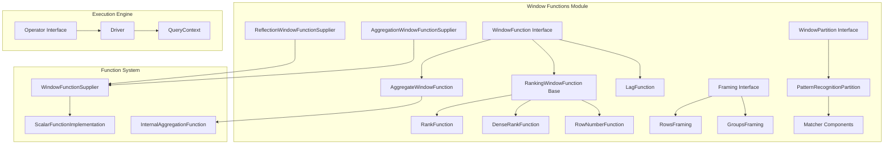
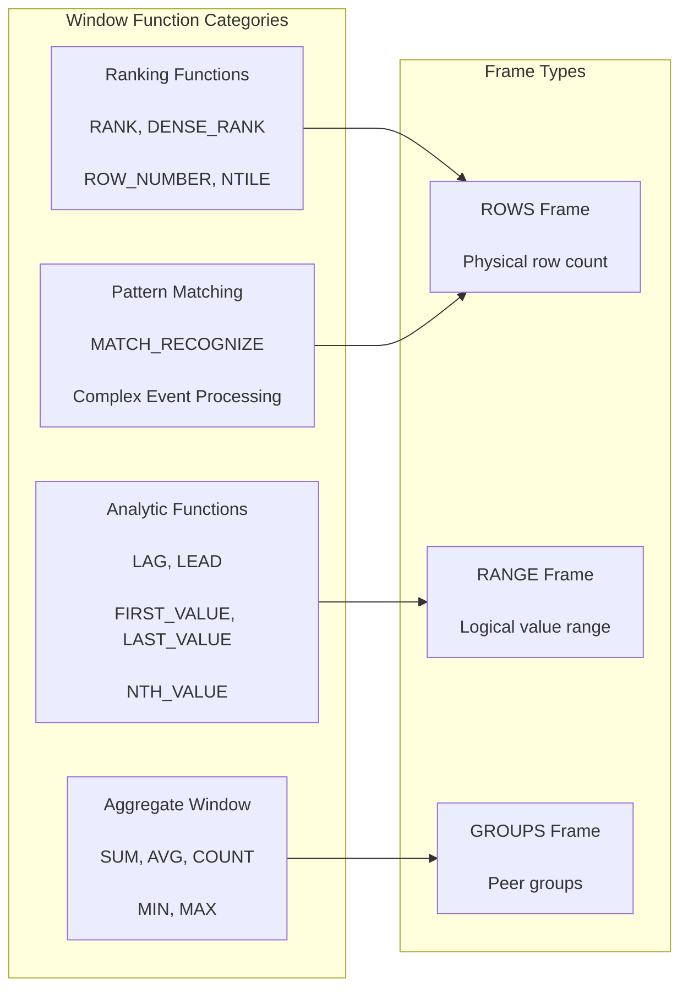
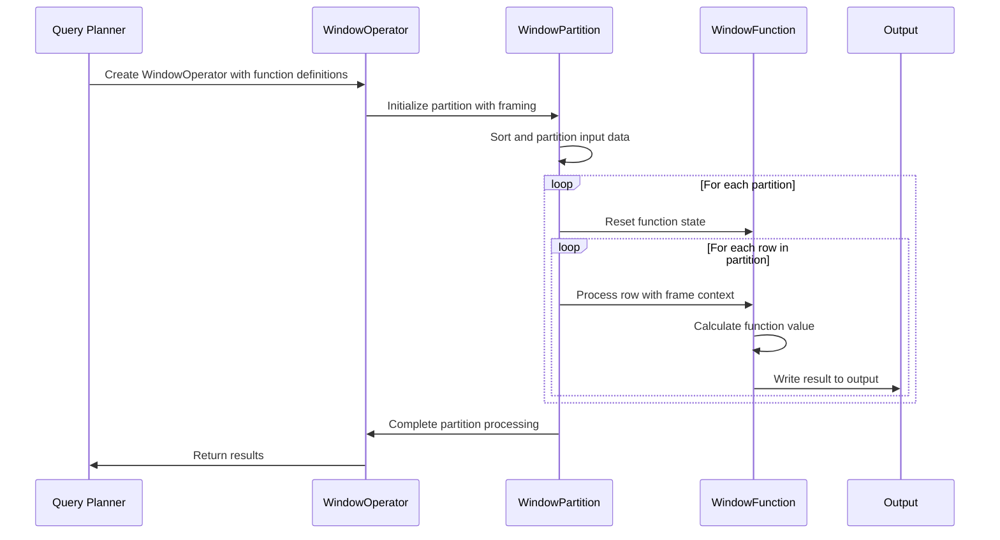
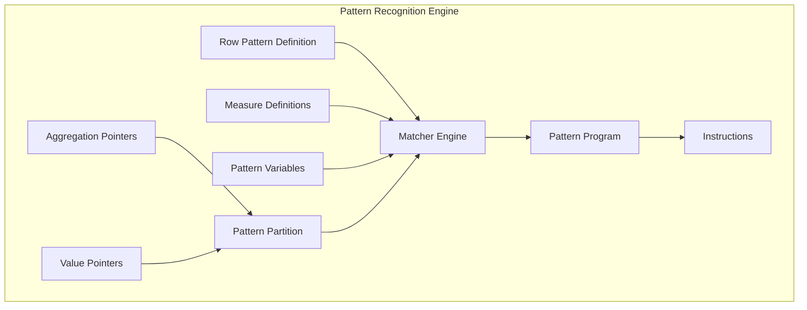

# Window Functions Module

The Window Functions module provides the execution engine for SQL window functions in Trino, implementing analytical functions that operate across sets of rows related to the current row. This module enables powerful analytical capabilities like ranking, cumulative calculations, and moving averages within SQL queries.

## Overview

Window functions perform calculations across sets of rows that are related to the current row. Unlike aggregate functions, window functions do not collapse rows into a single output row - they return a value for each row while considering data from multiple rows within a "window" frame.

The module implements:
- **Ranking functions**: RANK, DENSE_RANK, ROW_NUMBER, PERCENT_RANK, CUME_DIST
- **Analytical functions**: LAG, LEAD, FIRST_VALUE, LAST_VALUE, NTH_VALUE
- **Aggregate window functions**: SUM, AVG, COUNT, etc. applied over windows
- **Advanced pattern matching**: MATCH_RECOGNIZE for complex event processing
- **Frame specification**: ROWS, RANGE, and GROUPS framing modes

## Architecture

### Core Components



### Window Function Types



## Key Components

### WindowFunction Interface
The core abstraction for all window functions, defining the contract for processing rows within window partitions.

### RankingWindowFunction
Base class for ranking functions that provides common functionality for peer group detection and ranking calculations.

### AggregateWindowFunction
Enables standard aggregate functions (SUM, AVG, COUNT) to operate as window functions with frame specifications.

### WindowPartition
Manages the partitioning of data for window function execution, handling partition boundaries and row processing.

### Framing System
Implements SQL frame specifications (ROWS, RANGE, GROUPS) that define the window of rows for each calculation.

## Data Flow



## Pattern Recognition

The module includes sophisticated pattern matching capabilities through MATCH_RECOGNIZE:



## Integration with Trino

### Function Registration
Window functions are registered through the [Function System](SQL Functions & Operators.md) and made available to the SQL parser and analyzer.

### Query Planning
The [SQL Analyzer, Planner & Optimizer](SQL Analyzer, Planner & Optimizer.md) module handles window function parsing, validation, and optimization.

### Execution
Window functions execute within the [Query Execution Engine](Query Execution Engine.md) as specialized operators that process partitioned data.

## Performance Features

### Partitioning Strategy
Efficient data partitioning minimizes memory usage and enables parallel processing of independent partitions.

### Frame Optimization
Smart frame calculation reduces redundant computations and leverages sorted data properties.

### Memory Management
Integration with Trino's memory management system through [QueryContext](Query Execution Engine.md) for spill-to-disk capabilities.

## Usage Examples

### Basic Ranking
```sql
SELECT 
    employee_id,
    department_id,
    salary,
    RANK() OVER (PARTITION BY department_id ORDER BY salary DESC) as salary_rank
FROM employees;
```

### Moving Average
```sql
SELECT 
    date,
    sales_amount,
    AVG(sales_amount) OVER (
        ORDER BY date 
        ROWS BETWEEN 6 PRECEDING AND CURRENT ROW
    ) as moving_avg
FROM sales;
```

### Pattern Recognition
```sql
SELECT * FROM stock_prices
MATCH_RECOGNIZE (
    PARTITION BY symbol
    ORDER BY date
    MEASURES 
        A.date AS start_date,
        B.date AS peak_date
    PATTERN (A B)
    DEFINE
        A AS price < 100,
        B AS price > 150
);
```

## Dependencies

- **[Trino SPI](Trino SPI.md)**: Core interfaces and types
- **[SQL Functions & Operators](SQL Functions & Operators.md)**: Function implementation framework
- **[Query Execution Engine](Query Execution Engine.md)**: Operator execution framework
- **[SQL Analyzer, Planner & Optimizer](SQL Analyzer, Planner & Optimizer.md)**: Query planning and optimization

## Related Documentation

- [SQL Functions & Operators](SQL Functions & Operators.md) - General function system architecture
- [Query Execution Engine](Query Execution Engine.md) - Operator execution framework
- [SQL Analyzer, Planner & Optimizer](SQL Analyzer, Planner & Optimizer.md) - Query planning details
- [Trino SPI](Trino SPI.md) - Core type system and interfaces