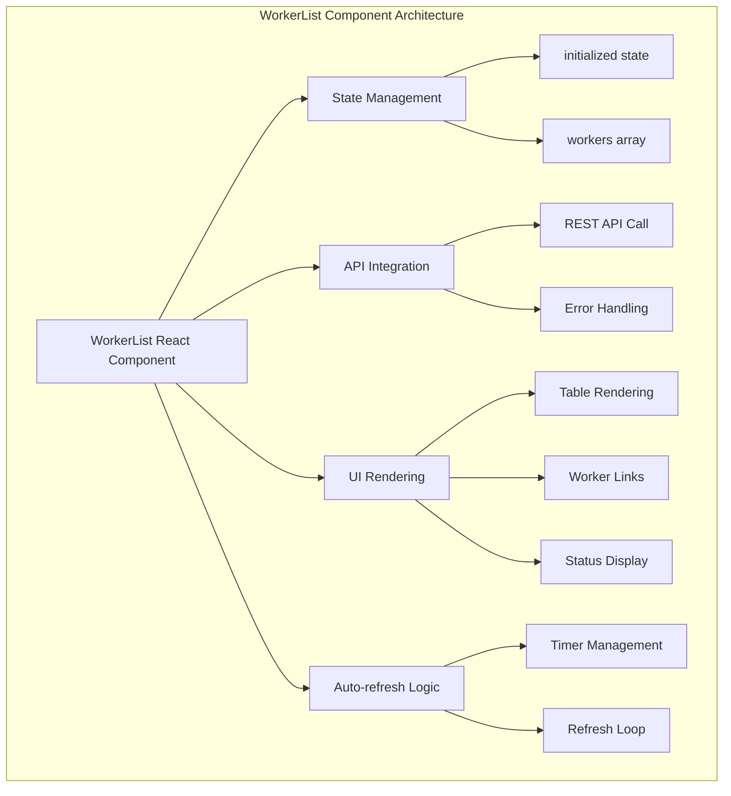
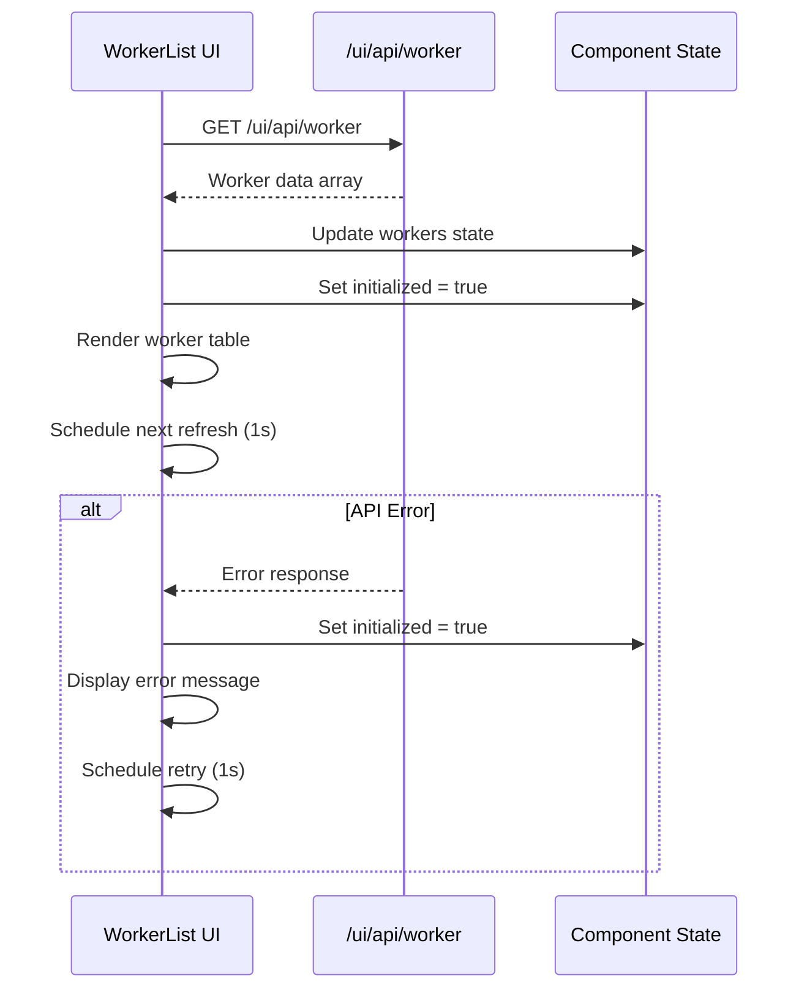

# WorkerList Module Documentation

## Introduction

The WorkerList module is a React-based UI component within the Trino Web UI that provides real-time monitoring and visualization of Trino cluster worker nodes. It displays essential information about each worker node in the cluster, including node identification, network details, version information, coordinator status, and current operational state.

## Module Overview

The WorkerList component serves as a critical monitoring interface for Trino cluster administrators, offering:
- Real-time worker node status monitoring
- Automatic refresh of worker information
- Visual distinction between coordinator and worker nodes
- Detailed node information display
- Error handling for failed data retrieval

## Architecture

### Component Structure



### Data Flow



## Core Components

### WorkerList Class Component

The main React component that manages the worker list display and data fetching:

```javascript
export class WorkerList extends React.Component {
    constructor(props) {
        super(props)
        this.state = {
            initialized: false,
            workers: [],
        }
        this.refreshLoop = this.refreshLoop.bind(this)
    }
}
```

**Key Properties:**
- `initialized`: Tracks whether the component has attempted data loading
- `workers`: Array containing worker node information
- `refreshLoop`: Bound method for periodic data refresh

### State Management

The component maintains two primary state variables:

1. **initialized**: Boolean flag indicating whether the initial data load has been attempted
2. **workers**: Array of worker objects containing node information

### API Integration

The component integrates with the Trino Web UI REST API:

```javascript
$.get('/ui/api/worker', function (workers) {
    // Process and display worker data
})
```

**API Endpoint**: `/ui/api/worker`
**Response Format**: Array of worker objects with the following structure:
```javascript
{
    nodeId: string,        // Unique node identifier
    nodeIp: string,        // IP address of the node
    nodeVersion: string,   // Trino version running on the node
    coordinator: boolean,  // Whether this node is the coordinator
    state: string          // Current operational state
}
```

## Key Features

### Real-time Monitoring

The component implements automatic refresh functionality with a 1-second interval:

```javascript
resetTimer() {
    clearTimeout(this.timeoutId)
    this.timeoutId = setTimeout(this.refreshLoop.bind(this), 1000)
}
```

### Worker Sorting

Workers are automatically sorted with coordinators appearing first:

```javascript
workers.sort(function (workerA, workerB) {
    if (workerA.coordinator && !workerB.coordinator) {
        return -1
    }
    if (!workerA.coordinator && workerB.coordinator) {
        return 1
    }
    return workerA.nodeId.localeCompare(workerB.nodeId)
})
```

### Error Handling

Robust error handling ensures the UI remains responsive even when API calls fail:

```javascript
.fail(() => {
    this.setState({
        initialized: true,
    })
    this.resetTimer()
})
```

### Navigation Integration

Each worker entry provides clickable links to detailed worker pages:

```javascript
<a href={'worker.html?' + worker.nodeId} className="font-light" target="_blank">
    {worker.nodeId}
</a>
```

## UI Components

### Table Structure

The component renders a structured table displaying:

| Column | Description |
|--------|-------------|
| Node ID | Unique identifier for the worker node |
| Node IP | Network address of the worker |
| Node Version | Trino version running on the node |
| Coordinator | Boolean indicating coordinator status |
| State | Current operational state of the node |

### Loading States

The component handles multiple UI states:

1. **Initial Loading**: Displays "Loading..." message
2. **Data Loaded**: Renders worker table with current data
3. **Error State**: Shows error message when data cannot be loaded

## Dependencies

### External Dependencies

The WorkerList component relies on several external systems:

1. **jQuery**: For AJAX API calls (`$.get`)
2. **React**: Core framework for component rendering
3. **Trino Web UI API**: REST endpoint for worker data

### Related Modules

The WorkerList module integrates with several other Trino system components:

- [Trino Web UI](TrinoWebUI.md): Parent module providing the web interface framework
- [Trino Server](TrinoServer.md): Backend system providing worker status information
- [Query Execution Engine](QueryExecutionEngine.md): Core execution engine managing worker nodes

## Configuration

### Sparkline Properties

The component includes configuration for potential sparkline visualizations:

```javascript
const SMALL_SPARKLINE_PROPERTIES = {
    width: '100%',
    height: '57px',
    fillColor: '#3F4552',
    lineColor: '#747F96',
    spotColor: '#1EDCFF',
    tooltipClassname: 'sparkline-tooltip',
    disableHiddenCheck: true,
}
```

### Refresh Interval

The refresh interval is hardcoded to 1000ms (1 second) for real-time monitoring.

## Usage Patterns

### Integration with Trino Web UI

The WorkerList component is typically integrated into the main Trino Web UI dashboard, providing administrators with immediate visibility into cluster health and worker status.

### Monitoring Scenarios

Common use cases include:
- **Cluster Health Monitoring**: Quick assessment of all worker nodes
- **Version Management**: Verification of consistent versions across nodes
- **Coordinator Identification**: Easy identification of the coordinator node
- **Problem Detection**: Rapid identification of nodes in error states

## Performance Considerations

### Refresh Optimization

The 1-second refresh interval balances real-time monitoring needs with system resource usage. The component properly manages timers to prevent memory leaks.

### Data Volume Handling

The component is designed to handle clusters with varying numbers of worker nodes, from small clusters with a few nodes to large deployments with hundreds of workers.

## Error Handling

### API Failures

When the API call fails, the component:
1. Sets the initialized state to true
2. Maintains the existing timer for retry attempts
3. Displays an appropriate error message to the user

### Network Issues

The component gracefully handles network interruptions and continues attempting to refresh data on a regular interval.

## Future Enhancements

### Potential Improvements

1. **Configurable Refresh Rate**: Allow users to adjust the refresh interval
2. **Advanced Filtering**: Add filtering capabilities by node state or version
3. **Historical Data**: Display trends in worker performance over time
4. **Enhanced Visualizations**: Implement the prepared sparkline configurations
5. **Export Functionality**: Allow export of worker status data

### Integration Opportunities

The WorkerList component could be enhanced to integrate with:
- Alert systems for proactive monitoring
- Performance metrics visualization
- Configuration management interfaces
- Log aggregation systems

## Conclusion

The WorkerList module provides a fundamental monitoring interface for Trino cluster administration. Its simple yet effective design enables real-time visibility into cluster worker status while maintaining performance and reliability. The component's modular architecture allows for easy extension and integration with other monitoring and management tools within the Trino ecosystem.