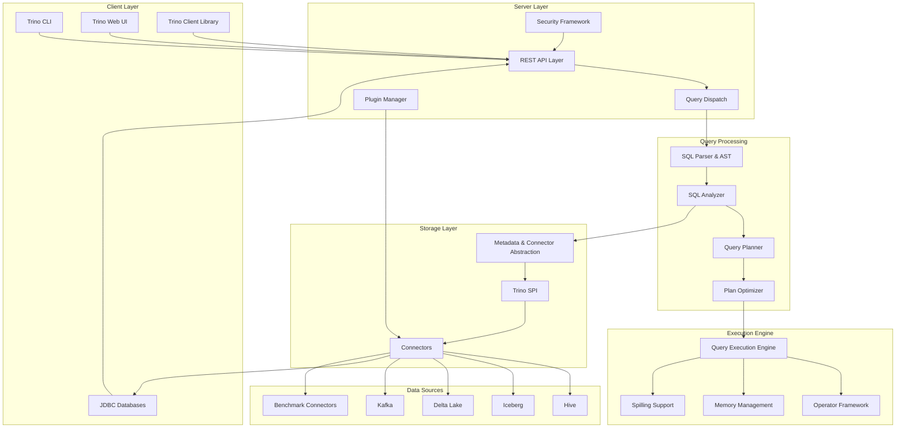

# Trino Repository Overview

## Purpose

The `trinodb--trino` repository is the official home of Trino (formerly Presto SQL), a distributed SQL query engine designed for interactive analytics on large datasets. Trino enables users to query data across multiple heterogeneous data sources using standard SQL syntax, providing a unified analytics platform that can process petabytes of data with low-latency responses.

## End-to-End Architecture

## Core Modules Documentation

### Query Processing Pipeline

1. **[SQL Parser & AST](SQL Parser & AST.md)** - Converts SQL text into Abstract Syntax Tree representation
2. **[SQL Analyzer, Planner & Optimizer](SQL Analyzer, Planner & Optimizer.md)** - Performs semantic analysis, query planning, and cost-based optimization
3. **[Query Execution Engine](Query Execution Engine.md)** - Executes distributed query plans across worker nodes

### Client Interfaces

4. **[Trino Client Library](Trino Client Library.md)** - Java client library for programmatic access
5. **[Trino CLI](Trino CLI.md)** - Command-line interface for interactive query execution
6. **[Trino JDBC Driver](Trino JDBC Driver.md)** - JDBC-compliant driver for database connectivity
7. **[Trino Web UI](Trino Web UI.md)** - Web-based interface for query monitoring and management

### Server Infrastructure

8. **[Trino Server & API](Trino Server & API.md)** - Core server components, REST API, and security framework
9. **[Metadata & Connector Abstraction](Metadata & Connector Abstraction.md)** - Unified metadata management and catalog abstraction

### Extension Framework

10. **[Trino SPI](Trino SPI.md)** - Service Provider Interface for plugin development
11. **[Plugin Toolkit](Plugin Toolkit.md)** - Base implementations and utilities for plugin developers

### Storage and Format Support

12. **[Filesystem Abstraction Layer](Filesystem Abstraction Layer.md)** - Unified interface for cloud and traditional storage systems
13. **[ORC & Parquet Libraries](ORC & Parquet Libraries.md)** - High-performance columnar format readers and writers
14. **[Hive Support Libraries](Hive Support Libraries.md)** - Metastore and format support for Hive integration

### Connector Implementations

15. **[Base JDBC Connector](Base JDBC Connector.md)** - Foundation for JDBC-based database connectors
16. **[Hive Connector](Hive Connector.md)** - Comprehensive Hive data warehouse integration
17. **[Iceberg Connector](Iceberg Connector.md)** - Modern table format with ACID transactions and time travel
18. **[Delta Lake Connector](Delta Lake Connector.md)** - Lakehouse format with transaction log support
19. **[Kafka Connector](Kafka Connector.md)** - Real-time streaming data integration
20. **[TPC-H Connector](TPC-H Connector.md)** - Benchmark dataset connector for performance testing
21. **[TPC-DS Connector](TPC-DS Connector.md)** - Decision support benchmark dataset connector

### Testing and Quality Assurance

22. **[Trino Testing Framework](Trino Testing Framework.md)** - Comprehensive testing infrastructure for connector validation
23. **[Trino Verifier](Trino Verifier.md)** - Query correctness and performance validation framework

### Additional Components

24. **[SQL Functions & Operators](SQL Functions & Operators.md)** - Built-in function implementations and operator framework

## Key Features

- **Distributed Architecture**: MPP (Massively Parallel Processing) design for scalable query execution
- **Federated Querying**: Query across multiple data sources in a single SQL statement
- **Standard SQL Compliance**: ANSI SQL support with extensions for modern analytics
- **Extensible Plugin System**: Easy integration of new data sources through the SPI
- **High Performance**: Vectorized execution, dynamic filtering, and advanced optimization techniques
- **Cloud-Native**: Designed for modern cloud storage and compute environments
- **ACID Compliance**: Full transaction support for compatible data sources
- **Security Framework**: Comprehensive authentication, authorization, and encryption capabilities

## Repository Structure

The repository is organized into several key directories:

- `core/` - Core engine components (parser, analyzer, execution engine)
- `client/` - Client libraries and tools (CLI, JDBC, client library)
- `plugin/` - Connector implementations (Hive, Iceberg, Delta Lake, etc.)
- `lib/` - Shared libraries (filesystem, formats, Hive support)
- `service/` - Service components (verifier, testing framework)
- `testing/` - Testing infrastructure and utilities

This architecture enables Trino to serve as a unified analytics platform capable of querying data wherever it resides, from traditional data warehouses to modern cloud data lakes.