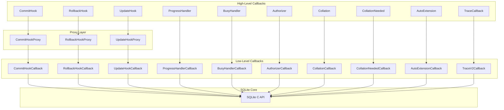
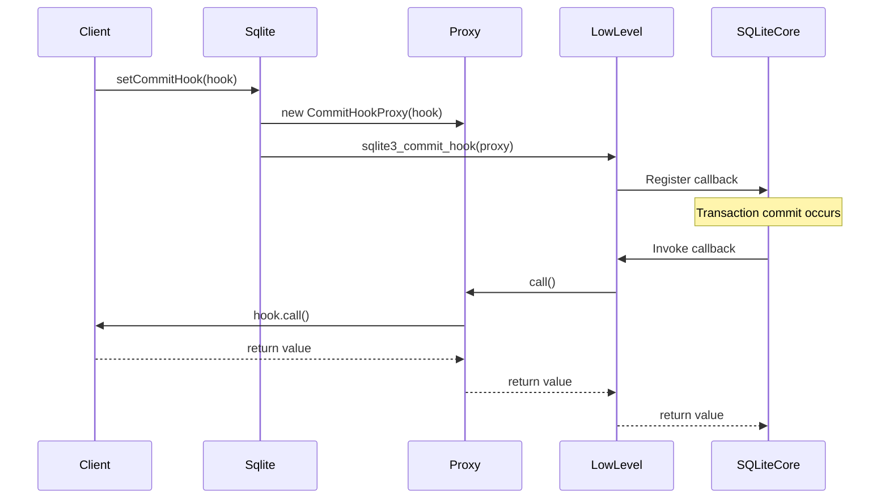
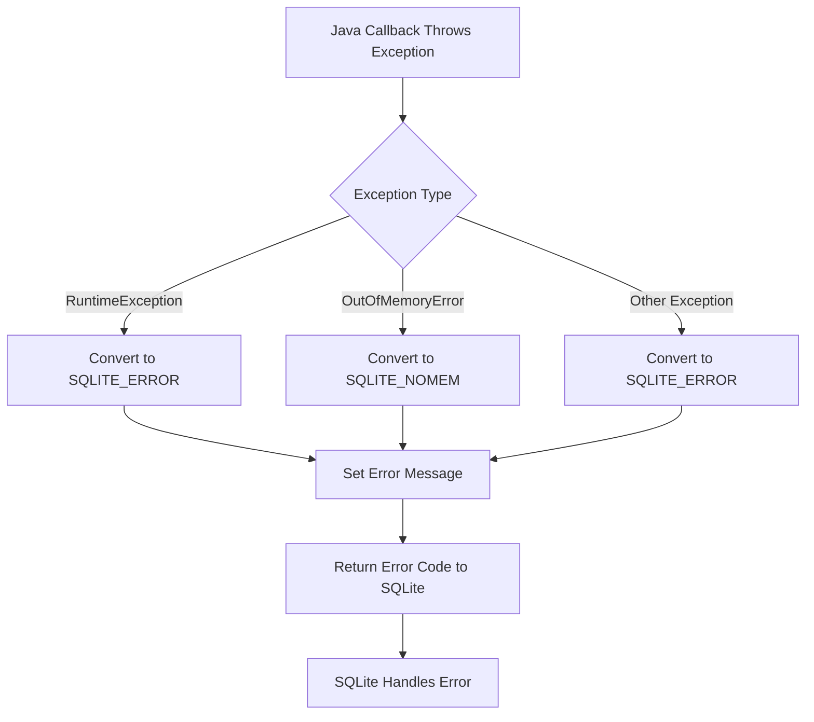
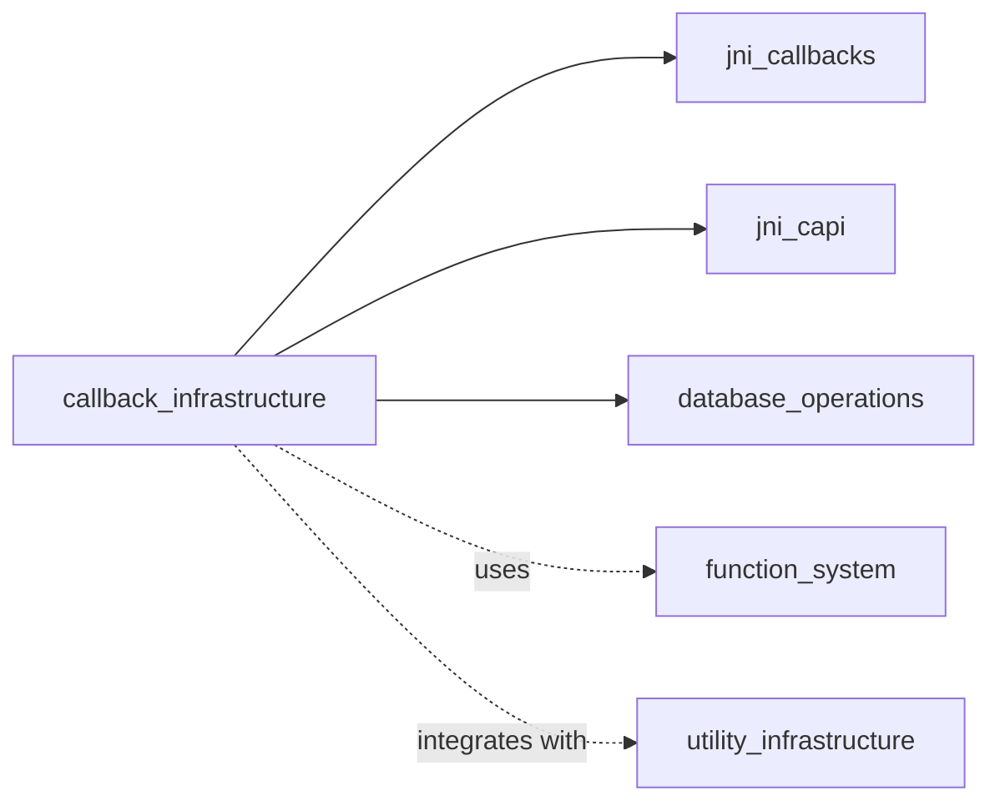

# Callback Infrastructure Module

## Overview

The **callback_infrastructure** module provides a comprehensive framework for implementing SQLite callback mechanisms in the Java JNI wrapper layer. This module serves as the bridge between Java callback interfaces and the underlying SQLite C API callback system, enabling Java applications to respond to various database events and operations through a type-safe, object-oriented interface.

The module is part of the larger [jni_wrapper1](jni_wrapper1.md) system and provides high-level callback abstractions that wrap the lower-level [jni_callbacks](jni_callbacks.md) interfaces, offering enhanced usability, error handling, and Java-specific features.

## Architecture

### Core Design Principles

The callback infrastructure follows a layered architecture that provides:

1. **Type Safety**: Strong typing for all callback parameters and return values
2. **Exception Handling**: Proper propagation and conversion of Java exceptions to SQLite error codes
3. **Resource Management**: Automatic cleanup and lifecycle management for callback objects
4. **Proxy Pattern**: Intermediate proxy objects that handle the translation between Java and C callback semantics

### Component Architecture



## Core Components

### Transaction Callbacks

#### CommitHook
```java
public interface CommitHook {
    int call();
}
```

**Purpose**: Handles transaction commit events
- **Return Value**: 0 to allow commit, non-zero to abort
- **Exception Handling**: Exceptions are translated to database-level errors
- **Use Cases**: Transaction validation, logging, audit trails

#### RollbackHook
```java
public interface RollbackHook {
    void call();
}
```

**Purpose**: Handles transaction rollback events
- **Return Value**: None (void)
- **Exception Handling**: Exceptions are translated to database-level errors
- **Use Cases**: Cleanup operations, rollback logging, state restoration

### Data Modification Callbacks

#### UpdateHook
```java
public interface UpdateHook {
    void call(int opId, String dbName, String tableName, long rowId);
}
```

**Purpose**: Monitors data modification operations (INSERT, UPDATE, DELETE)
- **Parameters**:
  - `opId`: Operation type (INSERT, UPDATE, DELETE constants)
  - `dbName`: Database name
  - `tableName`: Affected table name
  - `rowId`: Row identifier
- **Use Cases**: Change tracking, replication, audit logging

### Progress and Busy Handling

#### ProgressHandler
```java
public interface ProgressHandler {
    int call();
}
```

**Purpose**: Provides periodic callbacks during long-running operations
- **Return Value**: 0 to continue, non-zero to interrupt
- **Use Cases**: Progress reporting, operation cancellation, UI updates

#### BusyHandler
```java
public interface BusyHandler {
    int call(int n);
}
```

**Purpose**: Handles database busy conditions
- **Parameters**: `n` - Number of times handler has been called
- **Return Value**: 0 to return SQLITE_BUSY, non-zero to retry
- **Use Cases**: Custom retry logic, backoff strategies, deadlock resolution

### Security and Authorization

#### Authorizer
```java
public interface Authorizer {
    int call(int opId, String s1, String s2, String s3, String s4);
}
```

**Purpose**: Controls access to database operations and resources
- **Parameters**: Operation-specific strings for authorization decisions
- **Return Values**: SQLITE_OK, SQLITE_DENY, or SQLITE_IGNORE
- **Use Cases**: Security policies, access control, operation filtering

### Collation and Sorting

#### Collation
```java
public interface Collation {
    int call(byte[] lhs, byte[] rhs);
}
```

**Purpose**: Defines custom string comparison logic
- **Parameters**: Two byte arrays to compare
- **Return Value**: Comparison result (memcmp semantics)
- **Use Cases**: Locale-specific sorting, custom ordering rules

#### CollationNeeded
```java
public interface CollationNeeded {
    void call(Sqlite db, int encoding, String collationName);
}
```

**Purpose**: Dynamically provides collation functions when needed
- **Use Cases**: Lazy collation loading, dynamic collation registration

### Tracing and Debugging

#### TraceCallback
```java
public interface TraceCallback {
    void call(int traceFlag, Object pNative, Object pX);
}
```

**Purpose**: Provides detailed execution tracing
- **Trace Types**:
  - `TRACE_STMT`: Statement preparation
  - `TRACE_PROFILE`: Execution timing
  - `TRACE_ROW`: Row processing
  - `TRACE_CLOSE`: Connection closing
- **Use Cases**: Performance analysis, debugging, query optimization

### Extension Management

#### AutoExtension
```java
public interface AutoExtension {
    void call(Sqlite db);
}
```

**Purpose**: Automatically initializes extensions for new database connections
- **Use Cases**: Plugin systems, automatic feature enablement

## Proxy Pattern Implementation

### Design Rationale

The proxy pattern is implemented for certain callbacks to maintain API compatibility and enable proper callback chaining:



### Proxy Classes

#### CommitHookProxy
- **Purpose**: Wraps `CommitHook` instances for C API compatibility
- **Features**: Return value handling, exception translation
- **Lifecycle**: Managed automatically by the Sqlite class

#### RollbackHookProxy
- **Purpose**: Wraps `RollbackHook` instances
- **Features**: Exception handling, void return type management

#### UpdateHookProxy
- **Purpose**: Wraps `UpdateHook` instances
- **Features**: Parameter marshaling, exception handling

## Error Handling Strategy

### Exception Translation

The callback infrastructure implements a comprehensive error handling strategy:



### Error Propagation Rules

1. **Commit/Rollback Hooks**: Exceptions become transaction errors
2. **Update Hooks**: Exceptions are logged but don't affect the operation
3. **Progress Handlers**: Exceptions cause operation interruption
4. **Authorizer**: Exceptions result in DENY authorization
5. **Collation**: Exceptions are suppressed (unpredictable sorting)

## Usage Patterns

### Basic Callback Registration

```java
// Transaction monitoring
db.setCommitHook(() -> {
    System.out.println("Transaction committing");
    return 0; // Allow commit
});

// Data change tracking
db.setUpdateHook((opId, dbName, tableName, rowId) -> {
    System.out.printf("Operation %d on %s.%s row %d%n", 
                     opId, dbName, tableName, rowId);
});
```

### Progress Monitoring

```java
// Long operation with progress reporting
db.setProgressHandler(1000, () -> {
    if (shouldCancel()) {
        return 1; // Cancel operation
    }
    updateProgressBar();
    return 0; // Continue
});
```

### Custom Authorization

```java
db.setAuthorizer((opId, s1, s2, s3, s4) -> {
    if (opId == Sqlite.DELETE && "sensitive_table".equals(s1)) {
        return Sqlite.DENY;
    }
    return Sqlite.OK;
});
```

## Integration with Other Modules

### Dependencies

- **[jni_callbacks](jni_callbacks.md)**: Provides low-level callback interfaces
- **[jni_capi](jni_capi.md)**: Core database objects and API access
- **[database_operations](database_operations.md)**: Database connection management

### Relationships



## Performance Considerations

### Callback Overhead

1. **JNI Transition Cost**: Each callback involves JNI boundary crossing
2. **Object Creation**: Proxy objects are created for type safety
3. **Exception Handling**: Try-catch blocks add minimal overhead
4. **Memory Management**: Automatic cleanup prevents leaks

### Optimization Strategies

1. **Callback Batching**: Group related operations when possible
2. **Selective Registration**: Only register needed callbacks
3. **Efficient Implementations**: Keep callback logic lightweight
4. **Resource Pooling**: Reuse callback objects where appropriate

## Thread Safety

### Concurrency Model

- **Thread Affinity**: Callbacks execute on the thread that triggered them
- **Synchronization**: Client code must handle thread safety
- **Atomic Operations**: Use atomic operations for shared state
- **Lock-Free Design**: Avoid locks in callback implementations when possible

### Best Practices

1. **Minimize Shared State**: Keep callback state thread-local when possible
2. **Use Concurrent Collections**: For shared data structures
3. **Avoid Blocking Operations**: Don't block in callback implementations
4. **Exception Safety**: Ensure callbacks are exception-safe

## Testing and Debugging

### Testing Strategies

1. **Unit Tests**: Test individual callback implementations
2. **Integration Tests**: Test callback interaction with database operations
3. **Error Injection**: Test exception handling paths
4. **Performance Tests**: Measure callback overhead

### Debugging Tools

1. **Trace Callbacks**: Use for detailed execution analysis
2. **Logging**: Implement comprehensive logging in callbacks
3. **Profiling**: Monitor callback performance impact
4. **Error Tracking**: Track and analyze callback exceptions

## Future Enhancements

### Planned Features

1. **Async Callbacks**: Support for asynchronous callback execution
2. **Callback Composition**: Ability to chain multiple callbacks
3. **Performance Metrics**: Built-in performance monitoring
4. **Configuration API**: Runtime callback configuration

### Extensibility

The module is designed for extensibility through:

1. **Interface-Based Design**: Easy to add new callback types
2. **Proxy Pattern**: Consistent integration approach
3. **Error Handling Framework**: Reusable error translation
4. **Documentation Standards**: Clear patterns for new callbacks

## See Also

- [jni_callbacks](jni_callbacks.md) - Low-level callback interfaces
- [database_operations](database_operations.md) - Database connection management
- [function_system](function_system.md) - Custom function callbacks
- [jni_capi](jni_capi.md) - Core API components