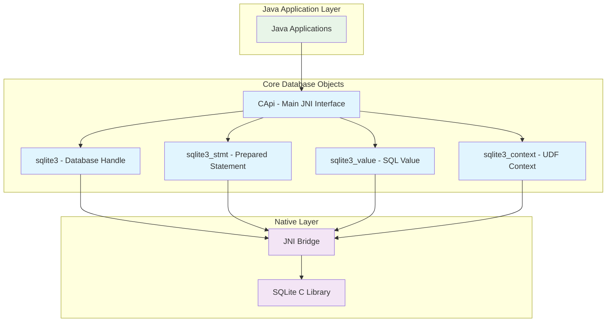
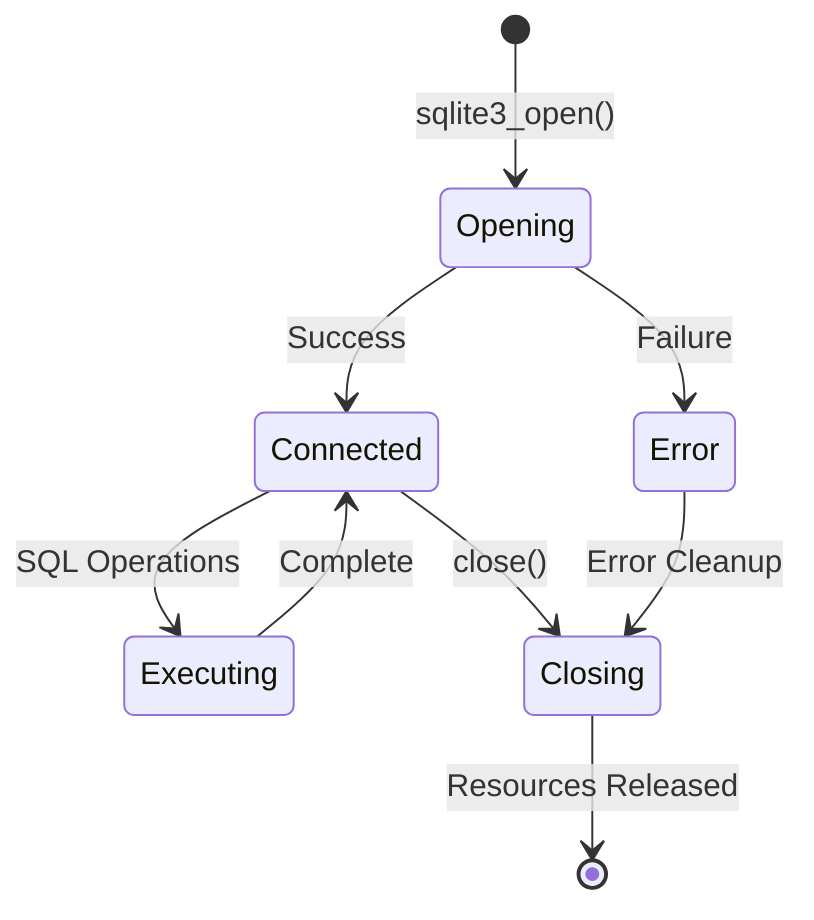
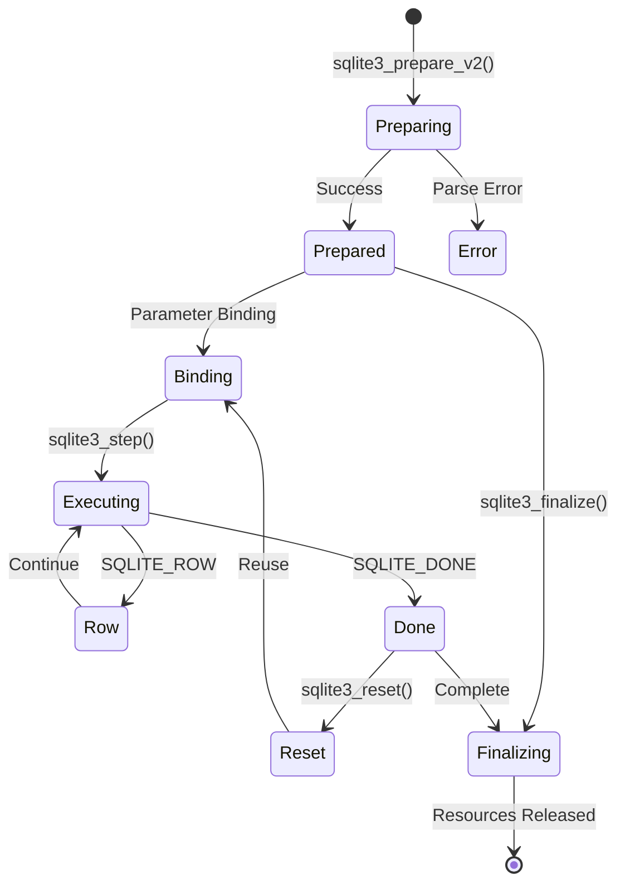
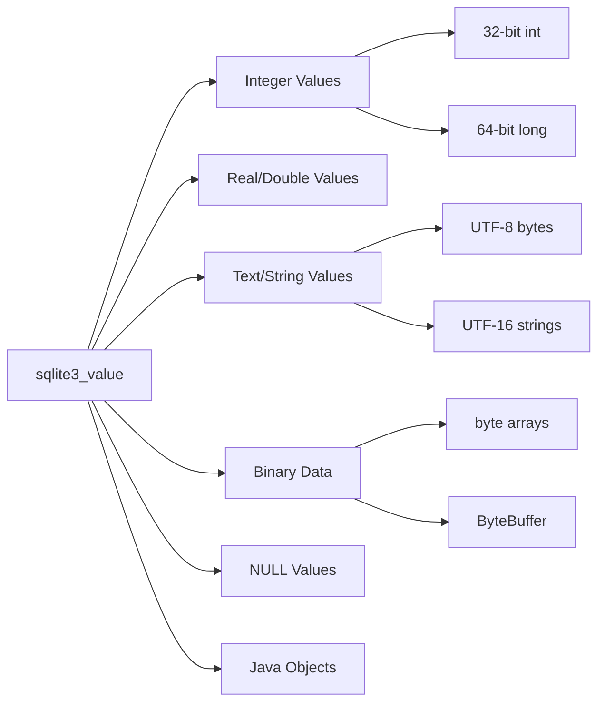
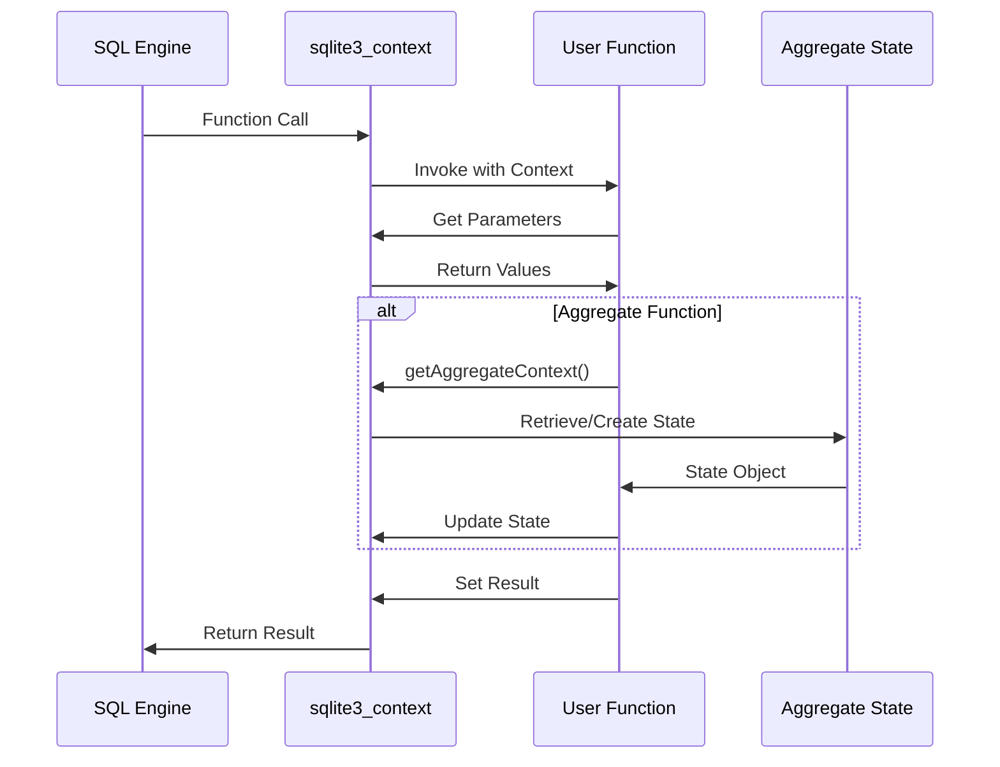
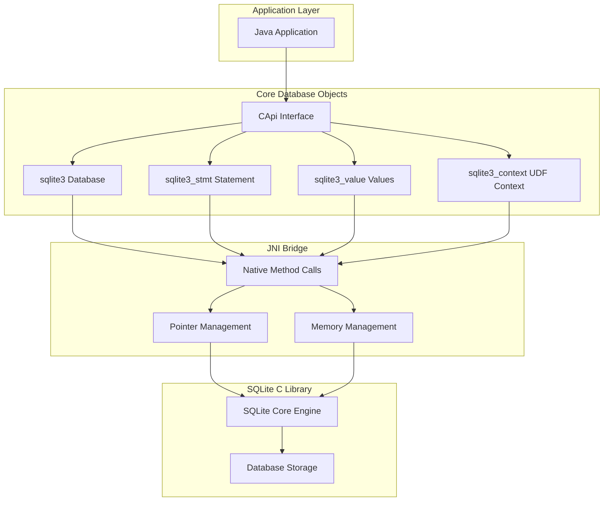
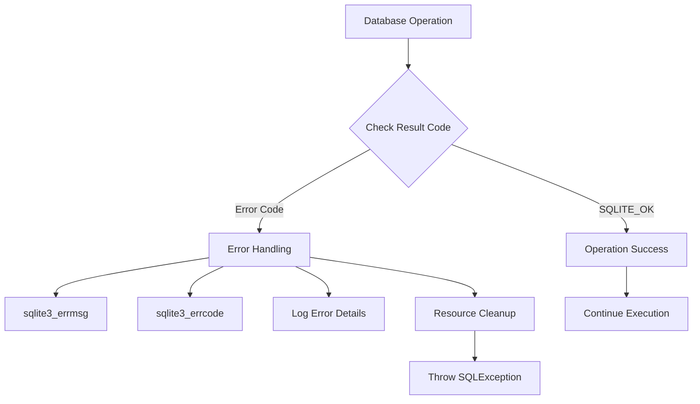

# Core Database Objects Module

## Overview

The `core_database_objects` module forms the foundational layer of the libSQL JNI binding system, providing essential Java wrapper classes for core SQLite database objects. This module encapsulates the primary database entities - database connections, prepared statements, values, and execution contexts - enabling type-safe communication between Java applications and the native SQLite C library.

## Architecture

The module implements a wrapper-based architecture where each core SQLite C structure is represented by a corresponding Java class that extends `NativePointerHolder`. This design ensures memory safety while maintaining direct access to native SQLite functionality.



## Core Components

### CApi - Central JNI Interface

The `CApi` class serves as the primary interface for all SQLite operations, providing a comprehensive Java binding to the SQLite C API.

**Key Responsibilities:**
- Static method collection for all SQLite C API functions
- UTF-8/UTF-16 string handling and conversion
- Memory management coordination
- Error handling and result code management
- Thread safety management

**Critical Features:**
- **Thread Management**: `sqlite3_java_uncache_thread()` for proper cleanup
- **Configuration**: Support for SQLite configuration options
- **Memory Safety**: Automatic handling of native pointer lifecycle
- **Encoding Support**: Proper UTF-8/UTF-16 conversion handling

### sqlite3 - Database Connection Handle

Represents a SQLite database connection, wrapping the native `sqlite3*` pointer.

**Lifecycle Management:**


**Key Features:**
- **AutoCloseable**: Automatic resource cleanup
- **Database Operations**: Connection to SQLite database files
- **Configuration**: Database-specific settings and options
- **Metadata Access**: Database schema and file information

### sqlite3_stmt - Prepared Statement Handle

Encapsulates compiled SQL statements, providing efficient execution of parameterized queries.

**Statement Lifecycle:**


**Key Capabilities:**
- **Parameter Binding**: Type-safe parameter binding
- **Result Extraction**: Column data retrieval
- **Reusability**: Reset and reuse for performance
- **Metadata**: Column information and statement properties

### sqlite3_value - SQL Value Container

Represents SQL values passed to and from user-defined functions and prepared statements.

**Value Type System:**


### sqlite3_context - UDF Execution Context

Provides the execution context for user-defined functions, enabling custom SQL function implementation.

**UDF Context Flow:**


## Data Flow Architecture



## Integration with Related Modules

### Dependencies

- **[utility_infrastructure](utility_infrastructure.md)**: Inherits from `NativePointerHolder` and uses `OutputPointer` classes
- **[specialized_handles](specialized_handles.md)**: Provides specialized database object types
- **[jni_callbacks](jni_callbacks.md)**: Integrates with callback mechanisms for UDFs and hooks

### Usage Patterns

**Basic Database Operations:**
```java
// Database connection
sqlite3 db = CApi.sqlite3_open("database.db");

// Prepared statement
sqlite3_stmt stmt = CApi.sqlite3_prepare_v2(db, "SELECT * FROM users WHERE id = ?");

// Parameter binding
CApi.sqlite3_bind_int(stmt, 1, userId);

// Execution and result processing
while (CApi.sqlite3_step(stmt) == CApi.SQLITE_ROW) {
    String name = CApi.sqlite3_column_text16(stmt, 0);
    // Process results
}

// Cleanup
CApi.sqlite3_finalize(stmt);
CApi.sqlite3_close(db);
```

**User-Defined Function Implementation:**
```java
// UDF using sqlite3_context
public class CustomFunction extends ScalarFunction {
    @Override
    public void xFunc(sqlite3_context cx, sqlite3_value[] args) {
        // Access function arguments
        int value = CApi.sqlite3_value_int(args[0]);
        
        // Perform computation
        int result = value * 2;
        
        // Set result
        CApi.sqlite3_result_int(cx, result);
    }
}
```

## Memory Management

The module implements careful memory management through:

1. **Native Pointer Tracking**: Each wrapper maintains its native pointer state
2. **Automatic Cleanup**: `AutoCloseable` implementation for resource management
3. **Thread Safety**: Proper synchronization for multi-threaded access
4. **Lifecycle Management**: Clear ownership and cleanup responsibilities

## Error Handling



## Thread Safety Considerations

- **Database Connections**: Thread-safe when properly configured
- **Prepared Statements**: Not thread-safe, require external synchronization
- **Value Objects**: Immutable during function execution
- **Context Objects**: Single-threaded access during UDF execution

## Performance Characteristics

- **Minimal Overhead**: Direct JNI calls with minimal Java wrapper overhead
- **Memory Efficient**: Native pointer management without object duplication
- **Optimized Conversions**: Efficient UTF-8/UTF-16 string handling
- **Resource Pooling**: Support for connection and statement reuse

## Best Practices

1. **Resource Management**: Always use try-with-resources or explicit cleanup
2. **Parameter Binding**: Use prepared statements for repeated operations
3. **Error Checking**: Always check return codes from operations
4. **Thread Safety**: Synchronize access to shared database connections
5. **Memory Cleanup**: Call `sqlite3_java_uncache_thread()` in worker threads

## Future Considerations

- Enhanced type safety for SQL value handling
- Improved error reporting with stack traces
- Performance optimizations for bulk operations
- Extended support for SQLite extensions and modules

This module serves as the cornerstone of the libSQL JNI binding system, providing the essential building blocks for all database operations while maintaining the performance and flexibility of the underlying SQLite C library.