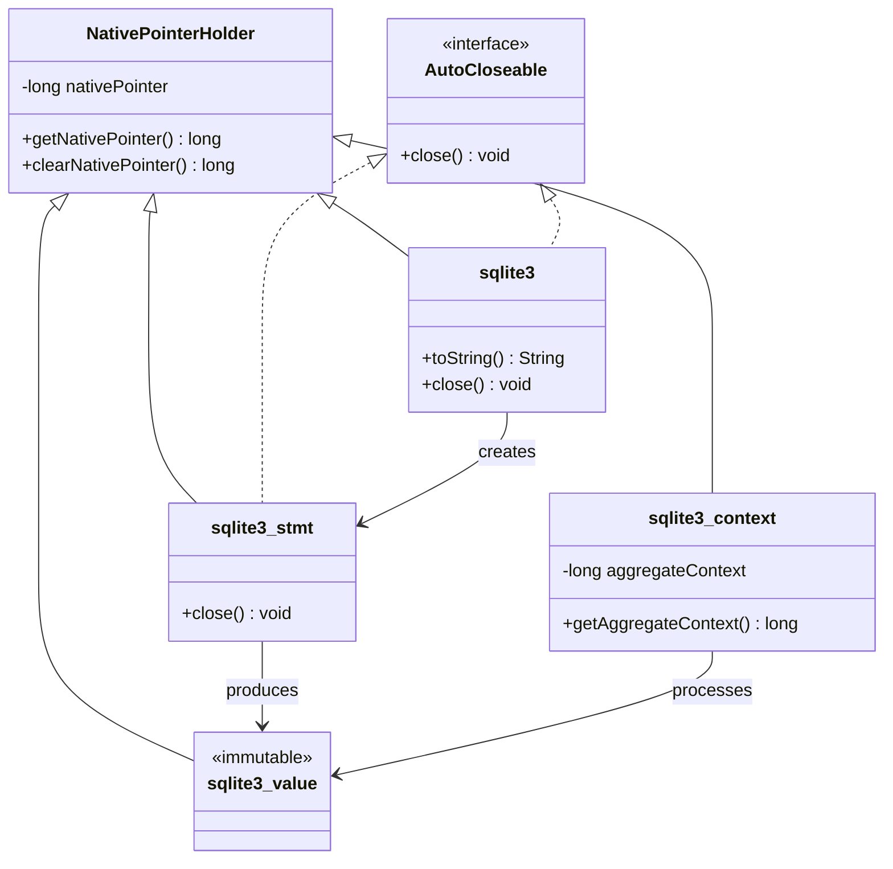
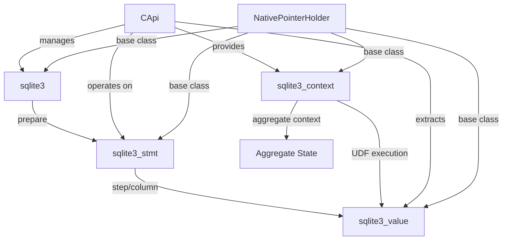
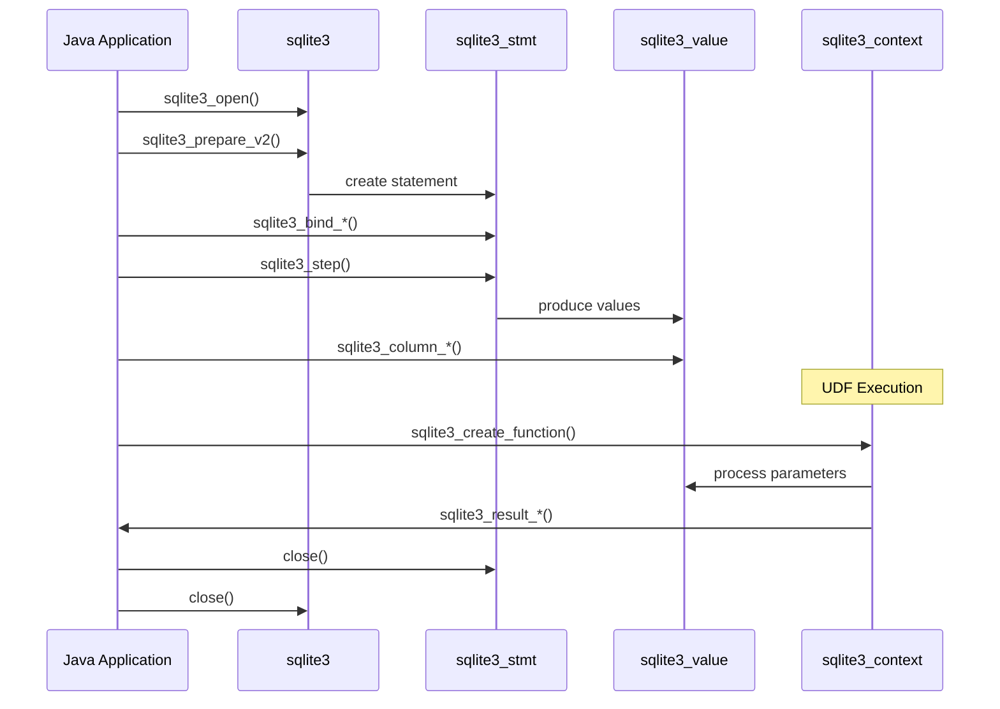

# Database Objects Module

The `database_objects` module provides the core Java wrapper classes for SQLite database objects in the libSQL JNI binding system. This module contains the fundamental object representations that bridge Java applications with the native SQLite C API.

## Overview

This module defines the essential database object wrappers that enable type-safe communication between Java and the native SQLite library. Each class represents a specific SQLite C structure and provides Java-friendly interfaces while maintaining direct access to native functionality.

## Core Components

### Database Connection Objects

#### sqlite3
The primary database connection wrapper that represents a SQLite database handle (`sqlite3*` in C).

**Key Features:**
- Implements `AutoCloseable` for automatic resource management
- Provides type-safe database handle communication
- Includes database identification and debugging support
- Automatic cleanup via `sqlite3_close_v2()`

**Usage Pattern:**
```java
try (sqlite3 db = CApi.sqlite3_open("database.db")) {
    // Database operations
} // Automatically closed
```

### Statement Objects

#### sqlite3_stmt
Represents a prepared SQL statement (`sqlite3_stmt*` in C).

**Key Features:**
- Implements `AutoCloseable` for automatic finalization
- Type-safe statement handle management
- Automatic cleanup via `sqlite3_finalize()`
- Supports all SQLite statement operations

**Usage Pattern:**
```java
try (sqlite3_stmt stmt = CApi.sqlite3_prepare_v2(db, "SELECT * FROM table")) {
    while (CApi.sqlite3_step(stmt) == CApi.SQLITE_ROW) {
        // Process results
    }
} // Automatically finalized
```

### Value Objects

#### sqlite3_value
Represents a SQLite value object (`sqlite3_value*` in C) used in user-defined functions and result processing.

**Key Features:**
- Immutable value representation
- Type-safe value extraction
- Support for all SQLite data types
- Used in UDF parameter passing

#### sqlite3_context
Represents the execution context for user-defined functions (`sqlite3_context*` in C).

**Key Features:**
- Aggregate context management
- Result value setting
- Error reporting capabilities
- Thread-safe context operations

**Aggregate Context Support:**
```java
public long getAggregateContext() {
    // Returns unique key for aggregate function instances
    // Enables proper state management across UDF calls
}
```

## Architecture



## Component Relationships



## Data Flow



## Integration Points

### With JNI Infrastructure
- Inherits from [jni_infrastructure](jni_infrastructure.md) `NativePointerHolder`
- Utilizes native pointer management for C interop
- Provides type-safe wrappers around raw pointers

### With Utility Types
- Works with [utility_types](utility_types.md) `OutputPointer` classes
- Integrates with `ValueHolder` for parameter management
- Uses `ResultCode` for error handling

### With JNI CAPI
- Operated on by [jni_capi](jni_capi.md) `CApi` methods
- Provides the object layer for C API functions
- Enables object-oriented database programming

## Memory Management

### Automatic Resource Management
All database objects implement proper resource cleanup:

```java
// Database connections
try (sqlite3 db = CApi.sqlite3_open("test.db")) {
    // Statements
    try (sqlite3_stmt stmt = CApi.sqlite3_prepare_v2(db, sql)) {
        // Automatic cleanup guaranteed
    }
}
```

### Native Pointer Lifecycle
1. **Creation**: Native pointers set by JNI layer
2. **Usage**: Accessed via `getNativePointer()`
3. **Cleanup**: Cleared via `clearNativePointer()` during close
4. **Safety**: Prevents use of stale pointers

## Thread Safety

### Database Objects
- `sqlite3`: Thread safety depends on SQLite configuration
- `sqlite3_stmt`: Not thread-safe, single-thread use only
- `sqlite3_value`: Immutable, safe for read-only access
- `sqlite3_context`: Thread-safe for UDF execution

### Aggregate Context Management
The `sqlite3_context.getAggregateContext()` method provides thread-safe access to aggregate function state:

```java
public long getAggregateContext() {
    // Returns stable key for aggregate function instances
    // Safe across multiple UDF callback invocations
    // Handles edge case of empty result sets
}
```

## Error Handling

### Resource Cleanup
- Implements fail-safe cleanup in `close()` methods
- Handles null pointers gracefully
- Prevents double-free scenarios

### Exception Safety
- `AutoCloseable` ensures cleanup even on exceptions
- Native pointer clearing prevents stale references
- Proper error propagation from C layer

## Usage Patterns

### Basic Database Operations
```java
try (sqlite3 db = CApi.sqlite3_open(":memory:")) {
    try (sqlite3_stmt stmt = CApi.sqlite3_prepare_v2(db, 
            "CREATE TABLE test (id INTEGER, name TEXT)")) {
        CApi.sqlite3_step(stmt);
    }
    
    try (sqlite3_stmt stmt = CApi.sqlite3_prepare_v2(db,
            "INSERT INTO test VALUES (?, ?)")) {
        CApi.sqlite3_bind_int(stmt, 1, 42);
        CApi.sqlite3_bind_text(stmt, 2, "example");
        CApi.sqlite3_step(stmt);
    }
}
```

### User-Defined Functions
```java
CApi.sqlite3_create_function(db, "my_func", 1, CApi.SQLITE_UTF8,
    new ScalarFunction() {
        @Override
        public void xFunc(sqlite3_context cx, sqlite3_value[] args) {
            // Access aggregate context if needed
            long aggCtx = cx.getAggregateContext();
            
            // Process input values
            String input = CApi.sqlite3_value_text16(args[0]);
            
            // Set result
            CApi.sqlite3_result_text(cx, input.toUpperCase());
        }
    });
```

## Performance Considerations

### Object Lifecycle
- Minimize object creation in tight loops
- Use try-with-resources for automatic cleanup
- Reuse prepared statements when possible

### Native Pointer Access
- Direct pointer access avoids Java object overhead
- Efficient C API integration
- Minimal JNI crossing overhead

## Best Practices

### Resource Management
1. Always use try-with-resources for database objects
2. Close objects in reverse order of creation
3. Handle exceptions without leaking resources

### Type Safety
1. Use specific object types rather than raw pointers
2. Leverage compile-time type checking
3. Avoid manual pointer manipulation

### Error Handling
1. Check return codes from all operations
2. Use appropriate exception handling
3. Ensure cleanup in all code paths

## Related Documentation

- [JNI Infrastructure](jni_infrastructure.md) - Base pointer management
- [Utility Types](utility_types.md) - Supporting type system
- [JNI CAPI](jni_capi.md) - C API operations
- [JNI Core API](jni_core_api.md) - Higher-level API integration