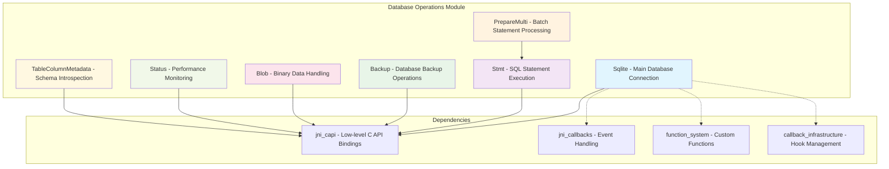
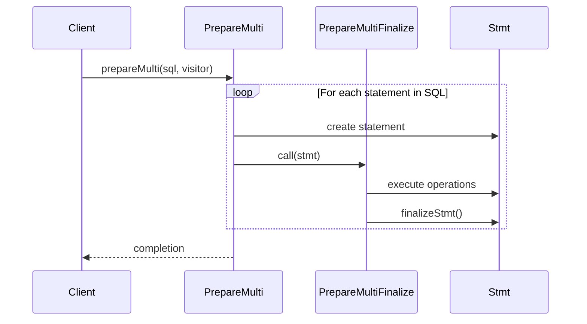
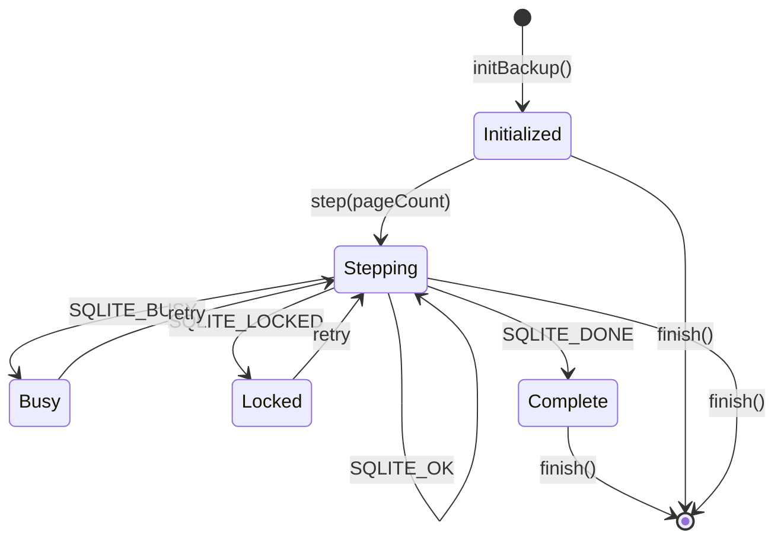
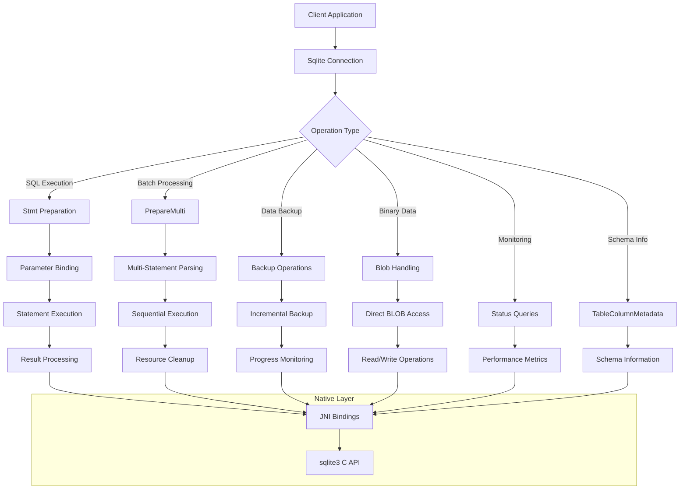
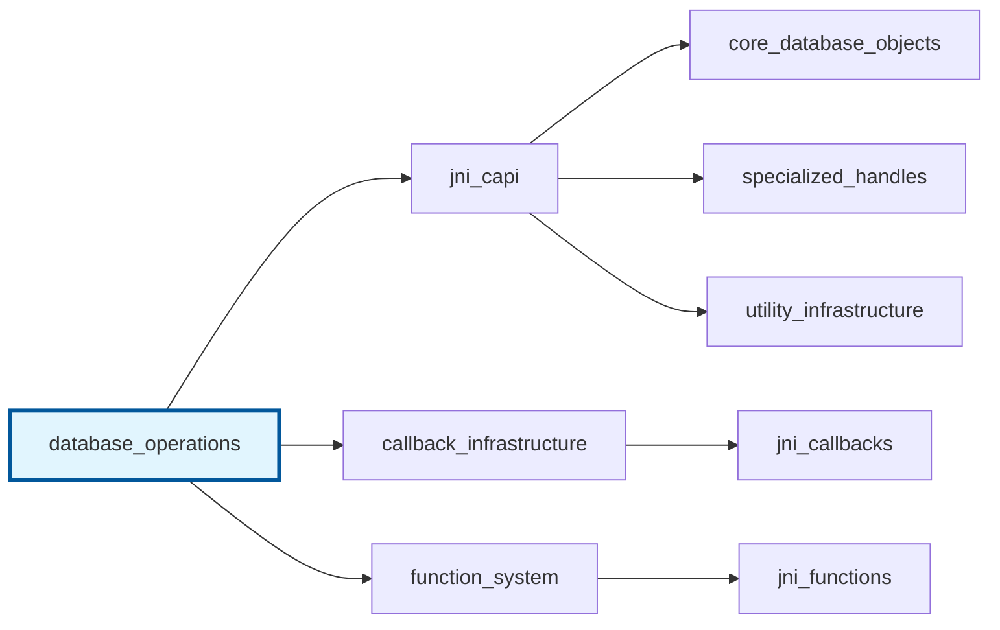

# Database Operations Module

The database_operations module provides high-level Java wrapper classes for core SQLite database operations within the libsql-sqlite3 JNI framework. This module serves as the primary interface for database connection management, SQL statement execution, data backup, BLOB handling, and database introspection.

## Architecture Overview



## Core Components

### 1. Sqlite - Primary Database Connection

The main database connection class that wraps the native sqlite3 handle and provides comprehensive database management functionality.

**Key Features:**
- Database connection lifecycle management
- SQL statement preparation and execution
- Transaction control and monitoring
- Configuration and optimization
- Error handling and exception management

**Core Operations:**
- `open()` - Database connection establishment
- `prepare()` - SQL statement preparation
- `close()` - Resource cleanup and connection termination
- `status()` - Performance metrics retrieval

### 2. Stmt - SQL Statement Execution

Represents prepared SQL statements with parameter binding and result processing capabilities.

**Key Features:**
- Parameter binding for all SQLite data types
- Result column access and type conversion
- Statement lifecycle management
- Execution control (step, reset, finalize)

### 3. PrepareMulti - Batch Statement Processing

Interface and implementation for processing multiple SQL statements from a single input string.



### 4. Backup - Database Backup Operations

Provides incremental database backup functionality with progress monitoring.

**Key Features:**
- Cross-database backup operations
- Incremental backup with page-level control
- Progress monitoring and status reporting
- Error handling for concurrent access scenarios

**Backup Process Flow:**


### 5. Blob - Binary Large Object Handling

Specialized interface for efficient handling of binary data stored in SQLite BLOB columns.

**Key Features:**
- Direct BLOB access without loading entire content into memory
- Read/write operations with offset control
- BLOB reopening for different rows
- Size information retrieval

### 6. Status - Performance Monitoring

Container class for SQLite performance metrics and statistics.

**Metrics Tracked:**
- Current resource usage values
- Peak (high-water mark) values
- Memory allocation statistics
- Cache performance metrics

### 7. TableColumnMetadata - Schema Introspection

Provides detailed metadata about database table columns.

**Metadata Available:**
- Data type information
- Collation sequence
- NOT NULL constraints
- Primary key status
- Auto-increment properties

## Data Flow Architecture



## Integration with Related Modules

### Dependencies

- **[jni_capi](jni_capi.md)**: Provides low-level C API bindings for all database operations
- **[jni_callbacks](jni_callbacks.md)**: Supplies callback infrastructure for database events
- **[function_system](function_system.md)**: Enables custom SQL function registration
- **[callback_infrastructure](callback_infrastructure.md)**: Manages database hooks and event handlers

### Module Relationships



## Error Handling Strategy

The module implements a comprehensive error handling approach:

1. **Exception Translation**: Native SQLite error codes are converted to Java exceptions
2. **Resource Management**: Automatic cleanup using try-with-resources and AutoCloseable
3. **State Validation**: Runtime checks for object lifecycle and parameter validity
4. **Error Propagation**: Consistent error reporting across all operations

## Performance Considerations

### Optimization Features

- **Connection Pooling**: Thread-safe connection management
- **Statement Caching**: Prepared statement reuse
- **Incremental Operations**: Page-level backup and BLOB access
- **Memory Management**: Automatic resource cleanup and memory monitoring

### Best Practices

1. Use try-with-resources for automatic resource cleanup
2. Leverage PrepareMultiFinalize for batch operations
3. Monitor performance using Status metrics
4. Implement proper transaction boundaries
5. Use BLOB interface for large binary data

## Usage Examples

### Basic Database Operations
```java
// Open database connection
try (Sqlite db = Sqlite.open("database.db")) {
    // Prepare and execute statement
    try (Sqlite.Stmt stmt = db.prepare("SELECT * FROM users WHERE id = ?")) {
        stmt.bindInt(1, 123);
        while (stmt.step()) {
            String name = stmt.columnText(1);
            // Process results
        }
    }
}
```

### Batch Statement Processing
```java
String multiSql = "INSERT INTO users VALUES (1, 'Alice'); INSERT INTO users VALUES (2, 'Bob');";
db.prepareMulti(multiSql, new Sqlite.PrepareMultiFinalize(stmt -> {
    stmt.step(); // Execute each statement
}));
```

### Database Backup
```java
try (Sqlite source = Sqlite.open("source.db");
     Sqlite dest = Sqlite.open("backup.db");
     Sqlite.Backup backup = dest.initBackup("main", source, "main")) {
    
    while (backup.step(100) != Sqlite.DONE) {
        // Monitor progress
        int remaining = backup.remaining();
        int total = backup.pageCount();
    }
}
```

This module serves as the cornerstone of the libsql-sqlite3 JNI framework, providing a robust, type-safe, and feature-complete interface for SQLite database operations in Java applications.