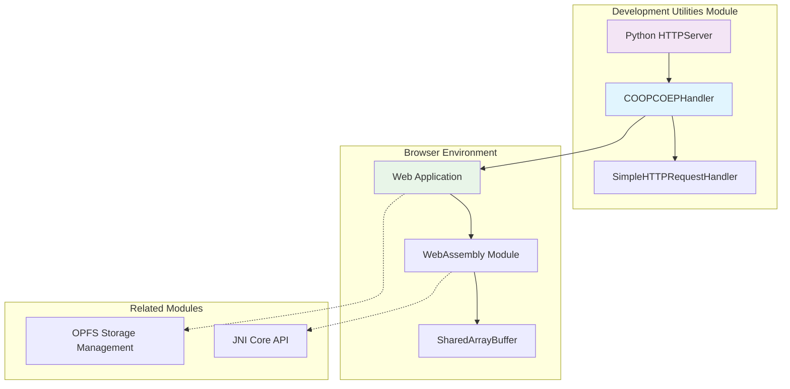
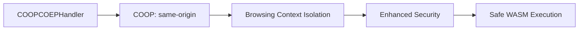
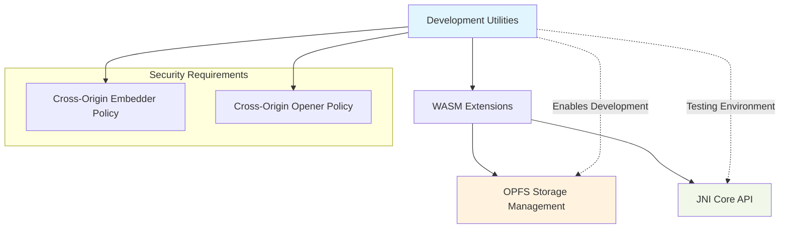
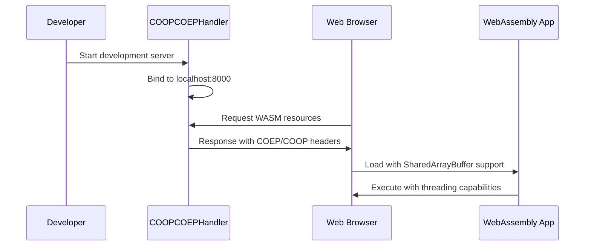
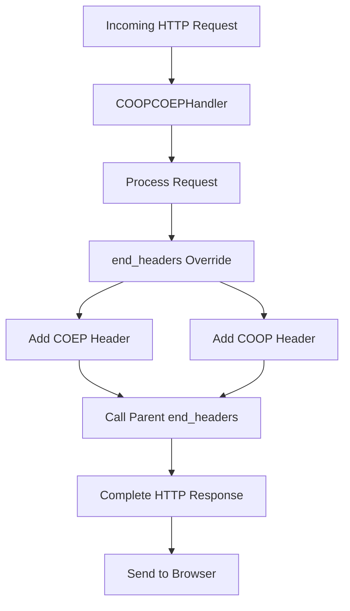
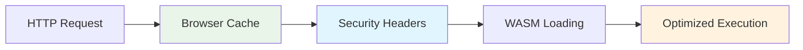

# Development Utilities Module

## Overview

The development_utilities module provides essential development and testing infrastructure for the LibSQL WebAssembly (WASM) extensions. This module focuses on enabling secure cross-origin resource sharing and providing a development server environment that supports the specific security requirements of WebAssembly applications in modern browsers.

## Core Purpose

This module serves as a critical development utility that addresses the Cross-Origin Embedder Policy (COEP) and Cross-Origin Opener Policy (COOP) requirements necessary for SharedArrayBuffer and WebAssembly threading support in web browsers. It provides a specialized HTTP server handler that automatically sets the required security headers for development and testing of WASM-based SQLite applications.

## Architecture Overview



## Core Components

### COOPCOEPHandler

The `COOPCOEPHandler` is the primary component of this module, extending Python's `SimpleHTTPRequestHandler` to provide the necessary security headers for WebAssembly development.

#### Key Features

- **Cross-Origin Embedder Policy (COEP)**: Sets `require-corp` to enable SharedArrayBuffer
- **Cross-Origin Opener Policy (COOP)**: Sets `same-origin` to isolate the browsing context
- **Development Server**: Provides a local HTTP server for testing WASM applications
- **Header Injection**: Automatically adds security headers to all HTTP responses

#### Implementation Details

```python
class COOPCOEPHandler(SimpleHTTPRequestHandler):
    def end_headers(self):
        self.send_header('Cross-Origin-Embedder-Policy', 'require-corp')
        self.send_header('Cross-Origin-Opener-Policy', 'same-origin')
        SimpleHTTPRequestHandler.end_headers(self)
```

The handler overrides the `end_headers()` method to inject the required security headers before completing the HTTP response.

## Security Headers Explained

### Cross-Origin Embedder Policy (COEP)


The `require-corp` policy ensures that all cross-origin resources are explicitly opted-in for embedding, which is required for SharedArrayBuffer access.

### Cross-Origin Opener Policy (COOP)



The `same-origin` policy isolates the browsing context from cross-origin windows, preventing potential security vulnerabilities.

## Module Dependencies



## Integration with Other Modules

### OPFS Storage Management
The development utilities module enables testing of the [OPFS Storage Management](opfs_storage_management.md) module by providing the necessary security headers for SharedArrayBuffer operations required by the OPFS VFS implementation.

### JNI Core API
While not directly dependent, this module provides the development environment necessary for testing WebAssembly applications that may interact with [JNI Core API](jni_core_api.md) components through the WASM bridge.

## Usage Patterns

### Development Server Setup



### Header Injection Process



## Development Workflow

### Local Development Setup

1. **Server Initialization**: The module creates an HTTPServer instance bound to localhost:8000
2. **Handler Registration**: COOPCOEPHandler is registered as the request handler
3. **Automatic Header Injection**: All responses automatically include required security headers
4. **WASM Application Testing**: Developers can test WebAssembly applications with full threading support

### Security Compliance

The module ensures compliance with modern browser security requirements:

- **SharedArrayBuffer Access**: Enables SharedArrayBuffer for multi-threaded WASM applications
- **Cross-Origin Protection**: Prevents unauthorized cross-origin access
- **Secure Context**: Maintains a secure browsing context for sensitive operations

## Configuration and Deployment

### Server Configuration

```python
# Default configuration
httpd = HTTPServer(('localhost', 8000), COOPCOEPHandler)
httpd.serve_forever()
```

### Customization Options

The module can be extended to support:
- Custom port configuration
- Additional security headers
- Development-specific middleware
- Request logging and debugging

## Performance Considerations

### Minimal Overhead

The COOPCOEPHandler introduces minimal performance overhead:
- **Header Injection**: Only adds two HTTP headers per response
- **Inheritance**: Leverages existing SimpleHTTPRequestHandler functionality
- **No Processing Delay**: Headers are added during the normal response flow

### Development Optimization



## Error Handling and Debugging

### Common Issues

1. **Port Conflicts**: Ensure port 8000 is available
2. **Header Conflicts**: Verify no conflicting security headers
3. **Browser Compatibility**: Confirm browser supports COEP/COOP

### Debugging Support

The module inherits logging capabilities from SimpleHTTPRequestHandler, providing:
- Request logging
- Error reporting
- Status code tracking

## Future Enhancements

### Potential Improvements

- **Configuration File Support**: External configuration for server settings
- **Multiple Environment Support**: Development, staging, and testing configurations
- **Enhanced Logging**: Detailed request/response logging for debugging
- **SSL/TLS Support**: HTTPS support for production-like testing

### Integration Opportunities

- **Build System Integration**: Automatic server startup during development builds
- **Testing Framework Integration**: Automated testing with proper security headers
- **CI/CD Pipeline Support**: Continuous integration testing environment

## Conclusion

The development_utilities module provides essential infrastructure for developing and testing WebAssembly-based SQLite applications. By automatically handling the complex security header requirements of modern browsers, it enables developers to focus on application logic while ensuring compliance with web security standards. The module's simple yet effective design makes it an indispensable tool in the LibSQL WASM development ecosystem.