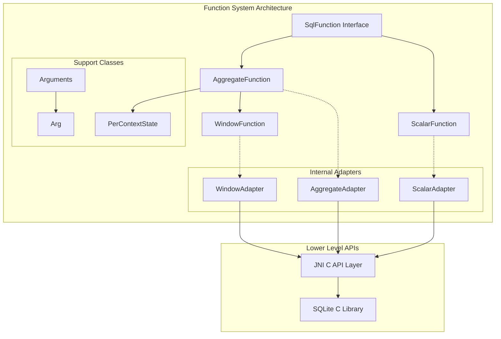
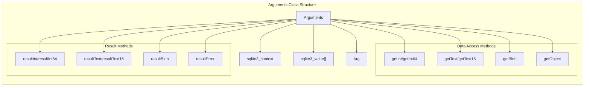
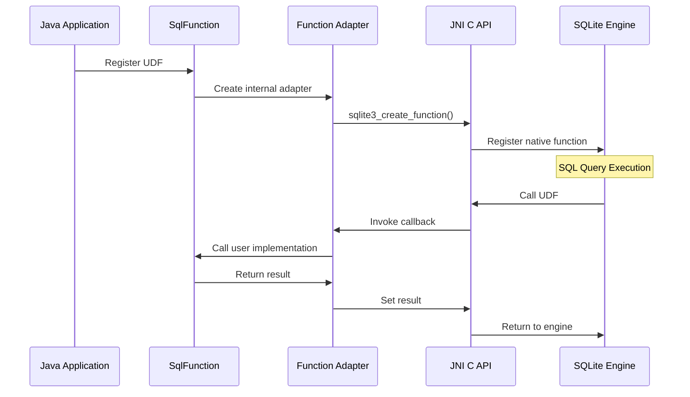
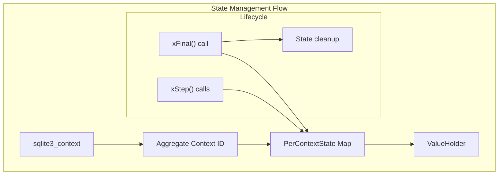
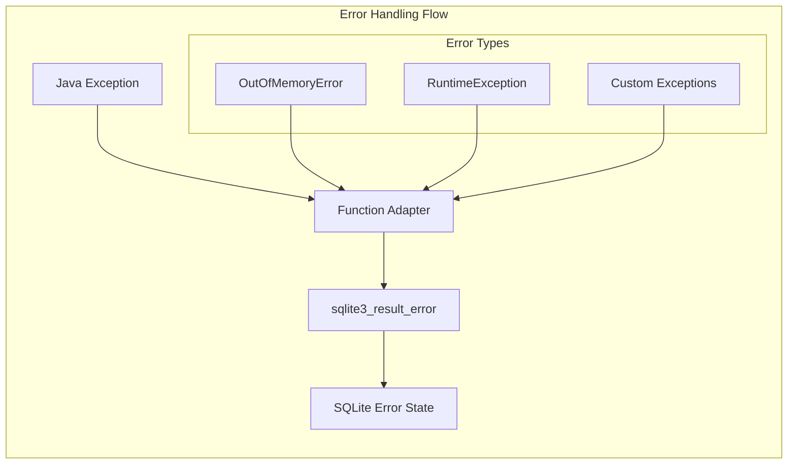

# Function System Module

The function_system module provides a high-level Java interface for creating and managing User-Defined Functions (UDFs) in SQLite through the JNI wrapper1 layer. This module abstracts the complexity of the lower-level C API while providing a clean, type-safe interface for implementing scalar, aggregate, and window functions.

## Architecture Overview

The function_system module is built on top of the [jni_capi](jni_capi.md) layer and provides three main types of SQL functions:



## Core Components

### SqlFunction Interface

The base marker interface that defines constants and common functionality for all UDF types:

- **Purpose**: Provides common constants and type definitions for all SQL function types
- **Key Features**:
  - Function behavior flags (DETERMINISTIC, INNOCUOUS, DIRECTONLY, etc.)
  - Text encoding constants (UTF8, UTF16)
  - Subtype handling constants

### Arguments Class

A comprehensive abstraction over SQLite's function argument handling:



**Key Capabilities**:
- Type-safe argument access with automatic bounds checking
- Multiple data type support (integers, text, blobs, objects)
- Result setting with automatic error handling
- Auxiliary data management for function state
- Iterator support for functional programming patterns

### Function Type Hierarchy

#### ScalarFunction
- **Purpose**: Implements simple functions that return a single value
- **Interface**: Single `xFunc()` method for computation
- **Use Cases**: Mathematical functions, string manipulation, data conversion

#### AggregateFunction
- **Purpose**: Implements functions that accumulate values across multiple rows
- **Interface**: `xStep()` for processing each row, `xFinal()` for result computation
- **State Management**: Built-in `PerContextState` for managing accumulator state
- **Use Cases**: SUM, COUNT, custom aggregations

#### WindowFunction
- **Purpose**: Extends aggregate functions with window-specific operations
- **Interface**: Inherits from AggregateFunction, adds `xInverse()` and `xValue()`
- **Advanced Features**: Supports sliding window operations
- **Use Cases**: Running totals, moving averages, ranking functions

## Data Flow Architecture



## State Management

### PerContextState System

The module provides sophisticated state management for aggregate and window functions:



**Features**:
- Automatic context-to-state mapping
- Type-safe state containers
- Automatic cleanup on function completion
- Support for multiple concurrent function invocations

## Integration Points

### With JNI C API Layer
- **Dependency**: Built on top of [jni_capi](jni_capi.md) for low-level SQLite access
- **Adapter Pattern**: Uses internal adapters to bridge high-level and low-level APIs
- **Error Handling**: Automatic translation of Java exceptions to SQLite errors

### With Callback Infrastructure
- **Relationship**: Complements [callback_infrastructure](callback_infrastructure.md) for complete UDF support
- **Scope**: Focuses on function implementation while callbacks handle database events

### With Database Operations
- **Integration**: Works with [database_operations](database_operations.md) for function registration
- **Context**: Functions operate within database connection contexts

## Error Handling Strategy



**Error Handling Features**:
- Automatic exception-to-error translation
- Special handling for OutOfMemoryError
- Preservation of error messages and context
- Graceful degradation without crashing SQLite

## Usage Patterns

### Scalar Function Implementation
```java
public class MyScalarFunction extends ScalarFunction {
    @Override
    public void xFunc(SqlFunction.Arguments args) {
        int input = args.getInt(0);
        int result = computeResult(input);
        args.resultInt(result);
    }
}
```

### Aggregate Function Implementation
```java
public class MyAggregateFunction extends AggregateFunction<Integer> {
    @Override
    public void xStep(SqlFunction.Arguments args) {
        ValueHolder<Integer> state = getAggregateState(args, 0);
        state.value += args.getInt(0);
    }
    
    @Override
    public void xFinal(SqlFunction.Arguments args) {
        Integer result = takeAggregateState(args);
        args.resultInt(result != null ? result : 0);
    }
}
```

## Performance Considerations

- **Memory Management**: Efficient state management with automatic cleanup
- **Type Safety**: Compile-time type checking reduces runtime overhead
- **Minimal Overhead**: Thin adapter layer with direct JNI calls
- **Concurrent Access**: Thread-safe state management for multiple function instances

## Security Features

- **Bounds Checking**: Automatic validation of argument indices
- **Type Validation**: Safe type conversion with error handling
- **Resource Management**: Automatic cleanup prevents memory leaks
- **Exception Isolation**: Java exceptions don't crash SQLite engine

## Future Extensibility

The module is designed for future enhancements:
- Additional function types can be added by extending SqlFunction
- New data types can be supported through the Arguments interface
- Enhanced state management patterns can be implemented
- Performance optimizations can be added transparently

This module represents the highest-level interface for SQLite UDF development in the libsql JNI binding, providing a clean, safe, and efficient way to extend SQLite with custom functionality while maintaining full integration with the underlying SQLite engine.