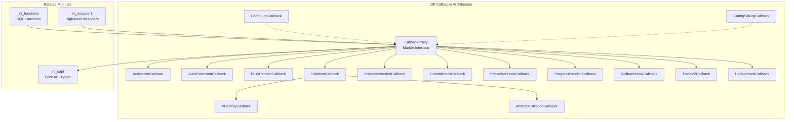
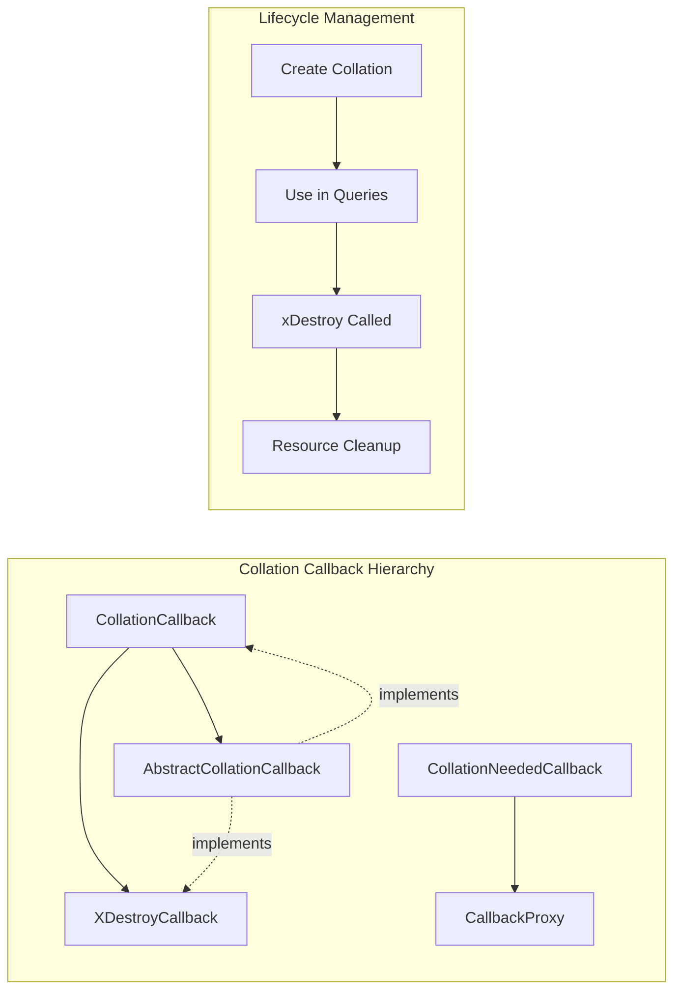
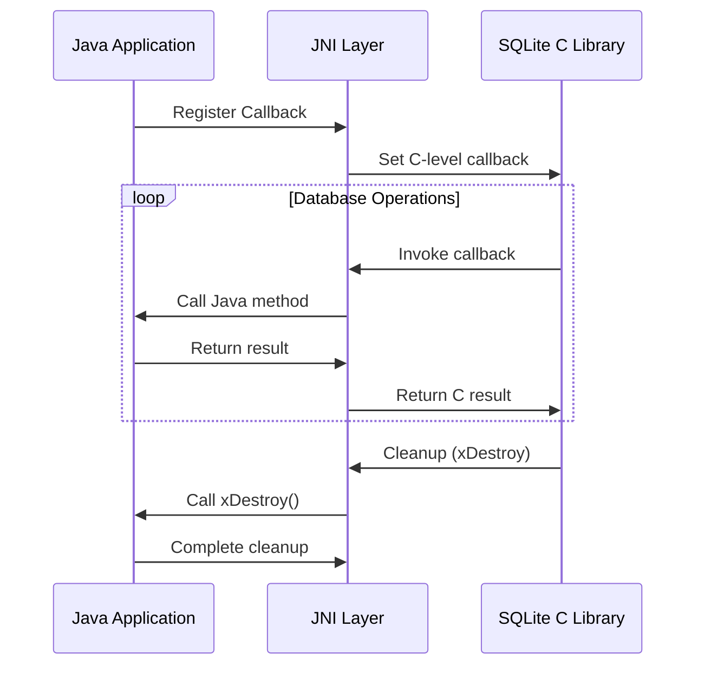
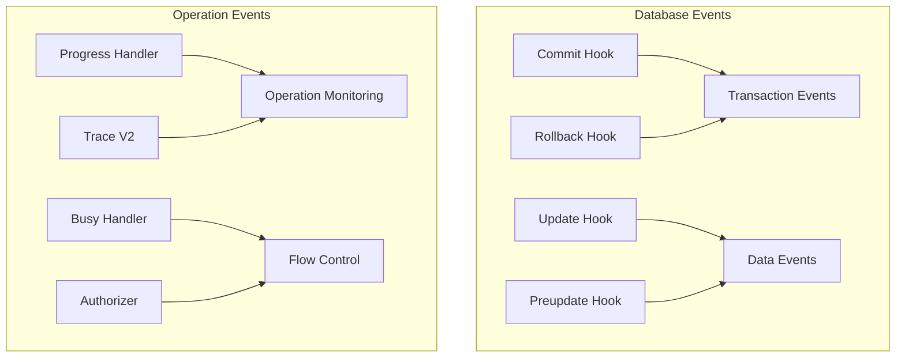

# JNI Callbacks Module

## Overview

The JNI Callbacks module provides a comprehensive callback system for SQLite's Java Native Interface (JNI) bindings. This module serves as the bridge between Java callback implementations and SQLite's C-level callback mechanisms, enabling Java applications to respond to various database events and operations through a type-safe, well-structured callback architecture.

The module implements the callback proxy pattern to handle the impedance mismatch between Java's object-oriented callback model and SQLite's C-style function pointer callbacks. It provides specialized callback interfaces for different SQLite operations including authorization, transaction hooks, progress monitoring, tracing, and collation handling.

## Architecture

The module is built around a hierarchical callback system with `CallbackProxy` as the root marker interface, providing specialized callback interfaces for different SQLite operations.



## Core Components

### CallbackProxy Interface
The foundational marker interface that establishes the callback contract and naming conventions for all SQLite JNI callbacks.

**Key Features:**
- Marker interface for documentation and class grouping
- Establishes no-throw semantics for callbacks
- Defines naming convention: UpperCamelCase + "Callback" suffix
- Provides exception handling guidelines

### Database Event Callbacks

#### Transaction Management
- **CommitHookCallback**: Monitors transaction commits
- **RollbackHookCallback**: Handles transaction rollbacks
- **PreupdateHookCallback**: Pre-update event notifications

#### Authorization and Security
- **AuthorizerCallback**: Controls access to database operations
- **AutoExtensionCallback**: Manages automatic extension loading

#### Progress and Performance
- **BusyHandlerCallback**: Handles database busy conditions
- **ProgressHandlerCallback**: Monitors long-running operations
- **TraceV2Callback**: Provides comprehensive operation tracing

#### Data Modification Tracking
- **UpdateHookCallback**: Tracks data modification events

### Collation System



#### CollationCallback
Defines custom string comparison logic for SQLite operations.

**Features:**
- Byte-array based comparison with memcmp() semantics
- Automatic resource cleanup via XDestroyCallback
- Integration with SQLite's collation system

#### AbstractCollationCallback
Provides a convenient base implementation with no-op cleanup.

#### CollationNeededCallback
Handles dynamic collation creation when SQLite encounters unknown collation names.

### Configuration Callbacks
- **ConfigLogCallback**: Global SQLite logging configuration
- **ConfigSqlLogCallback**: SQL statement logging configuration

### Resource Management



## Component Relationships

### Dependencies
The jni_callbacks module has the following key dependencies:

- **[jni_capi](jni_capi.md)**: Core SQLite types (sqlite3, sqlite3_stmt, etc.)
- **[jni_core_api](jni_core_api.md)**: Base JNI infrastructure
- **Java Annotations**: Type safety annotations (@Nullable, @NotNull)

### Integration Points
- **[jni_functions](jni_functions.md)**: SQL function callbacks extend this system
- **[jni_wrapper1](jni_wrapper1.md)**: High-level wrappers use these callbacks
- **[jni_fts5](jni_fts5.md)**: FTS5 extension callbacks follow similar patterns

## Callback Categories

### Event-Driven Callbacks


### Configuration Callbacks
- Global logging configuration
- SQL statement logging
- Extension auto-loading

### Collation Callbacks
- Custom string comparison
- Dynamic collation creation
- Resource lifecycle management

## Exception Handling Strategy

The module implements a sophisticated exception handling strategy:

1. **No-Throw Semantics**: Callbacks must not throw exceptions to maintain C-level compatibility
2. **Error Conversion**: Exceptions are converted to SQLite error codes where supported
3. **Exception Suppression**: Unsupported error contexts suppress exceptions to prevent undefined behavior
4. **Debug Output**: Unexpected exceptions may trigger debug logging

## Usage Patterns

### Basic Callback Registration
```java
// Example pattern for callback registration
AuthorizerCallback authorizer = new AuthorizerCallback() {
    @Override
    public int call(int opId, String s1, String s2, String s3, String s4) {
        // Authorization logic
        return SQLITE_OK;
    }
};

CApi.sqlite3_set_authorizer(db, authorizer);
```

### Resource Management
```java
// Collation with proper cleanup
CollationCallback collation = new AbstractCollationCallback() {
    @Override
    public int call(byte[] lhs, byte[] rhs) {
        // Comparison logic
        return compareBytes(lhs, rhs);
    }
    
    @Override
    public void xDestroy() {
        // Custom cleanup if needed
        super.xDestroy();
    }
};
```

## Thread Safety Considerations

- Callbacks may be invoked from multiple threads
- Implementations should be thread-safe or use synchronization
- State management requires careful consideration of concurrent access
- Auto-extension callbacks should avoid recursive database operations

## Performance Characteristics

- Minimal overhead callback proxy pattern
- Direct JNI method invocation
- Efficient exception handling path
- Optimized for high-frequency callbacks (trace, progress)

## Best Practices

1. **Stateless Design**: Prefer stateless callback implementations
2. **Synchronization**: Use synchronized methods for stateful callbacks
3. **Resource Cleanup**: Always implement xDestroy() for resource-holding callbacks
4. **Exception Safety**: Never throw from callbacks unless explicitly supported
5. **Recursive Operations**: Avoid database operations from auto-extension callbacks

## Integration with SQLite C API

The module provides seamless integration with SQLite's C-level callback system:

- Automatic marshaling of parameters between Java and C
- Type-safe callback signatures
- Proper resource lifecycle management
- Exception-to-error-code translation

## Related Documentation

- **[jni_capi](jni_capi.md)**: Core SQLite API types and constants
- **[jni_functions](jni_functions.md)**: SQL function callback implementations
- **[jni_wrapper1](jni_wrapper1.md)**: High-level callback usage patterns
- **[jni_core_api](jni_core_api.md)**: Base JNI infrastructure

This module forms the foundation of SQLite's event-driven architecture in Java, enabling applications to respond to database events, control operations, and extend functionality through a robust callback system.