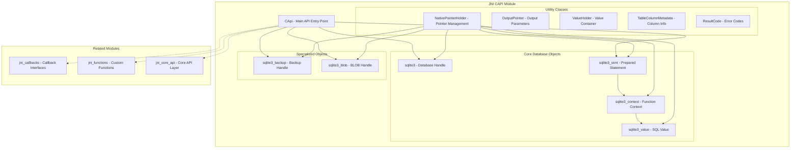
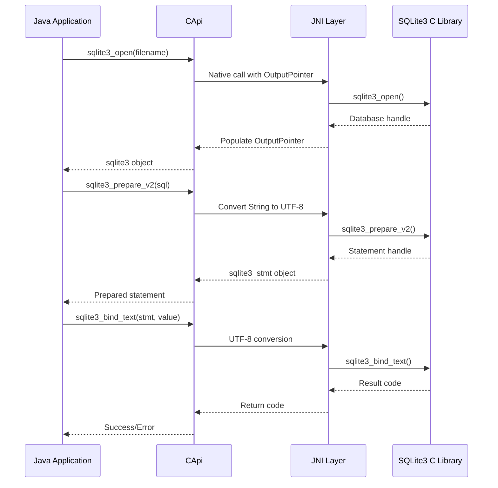

# JNI CAPI Module Documentation

## Overview

The `jni_capi` module provides the core Java Native Interface (JNI) bindings for the SQLite3 C API. This module serves as the foundational layer that bridges Java applications with the native SQLite3 database engine, offering a comprehensive set of classes and interfaces that mirror the C API functionality while maintaining Java's type safety and object-oriented principles.

## Purpose

The jni_capi module enables Java applications to:
- Execute SQL statements through prepared statements
- Manage database connections and transactions
- Handle binary large objects (BLOBs) and various data types
- Implement custom SQL functions and callbacks
- Perform database backup and recovery operations
- Access SQLite3's advanced features like full-text search (FTS5)

## Architecture Overview



## Core Components

The jni_capi module is organized into three main sub-modules, each serving distinct purposes in the SQLite3 JNI binding architecture:

### 1. Core Database Objects
The fundamental database interaction components that provide the primary interface to SQLite3 functionality. This includes the main CApi class and core database handle types.

**See detailed documentation:** [Core Database Objects](core_database_objects.md)

**Key Components:**
- **CApi**: Central API hub with complete SQLite3 C API coverage
- **sqlite3**: Database connection handle with resource management
- **sqlite3_stmt**: Prepared statement handle for SQL execution
- **sqlite3_value**: SQL value representation for data exchange
- **sqlite3_context**: Function execution context for UDFs

### 2. Specialized Handles
Advanced database operation handles for specific use cases like backup operations and binary large object manipulation.

**See detailed documentation:** [Specialized Handles](specialized_handles.md)

**Key Components:**
- **sqlite3_backup**: Incremental database backup operations
- **sqlite3_blob**: Direct binary large object I/O operations

### 3. Utility Infrastructure
Supporting classes that provide type safety, memory management, and parameter handling across the JNI boundary.

**See detailed documentation:** [Utility Infrastructure](utility_infrastructure.md)

**Key Components:**
- **NativePointerHolder**: Base class for native pointer management
- **OutputPointer**: Type-safe output parameter handling
- **ValueHolder**: Generic value container for cross-language communication
- **ResultCode**: Comprehensive error code mapping
- **TableColumnMetadata**: Database schema information container

## Data Flow Architecture



## Integration with Related Modules

### Callback Integration
The jni_capi module works closely with the [jni_callbacks](jni_callbacks.md) module to provide:
- Database event notifications
- Custom authorization logic
- Progress monitoring
- Logging and tracing capabilities

### Function Integration
Integration with [jni_functions](jni_functions.md) enables:
- Custom scalar functions
- Aggregate functions
- Window functions
- Multi-statement processing

### Core API Layer
The [jni_core_api](jni_core_api.md) module provides:
- Higher-level abstractions
- Simplified interfaces
- Additional utility functions
- Enhanced error handling

## Key Features

### Memory Management
- Automatic resource cleanup through AutoCloseable
- Native pointer lifecycle management
- Garbage collection integration
- Memory leak prevention

### Type Safety
- Strong typing for all database objects
- Compile-time error detection
- Generic type support where applicable
- Null safety considerations

### Error Handling
- Comprehensive result code mapping
- Exception-based error reporting
- Detailed error messages
- Context-aware error information

### Performance Optimization
- Direct memory access for BLOBs
- Efficient string encoding/decoding
- Minimal object allocation
- Native code optimization

## Usage Patterns

### Basic Database Operations
```java
import static org.sqlite.jni.capi.CApi.*;

// Open database
sqlite3 db = sqlite3_open(":memory:");

// Prepare statement
sqlite3_stmt stmt = sqlite3_prepare_v2(db, "SELECT * FROM users WHERE id = ?");

// Bind parameters
sqlite3_bind_int(stmt, 1, userId);

// Execute and process results
while (SQLITE_ROW == sqlite3_step(stmt)) {
    String name = sqlite3_column_text16(stmt, 0);
    // Process results
}

// Cleanup
sqlite3_finalize(stmt);
sqlite3_close_v2(db);
```

### BLOB Operations
```java
// Open BLOB for reading
sqlite3_blob blob = sqlite3_blob_open(db, "main", "documents", "content", rowId, 0);

// Read data
byte[] buffer = new byte[1024];
sqlite3_blob_read(blob, buffer, 0);

// Close BLOB
sqlite3_blob_close(blob);
```

## Thread Safety

The jni_capi module provides thread-safe operations when:
- SQLite3 is compiled with thread safety enabled
- Proper synchronization is used at the application level
- Database handles are not shared across threads without synchronization

## Best Practices

1. **Resource Management**: Always use try-with-resources or explicit cleanup
2. **Error Checking**: Check return codes for all operations
3. **Parameter Binding**: Use prepared statements with parameter binding
4. **Memory Efficiency**: Reuse prepared statements when possible
5. **Transaction Management**: Use explicit transactions for multiple operations

## Limitations and Considerations

1. **Platform Dependencies**: Requires native SQLite3 library
2. **JNI Overhead**: Some performance impact from JNI calls
3. **Memory Management**: Careful handling of native resources required
4. **String Encoding**: UTF-8/UTF-16 conversion considerations
5. **Callback Limitations**: Some C API callbacks have modified signatures

## See Also

- [jni_callbacks](jni_callbacks.md) - Callback interface implementations
- [jni_functions](jni_functions.md) - Custom function support
- [jni_core_api](jni_core_api.md) - Higher-level API abstractions
- [jni_wrapper1](jni_wrapper1.md) - Alternative wrapper implementation
- [jni_fts5](jni_fts5.md) - Full-text search extensions