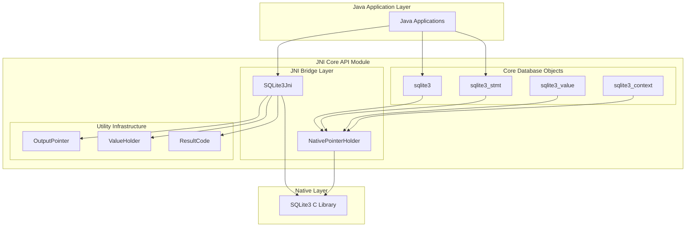
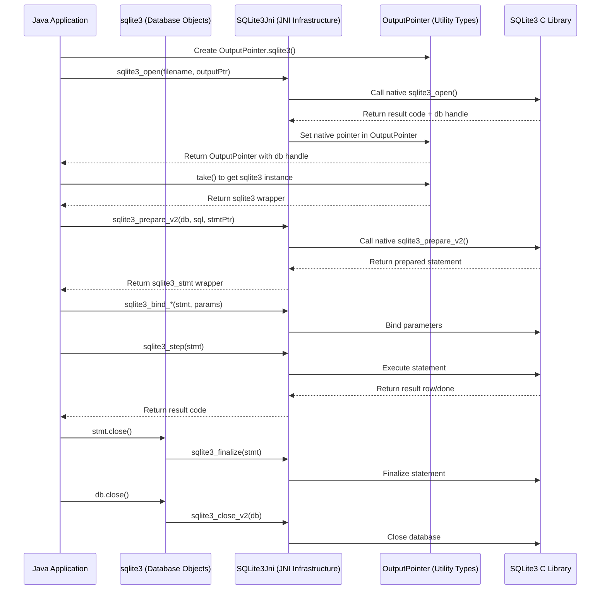

# JNI Core API Module Documentation

## Overview

The `jni_core_api` module serves as the primary Java Native Interface (JNI) bridge for SQLite3 database operations in the libsql project. This module provides a comprehensive Java API that wraps the native SQLite3 C library, enabling Java applications to interact with SQLite databases through type-safe, object-oriented interfaces.

## Purpose and Scope

The JNI Core API module is designed to:

- **Bridge Java and C**: Provide seamless integration between Java applications and the native SQLite3 C library
- **Type Safety**: Offer strongly-typed Java wrappers for SQLite3 native pointers and operations
- **Memory Management**: Handle native resource lifecycle management through Java's garbage collection and explicit resource management patterns
- **UTF-8 Compatibility**: Manage proper encoding conversions between Java's UTF-16 strings and SQLite's UTF-8 requirements
- **Thread Safety**: Provide synchronized access to native SQLite operations

## Architecture Overview

The module follows a layered architecture that abstracts native SQLite3 operations through Java interfaces:



## Component Interaction Flow

The following diagram illustrates how the sub-modules interact during typical database operations:



## Core Components

The JNI Core API module is organized into three main sub-modules, each handling specific aspects of the Java-to-native SQLite integration:

### Database Objects Sub-module
The **[Database Objects](database_objects.md)** sub-module provides the primary database interaction components:
- **sqlite3**: Primary database connection wrapper that manages native SQLite3 database handles
- **sqlite3_stmt**: Prepared statement wrapper for executing SQL queries and commands  
- **sqlite3_value**: Wrapper for SQLite value objects used in user-defined functions
- **sqlite3_context**: Context object for custom SQL function implementations

### JNI Infrastructure Sub-module
The **[JNI Infrastructure](jni_infrastructure.md)** sub-module handles the core JNI bridging mechanisms:
- **SQLite3Jni**: Central class containing all native method declarations and SQLite constants
- **NativePointerHolder**: Base class for managing native pointer lifecycle
- **Thread Management**: JNIEnv caching and cleanup mechanisms
- **Native Library Loading**: Dynamic library loading and initialization

### Utility Types Sub-module  
The **[Utility Types](utility_types.md)** sub-module provides supporting infrastructure for data exchange:
- **OutputPointer**: Type-safe output parameter handling for native function calls
- **ValueHolder**: Generic value container for cross-language data exchange
- **ResultCode**: Enumeration of SQLite result codes with human-readable mapping
- **Type-specific Pointers**: Specialized output pointer types for different data types

## Key Features

### Memory Safety
- Automatic native pointer lifecycle management
- Protection against use-after-free scenarios
- Proper cleanup of JNI resources

### Encoding Handling
- Transparent UTF-8/UTF-16 conversion
- Proper handling of Java's Modified UTF-8 vs standard UTF-8
- NUL-termination management for C string compatibility

### Thread Safety
- Synchronized access to native operations
- Per-thread JNIEnv management
- Thread-safe resource cleanup

### Error Handling
- Comprehensive SQLite error code mapping
- Exception-based error reporting
- Detailed error messages and diagnostics

## Integration with Related Modules

The JNI Core API module serves as the foundation for other specialized modules:

- **[jni_capi](jni_capi.md)**: Lower-level C API bindings that this module builds upon
- **[jni_callbacks](jni_callbacks.md)**: Callback mechanism implementations for database events
- **[jni_functions](jni_functions.md)**: User-defined function support built on this core
- **[jni_wrapper1](jni_wrapper1.md)**: Higher-level wrapper APIs that use this module
- **[jni_fts5](jni_fts5.md)**: Full-text search extensions that depend on this core

## Usage Patterns

### Basic Database Operations
```java
// Database connection
OutputPointer.sqlite3 dbPtr = new OutputPointer.sqlite3();
int rc = SQLite3Jni.sqlite3_open(":memory:", dbPtr);
sqlite3 db = dbPtr.take();

// Statement preparation
OutputPointer.sqlite3_stmt stmtPtr = new OutputPointer.sqlite3_stmt();
SQLite3Jni.sqlite3_prepare_v2(db, "SELECT * FROM users WHERE id = ?", stmtPtr);
sqlite3_stmt stmt = stmtPtr.take();

// Parameter binding and execution
SQLite3Jni.sqlite3_bind_int(stmt, 1, 42);
while (SQLite3Jni.sqlite3_step(stmt) == SQLite3Jni.SQLITE_ROW) {
    // Process results
}

// Cleanup
stmt.close();
db.close();
```

### Resource Management
```java
try (sqlite3 db = openDatabase()) {
    try (sqlite3_stmt stmt = prepareStatement(db, sql)) {
        // Use statement
    } // Statement automatically closed
} // Database automatically closed
```

## Performance Considerations

- **Synchronization Overhead**: All native calls are synchronized for thread safety
- **Memory Allocation**: Efficient native pointer management minimizes GC pressure
- **String Conversion**: UTF-8 conversion costs are optimized for common operations
- **JNI Overhead**: Direct native method calls minimize JNI transition costs

## Thread Safety Model

The module implements a comprehensive thread safety model:

- **Synchronized Native Calls**: All SQLite3Jni methods are synchronized
- **Per-Thread State**: JNIEnv caching per thread with proper cleanup
- **Resource Isolation**: Native pointers are thread-safe through synchronization
- **Cleanup Requirements**: Threads must call `uncacheJniEnv()` before termination

## Error Handling Strategy

The module provides multiple layers of error handling:

1. **Native Error Codes**: Direct SQLite result code propagation
2. **Result Code Mapping**: Human-readable error code enumeration
3. **Exception Integration**: Java exception throwing for critical errors
4. **Diagnostic Information**: Detailed error messages and context

## Future Extensibility

The architecture supports future enhancements:

- **Additional SQLite Features**: New SQLite3 functions can be easily added
- **Performance Optimizations**: JNI call batching and caching improvements
- **Enhanced Type Safety**: Additional wrapper types for specialized use cases
- **Async Operations**: Potential for non-blocking database operations

## Dependencies

### Internal Dependencies
- Native SQLite3 C library (libsql-ffi-bundled)
- JNI runtime environment

### External Dependencies
- Java 8+ (for AutoCloseable and other modern Java features)
- Platform-specific JNI libraries

## Maintenance Notes

### Code Organization
- All native methods are declared in SQLite3Jni class
- Wrapper classes follow consistent naming patterns
- Constants are grouped by functional category

### Testing Considerations
- JNI resource cleanup testing is critical
- Thread safety testing across multiple threads
- Memory leak detection for native resources
- UTF-8 encoding edge case testing

### Documentation Standards
- All public methods include comprehensive JavaDoc
- Native method signatures match C API documentation
- Cross-references to SQLite3 official documentation