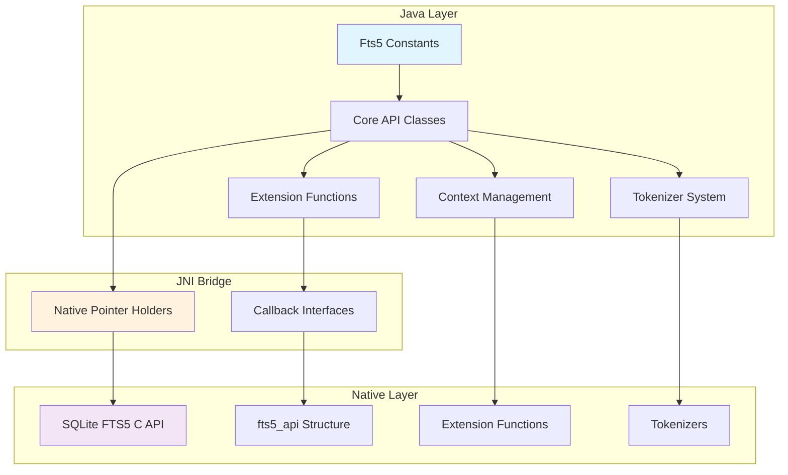
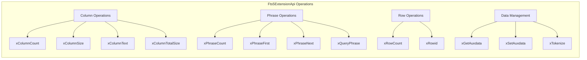
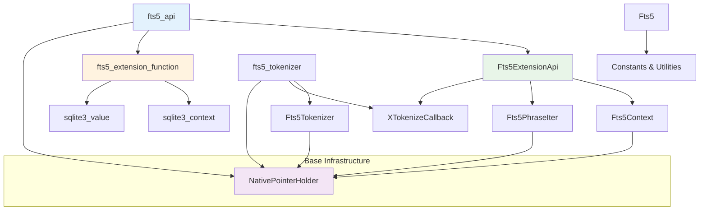
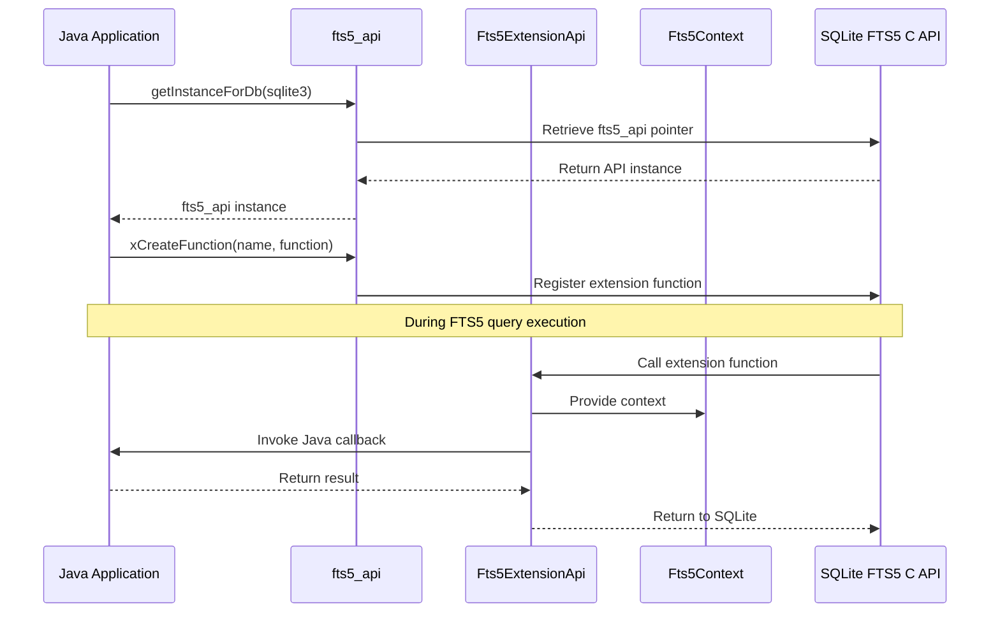

# JNI FTS5 Module Documentation

## Overview

The `jni_fts5` module provides Java Native Interface (JNI) bindings for SQLite's Full-Text Search 5 (FTS5) extension. This module enables Java applications to leverage SQLite's advanced full-text search capabilities through a comprehensive set of wrapper classes and interfaces that bridge the gap between Java and the native SQLite FTS5 C API.

The module is currently marked as **INCOMPLETE AND COMPLETELY UNTESTED** in several components, indicating it's in active development.

## Architecture

The jni_fts5 module follows a layered architecture that provides type-safe communication between Java and native C code:



## Core Components

### 1. Constants and Utilities (`Fts5`)

**Purpose**: Provides FTS5-specific constants and tokenization flags.

**Key Features**:
- Tokenization mode constants (`FTS5_TOKENIZE_*`)
- Token attribute flags (`FTS5_TOKEN_*`)
- Utility holder for shared FTS5 types

```java
// Tokenization modes
public static final int FTS5_TOKENIZE_QUERY    = 0x0001;
public static final int FTS5_TOKENIZE_PREFIX   = 0x0002;
public static final int FTS5_TOKENIZE_DOCUMENT = 0x0004;
public static final int FTS5_TOKENIZE_AUX      = 0x0008;

// Token attributes
public static final int FTS5_TOKEN_COLOCATED   = 0x0001;
```

### 2. Context Management (`Fts5Context`)

**Purpose**: Wraps C-level `Fts5Context*` instances for type-safe communication.

**Architecture**:
- Extends `NativePointerHolder<Fts5Context>`
- Provides context for FTS5 operations
- Used by extension functions and API calls

### 3. Extension API (`Fts5ExtensionApi`)

**Purpose**: Main interface to FTS5 extension functionality.

**Key Capabilities**:
- Column operations (count, size, text retrieval)
- Phrase analysis and iteration
- Row operations and metadata
- Auxiliary data management
- Tokenization services



### 4. Phrase Iteration (`Fts5PhraseIter`)

**Purpose**: Manages iteration over phrase matches in FTS5 results.

**Design**:
- Native-only modification and inspection
- Holds iteration state in native fields (`a`, `b`)
- Used with phrase navigation methods

### 5. Tokenizer System

#### `Fts5Tokenizer`
- Wraps C-level `Fts5Tokenizer*` instances
- Provides type-safe tokenizer communication
- Currently incomplete implementation

#### `fts5_tokenizer`
- Implements tokenizer interface
- Provides `xTokenize` method for text processing
- Bridges Java callbacks with native tokenization

#### `XTokenizeCallback`
- Callback interface for tokenization results
- Processes individual tokens with flags and positions

### 6. API Management (`fts5_api`)

**Purpose**: Main entry point for FTS5 API access and function registration.

**Key Methods**:
- `getInstanceForDb()`: Retrieves API instance for database
- `xCreateFunction()`: Registers custom FTS5 functions

### 7. Extension Functions (`fts5_extension_function`)

**Purpose**: Interface for creating custom FTS5 extension functions.

**Components**:
- Main interface with `call()` and `xDestroy()` methods
- Abstract base class for easier implementation
- Integration with SQLite function context

## Component Relationships



## Dependencies

The jni_fts5 module depends on several other modules:

### Core Dependencies
- **[jni_capi](jni_capi.md)**: Base JNI infrastructure
  - `NativePointerHolder`: Base class for native pointer management
  - `sqlite3_context`: SQL function execution context
  - `sqlite3_value`: SQL value representation
  - `sqlite3`: Database connection wrapper

### Utility Dependencies
- **[jni_core_api](jni_core_api.md)**: Core SQLite JNI functionality
- **[utility_infrastructure](utility_infrastructure.md)**: Output pointers and value holders

## Data Flow



## Integration Patterns

### 1. Extension Function Registration

```java
// Get FTS5 API instance
fts5_api api = fts5_api.getInstanceForDb(database);

// Create custom extension function
fts5_extension_function myFunction = new fts5_extension_function.Abstract() {
    @Override
    public void call(Fts5ExtensionApi ext, Fts5Context fCx,
                     sqlite3_context pCx, sqlite3_value argv[]) {
        // Implementation
    }
};

// Register the function
api.xCreateFunction("my_fts_function", myFunction);
```

### 2. Phrase Analysis

```java
// Within an extension function
int phraseCount = ext.xPhraseCount(fCx);
for (int i = 0; i < phraseCount; i++) {
    int phraseSize = ext.xPhraseSize(fCx, i);
    // Process phrase
}
```

### 3. Tokenization

```java
XTokenizeCallback callback = (tFlags, txt, iStart, iEnd) -> {
    // Process token
    return 0; // Continue tokenization
};

ext.xTokenize(context, textBytes, callback);
```

## Current Status and Limitations

### Implementation Status
- **Core API**: Partially implemented
- **Extension Functions**: Basic framework complete
- **Tokenizer System**: Incomplete implementation
- **Testing**: No tests currently available

### Known Limitations
1. Tokenizer creation and management not fully implemented
2. Some advanced FTS5 features may not be exposed
3. Error handling may be incomplete
4. Performance optimizations pending

### Future Development
- Complete tokenizer implementation
- Add comprehensive test coverage
- Implement missing FTS5 features
- Performance optimization
- Documentation and examples

## Error Handling

The module follows SQLite's error code conventions:
- Methods return integer result codes
- Success typically indicated by `SQLITE_OK` (0)
- Errors propagated through SQLite's standard error mechanism
- Context-specific error information available through SQLite APIs

## Thread Safety

- Native pointer holders are thread-safe for read operations
- FTS5 contexts are tied to specific database connections
- Extension functions should be stateless or properly synchronized
- Tokenizer instances may require synchronization depending on implementation

## Performance Considerations

1. **Native Transitions**: Minimize JNI boundary crossings
2. **Memory Management**: Proper cleanup of native resources
3. **Callback Efficiency**: Optimize tokenization callbacks
4. **Context Reuse**: Leverage context caching where appropriate

## See Also

- **[jni_capi](jni_capi.md)**: Core JNI infrastructure and base classes
- **[jni_core_api](jni_core_api.md)**: Main SQLite JNI functionality
- **[jni_functions](jni_functions.md)**: SQL function implementation framework
- **[jni_callbacks](jni_callbacks.md)**: Callback infrastructure