# JNI Functions Module

The JNI Functions module provides a comprehensive framework for implementing custom SQL functions in Java that can be registered and executed within SQLite databases through the JNI (Java Native Interface) binding. This module enables developers to extend SQLite's functionality by creating scalar, aggregate, and window functions in Java.

## Architecture Overview

The JNI Functions module is built around a hierarchical interface design that provides type-safe abstractions for different categories of SQL functions while managing the complex lifecycle and state requirements of user-defined functions (UDFs).

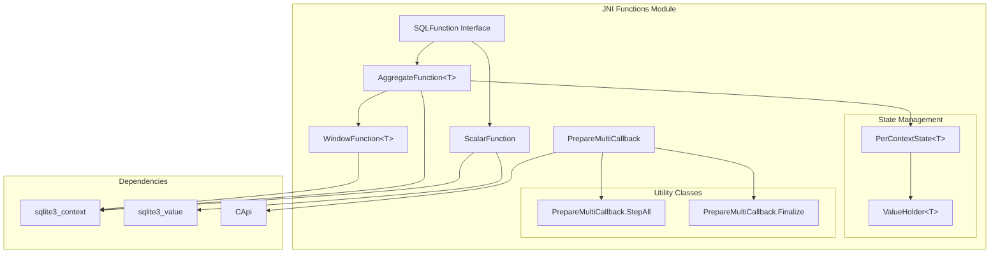

## Core Components

### SQLFunction Interface

The `SQLFunction` interface serves as the base marker interface for all user-defined functions. It provides a common type hierarchy that the JNI layer can recognize and process.

**Purpose:**
- Establishes a common contract for all UDF implementations
- Enables type-safe registration with SQLite through the JNI binding
- Provides a foundation for the three specialized function types

### ScalarFunction

`ScalarFunction` implements scalar SQL functions that take input parameters and return a single result value.

**Key Features:**
- Abstract `xFunc()` method for function implementation
- Optional `xDestroy()` method for cleanup operations
- Direct parameter access through `sqlite3_value[]`
- Result setting through `sqlite3_context`

**Lifecycle:**
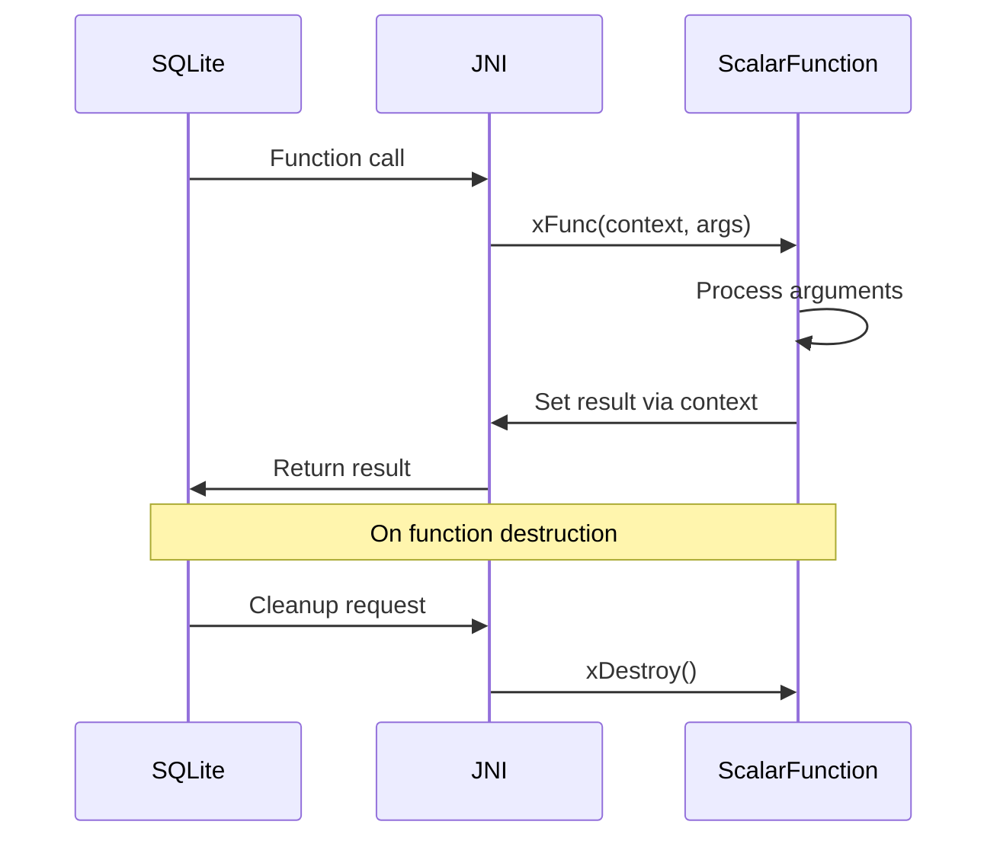

### AggregateFunction<T>

`AggregateFunction<T>` provides the foundation for aggregate functions that accumulate values across multiple rows and produce a single result.

**Key Components:**
- **Generic Type Parameter T**: Defines the accumulator state type
- **State Management**: Built-in `PerContextState<T>` for managing per-invocation state
- **Lifecycle Methods**: `xStep()`, `xFinal()`, and optional `xDestroy()`

**State Management Architecture:**
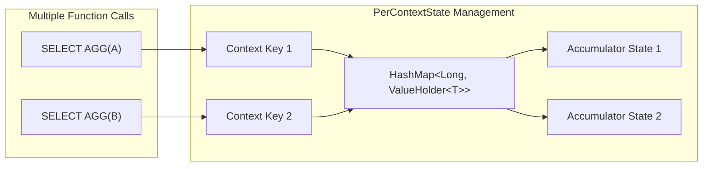

**Aggregate Function Lifecycle:**
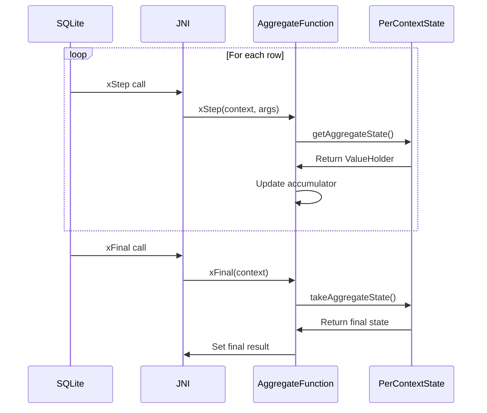

### WindowFunction<T>

`WindowFunction<T>` extends `AggregateFunction<T>` to support SQL window functions with additional `xInverse()` and `xValue()` methods for sliding window operations.

**Extended Capabilities:**
- **xInverse()**: Removes values from the window frame
- **xValue()**: Returns current window result without finalization
- **Sliding Window Support**: Efficient frame-based calculations

**Window Function Processing:**
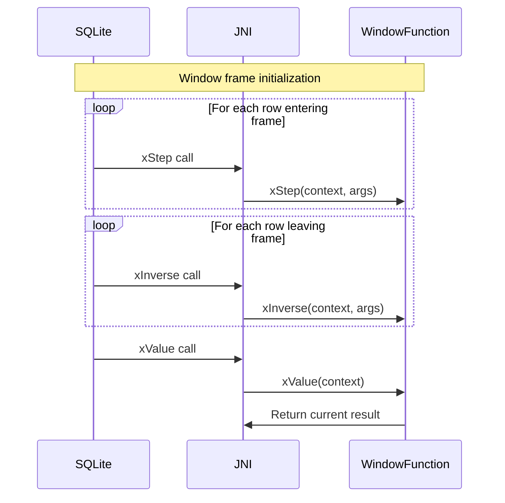

### PrepareMultiCallback

`PrepareMultiCallback` provides a framework for processing multiple SQL statements from a single input string, commonly used for batch SQL execution.

**Built-in Implementations:**
- **StepAll**: Executes statements completely, ignoring results
- **Finalize**: Wrapper that ensures statement cleanup

**Multi-Statement Processing Flow:**
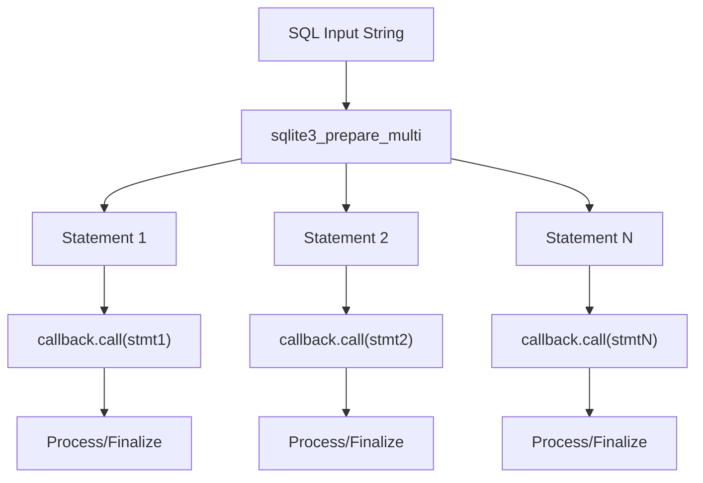

## State Management System

### PerContextState<T>

The `PerContextState<T>` class provides sophisticated state management for aggregate and window functions, handling the complex mapping between SQLite execution contexts and Java object state.

**Key Features:**
- **Context Mapping**: Maps `sqlite3_context` aggregate contexts to Java objects
- **Lifecycle Management**: Automatic cleanup of state mappings
- **Type Safety**: Generic type parameter ensures type-safe state handling
- **Concurrent Access**: Thread-safe state management

**State Lifecycle:**
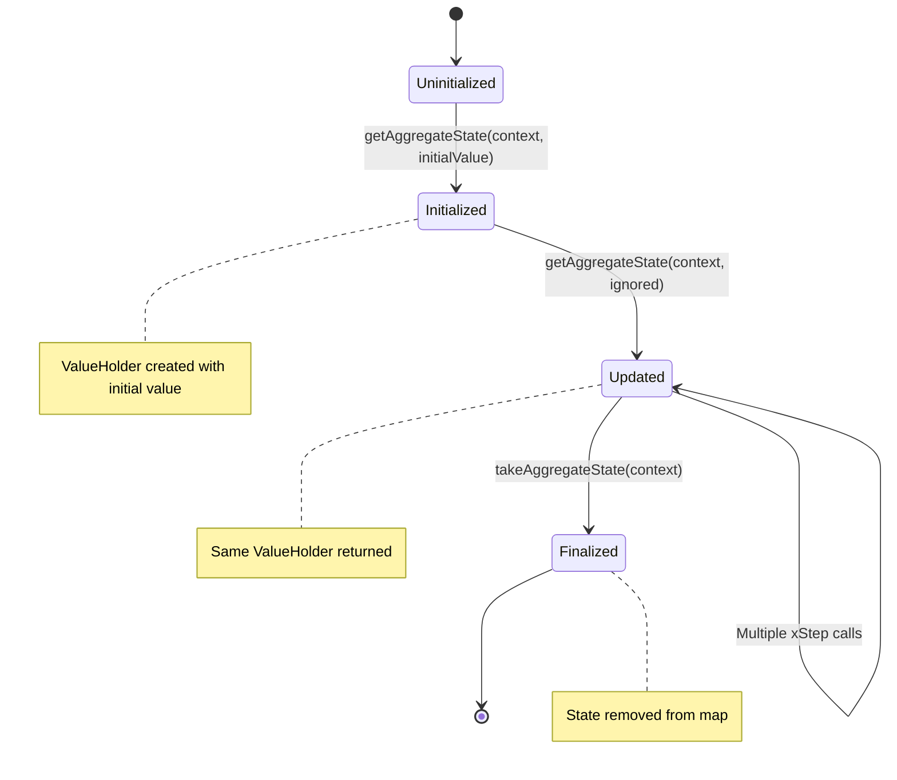

### ValueHolder<T>

`ValueHolder<T>` provides a simple container for mutable state that can be safely passed between method calls while maintaining reference semantics.

## Integration with Core Systems

### JNI CAPI Integration

The JNI Functions module integrates deeply with the [jni_capi](jni_capi.md) module for core SQLite operations:

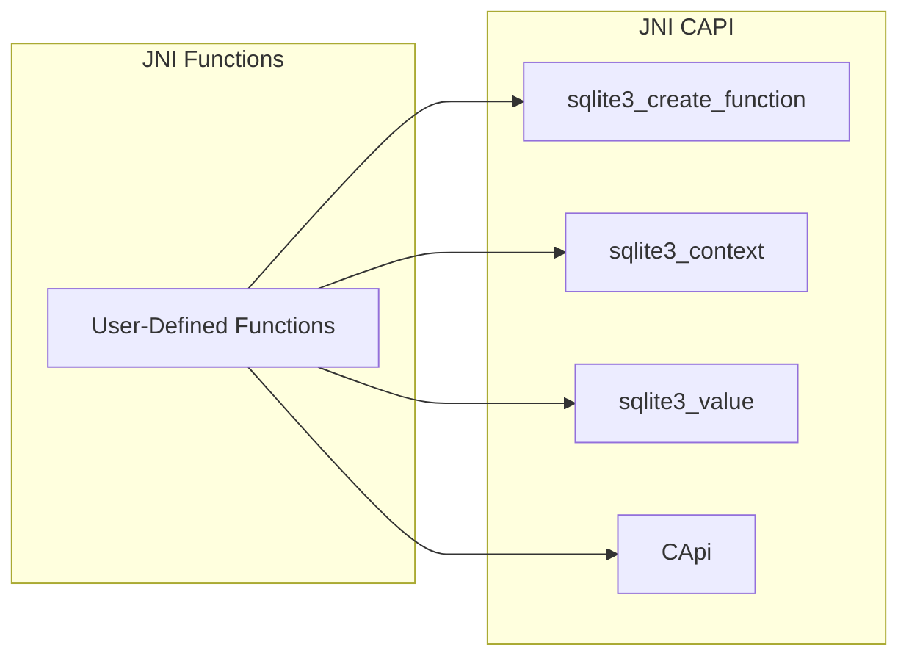

### Callback System Integration

The module leverages the [jni_callbacks](jni_callbacks.md) infrastructure for event-driven operations and lifecycle management.

## Function Registration and Execution

### Registration Process

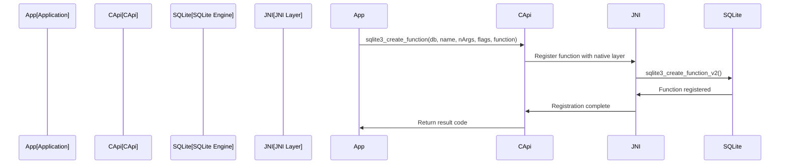

### Execution Flow

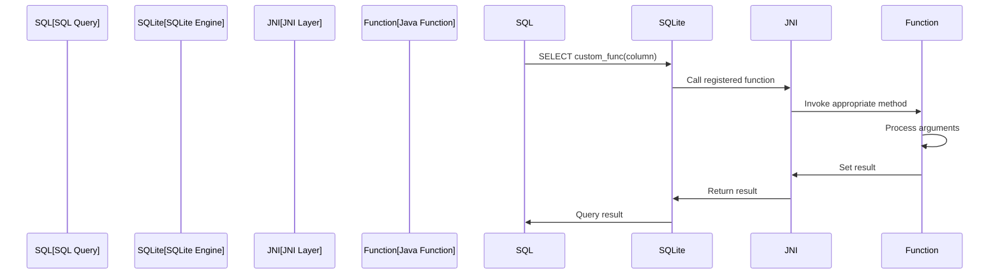

## Error Handling and Exception Management

The module provides comprehensive error handling that bridges Java exceptions with SQLite's C-style error reporting:

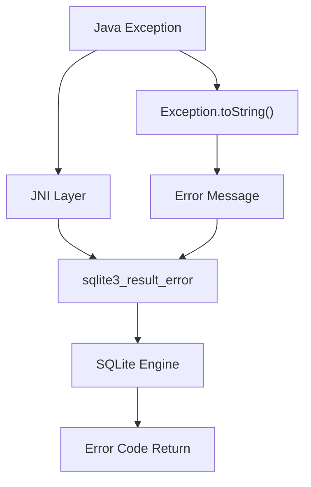

## Performance Considerations

### State Management Optimization

- **Lazy Initialization**: State objects created only when needed
- **Efficient Mapping**: HashMap-based context-to-state mapping
- **Memory Management**: Automatic cleanup prevents memory leaks

### JNI Overhead Mitigation

- **Batch Operations**: PrepareMultiCallback reduces JNI crossing overhead
- **Direct Memory Access**: Efficient parameter and result handling
- **Minimal Object Creation**: Reuse of context and value objects

## Usage Examples

### Scalar Function Implementation

```java
public class UpperCaseFunction extends ScalarFunction {
    @Override
    public void xFunc(sqlite3_context cx, sqlite3_value[] args) {
        if (args.length != 1) {
            sqlite3_result_error(cx, "upper() requires exactly 1 argument");
            return;
        }
        
        String input = sqlite3_value_text16(args[0]);
        if (input != null) {
            sqlite3_result_text(cx, input.toUpperCase());
        } else {
            sqlite3_result_null(cx);
        }
    }
}
```

### Aggregate Function Implementation

```java
public class SumFunction extends AggregateFunction<Double> {
    @Override
    public void xStep(sqlite3_context cx, sqlite3_value[] args) {
        ValueHolder<Double> state = getAggregateState(cx, 0.0);
        if (args.length > 0) {
            state.value += sqlite3_value_double(args[0]);
        }
    }
    
    @Override
    public void xFinal(sqlite3_context cx) {
        Double sum = takeAggregateState(cx);
        sqlite3_result_double(cx, sum != null ? sum : 0.0);
    }
}
```

## Security Considerations

- **Input Validation**: All function implementations should validate input parameters
- **Resource Management**: Proper cleanup through xDestroy() methods
- **Exception Handling**: Robust error handling prevents crashes
- **State Isolation**: Per-context state management prevents data leakage

## Future Enhancements

- **Performance Profiling**: Built-in performance monitoring for UDFs
- **Advanced State Management**: Support for more complex state patterns
- **Debugging Support**: Enhanced debugging capabilities for function development
- **Documentation Generation**: Automatic documentation from function annotations

The JNI Functions module represents a sophisticated bridge between Java's object-oriented programming model and SQLite's procedural function interface, providing developers with powerful tools for extending database functionality while maintaining performance and reliability.