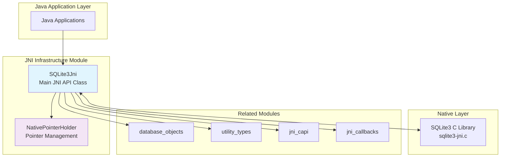
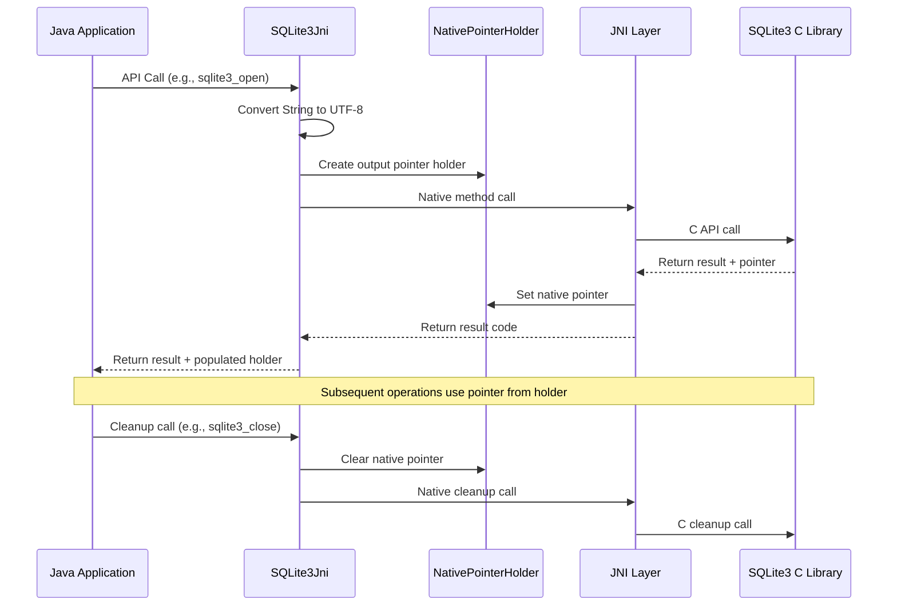
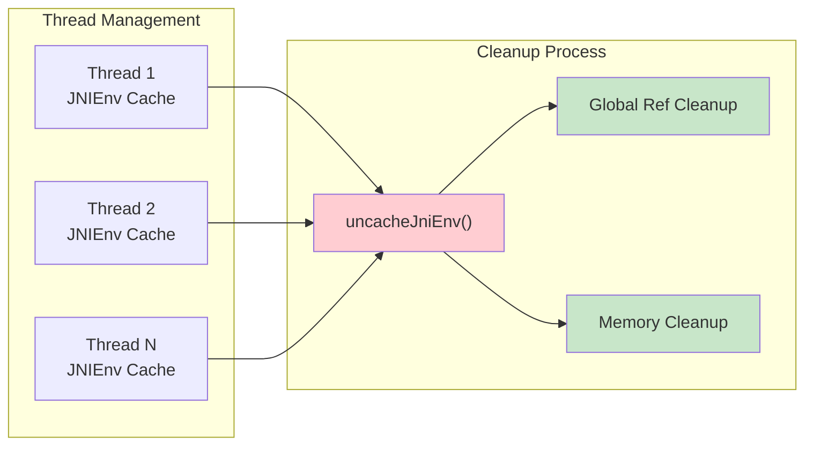

# JNI Infrastructure Module

## Overview

The JNI Infrastructure module forms the foundational layer of the SQLite3 JNI binding system, providing the core infrastructure for Java-to-C interoperability. This module contains the primary entry point (`SQLite3Jni`) and essential pointer management utilities (`NativePointerHolder`) that enable seamless communication between Java applications and the native SQLite3 C library.

## Architecture



## Core Components

### SQLite3Jni

The `SQLite3Jni` class serves as the primary interface for all SQLite3 JNI operations, providing:

#### Key Responsibilities
- **Native Library Loading**: Automatically loads the `sqlite3-jni` native library
- **API Binding**: Provides Java method signatures for all SQLite3 C API functions
- **String Encoding Management**: Handles UTF-8/UTF-16 conversions between Java and C
- **Memory Management**: Coordinates with native code for proper resource cleanup
- **Thread Safety**: Manages per-JNIEnv caching and cleanup

#### Critical Features

**UTF-8 Encoding Handling**
```java
// Proper UTF-8 conversion for C interop
public static int sqlite3_bind_parameter_index(
    @NotNull sqlite3_stmt stmt, @NotNull String paramName
){
    final byte[] utf8 = (paramName+"\0").getBytes(StandardCharsets.UTF_8);
    return sqlite3_bind_parameter_index(stmt, utf8);
}
```

**JNIEnv Management**
```java
/**
 * Cleans up cached per-JNIEnv information when thread terminates
 * Critical for preventing memory leaks in multi-threaded applications
 */
public static synchronized native boolean uncacheJniEnv();
```

**Auto-Extension Support**
```java
/**
 * Registers auto-extensions with recursion protection
 * Prevents infinite loops during database initialization
 */
public static synchronized native int sqlite3_auto_extension(@NotNull AutoExtension callback);
```

### NativePointerHolder

A generic utility class for safe pointer management between Java and native code:

#### Design Pattern
```java
public class NativePointerHolder<ContextType> {
    private volatile long nativePointer = 0;
    
    // Thread-safe pointer access
    public final long getNativePointer(){ return nativePointer; }
    
    // Safe pointer cleanup
    final long clearNativePointer() {
        final long rv = nativePointer;
        nativePointer = 0;
        return rv;
    }
}
```

#### Type Safety Features
- **Generic Context Type**: Provides compile-time type safety
- **Volatile Pointer Storage**: Ensures thread-safe access
- **Controlled Cleanup**: Prevents use-after-free scenarios

## Data Flow Architecture



## Integration Points

### With Database Objects Module
- Provides base infrastructure for `sqlite3`, `sqlite3_stmt`, and other core objects
- Manages pointer lifecycle for database handles and prepared statements

### With Utility Types Module
- Supplies `NativePointerHolder` as base class for `OutputPointer` implementations
- Enables type-safe pointer passing for various SQLite3 data types

### With JNI CAPI Module
- Serves as the implementation layer for C API bindings
- Provides the native method declarations that CAPI interfaces depend on

### With Callback System
- Manages callback registration and lifecycle
- Handles thread-local callback state and cleanup

## Thread Safety and Resource Management

### JNIEnv Caching Strategy


### Critical Cleanup Requirements
1. **Thread Termination**: Each thread must call `uncacheJniEnv()` before termination
2. **Database Closure**: All database handles must be properly closed
3. **Statement Finalization**: All prepared statements must be finalized
4. **Callback Cleanup**: All registered callbacks must be cleared

## Error Handling and Encoding

### UTF-8 vs Modified UTF-8 Considerations
The module addresses Java's Modified UTF-8 vs standard UTF-8 discrepancy:

```java
// Standard UTF-8 for SQLite compatibility
final byte[] utf8 = text.getBytes(StandardCharsets.UTF_8);

// Explicit NUL termination for C strings
final byte[] utf8 = (paramName+"\0").getBytes(StandardCharsets.UTF_8);
```

### Result Code Management
- Comprehensive SQLite3 result code constants
- Proper error propagation from C to Java
- Exception handling for Java-specific errors

## Performance Considerations

### Synchronization Strategy
- All native methods are `synchronized` to ensure thread safety
- Per-JNIEnv caching reduces overhead for repeated operations
- Efficient string conversion with minimal copying

### Memory Optimization
- Volatile pointer storage for thread-safe access without locks
- Controlled pointer lifecycle to prevent memory leaks
- Efficient byte array handling for large data transfers

## Usage Patterns

### Basic Database Operations
```java
// Database opening with proper resource management
OutputPointer.sqlite3 dbPtr = new OutputPointer.sqlite3();
int rc = SQLite3Jni.sqlite3_open("database.db", dbPtr);
if (rc == SQLite3Jni.SQLITE_OK) {
    sqlite3 db = dbPtr.get();
    // Use database...
    SQLite3Jni.sqlite3_close(db);
}
```

### Thread Cleanup
```java
// Proper thread termination
try {
    // Database operations...
} finally {
    SQLite3Jni.uncacheJniEnv(); // Clean up thread-local state
}
```

## Dependencies

### Internal Dependencies
- **Native Library**: `sqlite3-jni` shared library
- **Java Standard Library**: `java.nio.charset.StandardCharsets`
- **Annotations**: Custom `@NotNull` and `@Nullable` annotations

### Module Relationships
- **Parent Module**: [jni_core_api](jni_core_api.md)
- **Sibling Modules**: [database_objects](database_objects.md), [utility_types](utility_types.md)
- **Child Modules**: None (leaf module in infrastructure hierarchy)

## Configuration and Constants

### Compile-time Features
- Feature flags initialized at library startup (e.g., `SQLITE_ENABLE_FTS5`)
- SQLite3 limits synchronized with C compile-time values
- Version information from native library

### Runtime Configuration
- Thread-local JNIEnv management
- Auto-extension registration and cleanup
- Callback state management

## Best Practices

### Resource Management
1. Always call `uncacheJniEnv()` before thread termination
2. Close all database handles and finalize all statements
3. Clear all callbacks before application shutdown

### String Handling
1. Use `StandardCharsets.UTF_8` for all string conversions
2. Add explicit NUL termination for C string parameters
3. Handle encoding differences between Java and SQLite3

### Error Handling
1. Check result codes from all SQLite3 operations
2. Handle both SQLite3 errors and Java exceptions
3. Implement proper cleanup in error scenarios

This module serves as the critical foundation for all SQLite3 JNI operations, providing the essential infrastructure that enables safe, efficient, and reliable communication between Java applications and the SQLite3 C library.