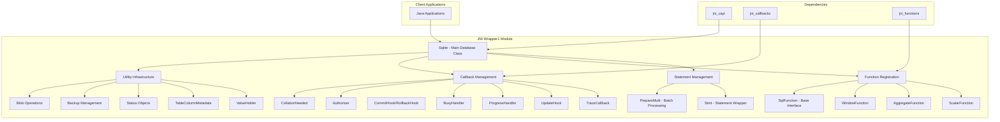
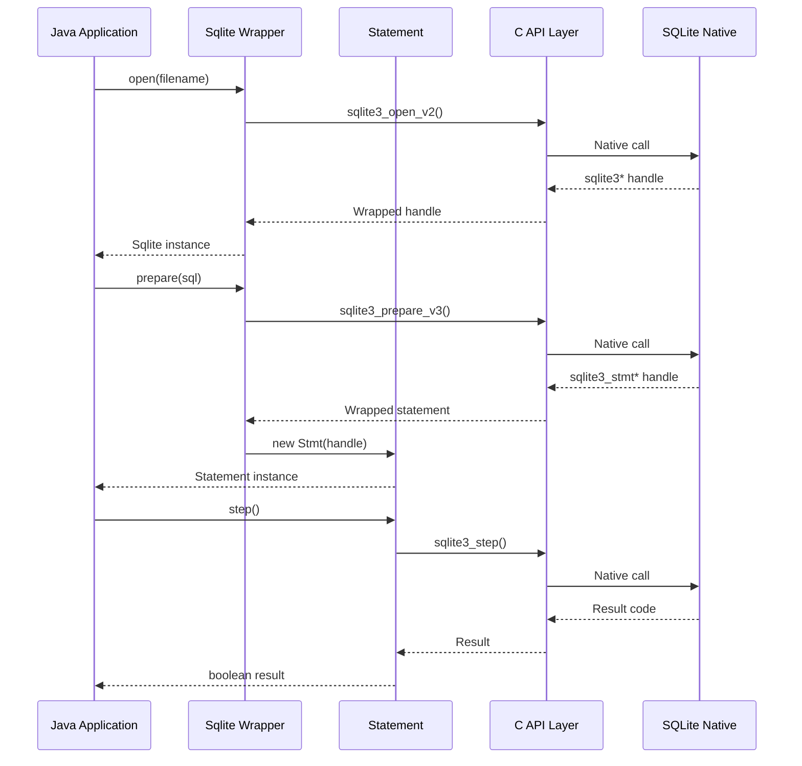

# JNI Wrapper1 Module Documentation

## Overview

The `jni_wrapper1` module provides a high-level, Java-friendly wrapper around SQLite's JNI interface. It serves as an abstraction layer that simplifies SQLite database operations while maintaining type safety and providing exception-based error handling. This module transforms the low-level C-style API into an object-oriented, Java-idiomatic interface.

## Purpose and Core Functionality

The jni_wrapper1 module acts as a bridge between Java applications and SQLite's native C library, offering:

- **Database Connection Management**: High-level database connection handling with automatic resource management
- **Statement Preparation and Execution**: Simplified SQL statement lifecycle management
- **User-Defined Functions**: Support for custom scalar, aggregate, and window functions
- **Callback Management**: Event-driven programming through various database hooks and callbacks
- **Type-Safe Operations**: Strong typing and exception handling for database operations
- **Resource Safety**: Automatic cleanup and proper resource management

## Architecture Overview

## Module Dependencies

The jni_wrapper1 module depends on several other modules in the SQLite JNI ecosystem:

- **[jni_capi](jni_capi.md)**: Provides the low-level C API bindings and core database objects
- **[jni_callbacks](jni_callbacks.md)**: Supplies callback infrastructure for event handling
- **[jni_functions](jni_functions.md)**: Offers user-defined function support and management

## Sub-Module Documentation

- **[Database Operations](database_operations.md)**: Detailed documentation on core database management, statement handling, and transaction control.
- **[Function System](function_system.md)**: Comprehensive guide to creating and managing user-defined scalar, aggregate, and window functions.
- **[Callback Infrastructure](callback_infrastructure.md)**: In-depth explanation of the event-driven callback and hook mechanisms.
- **[Utility Infrastructure](utility_infrastructure.md)**: Information on utility classes and configuration helpers.

## Sub-Module Architecture

The jni_wrapper1 module is organized into several logical sub-modules based on functionality:

### Database Operations
- **Core Database Management**: Connection handling, configuration, and lifecycle management
- **Statement Operations**: SQL preparation, execution, and result handling
- **Transaction Management**: Commit/rollback hooks and transaction state monitoring

### Function System
- **User-Defined Functions**: Support for custom scalar, aggregate, and window functions
- **Function Adapters**: Bridge between Java function implementations and C API
- **Function Arguments**: Type-safe argument handling and result setting

### Callback Infrastructure
- **Event Hooks**: Database event monitoring and handling
- **Progress Monitoring**: Long-running operation progress tracking
- **Authorization**: Security and access control callbacks

### Utility Components
- **Resource Management**: Automatic cleanup and resource tracking
- **Type Safety**: Strong typing and validation
- **Error Handling**: Exception-based error reporting

## Data Flow Architecture

## Key Components

### Core Database Class (Sqlite)
The main entry point providing:
- Database connection management
- SQL statement preparation
- Configuration and status operations
- Hook and callback registration
- Resource lifecycle management

### Statement Management (Stmt)
Handles SQL statement operations:
- Parameter binding with type safety
- Result column access
- Statement lifecycle management
- Batch processing support

### Function System
Supports custom SQL functions:
- **ScalarFunction**: Simple input-output functions
- **AggregateFunction**: Functions that accumulate data across rows
- **WindowFunction**: Advanced windowing functions with frame support

### Callback Infrastructure
Event-driven programming support:
- Database modification hooks
- Progress monitoring
- Authorization callbacks
- Collation management

## Integration Points

The jni_wrapper1 module integrates with:

1. **Lower-level APIs**: Built on top of jni_capi for native SQLite access
2. **Callback Systems**: Uses jni_callbacks for event handling infrastructure
3. **Function Framework**: Leverages jni_functions for UDF support
4. **Java Applications**: Provides the primary interface for Java SQLite usage

## Error Handling Strategy

The module implements comprehensive error handling:
- **Exception Translation**: Converts SQLite error codes to Java exceptions
- **Resource Safety**: Ensures proper cleanup even during error conditions
- **Type Validation**: Prevents common usage errors through compile-time checks
- **Graceful Degradation**: Handles edge cases and provides meaningful error messages

## Performance Considerations

- **Resource Pooling**: Efficient management of native resources
- **Lazy Initialization**: Components are created only when needed
- **Batch Operations**: Support for bulk operations to reduce JNI overhead
- **Memory Management**: Careful handling of native memory and Java object lifecycle

This module serves as the primary interface for Java applications needing SQLite database functionality, providing a clean, type-safe, and feature-rich API that abstracts away the complexities of the underlying C library while maintaining high performance and reliability.