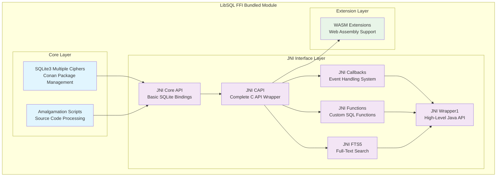
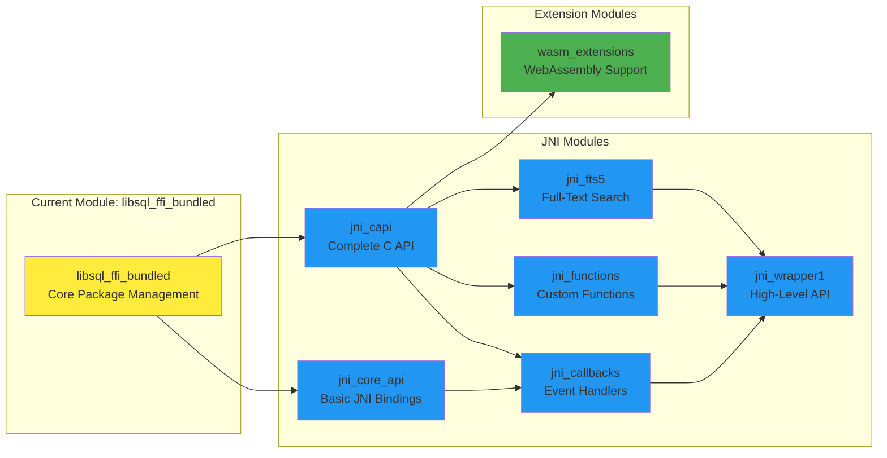
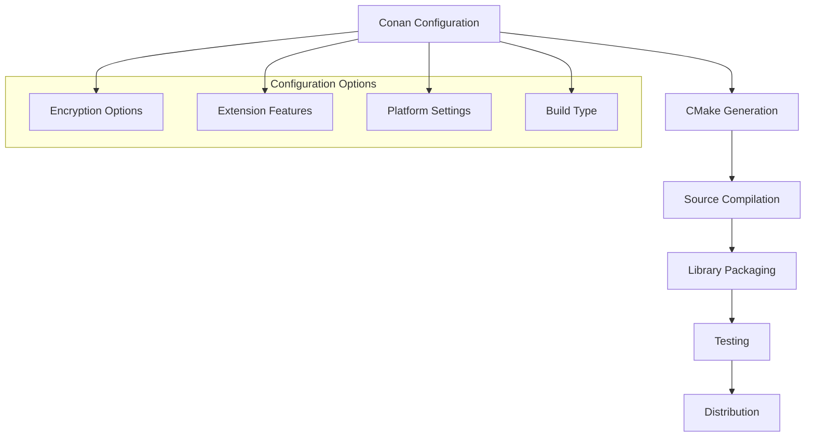
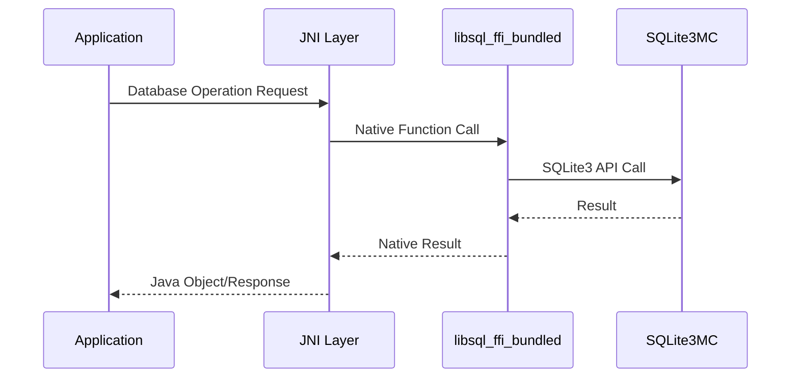

# LibSQL FFI Bundled Module Documentation

## Overview

The `libsql_ffi_bundled` module serves as the foundational layer for LibSQL's Foreign Function Interface (FFI) implementation, providing a comprehensive SQLite3 Multiple Ciphers integration with extensive JNI (Java Native Interface) bindings and WebAssembly (WASM) extensions. This module acts as the bridge between native SQLite functionality and higher-level language bindings, enabling secure database operations with multiple encryption cipher support.

## Purpose and Core Functionality

The module's primary purpose is to:

- **Provide SQLite3 Multiple Ciphers Integration**: Bundle and configure SQLite3 with multiple encryption cipher support through the SQLite3MultipleCiphers library
- **Enable Cross-Platform Database Access**: Support database operations across Java (via JNI), WebAssembly, and native environments
- **Facilitate Secure Database Operations**: Implement comprehensive encryption and security features for database storage
- **Offer Extensible Architecture**: Provide a modular system for extending SQLite functionality with custom functions, callbacks, and virtual tables

## Architecture Overview

The module follows a layered architecture with clear separation of concerns:

## Module Dependencies and Relationships

## Sub-Module Documentation

### Core Components

The libsql_ffi_bundled module contains essential components for package management and source code processing:

#### SQLite3 Multiple Ciphers Package Management
- **Conan Integration**: Provides comprehensive package management for SQLite3 Multiple Ciphers library
- **Build Configuration**: Extensive configuration options for encryption, extensions, and platform-specific features
- **Testing Framework**: Automated testing infrastructure for package validation

#### Source Code Amalgamation
- **Code Processing**: Advanced C/C++ source code amalgamation and preprocessing
- **Include Management**: Intelligent header file inclusion and dependency resolution
- **Build Optimization**: Source code optimization for distribution and deployment

### JNI Interface Modules

The module integrates with several JNI-based modules that provide Java bindings:

- **[JNI Core API](jni_core_api.md)**: Basic SQLite JNI bindings and core data structures
- **[JNI CAPI](jni_capi.md)**: Complete C API wrapper with comprehensive SQLite functionality
- **[JNI Callbacks](jni_callbacks.md)**: Event handling and callback management system
- **[JNI Functions](jni_functions.md)**: Custom SQL function implementation framework
- **[JNI FTS5](jni_fts5.md)**: Full-text search capabilities and tokenization
- **[JNI Wrapper1](jni_wrapper1.md)**: High-level Java API with simplified interfaces

### Extension Modules

- **[WASM Extensions](wasm_extensions.md)**: WebAssembly support for browser-based database operations

## Key Features

### Encryption and Security
- **Multiple Cipher Support**: AES, ChaCha20, RC4, and other encryption algorithms
- **Legacy Compatibility**: Support for SQLCipher and SQLeet legacy formats
- **Secure Memory Management**: Optional secure memory allocation and cleanup
- **Hardware Acceleration**: Optional AES hardware acceleration support

### Extensibility
- **Custom Functions**: Support for scalar, aggregate, and window functions
- **Virtual Tables**: Extensible virtual table implementations
- **Full-Text Search**: Advanced FTS5 integration with custom tokenizers
- **Callback System**: Comprehensive event handling and hooks

### Cross-Platform Support
- **Multi-Platform Builds**: Windows, Linux, macOS support
- **WebAssembly**: Browser-based database operations
- **Java Integration**: Complete JNI bindings for Java applications
- **Package Management**: Conan-based dependency management

## Build and Configuration

The module uses Conan for package management with extensive configuration options:

### Major Configuration Categories

1. **Core SQLite Features**: FTS, JSON, R-Tree, virtual tables
2. **Encryption Options**: Multiple cipher support, legacy compatibility
3. **Extension Modules**: Compression, file I/O, regular expressions
4. **Platform Specific**: Threading, memory management, hardware acceleration
5. **Development Tools**: Debug support, shell utilities, testing frameworks

## Integration Points

The module serves as the foundation for the entire LibSQL FFI ecosystem:

## Performance Considerations

- **Amalgamated Source**: Single-file distribution for optimal compilation
- **Hardware Acceleration**: Optional AES hardware support for encryption
- **Memory Management**: Configurable memory allocation strategies
- **Build Optimization**: Platform-specific optimizations and static linking options

## Security Features

- **Encryption at Rest**: Multiple cipher algorithms for database encryption
- **Secure Memory**: Optional secure memory allocation and cleanup
- **Authentication**: User authentication and authorization support
- **Audit Trail**: Comprehensive logging and monitoring capabilities

This module forms the cornerstone of LibSQL's FFI implementation, providing the essential infrastructure for secure, cross-platform database operations with extensive language binding support.