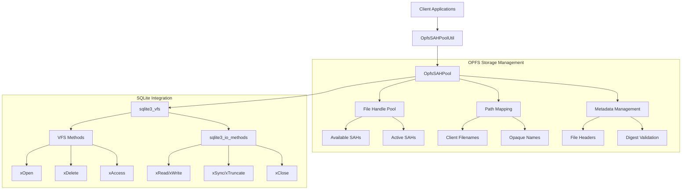
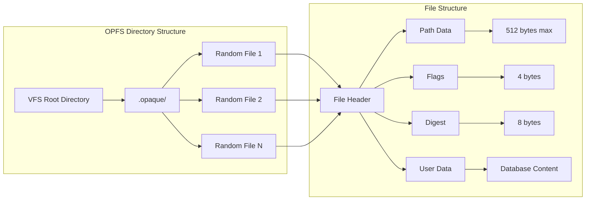
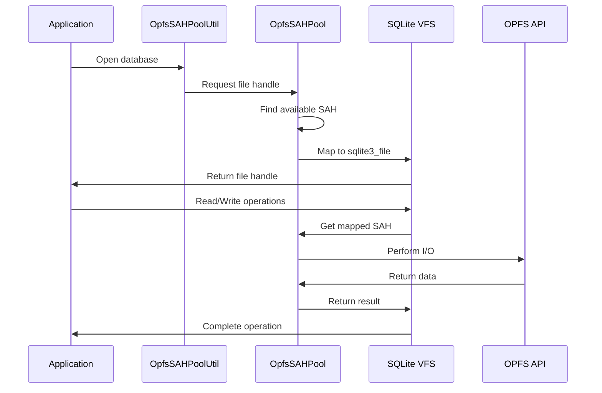
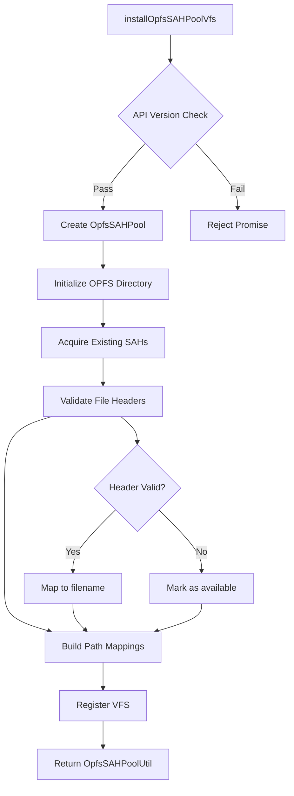

# OPFS Storage Management Module

## Overview

The OPFS Storage Management module provides a sophisticated SQLite Virtual File System (VFS) implementation that leverages the Origin Private File System (OPFS) with SyncAccessHandle (SAH) pooling for efficient database storage in web browsers. This module enables synchronous database operations in web environments without requiring SharedArrayBuffer or COOP/COEP headers.

## Core Architecture

The module implements a pool-based approach to OPFS file management, maintaining a fixed number of pre-opened file handles to avoid the synchronization challenges inherent in the OPFS API. This design enables SQLite's synchronous C API to work seamlessly with the partially-asynchronous OPFS interface.



## Core Components

### OpfsSAHPool

The central class managing OPFS storage operations and file handle pooling.

**Key Responsibilities:**
- Maintains a pool of pre-opened SyncAccessHandle objects
- Maps client-specified filenames to opaque OPFS files
- Handles file metadata and validation
- Provides synchronous file operations for SQLite

**Core Features:**
- **Pool Management**: Fixed-capacity pool of SAH objects
- **Path Association**: Maps logical filenames to physical OPFS files
- **Metadata Storage**: File headers with path, flags, and validation digest
- **Error Handling**: Comprehensive error tracking and recovery

### OpfsSAHPoolUtil

A utility interface that provides controlled access to OpfsSAHPool functionality.

**Public API Methods:**
- `addCapacity(n)`: Expand pool capacity
- `reduceCapacity(n)`: Reduce pool size
- `exportFile(name)`: Extract file contents
- `importDb(name, bytes)`: Import database files
- `getCapacity()`: Query current pool size
- `getFileCount()`: Count active files

## File System Architecture



### File Header Format

Each OPFS file contains a standardized header:

| Offset | Size | Content |
|--------|------|---------|
| 0 | 512 bytes | Client file path (null-terminated) |
| 512 | 4 bytes | SQLite open flags |
| 516 | 8 bytes | Validation digest |
| 4096 | Variable | Actual file data |

## VFS Integration

The module implements the complete SQLite VFS interface, providing:

### VFS Methods
- **xOpen**: File opening with pool allocation
- **xDelete**: File deletion and pool deallocation  
- **xAccess**: File existence checking
- **xFullPathname**: Path normalization
- **xGetLastError**: Error reporting

### I/O Methods
- **xRead/xWrite**: Data transfer operations
- **xTruncate**: File size management
- **xSync**: Data persistence
- **xLock/xUnlock**: Locking operations (no-op implementation)
- **xFileSize**: Size queries

## Data Flow



## Initialization Process



## Configuration Options

The module supports extensive configuration through the installation options:

```javascript
{
  name: 'opfs-sahpool',           // VFS registration name
  directory: '.opfs-sahpool',     // OPFS storage directory
  initialCapacity: 6,             // Initial pool size
  clearOnInit: false,             // Clear existing data
  verbosity: 2                    // Logging level
}
```

## Error Handling

The module implements comprehensive error handling:

- **Pool Exhaustion**: Graceful handling when no SAHs available
- **I/O Errors**: Proper SQLite error code mapping
- **Validation Failures**: Digest mismatch detection and recovery
- **Concurrency Issues**: Handle locking conflicts between tabs

## Performance Characteristics

### Advantages
- **Synchronous Operations**: No async/await overhead in I/O path
- **No SharedArrayBuffer**: Works without COOP/COEP headers
- **Persistent Storage**: Data survives page reloads
- **Efficient Pooling**: Reuses file handles to minimize OPFS overhead

### Limitations
- **Fixed Capacity**: Pool size must be predetermined
- **No Concurrency**: Single-tab access per VFS instance
- **Browser Support**: Requires modern OPFS SAH APIs (Chrome 108+)

## Integration with Other Modules

This module integrates with several other components in the system:

- **[jni_core_api](jni_core_api.md)**: Provides JNI bindings for Java integration
- **[jni_capi](jni_capi.md)**: Core C API wrappers for JNI
- **[wasm_extensions](wasm_extensions.md)**: Parent module containing WASM-specific extensions
- **[development_utilities](development_utilities.md)**: Sibling module with development tools

## Usage Examples

### Basic Initialization
```javascript
const poolUtil = await sqlite3.installOpfsSAHPoolVfs({
  initialCapacity: 10,
  clearOnInit: false
});
```

### Database Operations
```javascript
// Import a database
const dbBytes = new Uint8Array(/* database content */);
poolUtil.importDb('mydb.sqlite', dbBytes);

// Export a database
const exportedBytes = poolUtil.exportFile('mydb.sqlite');
```

### Pool Management
```javascript
// Expand capacity
await poolUtil.addCapacity(5);

// Check current status
console.log(`Capacity: ${poolUtil.getCapacity()}`);
console.log(`Files: ${poolUtil.getFileCount()}`);
```

## Security Considerations

- **Origin Isolation**: Each origin has separate OPFS storage
- **Path Validation**: Prevents directory traversal attacks
- **Digest Verification**: Ensures file integrity
- **Cleanup Procedures**: Removes temporary and invalid files

## Browser Compatibility

- **Chrome 108+**: Full support with stable SAH APIs
- **Safari 16.4+**: Supported (unlike the alternative "opfs" VFS)
- **Firefox**: Support depends on OPFS SAH implementation

## Future Enhancements

Potential areas for improvement:
- Dynamic pool resizing based on usage patterns
- Multi-tab coordination mechanisms
- Enhanced error recovery strategies
- Performance optimizations for large databases

---

*This module represents a sophisticated approach to web-based database storage, bridging the gap between SQLite's synchronous requirements and the web platform's asynchronous storage APIs.*