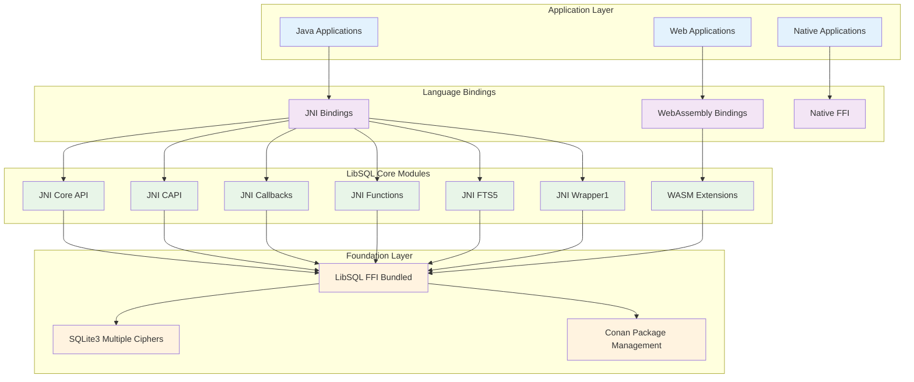
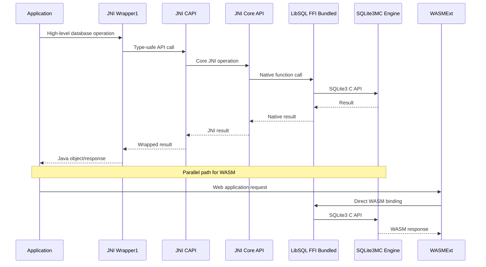
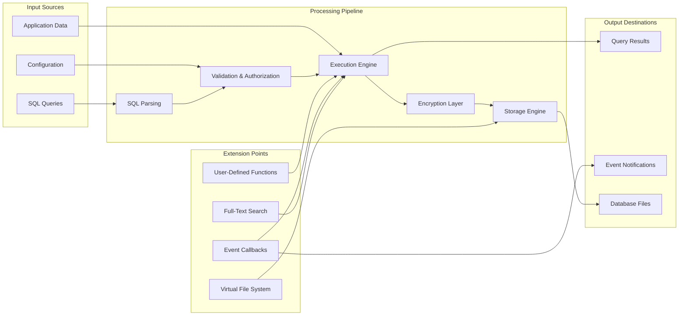
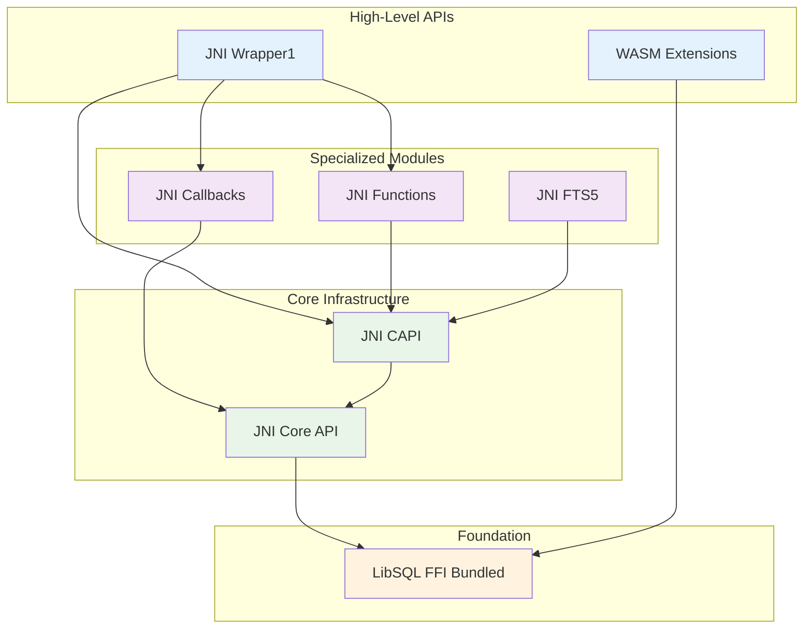
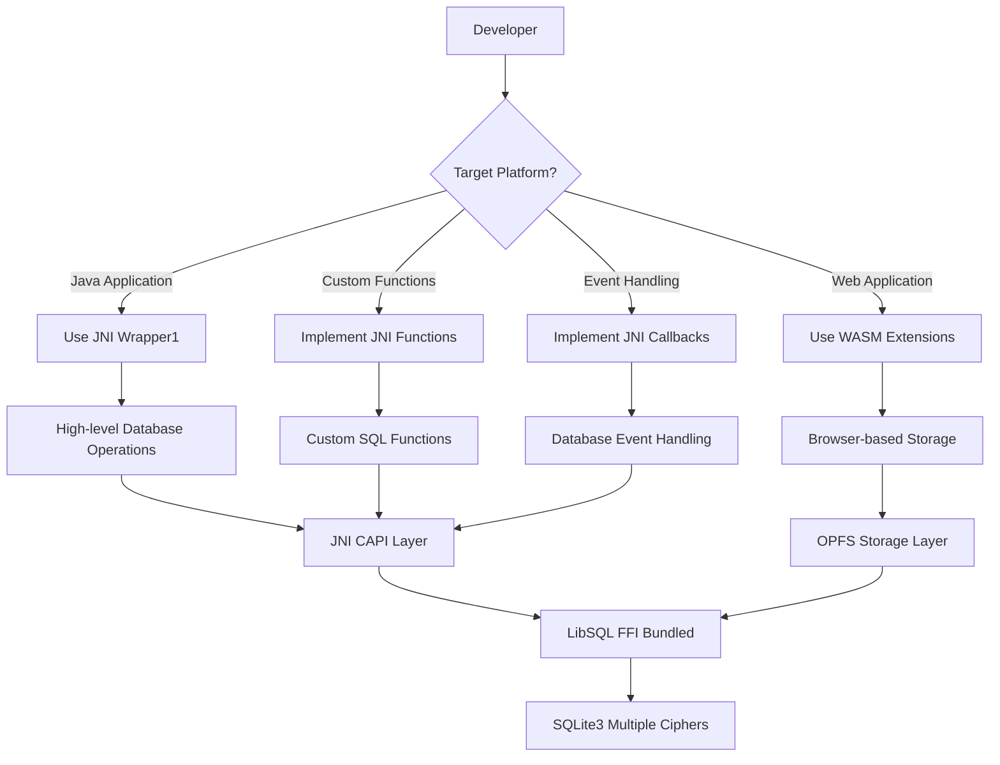

# LibSQL Repository Overview

## Purpose

The `tursodatabase--libsql` repository is a comprehensive SQLite-compatible database engine that extends SQLite with modern features while maintaining full compatibility. LibSQL serves as the foundation for Turso's distributed database platform, providing enhanced functionality through multiple language bindings, WebAssembly support, and advanced security features including multiple encryption ciphers.

The repository's primary goals are to:
- Provide a drop-in replacement for SQLite with enhanced capabilities
- Enable cross-platform database operations across Java, WebAssembly, and native environments
- Implement comprehensive encryption and security features for database storage
- Offer extensible architecture for custom functions, callbacks, and virtual tables
- Support modern web development through WebAssembly bindings and OPFS storage

## End-to-End Architecture

### High-Level System Architecture

### Module Interaction Flow

### Data Flow Architecture

## Core Modules Documentation

### Foundation Layer

#### [LibSQL FFI Bundled](libsql_ffi_bundled.md)
The foundational module providing SQLite3 Multiple Ciphers integration with comprehensive package management and cross-platform support. This module serves as the bridge between native SQLite functionality and higher-level language bindings.

**Key Features:**
- SQLite3 Multiple Ciphers integration with AES, ChaCha20, RC4 encryption
- Conan-based package management system
- Cross-platform build support (Windows, Linux, macOS)
- Source code amalgamation and optimization
- Hardware acceleration support for encryption

### JNI Binding Modules

#### [JNI Core API](jni_core_api.md)
Primary Java Native Interface bridge providing fundamental database interaction components and type-safe wrappers for SQLite3 operations.

**Key Components:**
- `sqlite3`: Database connection wrapper with resource management
- `sqlite3_stmt`: Prepared statement wrapper for SQL execution
- `sqlite3_value`: SQL value representation for data exchange
- `SQLite3Jni`: Central JNI method declarations and constants
- `OutputPointer`: Type-safe output parameter handling

#### [JNI CAPI](jni_capi.md)
Comprehensive C API bindings providing complete SQLite3 functionality through Java interfaces with advanced features like BLOB handling and backup operations.

**Key Components:**
- `CApi`: Central API hub with complete SQLite3 C API coverage
- `sqlite3_backup`: Incremental database backup operations
- `sqlite3_blob`: Direct binary large object I/O operations
- `NativePointerHolder`: Base class for native pointer management
- `TableColumnMetadata`: Database schema information container

#### [JNI Callbacks](jni_callbacks.md)
Event-driven callback system enabling Java applications to respond to database events through a comprehensive set of specialized callback interfaces.

**Key Components:**
- `AuthorizerCallback`: Controls access to database operations
- `CommitHookCallback` / `RollbackHookCallback`: Transaction monitoring
- `UpdateHookCallback`: Data modification tracking
- `TraceV2Callback`: Comprehensive operation tracing
- `CollationCallback`: Custom string comparison logic

#### [JNI Functions](jni_functions.md)
Framework for implementing custom SQL functions in Java, supporting scalar, aggregate, and window functions with sophisticated state management.

**Key Components:**
- `ScalarFunction`: Simple input-output functions
- `AggregateFunction<T>`: Functions that accumulate data across rows
- `WindowFunction<T>`: Advanced windowing functions with frame support
- `PerContextState<T>`: Sophisticated state management for aggregate functions
- `PrepareMultiCallback`: Multi-statement processing framework

#### [JNI FTS5](jni_fts5.md)
Full-Text Search 5 (FTS5) extension bindings providing advanced search capabilities through Java interfaces (currently in development).

**Key Components:**
- `Fts5ExtensionApi`: Main interface to FTS5 extension functionality
- `fts5_extension_function`: Interface for creating custom FTS5 functions
- `Fts5Tokenizer`: Custom tokenization support
- `XTokenizeCallback`: Callback interface for tokenization results

#### [JNI Wrapper1](jni_wrapper1.md)
High-level, Java-friendly wrapper providing simplified database operations with exception-based error handling and automatic resource management.

**Key Components:**
- `Sqlite`: Main database class with connection management
- `Stmt`: Statement wrapper with type-safe parameter binding
- Enhanced function registration and callback management
- Simplified API for common database operations

### WebAssembly Extensions

#### [WASM Extensions](wasm_extensions.md)
WebAssembly-specific extensions enabling SQLite to run efficiently in web browsers with persistent storage through modern web APIs.

**Key Components:**
- `OpfsSAHPool`: High-performance VFS using OPFS SyncAccessHandle Pool
- `OpfsSAHPoolUtil`: Client-facing utility interface for pool management
- `COOPCOEPHandler`: Development server with proper security headers
- Browser compatibility layer for Chrome, Safari, and Firefox

## Integration Patterns

### Cross-Module Dependencies

### Development Workflow

## Key Features Summary

### Security and Encryption
- Multiple encryption cipher support (AES, ChaCha20, RC4)
- Hardware acceleration for encryption operations
- User authentication and authorization
- Secure memory management

### Cross-Platform Support
- Java applications through comprehensive JNI bindings
- Web browsers through WebAssembly and OPFS storage
- Native applications through direct FFI
- Multiple operating systems (Windows, Linux, macOS)

### Extensibility
- User-defined scalar, aggregate, and window functions
- Custom callback system for database events
- Virtual file system extensions
- Full-text search with custom tokenizers

### Performance Optimization
- Amalgamated source distribution
- Hardware acceleration support
- Efficient memory management
- Optimized JNI and WASM bindings

### Developer Experience
- Type-safe APIs with comprehensive error handling
- Automatic resource management
- Extensive documentation and examples
- Development tools and utilities

This repository represents a comprehensive database solution that extends SQLite's capabilities while maintaining compatibility, providing developers with powerful tools for building modern applications across multiple platforms and environments.