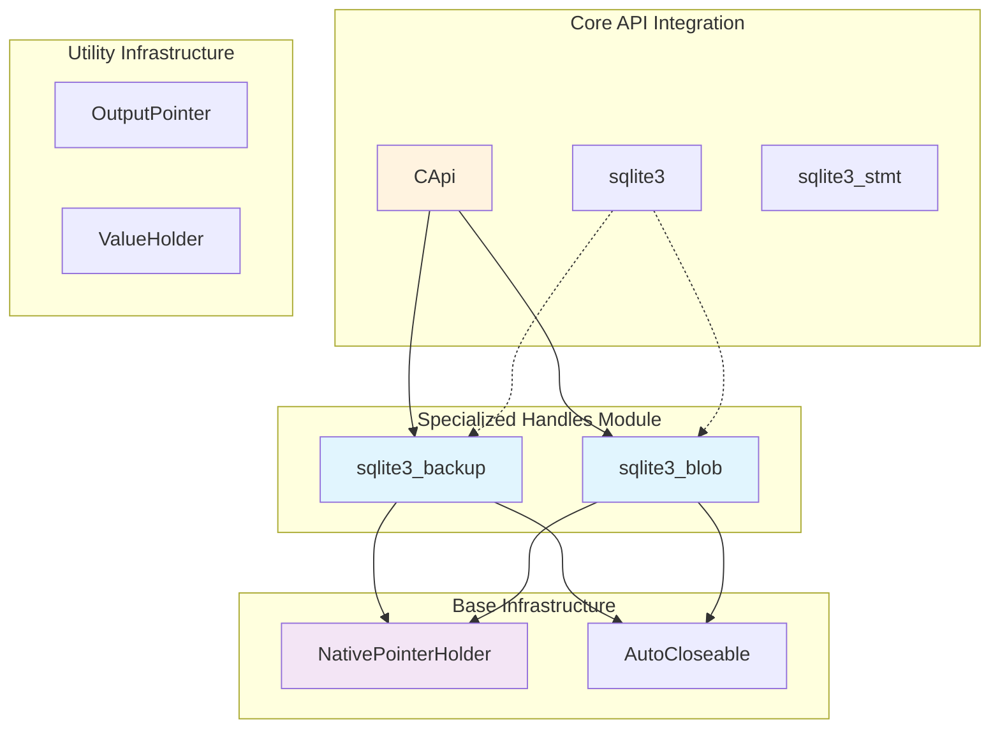
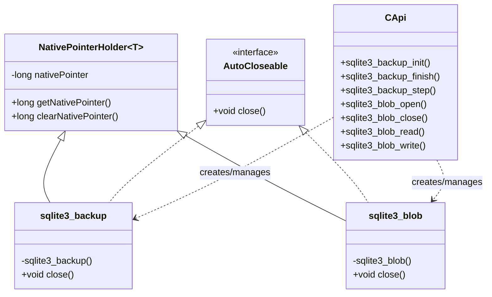
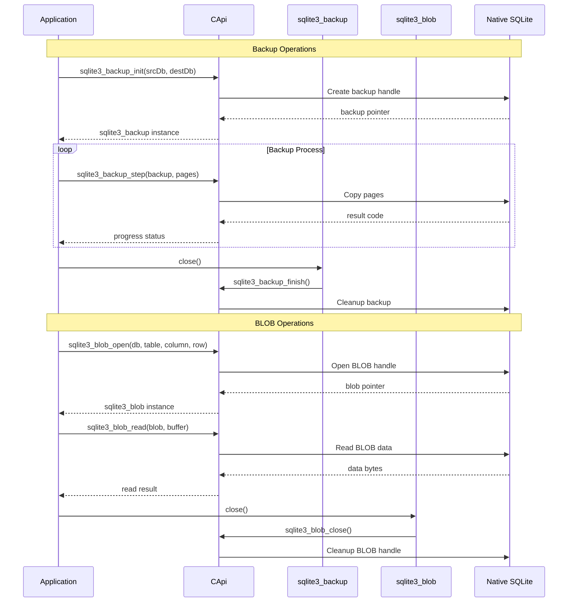

# Specialized Handles Module

## Overview

The specialized_handles module provides Java wrappers for specialized SQLite C API handles that manage specific database operations beyond basic database connections and statements. This module contains two core components that handle backup operations and BLOB (Binary Large Object) access, providing type-safe Java interfaces for these specialized SQLite features.

## Core Components

### sqlite3_backup
A wrapper class for SQLite backup operations that provides a Java interface to the C-level `sqlite3_backup*` handle. This class enables database backup and restore functionality with automatic resource management.

### sqlite3_blob
A wrapper class for SQLite BLOB operations that provides a Java interface to the C-level `sqlite3_blob*` handle. This class enables direct access to BLOB data stored in database tables without loading the entire BLOB into memory.

## Architecture



## Component Relationships



## Data Flow



## Key Features

### Backup Operations (sqlite3_backup)
- **Database Backup**: Complete database backup from source to destination
- **Incremental Backup**: Page-by-page backup with progress monitoring
- **Cross-Database**: Backup between different database connections
- **Resource Management**: Automatic cleanup via AutoCloseable interface

### BLOB Operations (sqlite3_blob)
- **Direct Access**: Read/write BLOB data without loading entire content
- **Streaming**: Efficient handling of large binary data
- **Random Access**: Read/write at specific offsets within BLOBs
- **Memory Efficient**: Minimal memory footprint for large BLOBs

## Integration Points

### With Core Database Objects
- **sqlite3**: Source and destination databases for backup operations
- **Database Tables**: Target tables and columns for BLOB access
- **Row Identification**: Specific row targeting for BLOB operations

### With Utility Infrastructure
- **OutputPointer**: Used for returning specialized handles from API calls
- **NativePointerHolder**: Base class providing native pointer management
- **AutoCloseable**: Ensures proper resource cleanup

### With JNI C API
- **CApi**: Provides all native method implementations
- **Native Bindings**: Direct mapping to SQLite C API functions
- **Memory Management**: Proper cleanup of native resources

## Usage Patterns

### Backup Operations
```java
// Initialize backup
sqlite3_backup backup = CApi.sqlite3_backup_init(
    destDb, "main", srcDb, "main"
);

// Perform incremental backup
int rc;
do {
    rc = CApi.sqlite3_backup_step(backup, 5); // 5 pages at a time
    // Check progress with sqlite3_backup_remaining()
} while (rc == SQLITE_OK);

// Cleanup automatically via try-with-resources
backup.close();
```

### BLOB Operations
```java
// Open BLOB for reading
sqlite3_blob blob = CApi.sqlite3_blob_open(
    db, "main", "images", "data", rowId, 0 // read-only
);

// Read BLOB data
byte[] buffer = new byte[1024];
int rc = CApi.sqlite3_blob_read(blob, buffer, 0);

// Cleanup automatically
blob.close();
```

## Error Handling

### Resource Management
- **Automatic Cleanup**: AutoCloseable interface ensures proper resource disposal
- **Exception Safety**: Resources cleaned up even if exceptions occur
- **Native Pointer Clearing**: Prevents use of stale pointers after cleanup

### Error Propagation
- **Result Codes**: Standard SQLite result codes returned from operations
- **State Validation**: Checks for null handles and invalid states
- **Memory Safety**: Prevents access to freed native resources

## Performance Considerations

### Backup Operations
- **Page-based Processing**: Configurable page count per step for performance tuning
- **Progress Monitoring**: Built-in progress tracking without performance overhead
- **Memory Efficiency**: Minimal Java heap usage during backup operations

### BLOB Operations
- **Streaming Access**: No need to load entire BLOB into memory
- **Random Access**: Efficient seeking within large BLOBs
- **Buffer Management**: Configurable buffer sizes for optimal performance

## Dependencies

### Internal Dependencies
- **[core_database_objects](core_database_objects.md)**: For sqlite3 database handles
- **[utility_infrastructure](utility_infrastructure.md)**: For NativePointerHolder and OutputPointer
- **[jni_capi](jni_capi.md)**: For CApi native method implementations

### External Dependencies
- **SQLite C Library**: Native SQLite implementation
- **JNI Runtime**: Java Native Interface for C integration
- **Java AutoCloseable**: For resource management pattern

## Thread Safety

### Handle Isolation
- **Thread-Local**: Each handle is isolated to creating thread
- **No Shared State**: Handles don't share mutable state
- **Synchronization**: Thread safety handled at native SQLite level

### Resource Cleanup
- **Deterministic**: Explicit cleanup via close() method
- **Exception Safe**: Cleanup occurs even during exception unwinding
- **Native Coordination**: Proper coordination with native resource management

## Best Practices

### Resource Management
1. **Use try-with-resources**: Leverage AutoCloseable for automatic cleanup
2. **Explicit Cleanup**: Call close() explicitly when not using try-with-resources
3. **Check Return Codes**: Always verify operation success via result codes

### Performance Optimization
1. **Backup Tuning**: Adjust page count per step based on performance requirements
2. **BLOB Buffering**: Use appropriate buffer sizes for BLOB operations
3. **Connection Reuse**: Reuse database connections when possible

### Error Handling
1. **Result Code Checking**: Always check SQLite result codes
2. **Resource Cleanup**: Ensure cleanup occurs even on errors
3. **State Validation**: Verify handle validity before operations

## Future Considerations

### Potential Enhancements
- **Async Operations**: Support for asynchronous backup operations
- **Progress Callbacks**: Enhanced progress reporting for long-running operations
- **Compression**: Built-in compression support for backup operations
- **Encryption**: Support for encrypted backup operations

### API Evolution
- **NIO Integration**: Enhanced ByteBuffer support for BLOB operations
- **Stream API**: Java 8+ stream integration for data processing
- **Reactive Support**: Integration with reactive programming patterns

This module provides essential specialized database operation capabilities while maintaining the type safety and resource management patterns established by the broader JNI binding architecture.