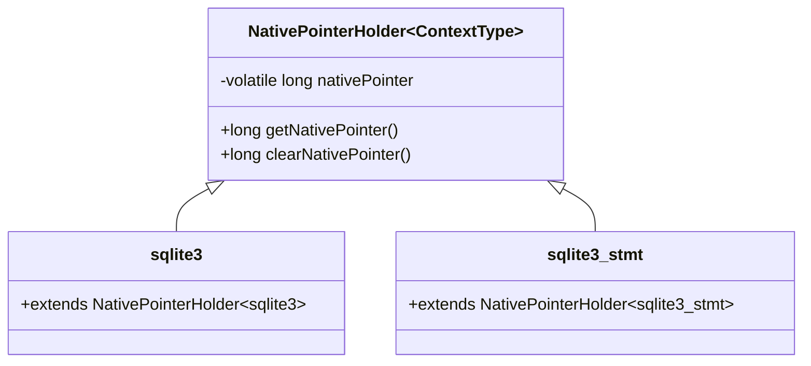
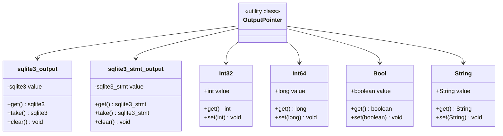
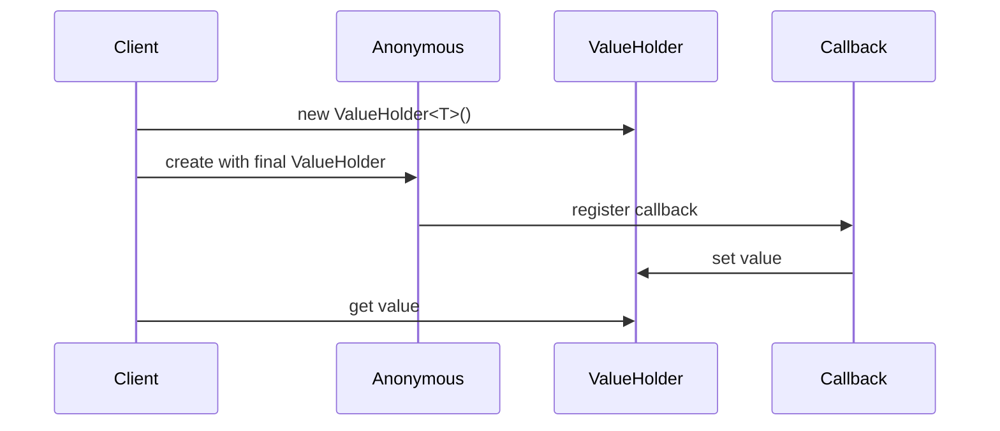
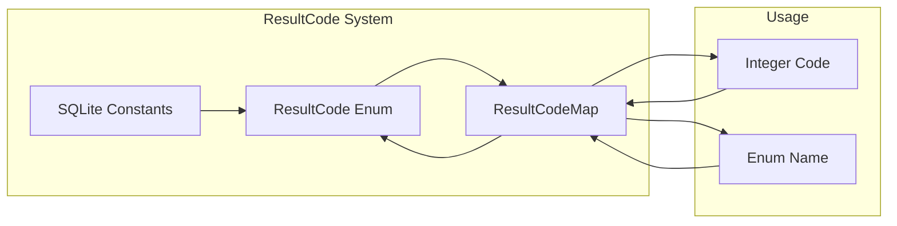
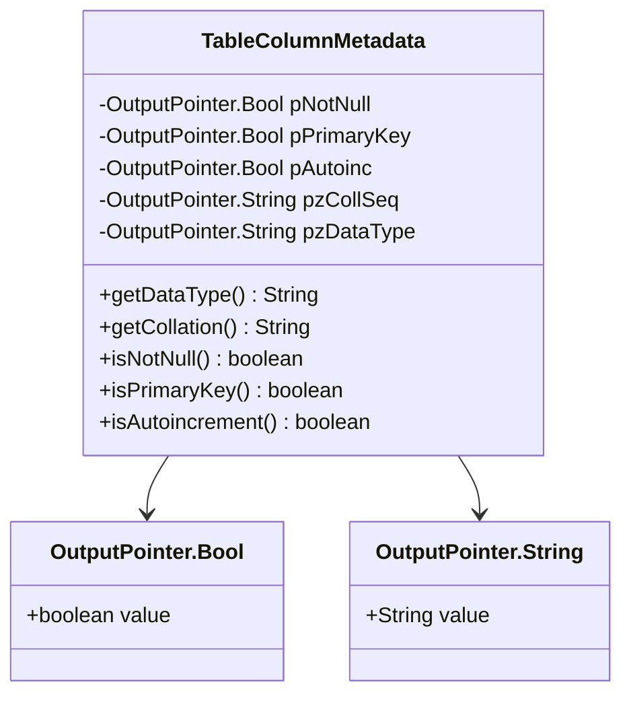
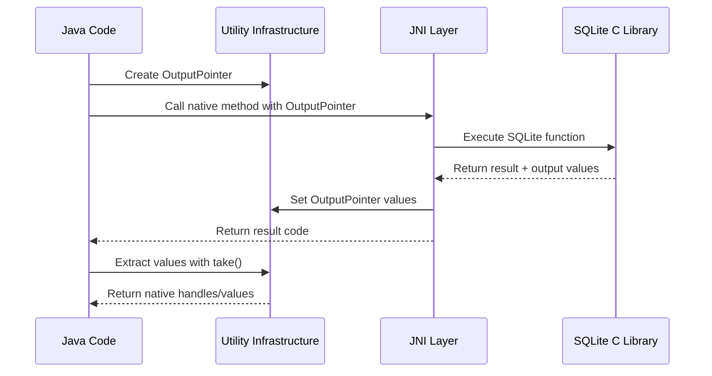
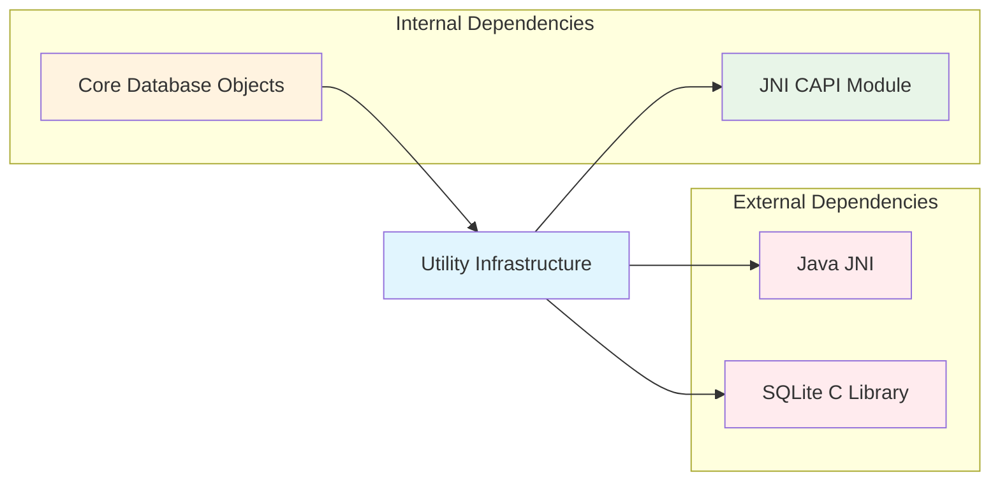

# Utility Infrastructure Module

The utility_infrastructure module provides essential foundational components that support the SQLite JNI binding infrastructure. This module contains utility classes for memory management, data exchange between Java and native code, and metadata handling that are used throughout the SQLite JNI ecosystem.

## Overview

The utility_infrastructure module serves as the foundational layer for the SQLite JNI bindings, providing critical infrastructure components that enable safe and efficient communication between Java and native SQLite code. It includes pointer management, output parameter handling, value containers, and metadata structures that are essential for the proper functioning of the entire SQLite JNI system.

## Architecture Overview

```mermaid
graph TB
    subgraph "Utility Infrastructure Module"
        NPH[NativePointerHolder]
        OP[OutputPointer]
        VH[ValueHolder]
        RCM[ResultCodeMap]
        TCM[TableColumnMetadata]
        
        subgraph "OutputPointer Types"
            OP_DB[sqlite3]
            OP_STMT[sqlite3_stmt]
            OP_BLOB[sqlite3_blob]
            OP_VALUE[sqlite3_value]
            OP_INT32[Int32]
            OP_INT64[Int64]
            OP_BOOL[Bool]
            OP_STRING[String]
            OP_BYTES[ByteArray]
            OP_BUFFER[ByteBuffer]
        end
    end
    
    subgraph "Related Modules"
        CAPI[jni_capi]
        CORE[core_database_objects]
        CALLBACKS[jni_callbacks]
        FUNCTIONS[jni_functions]
        WRAPPER1[jni_wrapper1]
    end
    
    NPH --> CAPI
    NPH --> CORE
    OP --> CORE
    OP --> CAPI
    OP --> FUNCTIONS
    VH --> CALLBACKS
    VH --> FUNCTIONS
    VH --> WRAPPER1
    RCM --> CAPI
    RCM --> CALLBACKS
    RCM --> FUNCTIONS
    TCM --> CAPI
    TCM --> WRAPPER1
    
    OP --> OP_DB
    OP --> OP_STMT
    OP --> OP_BLOB
    OP --> OP_VALUE
    OP --> OP_INT32
    OP --> OP_INT64
    OP --> OP_BOOL
    OP --> OP_STRING
    OP --> OP_BYTES
    OP --> OP_BUFFER
    
    style NPH fill:#e1f5fe
    style OP fill:#e8f5e8
    style VH fill:#fff3e0
    style RCM fill:#fce4ec
    style TCM fill:#f3e5f5
```



## Core Components

### NativePointerHolder

**Purpose**: Manages native memory pointers safely in the Java environment.

**Key Features**:
- Thread-safe pointer management with volatile fields
- Automatic pointer cleanup and nullification
- Package-level access control for security
- Generic type parameter for context-specific usage

**Architecture**:


**Usage Pattern**:
```java
// Base class for objects that hold native pointers
public class NativePointerHolder<ContextType> {
    private volatile long nativePointer = 0;
    
    // Safe pointer retrieval
    public final long getNativePointer() { return nativePointer; }
    
    // Secure pointer cleanup
    final long clearNativePointer() {
        final long rv = nativePointer;
        nativePointer = 0;
        return rv;
    }
}
```

### OutputPointer

**Purpose**: Provides type-safe output parameter handling for JNI calls.

**Key Features**:
- Multiple specialized output pointer types
- Safe memory management with take() semantics
- Support for all SQLite handle types
- Primitive type wrappers for output parameters

**Specialized Types**:
- `sqlite3`: Database handle output
- `sqlite3_stmt`: Statement handle output  
- `sqlite3_blob`: BLOB handle output
- `sqlite3_value`: Value handle output
- `Bool`, `Int32`, `Int64`: Primitive output types
- `String`, `ByteArray`, `ByteBuffer`: Data output types

**Type Hierarchy**:


**Usage Pattern**:
```java
// Example: Database opening with output pointer
OutputPointer.sqlite3 dbOut = new OutputPointer.sqlite3();
int rc = sqlite3_open_v2(filename, dbOut, flags, vfsName);
if (rc == SQLITE_OK) {
    sqlite3 db = dbOut.take(); // Safely extract and clear
}
```

### ValueHolder

**Purpose**: Generic container for passing values through callback interfaces.

**Key Features**:
- Generic type support for any value type
- Simple container semantics
- Designed for callback parameter passing
- Supports both initialized and uninitialized construction

**Usage Context**:


**Usage Pattern**:
```java
// Generic value container
ValueHolder<String> holder = new ValueHolder<>("initial");
// Or uninitialized
ValueHolder<Integer> counter = new ValueHolder<>();
counter.value = 42;
```

### ResultCodeMap

**Purpose**: Maps SQLite result codes to Java enum representations.

**Key Features**:
- Efficient integer-to-enum mapping
- Thread-safe static mapping
- Centralized result code management
- Support for all SQLite result codes

**Code Mapping System**:


### TableColumnMetadata

**Purpose**: Encapsulates database table column metadata information.

**Key Features**:
- Complete column metadata representation
- Type-safe boolean and string properties
- Integration with OutputPointer system
- Comprehensive column information access

**Data Structure**:


**Metadata Properties**:
- Data type information
- Collation sequence
- NOT NULL constraint status
- Primary key status
- Auto-increment status

## Data Flow



## Component Interactions

```mermaid
graph TB
    subgraph "Memory Management Flow"
        NPH[NativePointerHolder] --> |"manages"| PTR[Native Pointers]
        PTR --> |"cleanup"| NPH
    end
    
    subgraph "Parameter Exchange Flow"
        OP[OutputPointer] --> |"receives"| JNI[JNI Layer]
        JNI --> |"populates"| OP
        OP --> |"take()"| APP[Application Code]
    end
    
    subgraph "Value Container Flow"
        VH[ValueHolder] --> |"stores"| VAL[Generic Values]
        VAL --> |"callback access"| CB[Callback Functions]
    end
    
    subgraph "Metadata Flow"
        TCM[TableColumnMetadata] --> |"encapsulates"| META[Column Info]
        META --> |"provides"| QUERY[Query Operations]
    end
    
    style NPH fill:#e1f5fe
    style OP fill:#e8f5e8
    style VH fill:#fff3e0
    style TCM fill:#f3e5f5
```



## Integration Points

### With Core Database Objects
- **NativePointerHolder**: Base class for `sqlite3`, `sqlite3_stmt`, and other handle types
- **OutputPointer**: Used in database and statement creation operations
- **ResultCodeMap**: Provides error code translation for database operations

### With JNI Callbacks
- **ValueHolder**: Enables value passing in callback implementations
- **OutputPointer**: Handles callback parameter extraction
- **ResultCodeMap**: Translates callback return codes

### With Wrapper APIs
- **ValueHolder**: Simplifies high-level API callback implementations
- **TableColumnMetadata**: Provides metadata access in wrapper APIs
- **OutputPointer**: Underlying mechanism for wrapper parameter handling

## Dependencies



## Thread Safety

### Thread-Safe Components
- **NativePointerHolder**: Uses volatile fields for thread-safe pointer access
- **ResultCodeMap**: Immutable static mapping ensures thread safety
- **OutputPointer**: Individual instances are not thread-safe but can be used safely across threads

### Thread Safety Considerations
- **ValueHolder**: Not inherently thread-safe; requires external synchronization
- **TableColumnMetadata**: Not thread-safe; designed for single-thread usage per instance

## Memory Management

### Pointer Lifecycle
1. **Creation**: Native pointers allocated by SQLite C library
2. **Management**: Wrapped in NativePointerHolder for safe access
3. **Transfer**: Passed through OutputPointer mechanisms
4. **Cleanup**: Cleared via clearNativePointer() during finalization

### Resource Cleanup
- Automatic pointer nullification prevents stale pointer access
- OutputPointer.take() semantics ensure single-use extraction
- Integration with Java garbage collection for memory safety

## Error Handling

### Result Code Management
- Centralized mapping of SQLite result codes to Java enums
- Type-safe error code representation
- Integration with exception handling mechanisms

### Pointer Validation
- Null pointer checks in NativePointerHolder
- Safe pointer extraction in OutputPointer
- Automatic cleanup on error conditions

## Performance Considerations

### Optimization Features
- Minimal object allocation in OutputPointer operations
- Efficient integer-to-enum mapping in ResultCodeMap
- Direct field access in ValueHolder for performance
- Volatile fields only where necessary for thread safety

### Memory Efficiency
- Lightweight container objects
- Reusable OutputPointer instances
- Minimal overhead in pointer management

## Usage Examples

### Basic OutputPointer Usage
```java
// Database opening
OutputPointer.sqlite3 dbOut = new OutputPointer.sqlite3();
int rc = CApi.sqlite3_open_v2(filename, dbOut, flags, vfsName);
if (rc == SQLITE_OK) {
    sqlite3 db = dbOut.take();
    // Use database handle
}
```

### ValueHolder in Callbacks
```java
ValueHolder<String> result = new ValueHolder<>();
callback.execute((value) -> {
    result.value = processValue(value);
});
String processedValue = result.value;
```

### Metadata Access
```java
TableColumnMetadata meta = new TableColumnMetadata();
// Populated by JNI call
String dataType = meta.getDataType();
boolean isPrimaryKey = meta.isPrimaryKey();
boolean isNotNull = meta.isNotNull();
```

## Related Documentation

- [Core Database Objects](core_database_objects.md) - Primary consumers of utility infrastructure
- [JNI CAPI](jni_capi.md) - Low-level JNI interface using these utilities
- [JNI Callbacks](jni_callbacks.md) - Callback system utilizing ValueHolder and OutputPointer
- [Specialized Handles](specialized_handles.md) - Handle types built on NativePointerHolder

## Best Practices

### NativePointerHolder Usage
- Always check pointer validity before use
- Use clearNativePointer() in cleanup methods
- Avoid direct pointer manipulation

### OutputPointer Patterns
- Use take() semantics for single-use extraction
- Clear pointers after use to prevent memory leaks
- Choose appropriate specialized types for type safety

### ValueHolder Guidelines
- Use for callback parameter passing
- Consider thread safety requirements
- Initialize appropriately for use case

### Memory Management
- Follow RAII patterns where possible
- Ensure proper cleanup in error conditions
- Use try-with-resources for automatic cleanup