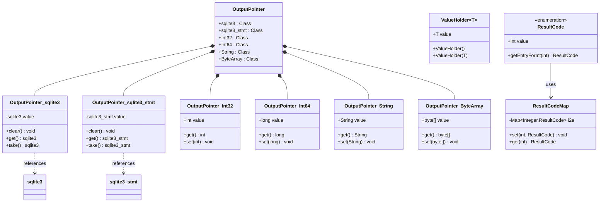

# Utility Types Module

The **utility_types** module provides essential utility classes and type definitions that support the SQLite JNI binding infrastructure. This module contains helper types for parameter passing, result handling, and type mapping between Java and native SQLite operations.

## Module Overview

The utility_types module serves as the foundational layer for type safety and data exchange in the SQLite JNI bindings. It provides specialized pointer types, value holders, and result code mappings that enable seamless communication between Java code and the underlying SQLite C library.

## Architecture


## Core Components

### OutputPointer System

The `OutputPointer` class provides a type-safe mechanism for handling output parameters in JNI calls, addressing the challenge of returning multiple values from native functions.

#### Base OutputPointer Class
```java
public final class OutputPointer {
    // Container for various output pointer specializations
}
```

#### Database Handle Pointers
- **`OutputPointer.sqlite3`**: Manages SQLite database handle output parameters
- **`OutputPointer.sqlite3_stmt`**: Handles prepared statement output parameters

#### Primitive Type Pointers
- **`OutputPointer.Int32`**: 32-bit integer output parameters
- **`OutputPointer.Int64`**: 64-bit integer output parameters
- **`OutputPointer.String`**: String output parameters
- **`OutputPointer.ByteArray`**: Binary data output parameters

### ValueHolder Generic Container

The `ValueHolder<T>` class provides a generic container for passing values across JNI boundaries and maintaining state in callback contexts.

```java
public class ValueHolder<T> {
    public T value;
    public ValueHolder() {}
    public ValueHolder(T v) { value = v; }
}
```

### ResultCode Enumeration

The `ResultCode` enum provides a comprehensive mapping of SQLite result codes to Java enum values, enabling type-safe error handling.

```java
public enum ResultCode {
    SQLITE_OK(0),
    SQLITE_ERROR(1),
    // ... comprehensive set of SQLite result codes
}
```

## Component Relationships



## Data Flow Patterns


## Usage Patterns

### Output Parameter Handling

```java
// Database opening with output parameter
OutputPointer.sqlite3 dbOut = new OutputPointer.sqlite3();
int rc = sqlite3_open(":memory:", dbOut);
if (rc == SQLITE_OK) {
    sqlite3 db = dbOut.take(); // Transfer ownership
    // Use database...
}

// Statement preparation
OutputPointer.sqlite3_stmt stmtOut = new OutputPointer.sqlite3_stmt();
rc = sqlite3_prepare_v2(db, sql, stmtOut);
if (rc == SQLITE_OK) {
    sqlite3_stmt stmt = stmtOut.get(); // Keep reference
    // Use statement...
}
```

### Value Holder Usage

```java
// Generic value container
ValueHolder<String> holder = new ValueHolder<>("initial");

// Aggregate function state
ValueHolder<Integer> counter = new ValueHolder<>(0);
// In aggregate step function:
counter.value++;

// Cross-callback communication
ValueHolder<List<String>> results = new ValueHolder<>(new ArrayList<>());
```

### Result Code Handling

```java
// Type-safe result code handling
int nativeCode = sqlite3_step(stmt);
ResultCode result = ResultCode.getEntryForInt(nativeCode);

switch (result) {
    case SQLITE_ROW:
        // Process row data
        break;
    case SQLITE_DONE:
        // Query completed
        break;
    case SQLITE_ERROR:
        // Handle error
        break;
}
```

## Integration Points

### With Database Objects Module
- OutputPointer types reference [database_objects](database_objects.md) classes
- Provides type-safe parameter passing for database operations
- Enables proper resource management and ownership transfer

### With JNI Infrastructure Module
- ValueHolder supports callback state management in [jni_infrastructure](jni_infrastructure.md)
- ResultCode provides error handling integration
- OutputPointer enables native function parameter binding

### With Core API Modules
- Used extensively in [jni_core_api](jni_core_api.md) for function parameters
- Supports [jni_capi](jni_capi.md) low-level operations
- Enables type safety in [jni_callbacks](jni_callbacks.md)

## Type Safety Features

### Compile-Time Safety
- Generic ValueHolder provides type parameterization
- Enum-based result codes prevent invalid values
- Specialized OutputPointer classes prevent type confusion

### Runtime Safety
- Null-safe operations in OutputPointer implementations
- Proper resource lifecycle management
- Clear ownership semantics with `take()` vs `get()` methods

### Memory Management
- OutputPointer handles native pointer lifecycle
- ValueHolder provides garbage collection compatibility
- ResultCode enum provides efficient constant mapping

## Performance Considerations

### Memory Efficiency
- OutputPointer classes minimize object allocation
- ResultCode enum uses efficient integer-to-enum mapping
- ValueHolder avoids boxing/unboxing where possible

### JNI Optimization
- Direct field access in primitive OutputPointer types
- Minimal object creation in critical paths
- Efficient native pointer management

## Error Handling

### OutputPointer Error States
- Null value handling in database handle pointers
- Clear/take operations for resource management
- Type-specific error conditions

### ResultCode Integration
- Comprehensive SQLite error code coverage
- Type-safe error code comparison
- Integration with exception handling patterns

## Thread Safety

### Synchronization Requirements
- OutputPointer instances are not thread-safe
- ValueHolder requires external synchronization
- ResultCode enum is inherently thread-safe

### Usage Guidelines
- Create OutputPointer instances per thread
- Synchronize ValueHolder access in multi-threaded contexts
- Use ResultCode freely across threads

## Best Practices

### OutputPointer Usage
1. Use `take()` for ownership transfer
2. Use `get()` for temporary access
3. Always check for null after native calls
4. Clear pointers when done to prevent leaks

### ValueHolder Patterns
1. Initialize with appropriate default values
2. Use generic types for compile-time safety
3. Consider thread safety requirements
4. Avoid holding large objects unnecessarily

### ResultCode Handling
1. Always check return codes from native functions
2. Use enum comparison instead of integer values
3. Handle unknown result codes gracefully
4. Log result codes for debugging

## Future Considerations

### Extensibility
- Additional OutputPointer specializations for new types
- Enhanced ValueHolder functionality
- Extended ResultCode coverage for new SQLite versions

### Performance Optimization
- Potential for more efficient native pointer handling
- Optimized ResultCode mapping strategies
- Reduced object allocation in critical paths

### API Evolution
- Backward compatibility maintenance
- Integration with newer JNI features
- Enhanced type safety mechanisms