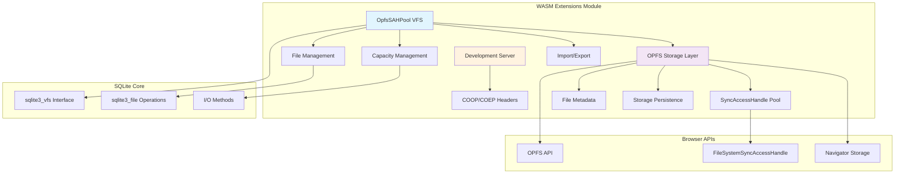
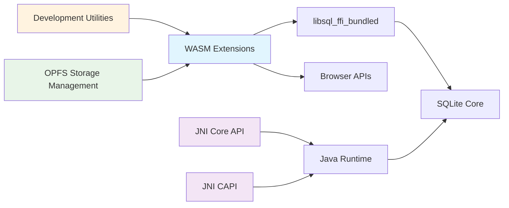

# WASM Extensions Module

## Overview

The `wasm_extensions` module provides WebAssembly (WASM) specific extensions for SQLite, focusing on OPFS (Origin Private File System) storage capabilities and development tooling. This module enables SQLite to run efficiently in web browsers with persistent storage through modern web APIs.

## Purpose

The WASM Extensions module serves as a bridge between SQLite's C-based architecture and modern web browser capabilities, specifically:

- **OPFS Storage Integration**: Provides a high-performance virtual file system (VFS) using OPFS SyncAccessHandle Pool
- **Web Development Support**: Includes development server utilities with proper COOP/COEP headers for SharedArrayBuffer support
- **Browser Compatibility**: Ensures SQLite works across different browser environments with varying API support levels

## Architecture Overview



## Core Components

### 1. OpfsSAHPool VFS
- **Purpose**: High-performance virtual file system using OPFS SyncAccessHandle Pool
- **Key Features**:
  - Synchronous file operations without sub-workers
  - Fixed pool of pre-opened file handles
  - No SharedArrayBuffer requirement
  - Safari 16.4+ compatibility

### 2. OpfsSAHPoolUtil
- **Purpose**: Client-facing utility interface for pool management
- **Key Features**:
  - Capacity management (add/reduce)
  - File import/export operations
  - Database manipulation utilities
  - VFS lifecycle management

### 3. Development Server (COOPCOEPHandler)
- **Purpose**: HTTP server with proper headers for WASM/SharedArrayBuffer support
- **Key Features**:
  - Cross-Origin-Embedder-Policy: require-corp
  - Cross-Origin-Opener-Policy: same-origin
  - Local development support

## Sub-modules

### OPFS Storage Management
Detailed documentation: [opfs_storage_management.md](opfs_storage_management.md)

Handles the core OPFS integration including:
- SyncAccessHandle pool management
- File metadata and persistence
- Storage capacity optimization
- Cross-session data integrity

### Development Utilities
Detailed documentation: [development_utilities.md](development_utilities.md)

Provides development and testing support including:
- HTTP server with security headers
- WASM debugging capabilities
- Browser compatibility testing
- Performance optimization tools

## Key Features

### 1. High-Performance Storage
- **SyncAccessHandle Pool**: Pre-allocated file handles for optimal performance
- **No Sub-worker Required**: Direct synchronous operations without worker overhead
- **Persistent Storage**: Data survives browser sessions and page reloads

### 2. Browser Compatibility
- **Chrome 108+**: Full SyncAccessHandle API support
- **Safari 16.4+**: Compatible without SharedArrayBuffer requirements
- **Firefox**: Support through OPFS API implementation

### 3. Developer Experience
- **Easy Integration**: Simple API for VFS installation and management
- **Debugging Support**: Comprehensive logging and error handling
- **Development Server**: Ready-to-use server with proper security headers

## Integration with Other Modules

### Relationship with Other Modules


The WASM Extensions module operates independently from the JNI modules but shares the same SQLite core:
- **Parallel Architecture**: WASM for browsers, JNI for Java environments
- **Shared Core**: Both use the same underlying SQLite engine from [libsql_ffi_bundled.md](libsql_ffi_bundled.md)
- **Different APIs**: WASM uses web APIs while JNI uses Java Native Interface
- **Sub-module Integration**: Contains specialized sub-modules for storage and development support

## Usage Examples

### Basic VFS Installation
```javascript
// Install OPFS SAH Pool VFS
const poolUtil = await sqlite3.installOpfsSAHPoolVfs({
  name: 'my-app-storage',
  initialCapacity: 10,
  directory: 'my-app-data'
});

// Create database using the VFS
const db = new sqlite3.oo1.DB('my-database.db', 'c', 'my-app-storage');
```

### File Management
```javascript
// Import database from bytes
const dbBytes = new Uint8Array(/* database content */);
await poolUtil.importDb('imported.db', dbBytes);

// Export database to bytes
const exportedBytes = poolUtil.exportFile('imported.db');

// Manage capacity
await poolUtil.addCapacity(5);
const currentCapacity = poolUtil.getCapacity();
```

### Development Server
```python
# Start development server with proper headers
from serve import COOPCOEPHandler
from http.server import HTTPServer

httpd = HTTPServer(('localhost', 8000), COOPCOEPHandler)
httpd.serve_forever()
```

## Configuration Options

### VFS Options
- **name**: VFS registration name (default: 'opfs-sahpool')
- **directory**: OPFS storage directory (default: derived from name)
- **initialCapacity**: Initial file handle pool size (default: 6)
- **clearOnInit**: Clear existing data on initialization (default: false)
- **verbosity**: Logging level (0-3, default: 2)

### Performance Tuning
- **SECTOR_SIZE**: File system sector size (4096 bytes)
- **HEADER_MAX_PATH_SIZE**: Maximum path length (512 bytes)
- **Pool Capacity**: Balance between memory usage and file availability

## Error Handling

The module provides comprehensive error handling:
- **API Compatibility Checks**: Validates required OPFS APIs before initialization
- **Storage Errors**: Handles OPFS locking and access errors gracefully
- **Data Integrity**: Validates file headers and checksums
- **Recovery Mechanisms**: Automatic cleanup of corrupted or orphaned files

## Performance Considerations

### Optimization Strategies
1. **Pre-allocated Handles**: Avoids runtime file creation overhead
2. **Synchronous Operations**: Eliminates worker communication latency
3. **Efficient Metadata**: Minimal header overhead per file
4. **Pool Management**: Optimal balance between capacity and resource usage

### Browser-Specific Optimizations
- **Chrome**: Full SyncAccessHandle API utilization
- **Safari**: Compatibility mode without SharedArrayBuffer
- **Firefox**: OPFS API fallback mechanisms

## Security Considerations

### COOP/COEP Headers
The development server automatically sets required security headers:
- **Cross-Origin-Embedder-Policy**: require-corp
- **Cross-Origin-Opener-Policy**: same-origin

### Data Isolation
- **Origin-based Storage**: Data isolated per web origin
- **Directory Sandboxing**: Multiple VFS instances can coexist
- **Handle Locking**: Prevents concurrent access conflicts

## Future Enhancements

### Planned Features
1. **Streaming Import/Export**: Large file handling with chunked operations
2. **Compression Support**: Optional data compression for storage efficiency
3. **Backup/Restore**: Automated backup mechanisms
4. **Performance Metrics**: Built-in performance monitoring and reporting

### Browser API Evolution
- **Enhanced OPFS APIs**: Leverage new browser capabilities as they become available
- **WebAssembly Improvements**: Optimize for new WASM features
- **Storage Quotas**: Better integration with browser storage management

## Troubleshooting

### Common Issues
1. **VFS Registration Failures**: Check for existing VFS with same name
2. **OPFS API Unavailable**: Verify browser support and secure context
3. **Storage Quota Exceeded**: Monitor and manage storage usage
4. **Concurrent Access Errors**: Ensure proper VFS lifecycle management

### Debugging Tools
- **Verbose Logging**: Enable detailed operation logging
- **Pool Inspection**: Monitor file handle usage and capacity
- **Error Tracking**: Comprehensive error reporting and recovery

---

*This documentation covers the WASM Extensions module's architecture, components, and usage patterns. For detailed implementation information, refer to the sub-module documentation linked above.*