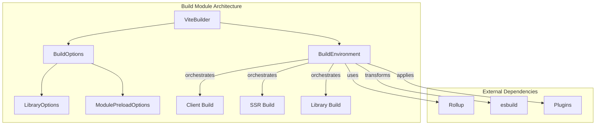
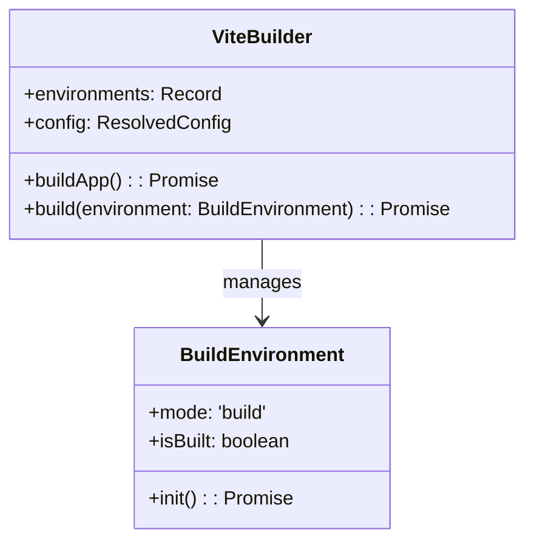
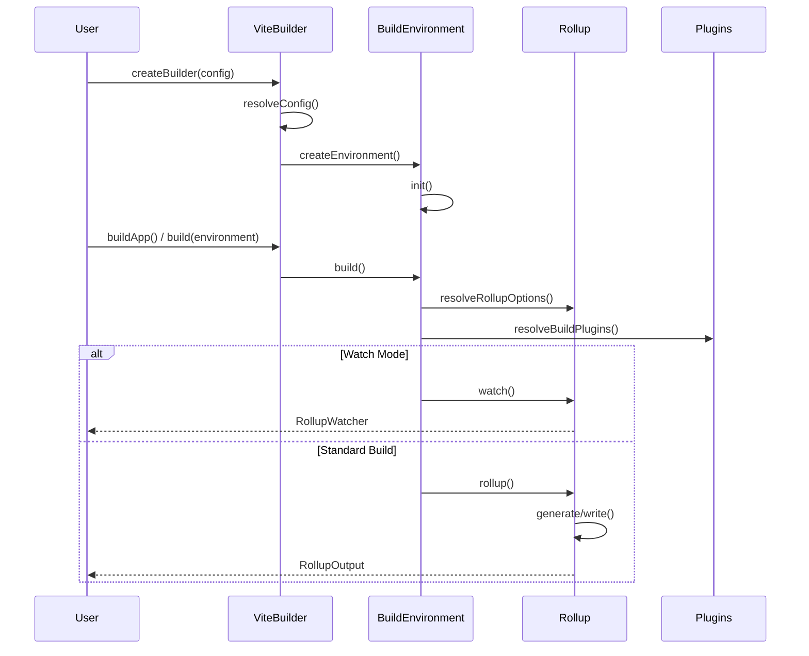
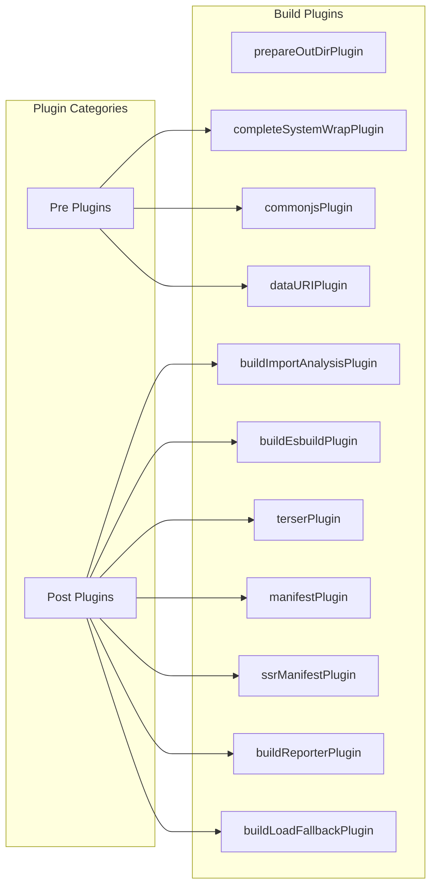
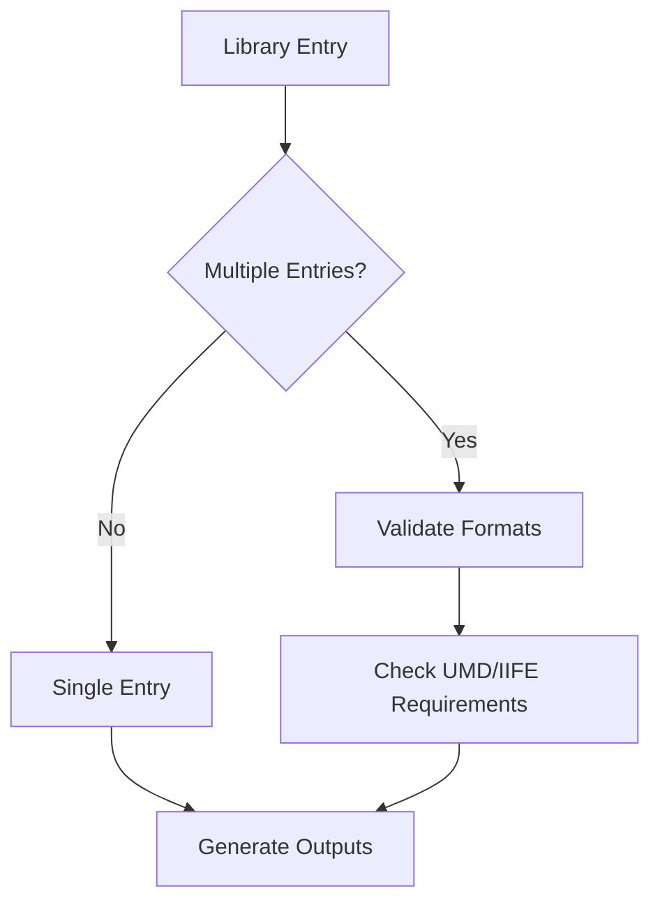
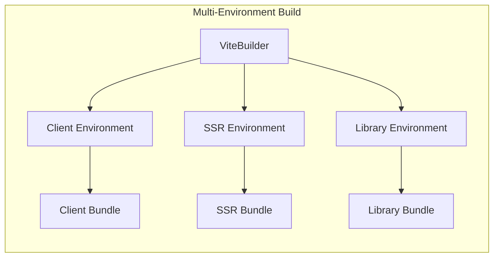

# Build Module Documentation

## Introduction

The build module is a core component of Vite's build system, responsible for orchestrating the production build process. It provides a comprehensive set of tools and configurations for bundling applications and libraries, handling various output formats, optimizations, and build-time transformations. The module integrates with Rollup as the underlying bundler while providing Vite-specific enhancements and conventions.

## Architecture Overview

The build module follows a multi-environment architecture that allows building different targets (client, server, library) with shared or isolated configurations. It leverages Rollup's plugin system while adding Vite-specific optimizations and conventions.



## Core Components

### ViteBuilder

The `ViteBuilder` interface is the main orchestrator for the build process. It manages multiple build environments and coordinates the overall build workflow.

**Key Responsibilities:**
- Manage multiple build environments (client, SSR, library)
- Coordinate build processes across environments
- Handle shared configuration and plugin instances
- Provide build orchestration hooks



### BuildEnvironment

The `BuildEnvironment` class extends `BaseEnvironment` and represents a specific build target with its own configuration and plugins.

**Key Features:**
- Environment-specific build configuration
- Isolated plugin instances per environment
- Build state management
- Integration with Rollup's build process

### Build Options

The build module provides extensive configuration options through several interfaces:

#### BuildEnvironmentOptions

```typescript
interface BuildEnvironmentOptions {
    target?: 'baseline-widely-available' | TransformOptions['target'] | false
    modulePreload?: boolean | ModulePreloadOptions
    outDir?: string
    assetsDir?: string
    assetsInlineLimit?: number | ((filePath: string, content: Buffer) => boolean | undefined)
    cssCodeSplit?: boolean
    cssTarget?: TransformOptions['target'] | false
    cssMinify?: boolean | 'esbuild' | 'lightningcss'
    sourcemap?: boolean | 'inline' | 'hidden'
    minify?: boolean | 'terser' | 'esbuild'
    rollupOptions?: RollupOptions
    lib?: LibraryOptions | false
    ssr?: boolean | string
    // ... additional options
}
```

#### LibraryOptions

Specialized options for library builds:

```typescript
interface LibraryOptions {
    entry: InputOption
    name?: string
    formats?: LibraryFormats[]
    fileName?: string | ((format: ModuleFormat, entryName: string) => string)
    cssFileName?: string
}
```

## Build Process Flow



## Plugin System Integration

The build module integrates deeply with Vite's plugin system, providing environment-aware plugin contexts and hooks.

### Build Plugins

The module includes several built-in plugins:



### Environment Injection

The build module injects environment context into plugin hooks:

```typescript
function injectEnvironmentToHooks(environment: Environment, plugin: Plugin): Plugin
```

This ensures plugins have access to:
- Current build environment
- SSR flags
- Environment-specific configuration
- Plugin context metadata

## Output Generation

### Asset Handling

The module provides sophisticated asset handling with support for:

- **Inline assets**: Small assets can be inlined as base64
- **Hashed filenames**: Content-based hashing for cache busting
- **Asset optimization**: Minification and optimization
- **Source maps**: Generation of source maps for debugging

### Output Formats

Supports multiple output formats:
- **ES Modules**: Modern JavaScript modules
- **CommonJS**: Node.js compatible format
- **UMD**: Universal module definition
- **IIFE**: Immediately invoked function expression
- **System**: SystemJS format

### Library Mode

Special handling for library builds:



## Error Handling and Logging

The build module includes comprehensive error handling:

- **Rollup error enhancement**: Improves error messages with better context
- **Log level management**: Configurable logging with different levels
- **Warning filtering**: Ignores specific warnings based on configuration
- **Build reporting**: Detailed build reports with timing information

## Integration with Other Modules

### Config Module

The build module depends on the [config module](config.md) for:
- Configuration resolution
- Environment setup
- Plugin management

### Plugin System

Integrates with the [plugin system](plugin-system.md) for:
- Plugin context injection
- Hook orchestration
- Environment-aware plugins

### Dev Server

Complements the [dev server](dev-server.md) by providing:
- Production optimizations
- Asset processing
- Bundle generation

## Advanced Features

### Multi-Environment Builds

Supports building multiple environments simultaneously:



### Watch Mode

Provides file watching capabilities for development builds:
- Incremental rebuilds
- Change detection
- Hot reloading support

### Module Preloading

Advanced module preloading with:
- Polyfill injection
- Dependency resolution
- Preload optimization

## Performance Considerations

The build module is designed for optimal performance:

- **Parallel processing**: Multiple environments can be built in parallel
- **Caching**: Intelligent caching of build results
- **Incremental builds**: Watch mode for faster rebuilds
- **Asset optimization**: Efficient asset processing and minification

## Usage Examples

### Basic Build

```typescript
import { build } from 'vite'

const result = await build({
  build: {
    outDir: 'dist',
    minify: 'esbuild'
  }
})
```

### Library Build

```typescript
const result = await build({
  build: {
    lib: {
      entry: 'src/index.ts',
      name: 'MyLibrary',
      formats: ['es', 'umd']
    }
  }
})
```

### Multi-Environment Build

```typescript
const builder = await createBuilder({
  environments: {
    client: { /* client config */ },
    ssr: { /* ssr config */ }
  }
})

await builder.buildApp()
```

## API Reference

For detailed API documentation, see the core components:
- [ViteBuilder](#vitebuilder)
- [BuildEnvironment](#buildenvironment)
- [BuildOptions](#build-options)
- [LibraryOptions](#libraryoptions)

## Related Documentation

- [Config Module](config.md) - Configuration management
- [Plugin System](plugin-system.md) - Plugin architecture
- [Dev Server](dev-server.md) - Development server
- [Module Runner](module-runner.md) - Module execution