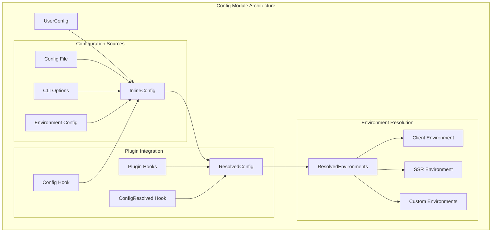
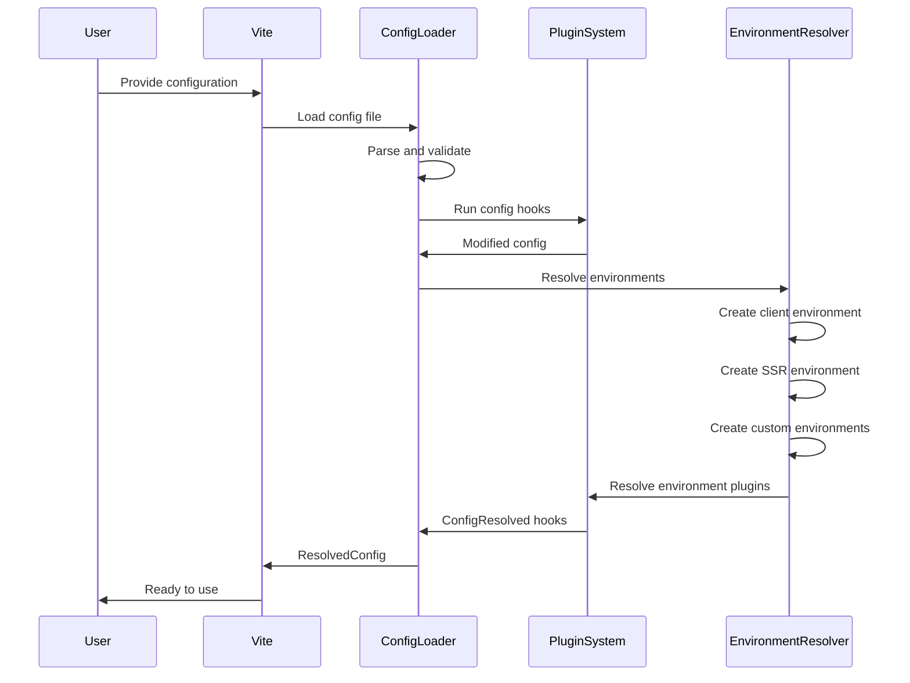
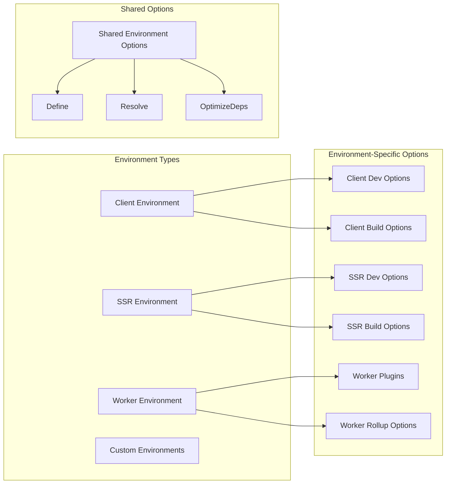
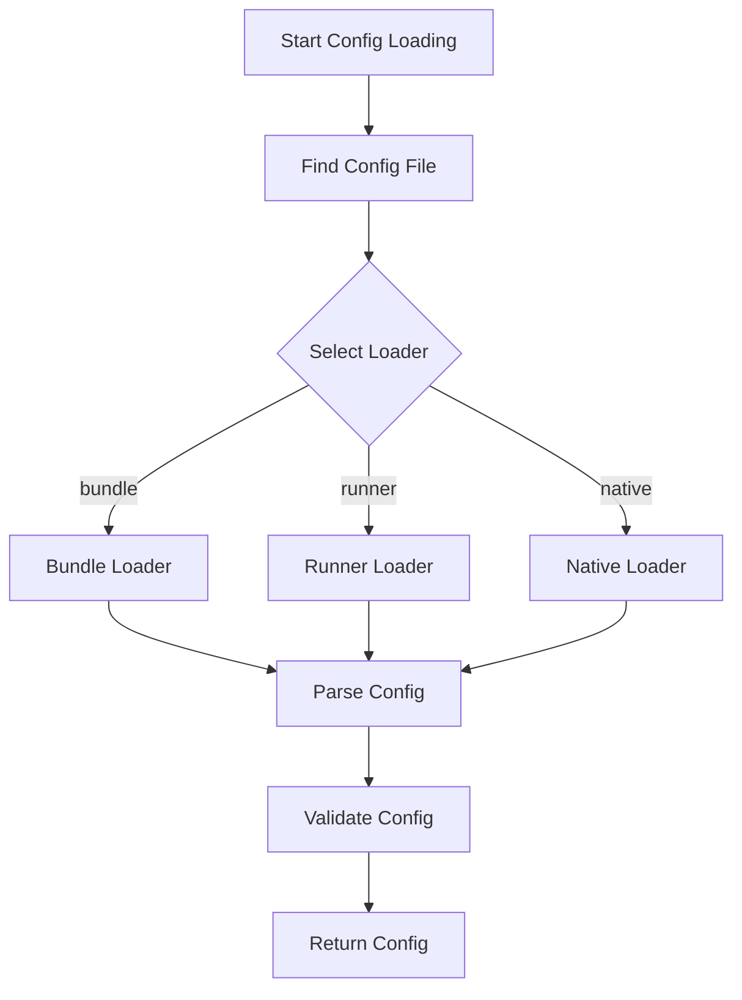

# Config Module Documentation

## Introduction

The config module is the central configuration management system for Vite. It handles the loading, validation, resolution, and merging of user configurations across different environments (client, SSR, and custom environments). This module serves as the foundation for all other Vite modules, providing a unified configuration interface that adapts to different build targets and development scenarios.

## Architecture Overview

The config module implements a sophisticated configuration resolution system that supports:

- **Multi-environment configuration**: Separate configurations for client, SSR, and custom environments
- **Plugin-based configuration**: Integration with Vite's plugin system for configuration hooks
- **Backward compatibility**: Maintains compatibility with legacy configuration options
- **Type safety**: Comprehensive TypeScript interfaces for configuration validation
- **Dynamic configuration**: Support for configuration functions and async configuration loading



## Core Components

### Configuration Interfaces

#### UserConfig
The primary interface for user-provided configuration. Supports both static objects and functions that return configuration based on environment.

```typescript
interface UserConfig {
  root?: string
  base?: string
  publicDir?: string | false
  cacheDir?: string
  mode?: string
  plugins?: PluginOption[]
  // ... additional options
}
```

#### ResolvedConfig
The fully resolved and validated configuration object used internally by Vite. Contains all default values and resolved paths.

```typescript
interface ResolvedConfig extends Readonly<{
  // Core configuration
  root: string
  base: string
  publicDir: string
  cacheDir: string
  command: 'build' | 'serve'
  mode: string
  
  // Environment configurations
  environments: Record<string, ResolvedEnvironmentOptions>
  
  // Plugin system
  plugins: readonly Plugin[]
  getSortedPlugins: <K extends keyof Plugin>(hookName: K) => PluginWithRequiredHook<K>[]
  getSortedPluginHooks: <K extends keyof Plugin>(hookName: K) => NonNullable<HookHandler<Plugin[K]>>[]
}>
```

#### EnvironmentOptions
Configuration options specific to different runtime environments (client, server, SSR).

```typescript
interface EnvironmentOptions extends SharedEnvironmentOptions {
  dev?: DevEnvironmentOptions
  build?: BuildEnvironmentOptions
}
```

### Configuration Resolution Process



## Key Features

### Multi-Environment Support

The config module supports multiple environments with specific configurations:



### Plugin Integration

The config module integrates deeply with Vite's plugin system:

- **Config Hook**: Allows plugins to modify configuration before resolution
- **ConfigEnvironment Hook**: Enables environment-specific configuration modifications
- **ConfigResolved Hook**: Provides access to the final resolved configuration

### Backward Compatibility

Maintains compatibility with legacy configuration patterns:

- Top-level SSR options are merged into environments.ssr
- Server warmup options are converted to environment-specific warmup settings
- Deprecated options trigger warnings but continue to function

## Configuration Loading

### File Loading Process



### Configuration Sources Priority

1. **Inline Config**: Command-line options and programmatic configuration
2. **Config File**: vite.config.js/ts files
3. **Environment Variables**: .env files and process.env
4. **Defaults**: Built-in default values

## Dependencies and Integration

### Internal Dependencies

The config module integrates with numerous other Vite modules:

- **[Plugin System](plugin-system.md)**: Configuration hooks and plugin resolution
- **[Build Module](build.md)**: Build-specific configuration options
- **[Dev Server](dev-server.md)**: Development server configuration
- **[SSR Module](ssr.md)**: Server-side rendering configuration
- **[Optimizer](optimizer.md)**: Dependency optimization settings
- **[Module Graph](module-graph.md)**: Module resolution configuration

### External Dependencies

- **esbuild**: Used for bundling configuration files
- **picocolors**: Terminal color output for warnings and errors
- **picomatch**: File pattern matching for various configuration options

## Configuration Validation

### Path Validation

The config module validates file paths to prevent common issues:

- Checks for problematic characters (`#`, `?`, `*`)
- Validates base URL format
- Ensures build output directory is not the same as root

### Security Validation

- Warns about exposing `process.env` in define options
- Validates WebSocket token configuration
- Checks for potentially unsafe path configurations

## Usage Examples

### Basic Configuration

```typescript
import { defineConfig } from 'vite'

export default defineConfig({
  root: './src',
  base: '/app/',
  server: {
    port: 3000
  }
})
```

### Environment-Specific Configuration

```typescript
import { defineConfig } from 'vite'

export default defineConfig({
  environments: {
    client: {
      dev: {
        warmup: ['./src/main.ts']
      }
    },
    ssr: {
      resolve: {
        external: ['some-ssr-only-package']
      }
    }
  }
})
```

### Configuration Function

```typescript
import { defineConfig } from 'vite'

export default defineConfig(({ command, mode }) => ({
  base: mode === 'production' ? '/app/' : '/',
  build: {
    minify: mode === 'production'
  }
}))
```

## Error Handling

The config module provides comprehensive error handling:

- **Configuration Validation Errors**: Clear messages for invalid configurations
- **File Loading Errors**: Detailed error information for config file issues
- **Plugin Hook Errors**: Proper error propagation from configuration hooks
- **Backward Compatibility Warnings**: Informative warnings for deprecated options

## Performance Considerations

- **Caching**: Resolved configurations are cached to avoid repeated resolution
- **Lazy Loading**: Environment-specific configurations are resolved on-demand
- **Bundle Optimization**: Configuration files are bundled for faster loading
- **Dependency Tracking**: Tracks config file dependencies for efficient reloading

## Future Enhancements

The config module includes experimental options for future features:

- **Import Glob Extensions**: Support for preserving file extensions in import globs
- **HMR Partial Accept**: Experimental hot module replacement features
- **Future Deprecation Warnings**: Early warnings for upcoming breaking changes

This comprehensive configuration system ensures that Vite can adapt to various project requirements while maintaining backward compatibility and providing a smooth developer experience.