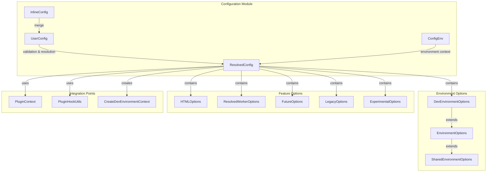
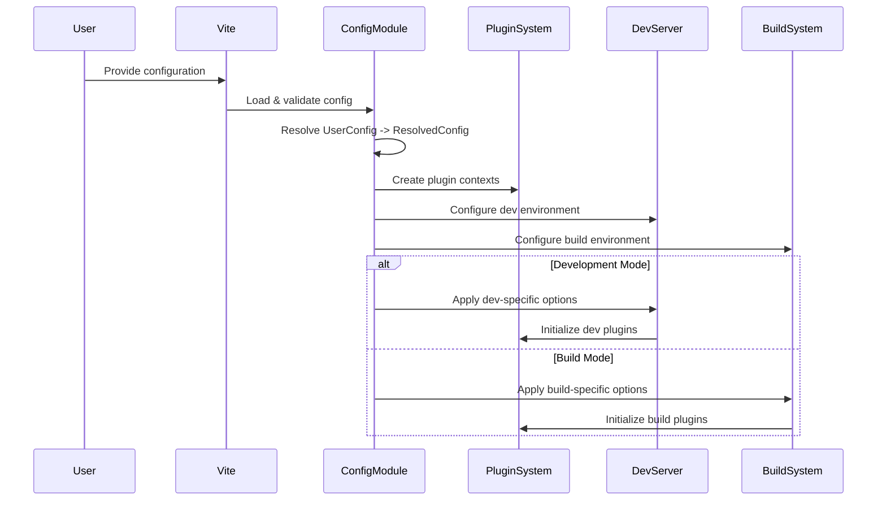
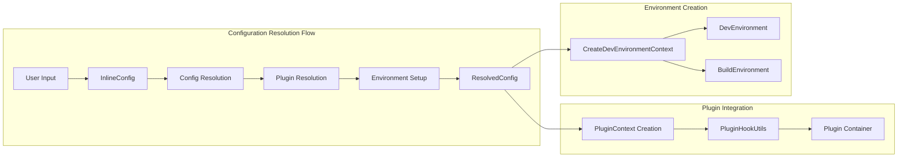
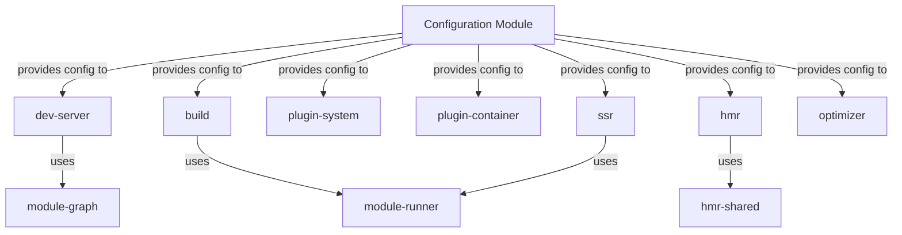
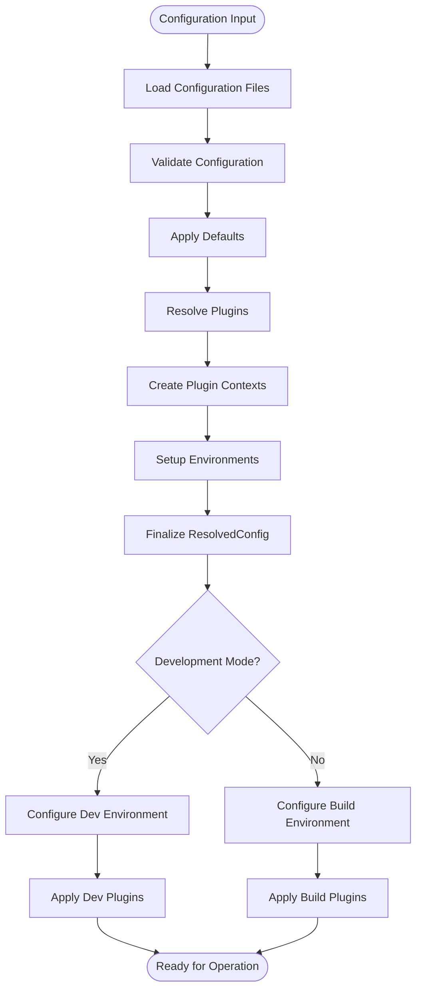

# Configuration Module Documentation

## Introduction

The configuration module is the central configuration management system for Vite, providing the foundation for all Vite operations including development server, build processes, SSR, and plugin systems. It defines the structure, validation, and resolution of user configurations, serving as the single source of truth for Vite's behavior across different environments and use cases.

## Architecture Overview



## Core Components

### Configuration Types

#### UserConfig
The primary configuration interface that users interact with. It defines all available configuration options with their user-facing types and optional nature.

#### InlineConfig
Configuration that can be passed programmatically to Vite, typically used when creating Vite instances programmatically. Extends UserConfig with additional internal options.

#### ResolvedConfig
The fully resolved and validated configuration object that Vite uses internally. All optional properties are made required and defaults are applied.

#### ConfigEnv
Provides environment context during configuration resolution, including command (build/serve) and mode (development/production).

### Environment Configuration

#### SharedEnvironmentOptions
Base configuration options shared across all environments:
- Define configuration
- SSR options
- Plugin configuration
- Resolve options

#### EnvironmentOptions
Extends SharedEnvironmentOptions with environment-specific settings for build and development environments.

#### DevEnvironmentOptions
Specialized configuration for development server environments, including HMR and dev-specific optimizations.

### Feature-Specific Options

#### HTMLOptions
Configuration for HTML processing, including:
- HTML transformation options
- Asset injection settings
- Template processing

#### ResolvedWorkerOptions
Configuration for web workers, including:
- Worker format options
- Plugin application to workers
- Build settings for worker bundles

#### FutureOptions
Experimental features and upcoming breaking changes that can be opted into early.

#### LegacyOptions
Backward compatibility options for supporting older browsers and build targets.

#### ExperimentalOptions
Cutting-edge features that are not yet stable and may change or be removed.

## Data Flow



## Component Interactions



## Integration with Other Modules

### Module Dependencies



### Configuration Resolution Process



## Key Features

### 1. Configuration Validation
- Type-safe configuration interfaces
- Runtime validation of configuration values
- Clear error messages for invalid configurations

### 2. Environment-Aware Configuration
- Different defaults for development vs production
- Environment-specific option validation
- Mode-based configuration merging

### 3. Plugin System Integration
- Plugin configuration resolution
- Plugin context creation
- Hook utility functions for plugin authors

### 4. Backward Compatibility
- Legacy options for gradual migration
- Deprecation warnings for old options
- Automatic migration where possible

### 5. Future-Proofing
- Experimental options for testing new features
- Future options for upcoming breaking changes
- Feature flags for gradual rollouts

## Usage Examples

### Basic Configuration
```typescript
import { defineConfig } from 'vite'

export default defineConfig({
  root: './src',
  build: {
    outDir: '../dist'
  },
  server: {
    port: 3000
  }
})
```

### Environment-Specific Configuration
```typescript
import { defineConfig } from 'vite'

export default defineConfig(({ command, mode }) => ({
  base: mode === 'production' ? '/app/' : '/',
  build: {
    minify: mode === 'production'
  },
  server: {
    hmr: mode === 'development'
  }
}))
```

### Plugin Configuration
```typescript
import { defineConfig } from 'vite'
import vue from '@vitejs/plugin-vue'

export default defineConfig({
  plugins: [vue()],
  resolve: {
    alias: {
      '@': '/src'
    }
  }
})
```

## Related Documentation

- [Dev Server Module](dev-server.md) - Configuration for development server
- [Build Module](build.md) - Configuration for build process
- [Plugin System](plugin-system.md) - Plugin configuration and context
- [SSR Module](ssr.md) - Server-side rendering configuration
- [HMR Module](hmr.md) - Hot module replacement configuration
- [Module Runner](module-runner.md) - Module execution configuration
- [Optimizer Module](optimizer.md) - Dependency optimization configuration

## Configuration Reference

The configuration module provides a comprehensive set of options organized into logical groups:

### Core Options
- `root`: Project root directory
- `base`: Public base path
- `mode`: Application mode
- `configFile`: Configuration file path
- `envDir`: Environment variables directory
- `envPrefix`: Environment variable prefix

### Server Options
- `server`: Development server configuration
- `server.port`: Server port
- `server.host`: Server host
- `server.hmr`: Hot module replacement settings
- `server.open`: Auto-open browser

### Build Options
- `build`: Build configuration
- `build.outDir`: Output directory
- `build.assetsDir`: Assets directory
- `build.minify`: Minification options
- `build.sourcemap`: Source map generation

### Resolve Options
- `resolve`: Module resolution
- `resolve.alias`: Path aliases
- `resolve.extensions`: File extensions
- `resolve.mainFields`: Package.json fields

### Plugin Options
- `plugins`: Plugin array
- `pluginOptions`: Plugin-specific options

### SSR Options
- `ssr`: Server-side rendering
- `ssr.target`: SSR target
- `ssr.external`: External dependencies
- `ssr.noExternal`: Non-external dependencies

### Optimization Options
- `optimizeDeps`: Dependency optimization
- `optimizeDeps.include`: Dependencies to optimize
- `optimizeDeps.exclude`: Dependencies to exclude

### Advanced Options
- `define`: Global replacements
- `css`: CSS processing
- `json`: JSON handling
- `esbuild`: ESBuild options
- `worker`: Web worker options
- `experimental`: Experimental features
- `legacy`: Legacy browser support
- `future`: Future compatibility