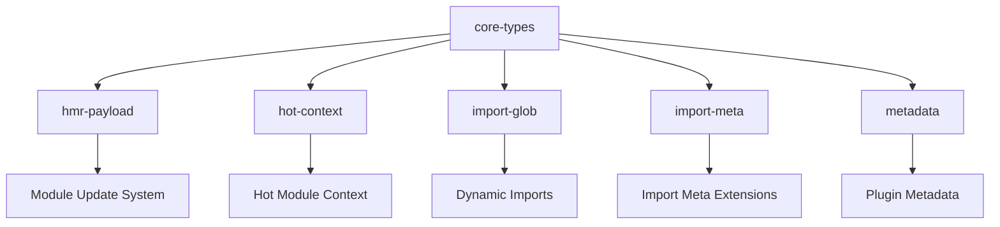
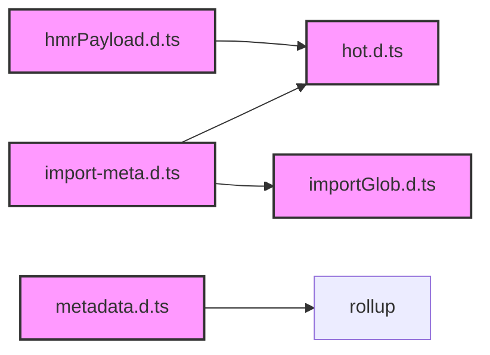
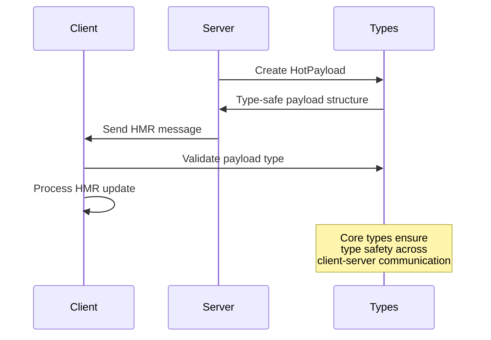

# Core Types Module Documentation

## Overview

The `core-types` module serves as the foundational type system for Vite, providing essential TypeScript interfaces and type definitions that are shared across the entire Vite ecosystem. This module defines the core abstractions for Hot Module Replacement (HMR), import meta handling, glob imports, and plugin metadata, forming the backbone of Vite's type safety and developer experience.

## Architecture

The core-types module is organized into five distinct sub-modules, each responsible for specific aspects of Vite's type system:



### Module Relationships



## Sub-modules

### 1. HMR Payload Types

Defines the communication protocol for Hot Module Replacement between the Vite server and client. This sub-module establishes the type-safe message structure for various HMR operations including updates, full reloads, and custom events.

**Key Components:**
- `HotPayload` - Union type for all HMR messages
- `UpdatePayload` - Module update notifications
- `FullReloadPayload` - Complete page reload triggers
- `ErrorPayload` - Error reporting structure

**Detailed documentation:** [hmr-payload.md](hmr-payload.md)

### 2. Hot Module Context

Provides the runtime API for module hot replacement functionality. This sub-module defines the interface that modules use to interact with Vite's HMR system, enabling fine-grained control over module updates and lifecycle management.

**Key Components:**
- `ViteHotContext` - Main HMR API interface
- Module acceptance and disposal mechanisms
- Event handling for custom HMR events
- Module invalidation controls

**Detailed documentation:** [hot-context.md](hot-context.md)

### 3. Import Glob Types

Implements type-safe dynamic imports using glob patterns. This sub-module enables developers to import multiple files matching a pattern while maintaining full TypeScript type safety and supporting various import formats.

**Key Components:**
- `ImportGlobFunction` - Core glob import functionality
- `ImportGlobOptions` - Configuration for glob imports
- `KnownAsTypeMap` - Type mappings for different import formats

**Detailed documentation:** [import-glob.md](import-glob.md)

### 4. Import Meta Extensions

Extends the standard `import.meta` object with Vite-specific properties and functionality. This sub-module provides type definitions for environment variables, hot module context, and glob imports accessible through `import.meta`.

**Key Components:**
- `ImportMeta` - Extended import.meta interface
- `ImportMetaEnv` - Environment variable types
- `ViteTypeOptions` - Type configuration interface

**Detailed documentation:** [import-meta.md](import-meta.md)

### 5. Plugin Metadata

Defines type extensions for Rollup plugins to integrate with Vite's metadata system. This sub-module enables plugins to attach custom metadata to chunks and access Vite-specific plugin options.

**Key Components:**
- `ChunkMetadata` - Asset tracking for chunks
- `CustomPluginOptionsVite` - Vite-specific plugin options
- Rollup interface extensions

**Detailed documentation:** [metadata.md](metadata.md)

## Integration with Other Modules

The core-types module serves as the foundation for several other Vite modules:

- **[module-runner](module-runner.md)**: Uses HMR payload types for module evaluation and hot replacement
- **[dev-server](dev-server.md)**: Leverages hot context types for development server HMR functionality
- **[hmr](hmr.md)**: Extends HMR payload types for server-side hot module replacement
- **[hmr-shared](hmr-shared.md)**: Shares HMR types between client and server

## Data Flow



## Usage Patterns

### HMR Payload Handling
```typescript
// Server-side payload creation
const updatePayload: UpdatePayload = {
  type: 'update',
  updates: [{
    type: 'js-update',
    path: '/src/main.js',
    acceptedPath: '/src/main.js',
    timestamp: Date.now()
  }]
}

// Client-side payload handling
function handleHMR(payload: HotPayload) {
  switch (payload.type) {
    case 'update':
      handleUpdate(payload)
      break
    case 'full-reload':
      window.location.reload()
      break
  }
}
```

### Import Meta Usage
```typescript
// Accessing environment variables
if (import.meta.env.DEV) {
  console.log('Development mode')
}

// Using hot module replacement
if (import.meta.hot) {
  import.meta.hot.accept((newModule) => {
    // Handle module update
  })
}

// Glob imports
const modules = import.meta.glob('./modules/*.js')
```

## Type Safety Benefits

The core-types module provides several key benefits:

1. **Compile-time Safety**: All HMR communications are type-checked
2. **API Consistency**: Standardized interfaces across the codebase
3. **Developer Experience**: IntelliSense and auto-completion for Vite APIs
4. **Extensibility**: Clear extension points for custom functionality
5. **Documentation**: Self-documenting type definitions

## Future Considerations

The core-types module is designed to be stable and backward-compatible. When extending these types:

- Maintain compatibility with existing plugins and tools
- Follow the established patterns for union types and interfaces
- Consider the impact on both client and server-side code
- Provide clear deprecation paths for any changes