# Dev Environment Module

The dev-environment module is a core component of Vite's development server infrastructure, providing isolated execution environments for different build targets during development. It serves as the foundation for Vite's multi-environment support, enabling developers to work with different JavaScript environments (browser, SSR, worker, etc.) simultaneously within a single development session.

## Overview

The DevEnvironment class extends BaseEnvironment and represents a specific execution environment within Vite's development server. Each environment maintains its own module graph, plugin container, dependency optimizer, and hot module replacement (HMR) channel, allowing for isolated processing and transformation of modules based on the target environment's requirements.

## Architecture

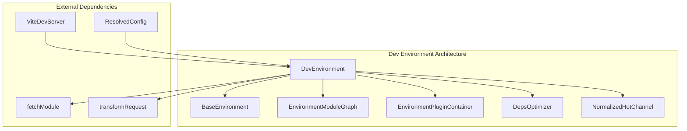

## Core Components

### DevEnvironment Class

The main class that encapsulates all development environment functionality:

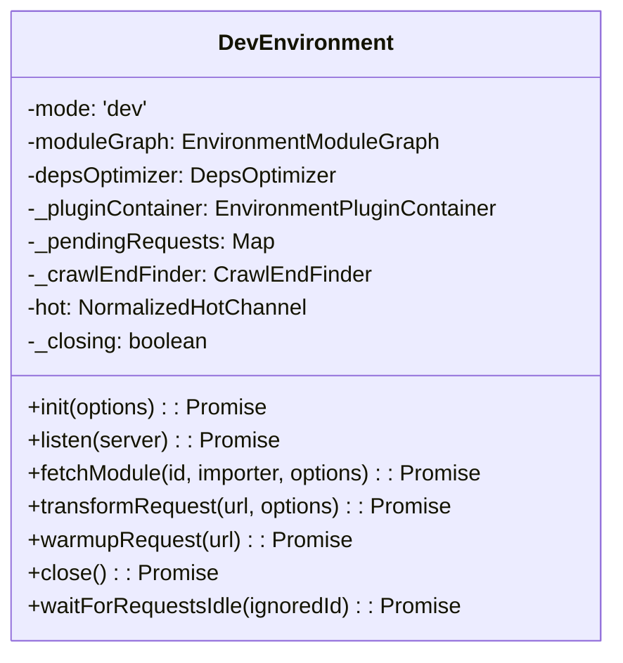

### DevEnvironmentContext Interface

Configuration context for creating a DevEnvironment instance:

```typescript
interface DevEnvironmentContext {
  hot: boolean                    // Enable HMR
  transport?: HotChannel | WebSocketServer  // HMR transport
  options?: EnvironmentOptions    // Environment-specific options
  remoteRunner?: {
    inlineSourceMap?: boolean     // Source map configuration for remote runners
  }
  depsOptimizer?: DepsOptimizer   // Optional dependency optimizer
}
```

## Key Features

### 1. Module Graph Management

Each DevEnvironment maintains its own module graph through the `EnvironmentModuleGraph` class, which tracks module dependencies, imports, and transformations specific to that environment.

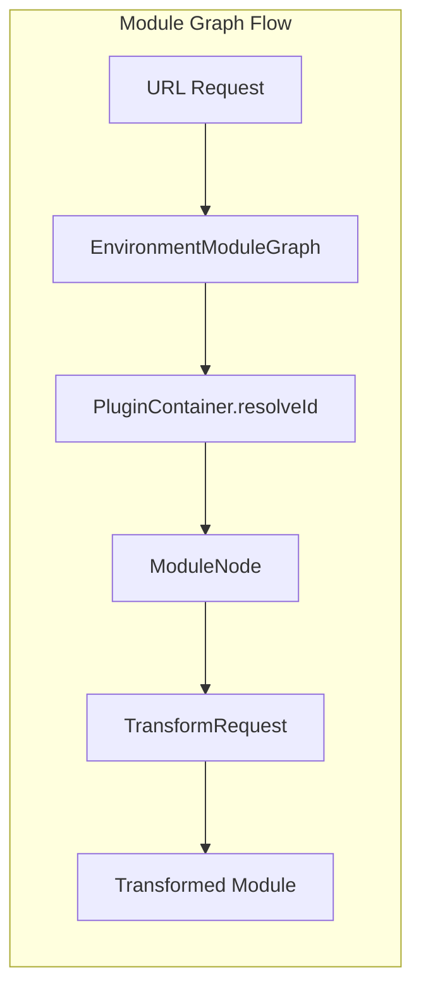

### 2. Dependency Optimization

The environment integrates with Vite's dependency optimizer to handle pre-bundling of dependencies:

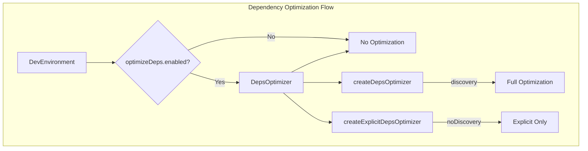

### 3. Hot Module Replacement (HMR)

Each environment has its own HMR channel for managing hot updates:

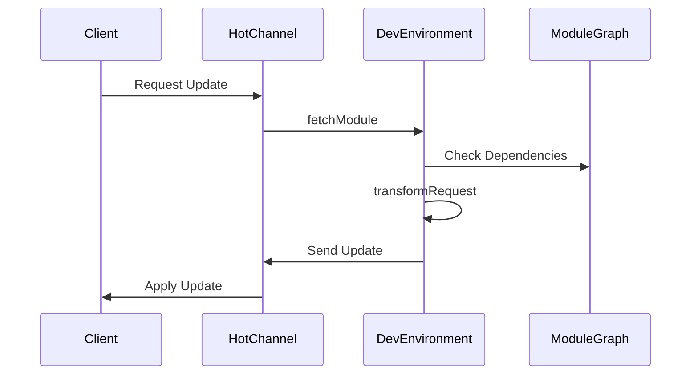

### 4. Request Management

The environment implements sophisticated request tracking and caching:

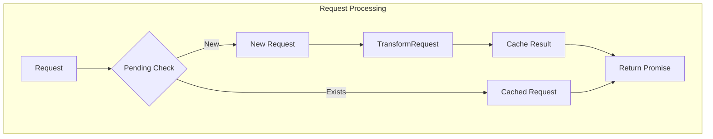

## Lifecycle Management

### Environment Initialization

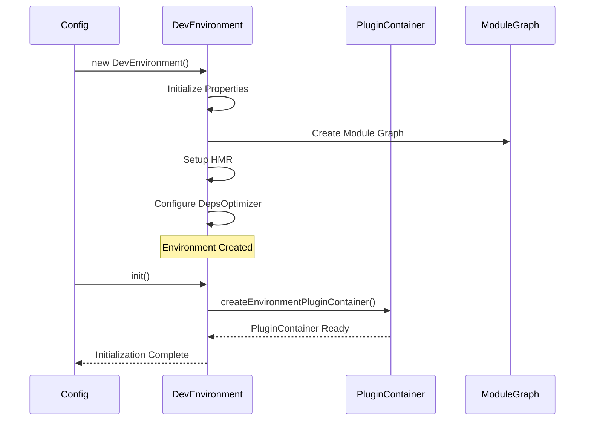

### Request Processing Flow

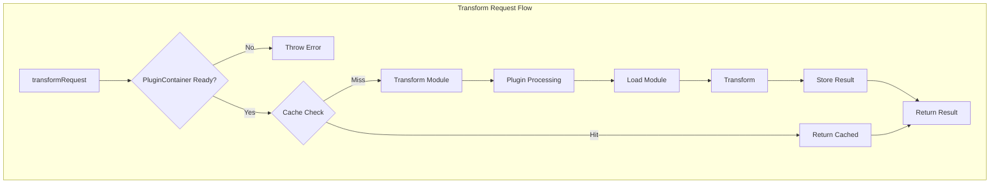

## Integration with Other Modules

### Module Runner Integration

The DevEnvironment works closely with the [module-runner](module-runner.md) system:

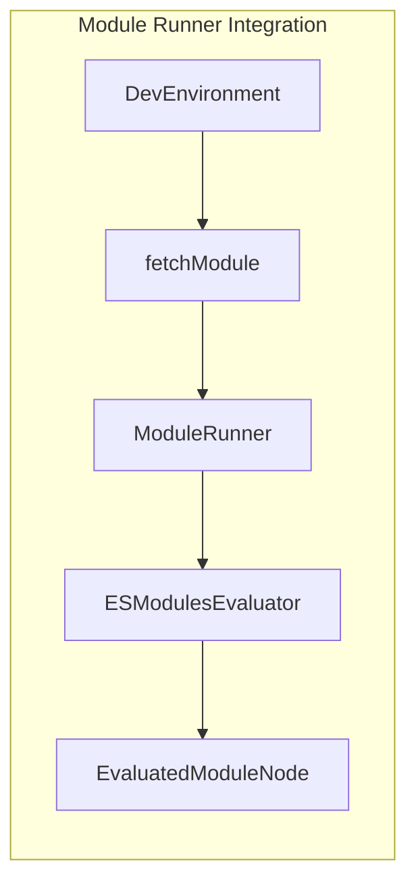

### Plugin System Integration

Integration with the [plugin-system](plugin-system.md) and [plugin-container](plugin-container.md):

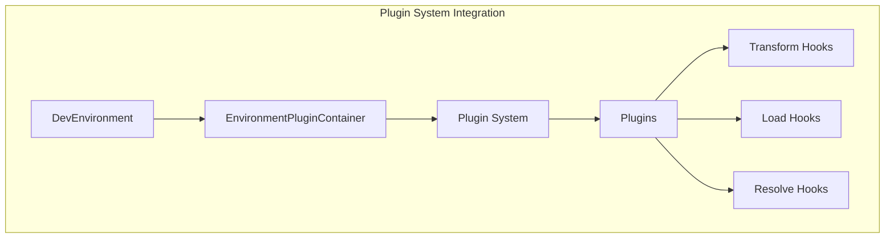

### HMR System Integration

Integration with the [hmr](hmr.md) system:

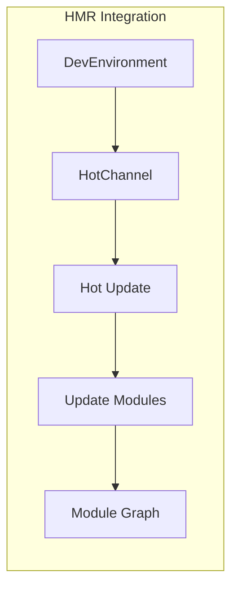

## Configuration

The DevEnvironment is configured through the `DevEnvironmentContext` and the main Vite configuration:

```typescript
// Environment context configuration
const context: DevEnvironmentContext = {
  hot: true,                    // Enable HMR
  transport: hotChannel,       // HMR transport mechanism
  options: environmentOptions, // Environment-specific options
  remoteRunner: {
    inlineSourceMap: true      // Source map configuration
  },
  depsOptimizer: optimizer     // Optional custom optimizer
}

// Create environment
const environment = new DevEnvironment('client', config, context)
```

## Error Handling

The environment implements comprehensive error handling for various scenarios:

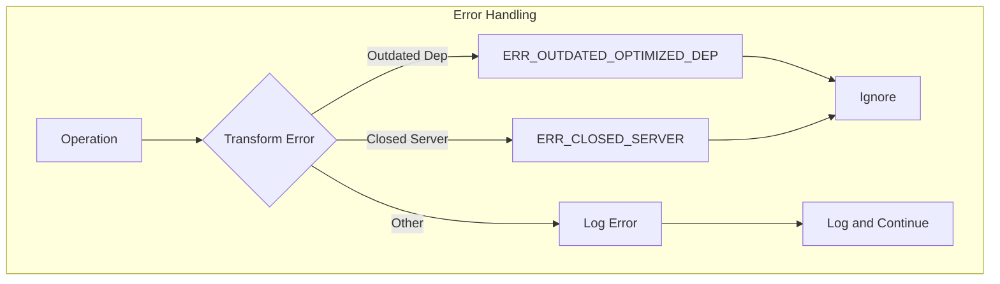

## Performance Optimizations

### Request Caching

The environment maintains a pending requests cache to avoid duplicate transformations:

```typescript
_pendingRequests: Map<string, {
  request: Promise<TransformResult | null>
  timestamp: number
  abort: () => void
}>
```

### Crawl End Detection

Implements intelligent crawl end detection to optimize module graph processing:

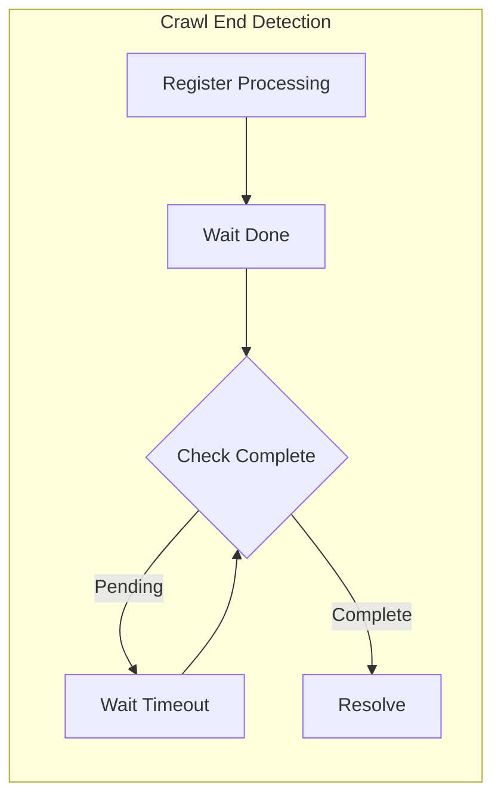

## Usage Examples

### Basic Environment Creation

```typescript
import { DevEnvironment } from 'vite'

const environment = new DevEnvironment('client', config, {
  hot: true,
  transport: webSocketServer
})

await environment.init()
await environment.listen(devServer)
```

### Module Fetching

```typescript
// Fetch a module for transformation
const result = await environment.fetchModule('./src/main.js')

// Transform a request
const transformed = await environment.transformRequest('/src/App.vue')
```

### HMR Usage

```typescript
// Send HMR update
environment.hot.send({
  type: 'update',
  updates: [{
    type: 'js-update',
    path: '/src/App.vue',
    acceptedPath: '/src/App.vue'
  }]
})
```

## API Reference

### Constructor

```typescript
new DevEnvironment(name: string, config: ResolvedConfig, context: DevEnvironmentContext)
```

### Methods

- `init(options?)`: Initialize the environment
- `listen(server)`: Start listening for requests
- `fetchModule(id, importer?, options?)`: Fetch and transform a module
- `transformRequest(url, options?)`: Transform a request
- `warmupRequest(url)`: Pre-transform a request
- `close()`: Close the environment
- `waitForRequestsIdle(ignoredId?)`: Wait for pending requests to complete

### Properties

- `mode`: Always 'dev'
- `moduleGraph`: Environment-specific module graph
- `depsOptimizer`: Dependency optimizer instance
- `hot`: HMR channel
- `pluginContainer`: Plugin container for this environment

## Related Documentation

- [Module Runner](module-runner.md) - For module evaluation and execution
- [Plugin System](plugin-system.md) - For plugin development and integration
- [Plugin Container](plugin-container.md) - For plugin context management
- [HMR](hmr.md) - For hot module replacement system
- [Dev Server](dev-server.md) - For overall development server architecture