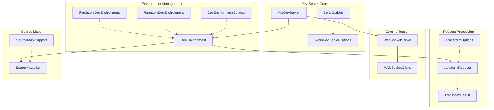

# Dev-Server Module Documentation

## Overview

The dev-server module is the core development server implementation in Vite, responsible for providing a fast and feature-rich development experience. It serves as the central orchestrator for development-time functionality including hot module replacement (HMR), module transformation, file serving, and environment management.

## Architecture



## Core Components

### ViteDevServer
The main server instance that orchestrates all development server functionality. It manages middlewares, HTTP server, WebSocket connections, module graphs, and multiple development environments.

### ServerOptions & ResolvedServerOptions
Configuration interfaces that define server behavior including HMR settings, file system access controls, middleware configuration, and development-specific options.

### DevEnvironment
Abstract base class for development environments that handle module transformation, dependency optimization, and hot module replacement for specific execution contexts (client, SSR, etc.).

## Sub-modules

### Environment Management
- **[Dev Environment](dev-environment.md)**: Core environment abstraction for development contexts
- **[Fetchable Environment](fetchable-environment.md)**: Environment implementation for fetch-based module loading
- **[Runnable Environment](runnable-environment.md)**: Environment implementation for executable module contexts

### Request Processing
- **[Transform Request](transform-request.md)**: Module transformation pipeline and caching system
- **[Send](send.md)**: HTTP response handling and content delivery

### Communication
- **[WebSocket](websocket.md)**: Real-time communication infrastructure for HMR and client-server messaging

### Source Map Support
- **[Source Map](sourcemap.md)**: Source map generation, processing, and debugging support

## Detailed Sub-module Documentation

For detailed information about each sub-module, please refer to their specific documentation:

- [Dev Environment](dev-environment.md) - Development environment management
- [Fetchable Environment](fetchable-environment.md) - Fetch-based environment implementation
- [Runnable Environment](runnable-environment.md) - Runnable environment implementation
- [Transform Request](transform-request.md) - Request transformation pipeline
- [Send](send.md) - HTTP response handling
- [WebSocket](websocket.md) - WebSocket communication system
- [Source Map](sourcemap.md) - Source map processing and support

## Key Features

### Hot Module Replacement (HMR)
- Real-time module updates without full page reloads
- Environment-specific HMR handling
- WebSocket-based communication channel
- Module invalidation and propagation

### Module Transformation
- On-demand module transformation
- Plugin-based transformation pipeline
- Result caching and invalidation
- Source map generation and processing

### Multi-Environment Support
- Client environment for browser execution
- SSR environment for server-side rendering
- Custom environment extensibility
- Environment-specific module graphs

### File System Integration
- File watching with chokidar
- Safe file access controls
- Public directory serving
- Static file middleware

## Integration Points

### Plugin System Integration
The dev-server integrates with Vite's plugin system through:
- Plugin container for hook execution
- Environment-specific plugin contexts
- Transform and load hooks
- HMR customization hooks

### Module Graph Integration
- Tracks module dependencies and relationships
- Manages module invalidation states
- Supports multi-environment module graphs
- Enables efficient HMR propagation

### Configuration Integration
- Resolves and validates server options
- Merges with default configurations
- Handles environment-specific settings
- Supports dynamic reconfiguration

## Usage Patterns

### Basic Server Creation
```typescript
const server = await createServer(config)
await server.listen()
```

### Middleware Mode
```typescript
const server = await createServer({
  server: { middlewareMode: true }
})
// Use server.middlewares in existing HTTP server
```

### Custom Environment
```typescript
const server = await createServer({
  environments: {
    custom: {
      dev: {
        createEnvironment: (name, config) => 
          new CustomDevEnvironment(name, config)
      }
    }
  }
})
```

## Performance Considerations

### Caching Strategy
- Transform result caching per module
- ETag-based HTTP caching
- Source map caching and reuse
- Dependency optimization caching

### Request Optimization
- Request deduplication
- Parallel processing where possible
- Lazy initialization of components
- Warmup request pre-processing

### Memory Management
- Module graph cleanup
- WebSocket connection management
- File watcher optimization
- Cache invalidation strategies

## Error Handling

### Graceful Degradation
- Continues serving on transform errors
- Fallback source map generation
- Error boundary middleware
- Client error reporting

### Recovery Mechanisms
- Server restart capability
- Configuration reload
- Plugin re-initialization
- Environment recovery

## Security Features

### File System Security
- Strict file access controls
- Path traversal protection
- Configurable allow/deny lists
- Origin validation

### WebSocket Security
- Token-based authentication
- Host validation
- Origin header checking
- Connection filtering

## Related Documentation
- [Module Runner](../module-runner.md) - Module execution runtime
- [Plugin System](../plugin-system.md) - Plugin architecture and hooks
- [HMR](../hmr.md) - Hot module replacement system
- [SSR](../ssr.md) - Server-side rendering integration
- [Module Graph](../module-graph.md) - Module dependency tracking