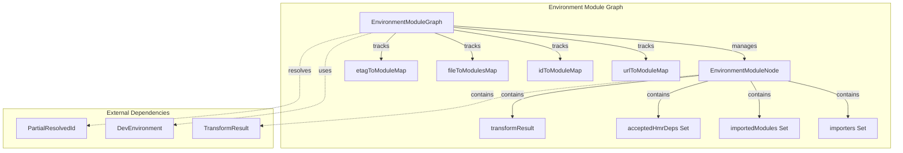
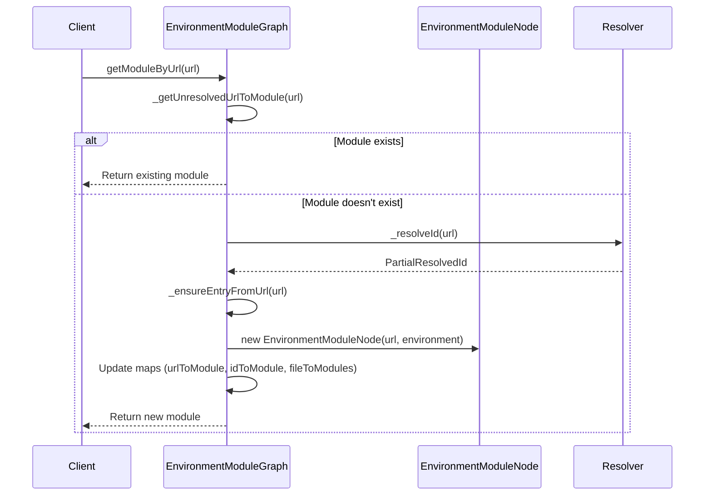
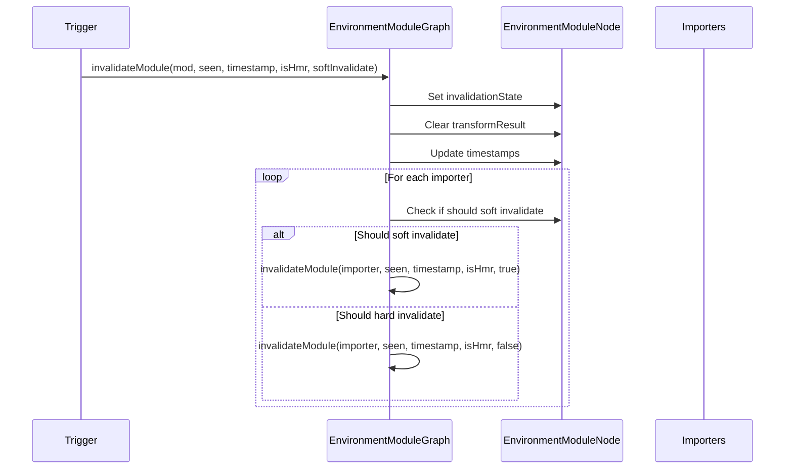
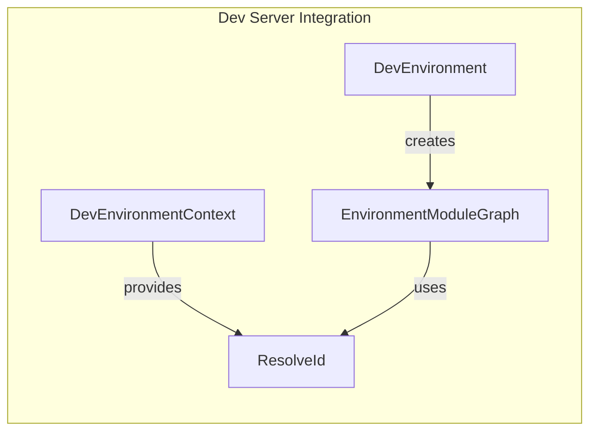
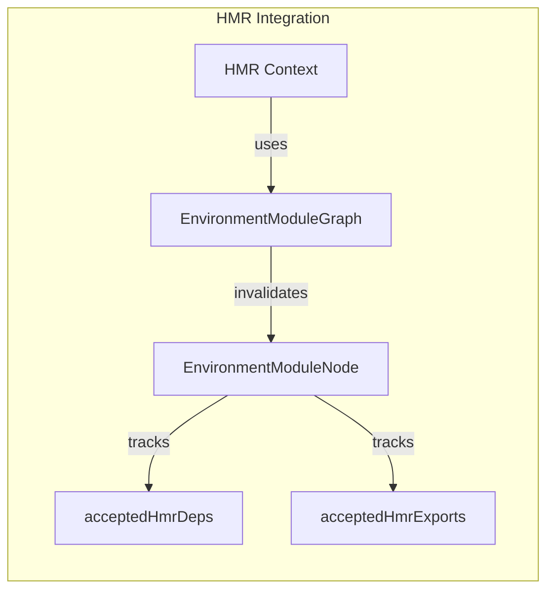
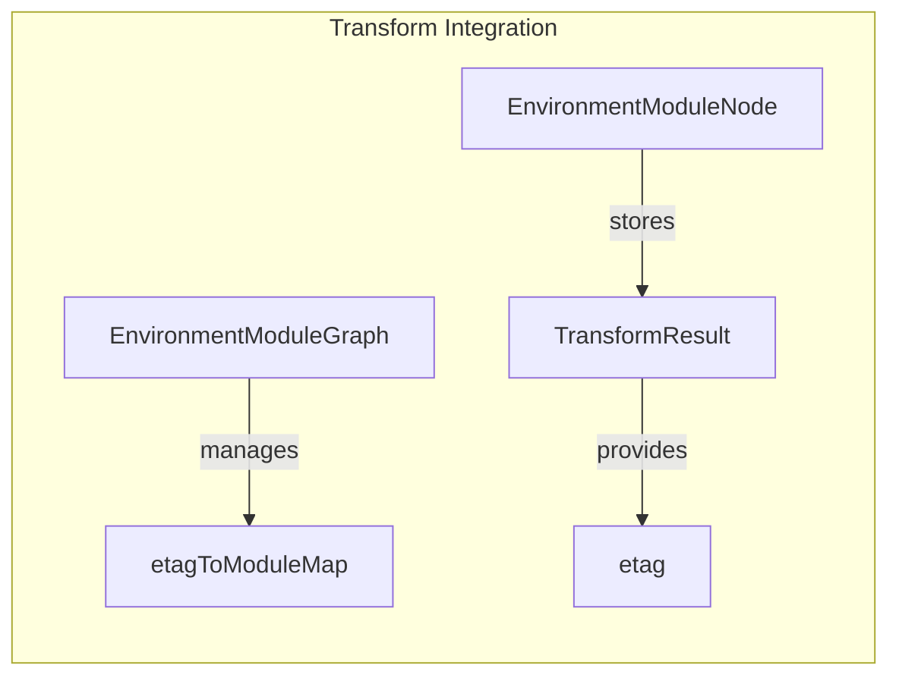

# Environment Module Graph

The environment-module-graph module provides the core infrastructure for tracking and managing module dependencies within specific execution environments in Vite. It maintains a graph structure that represents how modules are interconnected, enabling efficient dependency resolution, hot module replacement (HMR), and build optimization.

## Overview

The environment module graph serves as the foundation for Vite's module system by:
- Tracking module dependencies and relationships within specific environments (client, server, etc.)
- Managing module invalidation and updates during development
- Supporting hot module replacement (HMR) with dependency tracking
- Providing efficient module resolution and caching mechanisms

## Core Architecture

### Component Structure



### Key Components

#### EnvironmentModuleNode

The `EnvironmentModuleNode` class represents a single module within the module graph. Each node contains comprehensive information about the module's state, dependencies, and relationships.

**Key Properties:**
- `environment`: The execution environment (client, server, etc.)
- `url`: Public served URL path
- `id`: Resolved file system path with query parameters
- `file`: Clean file path without query parameters
- `type`: Module type ('js', 'css', 'asset')
- `importers`: Set of modules that import this module
- `importedModules`: Set of modules this module imports
- `acceptedHmrDeps`: Set of modules accepted for HMR
- `transformResult`: Cached transformation result
- `invalidationState`: Current invalidation state for updates

#### EnvironmentModuleGraph

The `EnvironmentModuleGraph` class manages the collection of module nodes and provides operations for module resolution, dependency tracking, and invalidation.

**Key Properties:**
- `urlToModuleMap`: Maps URLs to module nodes
- `idToModuleMap`: Maps resolved IDs to module nodes
- `fileToModulesMap`: Maps files to sets of module nodes (supports multiple modules per file)
- `etagToModuleMap`: Maps ETags to module nodes for caching

## Data Flow

### Module Resolution Flow



### Module Invalidation Flow



## Module Relationships

### Integration with Dev Environment

The environment module graph works closely with the [dev-server](dev-server.md) module:



### HMR Integration

The module graph supports HMR through the [hmr](hmr.md) module:



### Transform Integration

Module transformation results are managed through integration with the transform system:



## Key Operations

### Module Resolution

The module graph provides several methods for module resolution:

1. **URL-based resolution**: `getModuleByUrl(rawUrl)` - Resolves modules by their public URL
2. **ID-based resolution**: `getModuleById(id)` - Resolves modules by their resolved ID
3. **File-based resolution**: `getModulesByFile(file)` - Gets all modules associated with a file
4. **ETag-based resolution**: `getModuleByEtag(etag)` - Resolves modules by their ETag for caching

### Dependency Management

The graph maintains bidirectional dependency relationships:

- **Forward dependencies**: Tracked via `importedModules` - modules that this module imports
- **Reverse dependencies**: Tracked via `importers` - modules that import this module
- **HMR dependencies**: Tracked via `acceptedHmrDeps` - modules accepted for hot replacement

### Invalidation Strategies

The module graph supports two invalidation strategies:

1. **Soft Invalidation**: Only updates import timestamps without full re-transformation
   - Used for static imports within HMR chains
   - Preserves the previous `transformResult` for reuse
   - Only applicable to JavaScript modules

2. **Hard Invalidation**: Full module re-transformation
   - Clears the `transformResult` completely
   - Required for dynamic imports, watched files, and CSS modules
   - Forces complete reprocessing of the module

## Performance Optimizations

### Caching Mechanisms

The module graph implements several caching strategies:

1. **URL Resolution Cache**: `_unresolvedUrlToModuleMap` prevents duplicate URL resolutions
2. **Transform Result Cache**: Modules cache their transformation results via `transformResult`
3. **ETag-based Cache**: ETags enable efficient client-side caching of transformed modules

### Memory Management

The graph automatically cleans up unused modules:

- Modules with no importers are identified during `updateModuleInfo`
- File deletion triggers cleanup of associated modules
- Module invalidation clears cached transformation results

## Error Handling

The module graph handles various error scenarios:

- **Resolution failures**: Tracked via `_hasResolveFailedErrorModules`
- **Transform errors**: Stored in `ssrError` for SSR modules
- **Invalidation errors**: Handled gracefully during HMR updates

## Usage Examples

### Basic Module Graph Operations

```typescript
// Create a module graph for the client environment
const moduleGraph = new EnvironmentModuleGraph('client', resolveIdFunction)

// Get or create a module by URL
const module = await moduleGraph.ensureEntryFromUrl('/src/main.js')

// Update module dependencies
await moduleGraph.updateModuleInfo(
  module,
  importedModules,
  importedBindings,
  acceptedModules,
  acceptedExports,
  isSelfAccepting,
  staticImportedUrls
)

// Invalidate a module
moduleGraph.invalidateModule(module, new Set(), Date.now(), false, false)
```

### File Change Handling

```typescript
// Handle file changes
moduleGraph.onFileChange('/src/components/Button.vue')

// Handle file deletions
moduleGraph.onFileDelete('/src/deprecated-module.js')
```

## Related Modules

- [dev-server](dev-server.md) - Creates and manages environment module graphs
- [hmr](hmr.md) - Uses module graphs for dependency tracking during hot updates
- [module-graph](module-graph.md) - Parent module containing mixed module graph implementation
- [transformRequest](dev-server.md) - Provides transformation results stored in module nodes

## Future Considerations

The module graph system is designed to support:
- Multiple execution environments with isolated module graphs
- Efficient dependency tracking for large applications
- Seamless integration with Vite's plugin system
- Optimized HMR with minimal module re-transformation