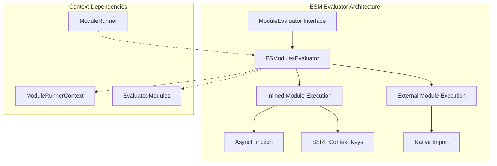
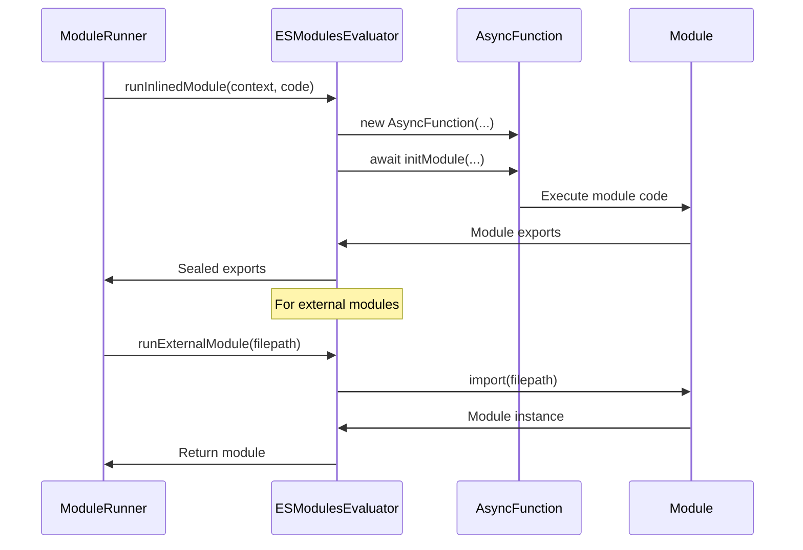

# ESM Evaluator Module

## Introduction

The ESM (ECMAScript Modules) Evaluator is a core component of Vite's module runner system that provides the capability to execute JavaScript modules in both development and server-side rendering contexts. It implements the `ModuleEvaluator` interface and serves as the primary mechanism for evaluating ES modules within Vite's module runner environment.

## Architecture Overview

The ESM Evaluator acts as a bridge between Vite's module system and the actual JavaScript execution environment, providing two distinct execution paths:

1. **Inlined Module Execution**: For modules that need to be evaluated within a controlled context
2. **External Module Execution**: For modules that can be executed directly via native ES module imports



## Core Components

### ESModulesEvaluator Class

The `ESModulesEvaluator` is the main implementation of the `ModuleEvaluator` interface. It provides the core functionality for executing ES modules within Vite's module runner system.

#### Key Properties

- **`startOffset`**: A read-only property that indicates the line offset for async function declarations, used for proper source mapping

#### Core Methods

##### `runInlinedModule(context, code)`

Executes module code within a controlled context using AsyncFunction constructor. This method:

1. Creates an AsyncFunction with predefined SSR context parameters
2. Injects the module code with strict mode enabled
3. Executes the function with the provided context values
4. Seals the module exports to prevent further modifications

**Parameters:**
- `context`: ModuleRunnerContext containing SSR-specific keys
- `code`: The JavaScript module code to execute

**Context Keys Used:**
- `ssrModuleExportsKey`: Module exports object
- `ssrImportMetaKey`: Import meta object
- `ssrImportKey`: Import function
- `ssrDynamicImportKey`: Dynamic import function
- `ssrExportAllKey`: Export all helper
- `ssrExportNameKey`: Export name helper

##### `runExternalModule(filepath)`

Executes external modules using native ES module import. This method provides a simple wrapper around the native `import()` function for modules that don't require special context handling.

**Parameters:**
- `filepath`: Path to the module file

## Data Flow



## Integration with Module Runner System

The ESM Evaluator integrates with several other components within the module runner system:

### Dependencies

- **[ModuleRunner](module-runner.md)**: The main orchestrator that uses the ESM Evaluator to execute modules
- **[ModuleRunnerContext](types-and-interfaces.md)**: Provides the execution context with SSR-specific keys and functions
- **[EvaluatedModules](evaluated-modules.md)**: Manages the cache of evaluated modules

### Usage Context

The evaluator operates within Vite's module runner environment, which can be used in:

1. **Development Server**: For hot module replacement and module evaluation
2. **SSR (Server-Side Rendering)**: For executing modules on the server
3. **Build Process**: For module transformation and optimization

## Error Handling and Debugging

The ESM Evaluator provides several mechanisms for debugging and error handling:

1. **Source Map Support**: The `startOffset` property helps maintain accurate source mappings when using AsyncFunction
2. **Context Isolation**: Each module runs in its own context with controlled access to SSR utilities
3. **Module Export Sealing**: Prevents accidental modification of module exports after evaluation

## Performance Considerations

- **AsyncFunction vs VM**: Uses AsyncFunction instead of Node's VM module for broader environment compatibility
- **Context Reuse**: Leverages shared context objects across module evaluations
- **Native Import**: Falls back to native import for external modules when possible

## Related Documentation

- [Module Runner](module-runner.md) - Main module runner orchestrator
- [Evaluated Modules](evaluated-modules.md) - Module caching and management
- [Types and Interfaces](types-and-interfaces.md) - Type definitions and interfaces
- [Sourcemap Support](sourcemap-support.md) - Source map handling for debugging

## Example Usage

```typescript
import { ESModulesEvaluator } from './esmEvaluator'
import type { ModuleRunnerContext } from './types'

const evaluator = new ESModulesEvaluator()

// For inlined module execution
const context: ModuleRunnerContext = {
  __vite_ssr_exports__: {},
  __vite_ssr_import_meta__: { url: 'file:///path/to/module.js' },
  __vite_ssr_import__: (id) => import(id),
  __vite_ssr_dynamic_import__: (id) => import(id),
  __vite_ssr_exportAll__: (obj) => { /* export all implementation */ },
  __vite_ssr_export__: (name, value) => { /* export implementation */ }
}

const moduleCode = `
export const message = 'Hello from ESM Evaluator';
export function greet(name) {
  return \`Hello, \${name}!\`;
}
`

await evaluator.runInlinedModule(context, moduleCode)
console.log(context.__vite_ssr_exports__) // { message: 'Hello...', greet: [Function] }

// For external module execution
const externalModule = await evaluator.runExternalModule('./path/to/module.js')
```