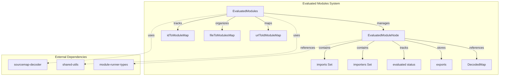
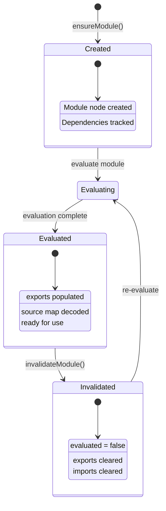
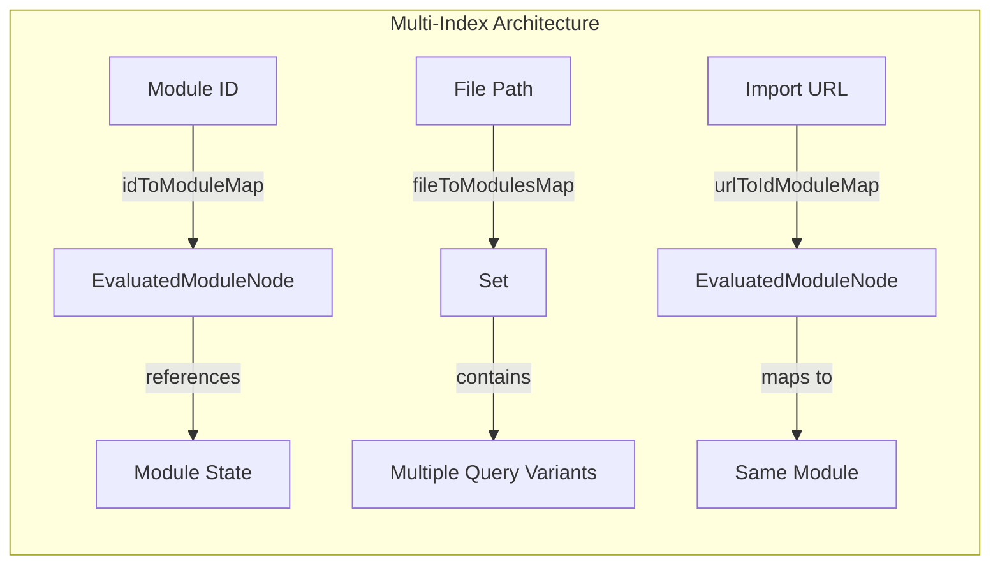
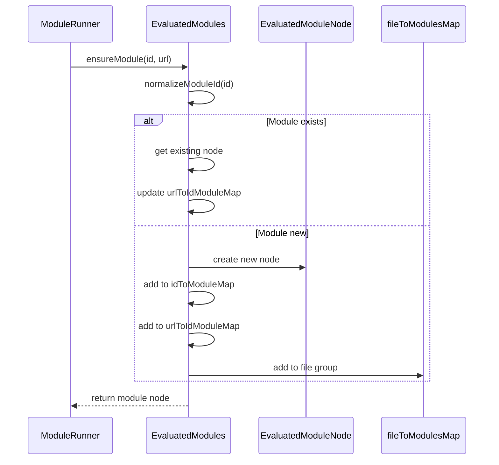
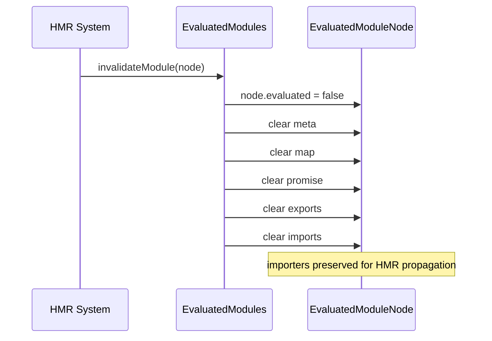
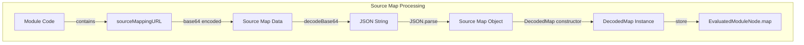
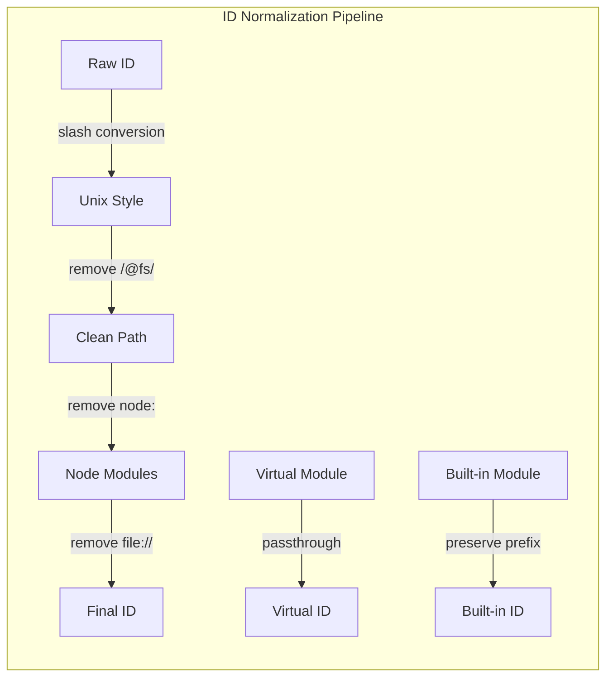
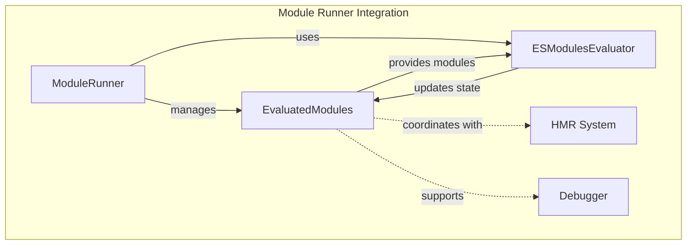

# Evaluated Modules Module

## Introduction

The evaluated-modules module is a core component of Vite's module runner system that manages the lifecycle and state of evaluated JavaScript modules. It provides a centralized registry for tracking module dependencies, evaluation status, and source maps during development and runtime execution.

This module serves as the foundation for Vite's hot module replacement (HMR) system and module dependency tracking, enabling efficient module invalidation and re-evaluation during development.

## Architecture Overview



## Core Components

### EvaluatedModuleNode

The `EvaluatedModuleNode` class represents a single module in the evaluation graph. Each node maintains comprehensive information about the module's state, dependencies, and evaluation results.

#### Key Properties

- **id**: Resolved module ID (file system path with query/hash or virtual module)
- **url**: Original URL used in import statements
- **file**: Clean file system path without query parameters
- **evaluated**: Boolean flag indicating if the module has been evaluated
- **importers**: Set of module IDs that import this module
- **imports**: Set of module IDs that this module imports
- **exports**: Module's exported values after evaluation
- **promise**: Promise representing the module evaluation
- **meta**: Resolved result containing module code and metadata
- **map**: Decoded source map for debugging support

#### Module State Management



### EvaluatedModules

The `EvaluatedModules` class serves as the central registry and manager for all evaluated modules. It provides multiple indexing strategies for efficient module lookup and maintains bidirectional relationships between modules.

#### Indexing Strategies



#### Core Methods

- **getModuleById(id)**: Retrieve module by resolved ID
- **getModulesByFile(file)**: Get all modules for a file path (handles query variants)
- **getModuleByUrl(url)**: Find module by import URL
- **ensureModule(id, url)**: Create or retrieve existing module
- **invalidateModule(node)**: Reset module state for re-evaluation
- **getModuleSourceMapById(id)**: Extract and decode inline source maps
- **clear()**: Reset entire module registry

## Data Flow

### Module Registration Flow



### Module Invalidation Flow



## Source Map Integration

The module system includes sophisticated source map handling for debugging support:



## Module ID Normalization

The `normalizeModuleId` function handles various module identifier formats:



## Integration with Module Runner

The evaluated-modules system integrates with the broader module runner architecture:



## Key Features

### 1. Multi-Index Module Registry
- **ID-based lookup**: Fast access by resolved module ID
- **File-based grouping**: Handle multiple query variants per file
- **URL-based mapping**: Support original import URLs

### 2. Dependency Tracking
- **Bidirectional relationships**: Track both imports and importers
- **Graph consistency**: Maintain coherent dependency graph
- **Selective invalidation**: Preserve importers during invalidation

### 3. Source Map Support
- **Inline source maps**: Extract base64-encoded source maps
- **Lazy decoding**: Decode source maps on-demand
- **Debug integration**: Support development debugging

### 4. Module Lifecycle Management
- **State tracking**: Monitor evaluation status
- **Promise management**: Handle async module evaluation
- **Export caching**: Store module exports for reuse

## Usage Patterns

### Module Registration
```typescript
const modules = new EvaluatedModules()
const moduleNode = modules.ensureModule('/src/app.js', '/src/app.js')
```

### Dependency Analysis
```typescript
const module = modules.getModuleById('/src/app.js')
const importers = module.importers // Who imports this module
const imports = module.imports // What this module imports
```

### Invalidation for HMR
```typescript
const module = modules.getModuleById('/src/changed.js')
modules.invalidateModule(module) // Reset for re-evaluation
```

## Performance Considerations

1. **Memory Efficiency**: Uses Maps for O(1) lookups
2. **Lazy Evaluation**: Source maps decoded only when needed
3. **Selective Clearing**: Preserves importers during invalidation
4. **File-based Grouping**: Efficient handling of query variants

## Related Modules

- **[runner-core](runner-core.md)**: Module runner orchestration
- **[esm-evaluator](esm-evaluator.md)**: Module evaluation engine
- **[sourcemap-support](sourcemap-support.md)**: Source map decoding
- **[types-and-interfaces](types-and-interfaces.md)**: Type definitions

## Conclusion

The evaluated-modules module provides the foundational infrastructure for Vite's module management system. Its multi-index architecture, comprehensive state tracking, and integration with source maps enable efficient development workflows with hot module replacement and debugging support. The design prioritizes performance, memory efficiency, and maintainability while supporting complex module dependency graphs.